#  aanl.lib 

A library for antialiased nonlinearities. Its official prefix is `aa`. 

This library provides aliasing-suppressed nonlinearities through first-order 
and second-order approximations of continuous-time signals, functions,
and convolution based on antiderivatives. This technique is particularly 
effective if combined with low-factor oversampling, for example, operating
at 96 kHz or 192 kHz sample-rate.

The library contains trigonometric functions as well as other nonlinear 
functions such as bounded and unbounded saturators.

Due to their limited domains or ranges, some of these functions may not 
suitable for audio nonlinear processing or waveshaping, although
they have been included for completeness. Some other functions,
for example, tan() and tanh(), are only available with first-order
antialiasing due to the complexity of the antiderivative of the 
x * f(x) term, particularly because of the necessity of the dilogarithm 
function, which requires special implementation.

Future improvements to this library may include an adaptive
mechanism to set the ill-conditioned cases threshold to improve
performance in varying cases.

Note that the antialiasing functions introduce a delay in the path,
respectively half and one-sample delay for first and second-order functions.

Also note that due to division by differences, it is vital to use
double-precision or more to reduce errors.

The environment identifier for this library is `aa`. After importing
the standard libraries in Faust, the functions below can be called as `aa.function_name`.

#### References

* [https://github.com/grame-cncm/faustlibraries/blob/master/aanl.lib](https://github.com/grame-cncm/faustlibraries/blob/master/aanl.lib)
* Reducing the Aliasing in Nonlinear Waveshaping Using Continuous-time Convolution, Julian Parker, Vadim Zavalishin, Efflam Le Bivic, DAFX, 2016
* [http://dafx16.vutbr.cz/dafxpapers/20-DAFx-16_paper_41-PN.pdf](http://dafx16.vutbr.cz/dafxpapers/20-DAFx-16_paper_41-PN.pdf)

## Auxiliary Functions


----

### `(aa.)Rsqrt`

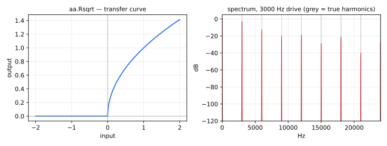

Real-valued sqrt().

----

### `(aa.)Rlog`

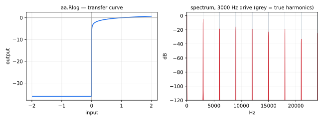

Real-valued log().

----

### `(aa.)Rtan`

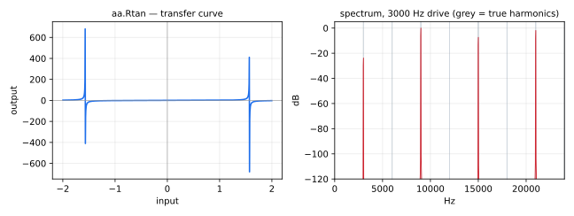

Real-valued tan().

----

### `(aa.)Racos`

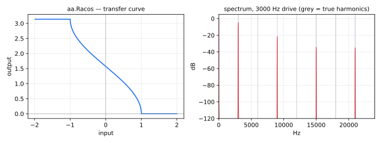

Real-valued acos().

----

### `(aa.)Rasin`


Real-valued asin().

----

### `(aa.)Racosh`

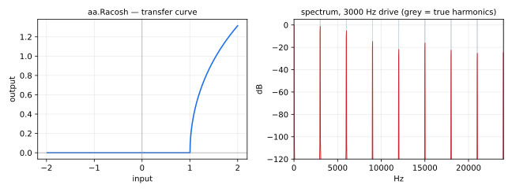

Real-valued acosh()

----

### `(aa.)Rcosh`

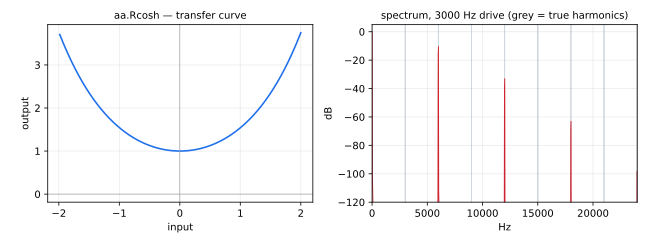

Real-valued cosh().

----

### `(aa.)Rsinh`

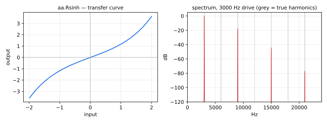

Real-valued sinh().

----

### `(aa.)Ratanh`

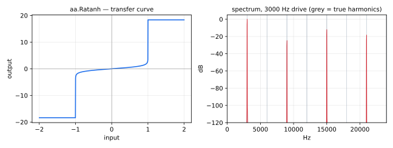

Real-valued atanh().

----

### `(aa.)ADAA1`

Generalised first-order Antiderivative Anti-Aliasing (ADAA) function.

Implements a first-order ADAA approximation to reduce aliasing
in nonlinear audio processing.

#### Usage

```
_ : ADAA1(EPS, f, F1) : _
```

Where:

* `EPS`: a threshold for switching between safe and ill-conditioned paths
* `f`: a function that we want to process with ADAA
* `F1`: f's first antiderivative
#### Test
```
aa = library("aanl.lib");
ba = library("basics.lib");
ma = library("maths.lib");
os = library("oscillators.lib");
sig = os.osc(110);
ADAA1_test = aa.ADAA1(0.001, f, F1, sig)
    with {
        f(x) = aa.clip(-1.0, 1.0, x);
        F1(x) = ba.if((x <= 1.0) & (x >= -1.0), 0.5 * x^2, x * ma.signum(x) - 0.5);
    };
```

----

### `(aa.)ADAA2`

Generalised second-order Antiderivative Anti-Aliasing (ADAA) function.

Implements a second-order ADAA approximation for even better aliasing reduction
at the cost of additional computation.
#### Usage

```
_ : ADAA2(EPS, f, F1, F2) : _
```

Where:

* `EPS`: a threshold for switching between safe and ill-conditioned paths
* `f`: a function that we want to process with ADAA
* `F1`: f's first antiderivative
* `F2`: f's second antiderivative
#### Test
```
aa = library("aanl.lib");
ba = library("basics.lib");
ma = library("maths.lib");
os = library("oscillators.lib");
sig = os.osc(110);
ADAA2_test = aa.ADAA2(0.001, f, F1, F2, sig)
    with {
        f(x) = aa.clip(-1.0, 1.0, x);
        F1(x) = ba.if((x <= 1.0) & (x >= -1.0), 0.5 * x^2, x * ma.signum(x) - 0.5);
        F2(x) = ba.if((x <= 1.0) & (x >= -1.0), (1.0 / 3.0) * x^3, ((0.5 * x^2) - 1.0 / 6.0) * ma.signum(x));
    };
```

## Main functions


##  Saturators 


These antialiased saturators perform best with high-amplitude input
signals. If the input is only slightly saturated, hence producing
negligible aliasing, the trivial saturator may result in a better
overall output, as noise can be introduced by first and second ADAA
at low amplitudes. 

Once determining the lowest saturation level for which the antialiased 
functions perform adequately, it might be sensible to cross-fade
between the trivial and the antialiased saturators according to the
amplitude profile of the input signal.

----

### `(aa.)hardclip`

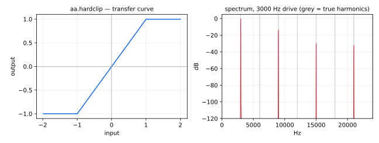


First-order ADAA hard-clip.

The domain of this function is ℝ; its theoretical range is [-1.0; 1.0].

#### Usage
```
_ : aa.hardclip : _
```
#### Test
```
aa = library("aanl.lib");
os = library("oscillators.lib");
sig = os.osc(110);
hardclip_test = aa.hardclip(sig);
```

----

### `(aa.)hardclip2`

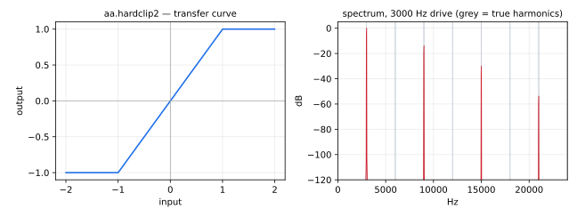


Second-order ADAA hard-clip.

The domain of this function is ℝ; its theoretical range is [-1.0; 1.0].

#### Usage
```
_ : aa.hardclip2 : _
```
#### Test
```
aa = library("aanl.lib");
os = library("oscillators.lib");
sig = os.osc(110);
hardclip2_test = aa.hardclip2(sig);
```

----

### `(aa.)cubic1`

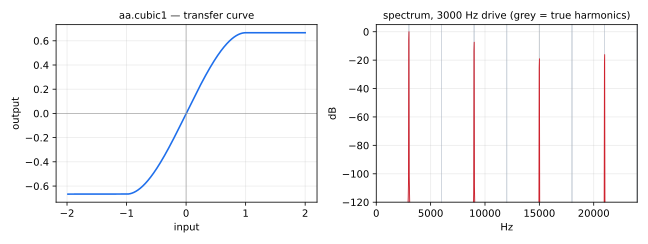


First-order ADAA cubic saturator.

The domain of this function is ℝ; its theoretical range is 
[-2.0/3.0; 2.0/3.0].

#### Usage
```
_ : aa.cubic1 : _
```
#### Test
```
aa = library("aanl.lib");
os = library("oscillators.lib");
sig = os.osc(110);
cubic1_test = aa.cubic1(sig);
```

----

### `(aa.)parabolic`

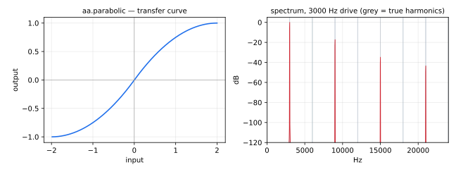


First-order ADAA parabolic saturator.

The domain of this function is ℝ; its theoretical range is [-1.0; 1.0].

#### Usage
```
_ : aa.parabolic : _
```
#### Test
```
aa = library("aanl.lib");
os = library("oscillators.lib");
sig = os.osc(110);
parabolic_test = aa.parabolic(sig);
```

----

### `(aa.)parabolic2`

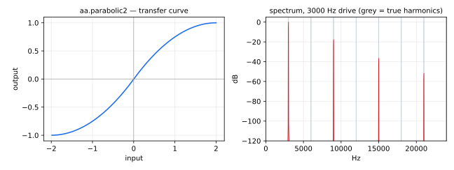


Second-order ADAA parabolic saturator.

The domain of this function is ℝ; its theoretical range is [-1.0; 1.0].

#### Usage
```
_ : aa.parabolic2 : _
```
#### Test
```
aa = library("aanl.lib");
os = library("oscillators.lib");
sig = os.osc(110);
parabolic2_test = aa.parabolic2(sig);
```

----

### `(aa.)hyperbolic`


First-order ADAA hyperbolic saturator.

The domain of this function is ℝ; its theoretical range is [-1.0; 1.0].

#### Usage
```
_ : aa.hyperbolic : _
```
#### Test
```
aa = library("aanl.lib");
os = library("oscillators.lib");
sig = os.osc(110);
hyperbolic_test = aa.hyperbolic(sig);
```

----

### `(aa.)hyperbolic2`

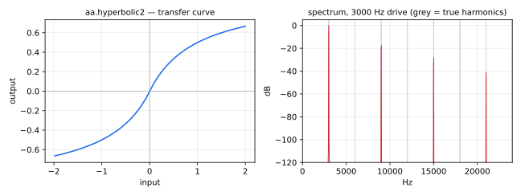


Second-order ADAA hyperbolic saturator.

The domain of this function is ℝ; its theoretical range is [-1.0; 1.0].

#### Usage
```
_ : aa.hyperbolic2 : _
```
#### Test
```
aa = library("aanl.lib");
os = library("oscillators.lib");
sig = os.osc(110);
hyperbolic2_test = aa.hyperbolic2(sig);
```

----

### `(aa.)sinarctan`

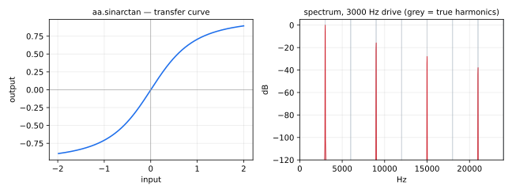


First-order ADAA sin(atan()) saturator.

The domain of this function is ℝ; its theoretical range is [-1.0; 1.0].

#### Usage
```
_ : aa.sinarctan : _
```
#### Test
```
aa = library("aanl.lib");
os = library("oscillators.lib");
sig = os.osc(110);
sinarctan_test = aa.sinarctan(sig);
```

----

### `(aa.)sinarctan2`


Second-order ADAA sin(atan()) saturator.

The domain of this function is ℝ; its theoretical range is [-1.0; 1.0].

#### Usage
```
_ : aa.sinarctan2 : _
```
#### Test
```
aa = library("aanl.lib");
os = library("oscillators.lib");
sig = os.osc(110);
sinarctan2_test = aa.sinarctan2(sig);
```

----

### `(aa.)softclipQuadratic1`

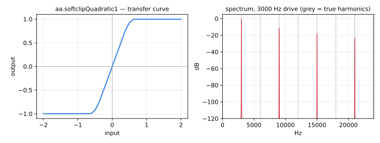


First-order ADAA quadratic softclip.

The domain of this function is ℝ; its theoretical range is [-1.0; 1.0].

#### Usage
```
_ : aa.softclipQuadratic1 : _
```
#### Test
```
aa = library("aanl.lib");
os = library("oscillators.lib");
sig = os.osc(110);
softclipQuadratic1_test = aa.softclipQuadratic1(sig);
```

----

### `(aa.)softclipQuadratic2`


Second-order ADAA quadratic softclip.

The domain of this function is ℝ; its theoretical range is [-1.0; 1.0].

#### Usage
```
_ : aa.softclipQuadratic2 : _
```
#### Test
```
aa = library("aanl.lib");
os = library("oscillators.lib");
sig = os.osc(110);
softclipQuadratic2_test = aa.softclipQuadratic2(sig);
```

----

### `(aa.)tanh1`

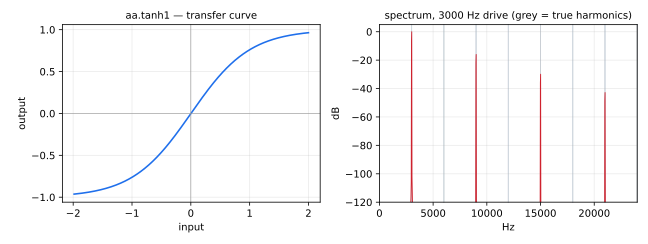


First-order ADAA tanh() saturator.

The domain of this function is ℝ; its theoretical range is [-1.0; 1.0].

#### Usage
```
_ : aa.tanh1 : _
```
#### Test
```
aa = library("aanl.lib");
os = library("oscillators.lib");
sig = os.osc(110);
tanh1_test = aa.tanh1(sig);
```

----

### `(aa.)arctan`


First-order ADAA atan().

The domain of this function is ℝ; its theoretical range is [-π/2.0; π/2.0].

#### Usage
```
_ : aa.arctan : _
```
#### Test
```
aa = library("aanl.lib");
os = library("oscillators.lib");
sig = os.osc(110);
arctan_test = aa.arctan(sig);
```

----

### `(aa.)arctan2`

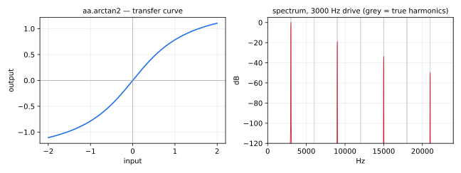


Second-order ADAA atan().

The domain of this function is ℝ; its theoretical range is ]-π/2.0; π/2.0[.

#### Usage
```
_ : aa.arctan2 : _
```
#### Test
```
aa = library("aanl.lib");
os = library("oscillators.lib");
sig = os.osc(110);
arctan2_test = aa.arctan2(sig);
```

----

### `(aa.)asinh1`


First-order ADAA asinh() saturator (unbounded).

The domain of this function is ℝ; its theoretical range is ℝ.

#### Usage
```
_ : aa.asinh1 : _
```
#### Test
```
aa = library("aanl.lib");
os = library("oscillators.lib");
sig = os.osc(110);
asinh1_test = aa.asinh1(sig);
```

----

### `(aa.)asinh2`

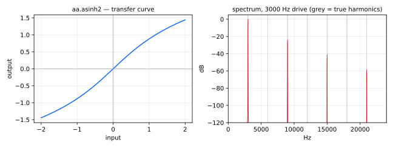


Second-order ADAA asinh() saturator (unbounded).

The domain of this function is ℝ; its theoretical range is ℝ.

#### Usage
```
_ : aa.asinh2 : _
```
#### Test
```
aa = library("aanl.lib");
os = library("oscillators.lib");
sig = os.osc(110);
asinh2_test = aa.asinh2(sig);
```

##  Trigonometry 

These functions are reliable if input signals are within their domains.

----

### `(aa.)cosine1`

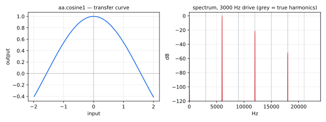


First-order ADAA cos().

The domain of this function is ℝ; its theoretical range is [-1.0; 1.0].

#### Usage
```
_ : aa.cosine1 : _
```
#### Test
```
aa = library("aanl.lib");
os = library("oscillators.lib");
sig = os.osc(110);
cosine1_test = aa.cosine1(sig);
```

----

### `(aa.)cosine2`

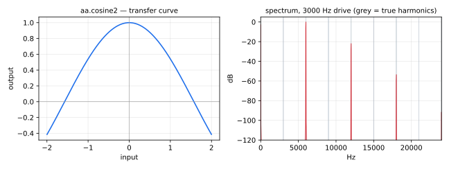


Second-order ADAA cos().

The domain of this function is ℝ; its theoretical range is [-1.0; 1.0].

#### Usage
```
_ : aa.cosine2 : _
```
#### Test
```
aa = library("aanl.lib");
os = library("oscillators.lib");
sig = os.osc(110);
cosine2_test = aa.cosine2(sig);
```

----

### `(aa.)arccos`

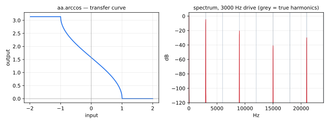


First-order ADAA acos().

The domain of this function is [-1.0; 1.0]; its theoretical range is
[π; 0.0].

#### Usage
```
_ : aa.arccos : _
```
#### Test
```
aa = library("aanl.lib");
os = library("oscillators.lib");
sig = os.osc(110);
arccos_test = aa.arccos(sig);
```

----

### `(aa.)arccos2`

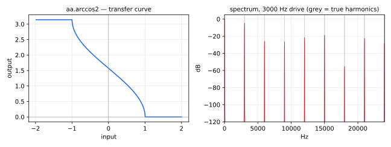


Second-order ADAA acos().

The domain of this function is [-1.0; 1.0]; its theoretical range is 
[π; 0.0].

Note that this function is not accurate for low-amplitude or low-frequency 
input signals. In that case, the first-order ADAA arccos() can be used.

#### Usage
```
_ : aa.arccos2 : _
```
#### Test
```
aa = library("aanl.lib");
os = library("oscillators.lib");
sig = os.osc(110);
arccos2_test = aa.arccos2(sig);
```

----

### `(aa.)acosh1`

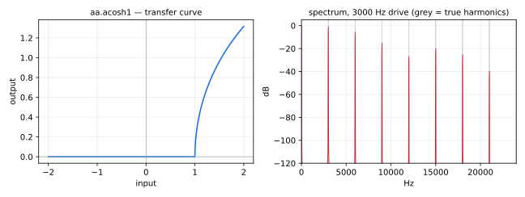


First-order ADAA acosh(). 

The domain of this function is ℝ >= 1.0; its theoretical range is ℝ >= 0.0.

#### Usage
```
_ : aa.acosh1 : _
```
#### Test
```
aa = library("aanl.lib");
os = library("oscillators.lib");
acoshDomainSig = 1.0 + abs(sig);
sig = os.osc(110);
acosh1_test = aa.acosh1(acoshDomainSig);
```

----

### `(aa.)acosh2`

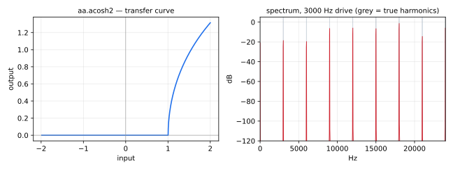


Second-order ADAA acosh().

The domain of this function is ℝ >= 1.0; its theoretical range is ℝ >= 0.0.

Note that this function is not accurate for low-frequency input signals. 
In that case, the first-order ADAA acosh() can be used.

#### Usage
```
_ : aa.acosh2 : _
```
#### Test
```
aa = library("aanl.lib");
os = library("oscillators.lib");
acoshDomainSig = 1.0 + abs(sig);
sig = os.osc(110);
acosh2_test = aa.acosh2(acoshDomainSig);
```

----

### `(aa.)sine`


First-order ADAA sin().

The domain of this function is ℝ; its theoretical range is ℝ.

#### Usage
```
_ : aa.sine : _
```
#### Test
```
aa = library("aanl.lib");
os = library("oscillators.lib");
sig = os.osc(110);
sine_test = aa.sine(sig);
```

----

### `(aa.)sine2`

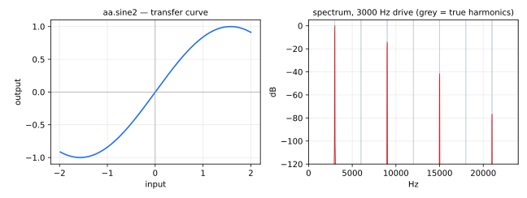


Second-order ADAA sin().

The domain of this function is ℝ; its theoretical range is ℝ.

#### Usage
```
_ : aa.sine2 : _
```
#### Test
```
aa = library("aanl.lib");
os = library("oscillators.lib");
sig = os.osc(110);
sine2_test = aa.sine2(sig);
```

----

### `(aa.)arcsin`


First-order ADAA asin().

The domain of this function is [-1.0, 1.0]; its theoretical range is 
[-π/2.0; π/2.0].

#### Usage
```
_ : aa.arcsin : _
```
#### Test
```
aa = library("aanl.lib");
os = library("oscillators.lib");
sig = os.osc(110);
arcsin_test = aa.arcsin(sig);
```

----

### `(aa.)arcsin2`

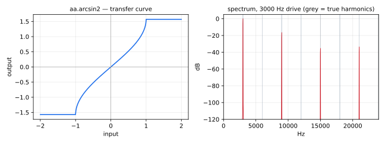


Second-order ADAA asin().

The domain of this function is [-1.0, 1.0]; its theoretical range is
[-π/2.0; π/2.0].

Note that this function is not accurate for low-frequency input signals.
In that case, the first-order ADAA asin() can be used.

#### Usage
```
_ : aa.arcsin2 : _
```
#### Test
```
aa = library("aanl.lib");
os = library("oscillators.lib");
sig = os.osc(110);
arcsin2_test = aa.arcsin2(sig);
```

----

### `(aa.)tangent`

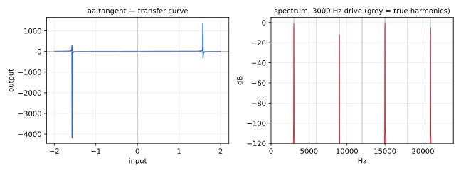


First-order ADAA tan().

The domain of this function is [-π/2.0; π/2.0]; its theoretical range is ℝ.

#### Usage
```
_ : aa.tangent : _
```
#### Test
```
aa = library("aanl.lib");
ma = library("maths.lib");
os = library("oscillators.lib");
tanDomainSig = 0.25 * ma.PI * sig;
sig = os.osc(110);
tangent_test = aa.tangent(tanDomainSig);
```

----

### `(aa.)atanh1`

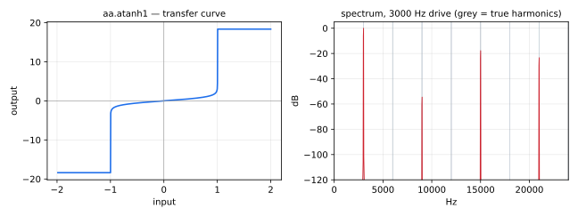


First-order ADAA atanh(). 

The domain of this function is [-1.0; 1.0]; its theoretical range is ℝ.

#### Usage
```
_ : aa.atanh1 : _
```
#### Test
```
aa = library("aanl.lib");
os = library("oscillators.lib");
atanhDomainSig = 0.8 * sig;
sig = os.osc(110);
atanh1_test = aa.atanh1(atanhDomainSig);
```

----

### `(aa.)atanh2`


Second-order ADAA atanh().

The domain of this function is [-1.0; 1.0]; its theoretical range is ℝ.

#### Usage
```
_ : aa.atanh2 : _
```
#### Test
```
aa = library("aanl.lib");
os = library("oscillators.lib");
atanhDomainSig = 0.8 * sig;
sig = os.osc(110);
atanh2_test = aa.atanh2(atanhDomainSig);
```
