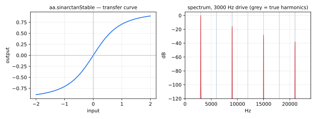
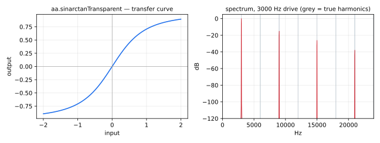

#  aanl.lib 

A library for antialiased nonlinearities. Its official prefix is `aa`. 

This library provides aliasing-suppressed nonlinearities through first-order 
and second-order approximations of continuous-time signals, functions,
and convolution based on antiderivatives. This technique is particularly 
effective if combined with low-factor oversampling, for example, operating
at 96 kHz or 192 kHz sample-rate.

The library contains trigonometric functions as well as other nonlinear 
functions such as bounded and unbounded saturators.

Due to their limited domains or ranges, some of these functions may not 
suitable for audio nonlinear processing or waveshaping, although
they have been included for completeness. Some other functions,
for example, tan() and tanh(), are only available with first-order
antialiasing due to the complexity of the antiderivative of the 
x * f(x) term, particularly because of the necessity of the dilogarithm 
function, which requires special implementation.

Future improvements to this library may include an adaptive
mechanism to set the ill-conditioned cases threshold to improve
performance in varying cases.

Note that the antialiasing functions introduce a delay in the path,
respectively half and one-sample delay for first and second-order functions.

Also note that due to division by differences, it is vital to use
double-precision or more to reduce errors.

The environment identifier for this library is `aa`. After importing
the standard libraries in Faust, the functions below can be called as `aa.function_name`.

The Antialiased Nonlinearities library is organized into 4 sections:

* [Auxiliary Functions](#auxiliary-functions)
* [Saturators](#saturators)
* [Wavefolders](#wavefolders)
* [Trigonometry](#trigonometry)

#### References

* [https://github.com/grame-cncm/faustlibraries/blob/master/aanl.lib](https://github.com/grame-cncm/faustlibraries/blob/master/aanl.lib)
* Reducing the Aliasing in Nonlinear Waveshaping Using Continuous-time Convolution, Julian Parker, Vadim Zavalishin, Efflam Le Bivic, DAFX, 2016
* [http://dafx16.vutbr.cz/dafxpapers/20-DAFx-16_paper_41-PN.pdf](http://dafx16.vutbr.cz/dafxpapers/20-DAFx-16_paper_41-PN.pdf)

## Auxiliary Functions


----

### `(aa.)Rsqrt`


Real-valued sqrt(): a negative input is clamped to 0, so that the output
is never NaN.

#### Usage

```
Rsqrt(x) : _
```

Where:

* `x`: input signal


----

### `(aa.)Rlog`


Real-valued log(): the input is clamped to `ma.EPSILON` from below, so
that the output stays finite.

#### Usage

```
Rlog(x) : _
```

Where:

* `x`: input signal


----

### `(aa.)Rtan`


Real-valued tan(): the input is clipped to [-ma.MAX, ma.MAX].

#### Usage

```
Rtan(x) : _
```

Where:

* `x`: input signal


----

### `(aa.)Racos`


Real-valued acos(): the input is clipped to [-1, 1].

#### Usage

```
Racos(x) : _
```

Where:

* `x`: input signal


----

### `(aa.)Rasin`


Real-valued asin(): the input is clipped to [-1, 1].

#### Usage

```
Rasin(x) : _
```

Where:

* `x`: input signal


----

### `(aa.)Racosh`


Real-valued acosh(): the input is clipped to [1, ma.MAX].

#### Usage

```
Racosh(x) : _
```

Where:

* `x`: input signal


----

### `(aa.)Rcosh`


Real-valued cosh(): the output is limited to `ma.MAX`.

#### Usage

```
Rcosh(x) : _
```

Where:

* `x`: input signal


----

### `(aa.)Rsinh`


Real-valued sinh(): the output is clipped to [-ma.MAX, ma.MAX].

#### Usage

```
Rsinh(x) : _
```

Where:

* `x`: input signal


----

### `(aa.)Ratanh`


Real-valued atanh(): the input is clipped to
[-1 + ma.EPSILON, 1 - ma.EPSILON].

#### Usage

```
Ratanh(x) : _
```

Where:

* `x`: input signal


----

### `(aa.)ADAA1`

Generalised first-order Antiderivative Anti-Aliasing (ADAA) function.

Implements a first-order ADAA approximation to reduce aliasing
in nonlinear audio processing.

#### Usage

```
ADAA1(EPS, f, F1, x) : _
```

Where:

* `EPS`: a threshold for switching between safe and ill-conditioned paths
* `f`: a function that we want to process with ADAA
* `F1`: f's first antiderivative
* `x`: input signal

#### Test
```
aa = library("aanl.lib");
ba = library("basics.lib");
ma = library("maths.lib");
os = library("oscillators.lib");
sig = os.tosc(110);
ADAA1_test = aa.ADAA1(0.001, f, F1, sig)
    with {
        f(x) = max(-1.0, min(1.0, x));
        F1(x) = ba.if((x <= 1.0) & (x >= -1.0), 0.5 * x^2, x * ma.signum(x) - 0.5);
    };
```

----

### `(aa.)ADAA2`

Generalised second-order Antiderivative Anti-Aliasing (ADAA) function.

Implements a second-order ADAA approximation for even better aliasing reduction
at the cost of additional computation.

#### Usage

```
ADAA2(EPS, f, F1, F2, x) : _
```

Where:

* `EPS`: a threshold for switching between safe and ill-conditioned paths
* `f`: a function that we want to process with ADAA
* `F1`: f's first antiderivative
* `F2`: the antiderivative of x * f(x), as in `aa.hardclip2` (not the second
  antiderivative of f)
* `x`: input signal

#### Test
```
aa = library("aanl.lib");
ba = library("basics.lib");
ma = library("maths.lib");
os = library("oscillators.lib");
sig = os.tosc(110);
ADAA2_test = aa.ADAA2(0.001, f, F1, F2, sig)
    with {
        f(x) = max(-1.0, min(1.0, x));
        F1(x) = ba.if((x <= 1.0) & (x >= -1.0), 0.5 * x^2, x * ma.signum(x) - 0.5);
        F2(x) = ba.if((x <= 1.0) & (x >= -1.0), (1.0 / 3.0) * x^3, ((0.5 * x^2) - 1.0 / 6.0) * ma.signum(x));
    };
```

##  Saturators 


These antialiased saturators perform best with high-amplitude input
signals. If the input is only slightly saturated, hence producing
negligible aliasing, the trivial saturator may result in a better
overall output, as noise can be introduced by first and second ADAA
at low amplitudes. 

Once determining the lowest saturation level for which the antialiased 
functions perform adequately, it might be sensible to cross-fade
between the trivial and the antialiased saturators according to the
amplitude profile of the input signal.

----

### `(aa.)hardclip`


First-order ADAA hard-clip.

The domain of this function is ℝ; its theoretical range is [-1.0; 1.0].

#### Usage
```
hardclip(x) : _
```

Where:

* `x`: input signal

#### Test
```
aa = library("aanl.lib");
os = library("oscillators.lib");
sig = os.tosc(110);
hardclip_test = aa.hardclip(sig);
```

----

### `(aa.)hardclip2`


Second-order ADAA hard-clip.

The domain of this function is ℝ; its theoretical range is [-1.0; 1.0].

#### Usage
```
hardclip2(x) : _
```

Where:

* `x`: input signal

#### Test
```
aa = library("aanl.lib");
os = library("oscillators.lib");
sig = os.tosc(110);
hardclip2_test = aa.hardclip2(sig);
```

----

### `(aa.)cubic1`


First-order ADAA cubic saturator.

The domain of this function is ℝ; its theoretical range is 
[-2.0/3.0; 2.0/3.0].

#### Usage
```
cubic1(x) : _
```

Where:

* `x`: input signal

#### Test
```
aa = library("aanl.lib");
os = library("oscillators.lib");
sig = os.tosc(110);
cubic1_test = aa.cubic1(sig);
cubic1_noise_test = aa.cubic1(2.0 * no.noise)
    with { no = library("noises.lib"); };
```

----

### `(aa.)parabolic`


First-order ADAA parabolic saturator.

The domain of this function is ℝ; its theoretical range is [-1.0; 1.0].

#### Usage
```
parabolic(x) : _
```

Where:

* `x`: input signal

#### Test
```
aa = library("aanl.lib");
os = library("oscillators.lib");
sig = os.tosc(110);
parabolic_test = aa.parabolic(sig);
parabolic_noise_test = aa.parabolic(4.0 * no.noise)
    with { no = library("noises.lib"); };
```

----

### `(aa.)parabolic2`


Second-order ADAA parabolic saturator.

The domain of this function is ℝ; its theoretical range is [-1.0; 1.0].

#### Usage
```
parabolic2(x) : _
```

Where:

* `x`: input signal

#### Test
```
aa = library("aanl.lib");
os = library("oscillators.lib");
sig = os.tosc(110);
parabolic2_test = aa.parabolic2(sig);
parabolic2_noise_test = aa.parabolic2(4.0 * no.noise)
    with { no = library("noises.lib"); };
```

----

### `(aa.)hyperbolic`


First-order ADAA hyperbolic saturator.

The domain of this function is ℝ; its theoretical range is [-1.0; 1.0].

#### Usage
```
hyperbolic(x) : _
```

Where:

* `x`: input signal

#### Test
```
aa = library("aanl.lib");
os = library("oscillators.lib");
sig = os.tosc(110);
hyperbolic_test = aa.hyperbolic(sig);
```

----

### `(aa.)hyperbolic2`


Second-order ADAA hyperbolic saturator.

The domain of this function is ℝ; its theoretical range is [-1.0; 1.0].

#### Usage
```
hyperbolic2(x) : _
```

Where:

* `x`: input signal

#### Test
```
aa = library("aanl.lib");
os = library("oscillators.lib");
sig = os.tosc(110);
hyperbolic2_test = aa.hyperbolic2(sig);
```

----

### `(aa.)sinarctan`


First-order ADAA sin(atan()) saturator.

The domain of this function is ℝ; its theoretical range is [-1.0; 1.0].

#### Usage
```
sinarctan(x) : _
```

Where:

* `x`: input signal

#### Test
```
aa = library("aanl.lib");
os = library("oscillators.lib");
sig = os.tosc(110);
sinarctan_test = aa.sinarctan(sig);
```

----

### `(aa.)sinarctan2`


Second-order ADAA sin(atan()) saturator.

The domain of this function is ℝ; its theoretical range is [-1.0; 1.0].

#### Usage
```
sinarctan2(x) : _
```

Where:

* `x`: input signal

#### Test
```
aa = library("aanl.lib");
os = library("oscillators.lib");
sig = os.tosc(110);
sinarctan2_test = aa.sinarctan2(sig);
```

----

### `(aa.)sinarctanStable`




First-order ADAA sin(atan()) saturator, x / sqrt(1 + x^2), evaluated without a
threshold or fallback branch.

With F(x) = sqrt(1 + x^2), the difference quotient of `aa.sinarctan` is
rewritten as (x[n] + x[n-1]) / (F(x[n]) + F(x[n-1])), which has no
cancellation when x[n] is close to x[n-1] and is exact for any pair of
samples. The output is delayed by half a sample, and at Nyquist the linear
response is zero, as for any first-order ADAA with a one-sample rectangular
kernel. See `aa.sinarctanTransparent` for a version with a flat linear response.

The domain of this function is ℝ; its theoretical range is [-1.0; 1.0].

#### Usage
```
sinarctanStable(x) : _
```

Where:

* `x`: input signal

#### Test
```
aa = library("aanl.lib");
os = library("oscillators.lib");
sig = os.tosc(110);
sinarctanStable_test = aa.sinarctanStable(5.0 * sig);
```

#### References

* M. Vicanek, "Note on Alias Suppression in Digital Distortion", 2023
  (revised 2024), eq. (9), [https://vicanek.de/articles/AADistortion.pdf](https://vicanek.de/articles/AADistortion.pdf)

----

### `(aa.)sinarctanTransparent`




First-order ADAA sin(atan()) saturator, x / sqrt(1 + x^2), with a flat
magnitude response in the linear regime.

The rectangular kernel of the antiderivative method is delayed by half a
sample, which gives a lowpass of -6 dB at Nyquist (y = (x[n] + 6 x[n-1] +
x[n-2]) / 8 for f(x) = x) instead of the zero of the undelayed kernel. The
two zeros of that filter are at z = -1 / (3 + sqrt(8)) and its reciprocal, so
two identical one-pole filters, y[n] = (1 + a) x[n] - a y[n-1] with
a = 1 / (3 + sqrt(8)), one before and one after the shaper, cancel it. Each
has unit gain at DC. In the linear regime the whole chain is then the
first-order allpass (a + z^-1) / (1 + a z^-1): its magnitude is flat, and
its delay is (1 - a) / (1 + a) = 0.71 samples at DC, rising to
(1 + a) / (1 - a) = 1.41 samples at Nyquist.

The domain of this function is ℝ; because of the post filter its output can
exceed [-1.0; 1.0] by up to about 7 % (a full-scale step peaks at 1.071).

#### Usage
```
sinarctanTransparent(x) : _
```

Where:

* `x`: input signal

#### Test
```
aa = library("aanl.lib");
os = library("oscillators.lib");
sig = os.tosc(110);
sinarctanTransparent_test = aa.sinarctanTransparent(5.0 * sig);
```

#### References

* M. Vicanek, "Note on Alias Suppression in Digital Distortion", 2023
  (revised 2024), eqs. (4), (6) and (10),
  [https://vicanek.de/articles/AADistortion.pdf](https://vicanek.de/articles/AADistortion.pdf)

----

### `(aa.)softclipQuadratic1`


First-order ADAA quadratic softclip.

The domain of this function is ℝ; its theoretical range is [-1.0; 1.0].

#### Usage
```
softclipQuadratic1(x) : _
```

Where:

* `x`: input signal

#### Test
```
aa = library("aanl.lib");
os = library("oscillators.lib");
sig = os.tosc(110);
softclipQuadratic1_test = aa.softclipQuadratic1(sig);
```

----

### `(aa.)softclipQuadratic2`


Second-order ADAA quadratic softclip.

The domain of this function is ℝ; its theoretical range is [-1.0; 1.0].

#### Usage
```
softclipQuadratic2(x) : _
```

Where:

* `x`: input signal

#### Test
```
aa = library("aanl.lib");
os = library("oscillators.lib");
sig = os.tosc(110);
softclipQuadratic2_test = aa.softclipQuadratic2(sig);
```

----

### `(aa.)tanh1`


First-order ADAA tanh() saturator.

The domain of this function is ℝ; its theoretical range is [-1.0; 1.0].

#### Usage
```
tanh1(x) : _
```

Where:

* `x`: input signal

#### Test
```
aa = library("aanl.lib");
os = library("oscillators.lib");
sig = os.tosc(110);
tanh1_test = aa.tanh1(sig);
```

----

### `(aa.)arctan`


First-order ADAA atan().

The domain of this function is ℝ; its theoretical range is [-π/2.0; π/2.0].

#### Usage
```
arctan(x) : _
```

Where:

* `x`: input signal

#### Test
```
aa = library("aanl.lib");
os = library("oscillators.lib");
sig = os.tosc(110);
arctan_test = aa.arctan(sig);
```

----

### `(aa.)arctan2`


Second-order ADAA atan().

The domain of this function is ℝ; its theoretical range is ]-π/2.0; π/2.0[.

#### Usage
```
arctan2(x) : _
```

Where:

* `x`: input signal

#### Test
```
aa = library("aanl.lib");
os = library("oscillators.lib");
sig = os.tosc(110);
arctan2_test = aa.arctan2(sig);
```

----

### `(aa.)asinh1`


First-order ADAA asinh() saturator (unbounded).

The domain of this function is ℝ; its theoretical range is ℝ.

#### Usage
```
asinh1(x) : _
```

Where:

* `x`: input signal

#### Test
```
aa = library("aanl.lib");
os = library("oscillators.lib");
sig = os.tosc(110);
asinh1_test = aa.asinh1(sig);
```

----

### `(aa.)asinh2`


Second-order ADAA asinh() saturator (unbounded).

The domain of this function is ℝ; its theoretical range is ℝ.

#### Usage
```
asinh2(x) : _
```

Where:

* `x`: input signal

#### Test
```
aa = library("aanl.lib");
os = library("oscillators.lib");
sig = os.tosc(110);
asinh2_test = aa.asinh2(sig);
```

##  Wavefolders 

Wavefolders reflect the part of the signal that exceeds a threshold back
towards zero, as many times as needed to keep the output within the
threshold. Their slope stays large however hard they are driven, so they
alias much more than saturators at the same drive.

The folders below share two parameters: the threshold `t` and a decay
factor `r`. At each reflection, the part of the input beyond the threshold
is scaled by `r`. With `r = 1` the folds are periodic in the input; with
`r < 1` each fold is `1/r` times wider than the previous one, so the
output moves more slowly as the input grows. Their antiderivatives are in
closed form for any number of folds.

The trivial (non-antialiased) curves are not exported; they are the
limit of the ADAA forms for slowly varying inputs.

----

### `(aa.)triangleFold1`


First-order ADAA triangle wavefolder.

The input passes unchanged between `-t` and `t`. Beyond, it is reflected
back linearly, as many times as needed. With `r = 1` this is the classic
triangle folder: for `|x| > t` the output is a triangle wave of the input
with period `4t`. With `r < 1` the excess is scaled by `r` at every
reflection: after k reflections the slope is `r^k` and the fold is
`2t / r^k` wide.

The domain of this function is ℝ; its theoretical range is [-t; t].

#### Usage
```
triangleFold1(t, r, x) : _
```

Where:

* `t`: the threshold, > 0; the output stays within [-t; t] (in single
  precision, within 1.004 t for inputs up to 20000 t)
* `r`: the decay factor of the excess at each reflection, in (0; 1];
  1 for periodic folding
* `x`: input signal

#### Test
```
aa = library("aanl.lib");
ba = library("basics.lib");
ma = library("maths.lib");
no = library("noises.lib");
foldSig = 4.0 * no.noise;
foldTri = 1.0 - abs(2.0 * ba.period(P) / P - 1.0) with { P = int(ma.SR / 10); };
triangleFold1_test = aa.triangleFold1(0.5, 0.9, foldSig);
triangleFold1_slider_test = aa.triangleFold1(hslider("t", 0.5, 0.05, 1.0, 0.01), hslider("r", 0.9, 0.5, 1.0, 0.001), foldSig);
triangleFold1_modulated_test = aa.triangleFold1(0.05 + 0.95 * (1.0 - foldTri), 0.5 + 0.5 * foldTri, foldSig);
```

----

### `(aa.)triangleFold2`


Second-order ADAA triangle wavefolder. Same curve and parameters as
`aa.triangleFold1`.

The domain of this function is ℝ; its theoretical range is [-t; t].

#### Usage
```
triangleFold2(t, r, x) : _
```

Where:

* `t`: the threshold, > 0; the output stays within [-t; t] in double
  precision; in single precision it can exceed t once |x| reaches a few
  thousand times t (up to 1.2 t at 6000 t and 8 t at 20000 t, with t = 0.05
  and r = 0.5), by cancellation in the ADAA2 formula
* `r`: the decay factor of the excess at each reflection, in (0; 1];
  1 for periodic folding
* `x`: input signal

#### Test
```
aa = library("aanl.lib");
ba = library("basics.lib");
ma = library("maths.lib");
no = library("noises.lib");
foldSig = 4.0 * no.noise;
foldTri = 1.0 - abs(2.0 * ba.period(P) / P - 1.0) with { P = int(ma.SR / 10); };
triangleFold2_test = aa.triangleFold2(0.5, 0.9, foldSig);
triangleFold2_slider_test = aa.triangleFold2(hslider("t", 0.5, 0.05, 1.0, 0.01), hslider("r", 0.9, 0.5, 1.0, 0.001), foldSig);
triangleFold2_modulated_test = aa.triangleFold2(0.05 + 0.95 * (1.0 - foldTri), 0.5 + 0.5 * foldTri, foldSig);
```

----

### `(aa.)sineFold1`


First-order ADAA sine wavefolder.

The input passes unchanged between `-t` and `t`. Beyond, each fold is a
half-period of a cosine that goes from one threshold to the other, so the
slope is 1 inside and 0 at the turning points. With `r = 1` the output for
`|x| > t` is `t * sin(pi * x / (2t))`. With `r < 1` each fold is `1/r`
times wider than the previous one, as for `aa.triangleFold1`: for
`|x| > t` the output is that of the triangle folder `y` passed through
`t * sin(pi * y / (2t))`.

The domain of this function is ℝ; its theoretical range is [-t; t].

#### Usage
```
sineFold1(t, r, x) : _
```

Where:

* `t`: the threshold, > 0; the output stays within [-t; t] (in single
  precision, within 1.004 t for inputs up to 20000 t)
* `r`: the decay factor of the fold width, in (0; 1]; 1 for periodic folding
* `x`: input signal

#### Test
```
aa = library("aanl.lib");
ba = library("basics.lib");
ma = library("maths.lib");
no = library("noises.lib");
foldSig = 4.0 * no.noise;
foldTri = 1.0 - abs(2.0 * ba.period(P) / P - 1.0) with { P = int(ma.SR / 10); };
sineFold1_test = aa.sineFold1(0.5, 0.8, foldSig);
sineFold1_slider_test = aa.sineFold1(hslider("t", 0.5, 0.05, 1.0, 0.01), hslider("r", 0.8, 0.5, 1.0, 0.001), foldSig);
sineFold1_modulated_test = aa.sineFold1(0.05 + 0.95 * (1.0 - foldTri), 0.5 + 0.5 * foldTri, foldSig);
```

----

### `(aa.)sineFold2`


Second-order ADAA sine wavefolder. Same curve and parameters as
`aa.sineFold1`.

The domain of this function is ℝ; its theoretical range is [-t; t].

#### Usage
```
sineFold2(t, r, x) : _
```

Where:

* `t`: the threshold, > 0; the output stays within [-t; t] in double
  precision; in single precision it can exceed t once |x| reaches a few
  thousand times t (up to 1.2 t at 6000 t and 8 t at 20000 t, with t = 0.05
  and r = 0.5), by cancellation in the ADAA2 formula
* `r`: the decay factor of the fold width, in (0; 1]; 1 for periodic folding
* `x`: input signal

#### Test
```
aa = library("aanl.lib");
ba = library("basics.lib");
ma = library("maths.lib");
no = library("noises.lib");
foldSig = 4.0 * no.noise;
foldTri = 1.0 - abs(2.0 * ba.period(P) / P - 1.0) with { P = int(ma.SR / 10); };
sineFold2_test = aa.sineFold2(0.5, 0.8, foldSig);
sineFold2_slider_test = aa.sineFold2(hslider("t", 0.5, 0.05, 1.0, 0.01), hslider("r", 0.8, 0.5, 1.0, 0.001), foldSig);
sineFold2_modulated_test = aa.sineFold2(0.05 + 0.95 * (1.0 - foldTri), 0.5 + 0.5 * foldTri, foldSig);
```

##  Trigonometry 

These functions are reliable if input signals are within their domains.

----

### `(aa.)cosine1`


First-order ADAA cos().

The domain of this function is ℝ; its theoretical range is [-1.0; 1.0].

#### Usage
```
cosine1(x) : _
```

Where:

* `x`: input signal

#### Test
```
aa = library("aanl.lib");
os = library("oscillators.lib");
sig = os.tosc(110);
cosine1_test = aa.cosine1(sig);
```

----

### `(aa.)cosine2`


Second-order ADAA cos().

The domain of this function is ℝ; its theoretical range is [-1.0; 1.0].

#### Usage
```
cosine2(x) : _
```

Where:

* `x`: input signal

#### Test
```
aa = library("aanl.lib");
os = library("oscillators.lib");
sig = os.tosc(110);
cosine2_test = aa.cosine2(sig);
```

----

### `(aa.)arccos`


First-order ADAA acos().

The domain of this function is [-1.0; 1.0]; its theoretical range is
[π; 0.0].

#### Usage
```
arccos(x) : _
```

Where:

* `x`: input signal

#### Test
```
aa = library("aanl.lib");
os = library("oscillators.lib");
sig = os.tosc(110);
arccos_test = aa.arccos(sig);
```

----

### `(aa.)arccos2`


Second-order ADAA acos().

The domain of this function is [-1.0; 1.0]; its theoretical range is 
[π; 0.0].

Note that this function is not accurate for low-amplitude or low-frequency 
input signals. In that case, the first-order ADAA arccos() can be used.

#### Usage
```
arccos2(x) : _
```

Where:

* `x`: input signal

#### Test
```
aa = library("aanl.lib");
os = library("oscillators.lib");
sig = os.tosc(110);
arccos2_test = aa.arccos2(sig);
arccos2_noise_test = aa.arccos2(no.noise)
    with { no = library("noises.lib"); };
```

----

### `(aa.)acosh1`


First-order ADAA acosh(). 

The domain of this function is ℝ >= 1.0; its theoretical range is ℝ >= 0.0.

#### Usage
```
acosh1(x) : _
```

Where:

* `x`: input signal

#### Test
```
aa = library("aanl.lib");
os = library("oscillators.lib");
acoshDomainSig = 1.0 + abs(sig);
sig = os.tosc(110);
acosh1_test = aa.acosh1(acoshDomainSig);
```

----

### `(aa.)acosh2`


Second-order ADAA acosh().

The domain of this function is ℝ >= 1.0; its theoretical range is ℝ >= 0.0.

Note that this function is not accurate for low-frequency input signals. 
In that case, the first-order ADAA acosh() can be used.

#### Usage
```
acosh2(x) : _
```

Where:

* `x`: input signal

#### Test
```
aa = library("aanl.lib");
os = library("oscillators.lib");
acoshDomainSig = 1.0 + abs(sig);
sig = os.tosc(110);
acosh2_test = aa.acosh2(acoshDomainSig);
```

----

### `(aa.)sine`


First-order ADAA sin().

The domain of this function is ℝ; its theoretical range is ℝ.

#### Usage
```
sine(x) : _
```

Where:

* `x`: input signal

#### Test
```
aa = library("aanl.lib");
os = library("oscillators.lib");
sig = os.tosc(110);
sine_test = aa.sine(sig);
```

----

### `(aa.)sine2`


Second-order ADAA sin().

The domain of this function is ℝ; its theoretical range is ℝ.

#### Usage
```
sine2(x) : _
```

Where:

* `x`: input signal

#### Test
```
aa = library("aanl.lib");
os = library("oscillators.lib");
sig = os.tosc(110);
sine2_test = aa.sine2(sig);
```

----

### `(aa.)arcsin`


First-order ADAA asin().

The domain of this function is [-1.0, 1.0]; its theoretical range is 
[-π/2.0; π/2.0].

#### Usage
```
arcsin(x) : _
```

Where:

* `x`: input signal

#### Test
```
aa = library("aanl.lib");
os = library("oscillators.lib");
sig = os.tosc(110);
arcsin_test = aa.arcsin(sig);
```

----

### `(aa.)arcsin2`


Second-order ADAA asin().

The domain of this function is [-1.0, 1.0]; its theoretical range is
[-π/2.0; π/2.0].

Note that this function is not accurate for low-frequency input signals.
In that case, the first-order ADAA asin() can be used.

#### Usage
```
arcsin2(x) : _
```

Where:

* `x`: input signal

#### Test
```
aa = library("aanl.lib");
os = library("oscillators.lib");
sig = os.tosc(110);
arcsin2_test = aa.arcsin2(sig);
```

----

### `(aa.)tangent`


First-order ADAA tan().

The domain of this function is [-π/2.0; π/2.0]; its theoretical range is ℝ.

#### Usage
```
tangent(x) : _
```

Where:

* `x`: input signal

#### Test
```
aa = library("aanl.lib");
ma = library("maths.lib");
os = library("oscillators.lib");
tanDomainSig = 0.25 * ma.PI * sig;
sig = os.tosc(110);
tangent_test = aa.tangent(tanDomainSig);
```

----

### `(aa.)atanh1`


First-order ADAA atanh(). 

The domain of this function is [-1.0; 1.0]; its theoretical range is ℝ.

#### Usage
```
atanh1(x) : _
```

Where:

* `x`: input signal

#### Test
```
aa = library("aanl.lib");
os = library("oscillators.lib");
atanhDomainSig = 0.8 * sig;
sig = os.tosc(110);
atanh1_test = aa.atanh1(atanhDomainSig);
```

----

### `(aa.)atanh2`


Second-order ADAA atanh().

The domain of this function is [-1.0; 1.0]; its theoretical range is ℝ.

#### Usage
```
atanh2(x) : _
```

Where:

* `x`: input signal

#### Test
```
aa = library("aanl.lib");
os = library("oscillators.lib");
atanhDomainSig = 0.8 * sig;
sig = os.tosc(110);
atanh2_test = aa.atanh2(atanhDomainSig);
```
