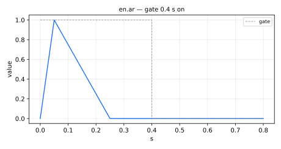
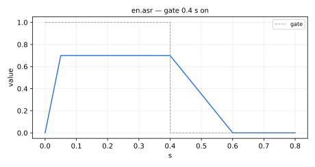
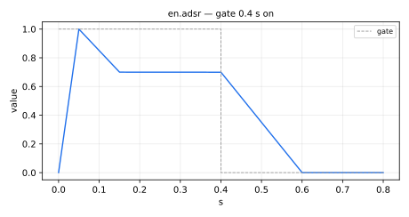
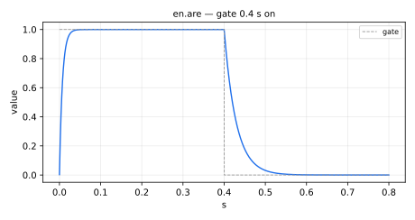
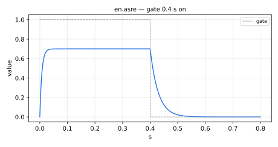
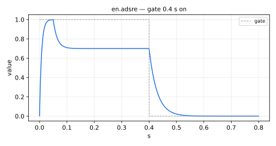

#  envelopes.lib 

Envelopes library. Its official prefix is `en`.

This library provides envelope generators and control functions for shaping
signal amplitude, pitch, or other parameters. It includes ADSR, AR, and percussive
models, as well as exponential, linear, and segmented envelope types used in both
synthesis and dynamic processing contexts.

The Envelopes library is organized into 3 sections:

* [Envelopes with linear segments](#envelopes-with-linear-segments)
* [Envelopes with exponential segments](#envelopes-with-exponential-segments)
* [Others](#others)

#### References

* [https://github.com/grame-cncm/faustlibraries/blob/master/envelopes.lib](https://github.com/grame-cncm/faustlibraries/blob/master/envelopes.lib)

## Envelopes with linear segments


----

### `(en.)ar`



AR (Attack, Release) envelope generator (useful to create percussion envelopes).
`ar` is a standard Faust function.

#### Usage

```
ar(at,rt,t) : _
```

Where:

* `at`: attack (sec)
* `rt`: release (sec)
* `t`: trigger signal (attack is triggered when `t>0`, release is triggered
when the envelope value reaches 1)

#### Test
```
en = library("envelopes.lib");
no = library("noises.lib");
gate = button("gate");
ar_test = no.noise * en.ar(0.02, 0.3, gate);
ar_slider_test = no.noise * en.ar(hslider("ar:at", 0.02, 0, 5, 0.001), hslider("ar:rt", 0.3, 0, 5, 0.001), gate);
```

----

### `(en.)asr`



ASR (Attack, Sustain, Release) envelope generator.
`asr` is a standard Faust function.

#### Usage

```
asr(at,sl,rt,t) : _
```

Where:

* `at`: attack (sec)
* `sl`: sustain level (between 0..1)
* `rt`: release (sec)
* `t`: trigger signal (attack is triggered when `t>0`, release is triggered
when `t=0`)

#### Test
```
en = library("envelopes.lib");
no = library("noises.lib");
os = library("oscillators.lib");
gate = button("gate");
asr_test = no.noise * en.asr(0.05, 0.7, 0.4, gate);
velocity_gate = 0.5 * os.lf_squarewavepos(4);
asr_velocity_test = en.asr(0.05, 0.7, 0.04, velocity_gate);
asr_slider_test = no.noise * en.asr(hslider("asr:at", 0.05, 0, 5, 0.001), hslider("asr:sl", 0.7, 0, 1, 0.01), hslider("asr:rt", 0.4, 0, 5, 0.001), gate);
```

----

### `(en.)adsr`



ADSR (Attack, Decay, Sustain, Release) envelope generator.
`adsr` is a standard Faust function.

#### Usage

```
adsr(at,dt,sl,rt,t) : _
```

Where:

* `at`: attack time (sec)
* `dt`: decay time (sec)
* `sl`: sustain level (between 0..1)
* `rt`: release time (sec)
* `t`: trigger signal (attack is triggered when `t>0`, release is triggered
when `t=0`)

#### Test
```
en = library("envelopes.lib");
no = library("noises.lib");
os = library("oscillators.lib");
gate = button("gate");
adsr_test = no.noise * en.adsr(0.05, 0.1, 0.6, 0.3, gate);
velocity_gate = 0.5 * os.lf_squarewavepos(4);
adsr_velocity_test = en.adsr(0.05, 0.1, 0.6, 0.04, velocity_gate);
adsr_slider_test = no.noise * en.adsr(hslider("adsr:at", 0.05, 0, 5, 0.001), hslider("adsr:dt", 0.1, 0, 5, 0.001), hslider("adsr:sl", 0.6, 0, 1, 0.01), hslider("adsr:rt", 0.3, 0, 5, 0.001), gate);
```

----

### `(en.)adsrf_bias`

ADSR (Attack, Decay, Sustain, Release, Final) envelope generator with
control over bias on each segment, and toggle for legato.

#### Usage

```
adsrf_bias(at,dt,sl,rt,final,b_att,b_dec,b_rel,legato,t) : _
```

Where:

* `at`: attack time (sec)
* `dt`: decay time (sec)
* `sl`: sustain level (between 0..1)
* `rt`: release time (sec)
* `final`: final level (between 0..1) but less than or equal to `sl`
* `b_att`: bias during attack (between 0..1) where 0.5 is no bias.
* `b_dec`: bias during decay (between 0..1) where 0.5 is no bias.
* `b_rel`: bias during release (between 0..1) where 0.5 is no bias.
* `legato`: toggle for legato. If disabled, envelopes "re-trigger" from zero.
* `t`: trigger signal (attack is triggered when `t>0`, release is triggered
when `t=0`)

#### Test
```
en = library("envelopes.lib");
no = library("noises.lib");
ba = library("basics.lib");
ma = library("maths.lib");
gate = button("gate");
legato = checkbox("legato");
adsrf_bias_test = no.noise * en.adsrf_bias(
  0.05, 0.1, 0.6, 0.4, 0.2,
  0.4, 0.6, 0.5,
  legato, gate
);
adsrf_bias_slider_test = no.noise * en.adsrf_bias(hslider("adsrf_bias:att", 0.05, 0, 5, 0.001), hslider("adsrf_bias:dec", 0.1, 0, 5, 0.001), hslider("adsrf_bias:sus", 0.6, 0, 1, 0.01), hslider("adsrf_bias:rel", 0.4, 0, 5, 0.001), hslider("adsrf_bias:final", 0.2, 0, 1, 0.01), hslider("adsrf_bias:bias_att", 0.4, 0, 1, 0.01), hslider("adsrf_bias:bias_dec", 0.6, 0, 1, 0.01), hslider("adsrf_bias:bias_rel", 0.5, 0, 1, 0.01), legato, gate);
adsrf_bias_modulated_test = no.noise * en.adsrf_bias(0.05, 0.1, 0.6, 0.4, 0.2, tri, 1 - tri, tri, checkbox("legato"), button("gate")) with { P = int(ma.SR/10); tri = 1 - abs(2*ba.period(P)/P - 1); };
```

----

### `(en.)adsr_bias`

ADSR (Attack, Decay, Sustain, Release) envelope generator with
control over bias on each segment, and toggle for legato.

#### Usage

```
adsr_bias(at,dt,sl,rt,b_att,b_dec,b_rel,legato,t) : _
```

Where:

* `at`: attack time (sec)
* `dt`: decay time (sec)
* `sl`: sustain level (between 0..1)
* `rt`: release time (sec)
* `b_att`: bias during attack (between 0..1) where 0.5 is no bias.
* `b_dec`: bias during decay (between 0..1) where 0.5 is no bias.
* `b_rel`: bias during release (between 0..1) where 0.5 is no bias.
* `legato`: toggle for legato. If disabled, envelopes "re-trigger" from zero.
* `t`: trigger signal (attack is triggered when `t>0`, release is triggered
when `t=0`)

#### Test
```
en = library("envelopes.lib");
no = library("noises.lib");
gate = button("gate");
legato = checkbox("legato");
adsr_bias_test = no.noise * en.adsr_bias(
  0.05, 0.1, 0.6, 0.4,
  0.4, 0.6, 0.5,
  legato, gate
);
```

----

### `(en.)ahdsrf_bias`

AHDSR (Attack, Hold, Decay, Sustain, Release, Final) envelope generator
with control over bias on each segment, and toggle for legato.

#### Usage

```
ahdsrf_bias(at,ht,dt,sl,rt,final,b_att,b_dec,b_rel,legato,t) : _
```

Where:

* `at`: attack time (sec)
* `ht`: hold time (sec)
* `dt`: decay time (sec)
* `sl`: sustain level (between 0..1)
* `rt`: release time (sec)
* `final`: final level (between 0..1) but less than or equal to `sl`
* `b_att`: bias during attack (between 0..1) where 0.5 is no bias.
* `b_dec`: bias during decay (between 0..1) where 0.5 is no bias.
* `b_rel`: bias during release (between 0..1) where 0.5 is no bias.
* `legato`: toggle for legato. If disabled, envelopes "re-trigger" from zero.
* `t`: trigger signal (attack is triggered when `t>0`, release is triggered
when `t=0`)

#### Test
```
en = library("envelopes.lib");
no = library("noises.lib");
ba = library("basics.lib");
ma = library("maths.lib");
gate = button("gate");
legato = checkbox("legato");
ahdsrf_bias_test = no.noise * en.ahdsrf_bias(
  0.05, 0.05, 0.1, 0.6, 0.4, 0.2,
  0.4, 0.6, 0.5,
  legato, gate
);
ahdsrf_bias_slider_test = no.noise * en.ahdsrf_bias(hslider("ahdsrf_bias:att", 0.05, 0, 5, 0.001), hslider("ahdsrf_bias:hol", 0.05, 0, 5, 0.001), hslider("ahdsrf_bias:dec", 0.1, 0, 5, 0.001), hslider("ahdsrf_bias:sus", 0.6, 0, 1, 0.01), hslider("ahdsrf_bias:rel", 0.4, 0, 5, 0.001), hslider("ahdsrf_bias:final", 0.2, 0, 1, 0.01), hslider("ahdsrf_bias:bias_att", 0.4, 0, 1, 0.01), hslider("ahdsrf_bias:bias_dec", 0.6, 0, 1, 0.01), hslider("ahdsrf_bias:bias_rel", 0.5, 0, 1, 0.01), legato, gate);
ahdsrf_bias_modulated_test = no.noise * en.ahdsrf_bias(0.05, 0.05, 0.1, 0.6, 0.4, 0.2, tri, 1 - tri, tri, checkbox("legato"), button("gate")) with { P = int(ma.SR/10); tri = 1 - abs(2*ba.period(P)/P - 1); };
```

----

### `(en.)ahdsr_bias`

AHDSR (Attack, Hold, Decay, Sustain, Release) envelope generator
with control over bias on each segment, and toggle for legato.
The release segment ends at 0 (see `ahdsrf_bias` for a final level).

#### Usage

```
ahdsr_bias(at,ht,dt,sl,rt,b_att,b_dec,b_rel,legato,t) : _
```

Where:

* `at`: attack time (sec)
* `ht`: hold time (sec)
* `dt`: decay time (sec)
* `sl`: sustain level (between 0..1)
* `rt`: release time (sec)
* `b_att`: bias during attack (between 0..1) where 0.5 is no bias.
* `b_dec`: bias during decay (between 0..1) where 0.5 is no bias.
* `b_rel`: bias during release (between 0..1) where 0.5 is no bias.
* `legato`: toggle for legato. If disabled, envelopes "re-trigger" from zero.
* `t`: trigger signal (attack is triggered when `t>0`, release is triggered
when `t=0`)

#### Test
```
en = library("envelopes.lib");
no = library("noises.lib");
gate = button("gate");
legato = checkbox("legato");
ahdsr_bias_test = no.noise * en.ahdsr_bias(
  0.05, 0.05, 0.1, 0.6, 0.4,
  0.4, 0.6, 0.5,
  legato, gate
);
```

## Envelopes with exponential segments


----

### `(en.)smoothEnvelope`

An envelope with an exponential attack and release.
`smoothEnvelope` is a standard Faust function.

#### Usage

```
smoothEnvelope(ar,t) : _
```

Where:

* `ar`: attack and release duration (sec)
* `t`: trigger signal (attack is triggered when `t>0`, release is triggered
when `t=0`)

#### Test
```
en = library("envelopes.lib");
no = library("noises.lib");
gate = button("gate");
smoothEnvelope_test = no.noise * en.smoothEnvelope(0.2, gate);
smoothEnvelope_slider_test = no.noise * en.smoothEnvelope(hslider("smoothEnvelope:ar", 0.2, 0, 5, 0.001), gate);
```

----

### `(en.)asrfe`

ASRFE (Attack, Sustain, Release-to-Final-value Exponentially) envelope
generator. Generic form specialized by `arfe` and friends: while the gate
is open the envelope approaches `susLvl` with time constant `attT60/6.91`,
and when it closes it approaches `finLvl` with time constant `relT60/6.91`.

#### Usage

```
asrfe(attT60,susLvl,relT60,finLvl,gate) : _
```

Where:

* `attT60`: attack time (sec) to reach the sustain level
* `susLvl`: sustain level held while the gate is open
* `relT60`: release time (sec) to reach the final level
* `finLvl`: final level to approach upon release (such as 0)
* `gate`: trigger signal (attack is triggered when `gate>0`, release is
triggered when `gate=0`)

#### Test
```
en = library("envelopes.lib");
no = library("noises.lib");
ba = library("basics.lib");
ma = library("maths.lib");
gate = button("gate");
asrfe_test = no.noise * en.asrfe(0.02, 0.8, 0.4, 0, gate);
asrfe_slider_test = no.noise * en.asrfe(hslider("asrfe:attT60", 0.02, 0, 5, 0.001), hslider("asrfe:susLvl", 0.8, 0, 1, 0.01), hslider("asrfe:relT60", 0.4, 0, 5, 0.001), hslider("asrfe:finLvl", 0, 0, 1, 0.01), gate);
asrfe_modulated_test = no.noise * en.asrfe(0.01*pow(100, tri), 0.8, 0.01*pow(100, 1 - tri), 0, button("gate")) with { P = int(ma.SR/10); tri = 1 - abs(2*ba.period(P)/P - 1); };
```

----

### `(en.)arfe`

ARFE (Attack and Release-to-Final-value Exponentially) envelope generator.
Approximately equal to `smoothEnvelope(Attack/6.91)` when Attack == Release.

#### Usage

```
arfe(at,rt,fl,t) : _
```

Where:

* `at`: attack (sec)
* `rt`: release (sec)
* `fl`: final level to approach upon release (such as 0)
* `t`: trigger signal (attack is triggered when `t>0`, release is triggered
when `t=0`)

#### Test
```
en = library("envelopes.lib");
no = library("noises.lib");
gate = button("gate");
arfe_test = no.noise * en.arfe(0.2, 0.4, 0, gate);
```

----

### `(en.)are`



ARE (Attack, Release) envelope generator with Exponential segments.
Approximately equal to `smoothEnvelope(Attack/6.91)` when Attack == Release.

#### Usage

```
are(at,rt,t) : _
```

Where:

* `at`: attack (sec)
* `rt`: release (sec)
* `t`: trigger signal (attack is triggered when `t>0`, release is triggered
when `t=0`)

#### Test
```
en = library("envelopes.lib");
no = library("noises.lib");
gate = button("gate");
are_test = no.noise * en.are(0.2, 0.4, gate);
```

----

### `(en.)asre`



ASRE (Attack, Sustain, Release) envelope generator with Exponential segments.

#### Usage

```
asre(at,sl,rt,t) : _
```

Where:

* `at`: attack (sec)
* `sl`: sustain level (between 0..1)
* `rt`: release (sec)
* `t`: trigger signal (attack is triggered when `t>0`, release is triggered
when `t=0`)

#### Test
```
en = library("envelopes.lib");
no = library("noises.lib");
gate = button("gate");
asre_test = no.noise * en.asre(0.2, 0.6, 0.4, gate);
```

----

### `(en.)adsre`



ADSRE (Attack, Decay, Sustain, Release) envelope generator with Exponential
segments.

#### Usage

```
adsre(at,dt,sl,rt,t) : _
```

Where:

* `at`: attack (sec)
* `dt`: decay (sec)
* `sl`: sustain level (between 0..1)
* `rt`: release (sec)
* `t`: trigger signal (attack is triggered when `t>0`, release is triggered
when `t=0`)

#### Test
```
en = library("envelopes.lib");
no = library("noises.lib");
gate = button("gate");
adsre_test = no.noise * en.adsre(0.2, 0.1, 0.6, 0.4, gate);
adsre_slider_test = no.noise * en.adsre(hslider("adsre:attT60", 0.2, 0, 5, 0.001), hslider("adsre:decT60", 0.1, 0, 5, 0.001), hslider("adsre:susLvl", 0.6, 0, 1, 0.01), hslider("adsre:relT60", 0.4, 0, 5, 0.001), gate);
```

----

### `(en.)ahdsre`

AHDSRE (Attack, Hold, Decay, Sustain, Release) envelope generator with Exponential
segments.

#### Usage

```
ahdsre(at,ht,dt,sl,rt,t) : _
```

Where:

* `at`: attack (sec)
* `ht`: hold (sec)
* `dt`: decay (sec)
* `sl`: sustain level (between 0..1)
* `rt`: release (sec)
* `t`: trigger signal (attack is triggered when `t>0`, release is triggered
when `t=0`)

#### Test
```
en = library("envelopes.lib");
no = library("noises.lib");
gate = button("gate");
ahdsre_test = no.noise * en.ahdsre(0.2, 0.05, 0.1, 0.6, 0.4, gate);
ahdsre_slider_test = no.noise * en.ahdsre(hslider("ahdsre:attT60", 0.2, 0, 5, 0.001), hslider("ahdsre:htT60", 0.05, 0, 5, 0.001), hslider("ahdsre:decT60", 0.1, 0, 5, 0.001), hslider("ahdsre:susLvl", 0.6, 0, 1, 0.01), hslider("ahdsre:relT60", 0.4, 0, 5, 0.001), gate);
ahdsre_zero_attack_test = en.ahdsre(0, 0, 0.1, 0.6, 0.4, gate);
```

## Others


----

### `(en.)dx7envelope`

DX7 operator envelope generator with 4 independent rates and levels. It is
essentially a 4 points BPF.

#### Usage

```
dx7envelope(R1,R2,R3,R4,L1,L2,L3,L4,t) : _
```

Where:

* `R1`, `R2`, `R3`, `R4`: rates in seconds
* `L1`, `L2`, `L3`, `L4`: levels (0-1)
* `t`: trigger signal

#### Test
```
en = library("envelopes.lib");
os = library("oscillators.lib");
gate = button("gate");
dx7envelope_test = os.tosc(440) * en.dx7envelope(
  0.05, 0.1, 0.1, 0.2,
  1, 0.8, 0.6, 0,
  gate
);
dx7envelope_slider_test = os.tosc(440) * en.dx7envelope(hslider("dx7envelope:R1", 0.05, 0, 5, 0.001), hslider("dx7envelope:R2", 0.1, 0, 5, 0.001), hslider("dx7envelope:R3", 0.1, 0, 5, 0.001), hslider("dx7envelope:R4", 0.2, 0, 5, 0.001), hslider("dx7envelope:L1", 1, 0, 1, 0.01), hslider("dx7envelope:L2", 0.8, 0, 1, 0.01), hslider("dx7envelope:L3", 0.6, 0, 1, 0.01), hslider("dx7envelope:L4", 0, 0, 1, 0.01), gate);
```
