#  filters.lib 

Filters library. Its official prefix is `fi`.

This library provides a comprehensive collection of linear and nonlinear
filters used in audio and signal processing. It includes low-pass, high-pass,
band-pass, allpass, shelving, equalizer, and crossover filters, as well as advanced
analog and digital filter design sections for both educational and production use.

The Filters library is organized into 24 sections:

* [Basic Filters](#basic-filters)
* [Comb Filters](#comb-filters)
* [Direct-Form Digital Filter Sections](#direct-form-digital-filter-sections)
* [Direct-Form Second-Order Biquad Sections](#direct-form-second-order-biquad-sections)
* [Ladder/Lattice Digital Filters](#ladderlattice-digital-filters)
* [Useful Special Cases](#useful-special-cases)
* [Ladder/Lattice Allpass Filters](#ladderlattice-allpass-filters)
* [Digital Filter Sections Specified as Analog Filter Sections](#digital-filter-sections-specified-as-analog-filter-sections)
* [Simple Resonator Filters](#simple-resonator-filters)
* [Butterworth Lowpass/Highpass Filters](#butterworth-lowpasshighpass-filters)
* [Special Filter-Bank Delay-Equalizing Allpass Filters](#special-filter-bank-delay-equalizing-allpass-filters)
* [Elliptic (Cauer) Lowpass Filters](#elliptic-cauer-lowpass-filters)
* [Elliptic Highpass Filters](#elliptic-highpass-filters)
* [Butterworth Bandpass/Bandstop Filters](#butterworth-bandpassbandstop-filters)
* [Elliptic Bandpass Filters](#elliptic-bandpass-filters)
* [Parametric Equalizers (Shelf, Peaking)](#parametric-equalizers-shelf-peaking)
* [Mth-Octave Filter-Banks](#mth-octave-filter-banks)
* [Arbitrary-Crossover Filter-Banks and Spectrum Analyzers](#arbitrary-crossover-filter-banks-and-spectrum-analyzers)
* [State Variable Filters (SVF)](#state-variable-filters)
* [Linkwitz-Riley 4th-order 2-way, 3-way, and 4-way crossovers](#linkwitz-riley-4th-order-2-way-3-way-and-4-way-crossovers)
* [Standardized Filters](#standardized-filters)
* [Averaging Functions](#averaging-functions)
* [Kalman Filters](#kalman-filters)
* [Adaptive Filters](#adaptive-filters)

#### References

* [https://github.com/grame-cncm/faustlibraries/blob/master/filters.lib](https://github.com/grame-cncm/faustlibraries/blob/master/filters.lib)

## Basic Filters


----

### `(fi.)zero`

One zero filter. Difference equation: \(y(n) = x(n) - zx(n-1)\).

#### Usage

```
_ : zero(z) : _
```

Where:

* `z`: location of zero along real axis in z-plane

#### Test
```
fi = library("filters.lib");
os = library("oscillators.lib");
ba = library("basics.lib");
no = library("noises.lib");
ma = library("maths.lib");
src = os.tosc(440);
zero_test = src : fi.zero(0.5);
zero_slider_test = no.noise : fi.zero(hslider("z", 0.5, -1, 1, 0.01));
zero_modulated_test = no.noise : fi.zero(-0.9 + 1.8*tri) with { P = int(ma.SR/10); tri = 1 - abs(2*ba.period(P)/P - 1); };
zero_jump_test = no.noise : fi.zero(-0.9 + 1.8*sq) with { P = int(ma.SR/10); sq = ba.period(2*P) < P; };
```

#### References
* [https://ccrma.stanford.edu/~jos/filters/One_Zero.html](https://ccrma.stanford.edu/~jos/filters/One_Zero.html)

----

### `(fi.)pole`

One pole filter. Could also be called a "leaky integrator".
Difference equation: \(y(n) = x(n) + py(n-1)\).

#### Usage

```
_ : pole(p) : _
```

Where:

* `p`: pole location = feedback coefficient

#### Test
```
fi = library("filters.lib");
os = library("oscillators.lib");
ba = library("basics.lib");
no = library("noises.lib");
ma = library("maths.lib");
src = os.tosc(440);
pole_test = src : fi.pole(0.9);
pole_slider_test = no.noise : fi.pole(hslider("p", 0.9, 0, 0.999, 0.001));
pole_modulated_test = no.noise : fi.pole(0.5 + 0.499*tri) with { P = int(ma.SR/10); tri = 1 - abs(2*ba.period(P)/P - 1); };
pole_jump_test = no.noise : fi.pole(0.5 + 0.499*sq) with { P = int(ma.SR/10); sq = ba.period(2*P) < P; };
```

#### References
* [https://ccrma.stanford.edu/~jos/filters/One_Pole.html](https://ccrma.stanford.edu/~jos/filters/One_Pole.html)

----

### `(fi.)integrator`

Same as `pole(1)` [implemented separately for block-diagram clarity].

#### Usage

```
_ : integrator : _
```

#### Test
```
fi = library("filters.lib");
os = library("oscillators.lib");
src = os.tosc(440);
integrator_test = src : fi.integrator;
```

----

### `(fi.)dcblockerat`

DC blocker with configurable "break frequency".
The amplitude response is substantially flat above `fb`,
and sloped at about +6 dB/octave below `fb`.
Derived from the analog transfer function:
$$H(s) = \frac{s}{(s + 2 \pi f_b)}$$
(which can be seen as a 1st-order Butterworth highpass filter)
by the low-frequency-matching bilinear transform method
(i.e., using the typical frequency-scaling constant `2*SR`).

#### Usage

```
_ : dcblockerat(fb) : _
```

Where:

* `fb`: "break frequency" in Hz, i.e., -3 dB gain frequency (see 2nd reference below)

#### Test
```
fi = library("filters.lib");
os = library("oscillators.lib");
ba = library("basics.lib");
no = library("noises.lib");
ma = library("maths.lib");
src = os.tosc(440);
dcblockerat_test = src : fi.dcblockerat(30);
dcblockerat_slider_test = no.noise : fi.dcblockerat(hslider("fb", 30, 1, 500, 1));
dcblockerat_modulated_test = no.noise : fi.dcblockerat(5*pow(40, tri)) with { P = int(ma.SR/10); tri = 1 - abs(2*ba.period(P)/P - 1); };
dcblockerat_jump_test = no.noise : fi.dcblockerat(5*pow(40, sq)) with { P = int(ma.SR/10); sq = ba.period(2*P) < P; };
```

#### References

* [https://ccrma.stanford.edu/~jos/pasp/Bilinear_Transformation.html](https://ccrma.stanford.edu/~jos/pasp/Bilinear_Transformation.html)
* [https://ccrma.stanford.edu/~jos/spectilt/Bode_Plots.html](https://ccrma.stanford.edu/~jos/spectilt/Bode_Plots.html)


----

### `(fi.)dcblocker`

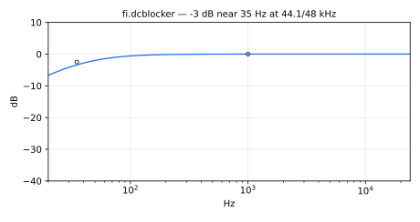

DC blocker. Default dc blocker has -3dB point near 35 Hz (at 44.1 kHz)
and high-frequency gain near 1.0025 (due to no scaling).
`dcblocker` is a standard Faust function.

#### Usage

```
_ : dcblocker : _
```

#### Test
```
fi = library("filters.lib");
os = library("oscillators.lib");
src = os.tosc(440);
dcblocker_test = src : fi.dcblocker;
```

----

### `(fi.)lptN`

One-pole lowpass filter with arbitrary dis/charging factors set in dB and
times set in seconds.

#### Usage

```
_ : lptN(N, tN) : _
```

Where:

* `N`: is the attenuation factor in dB
* `tN`: is the filter period in seconds, that is, the time for the
impulse response to decay by `N` dB

#### Test
```
fi = library("filters.lib");
os = library("oscillators.lib");
ba = library("basics.lib");
no = library("noises.lib");
ma = library("maths.lib");
src = os.tosc(440);
lptN_test = src : fi.lptN(60, 0.1);
lptN_slider_test = no.noise : fi.lptN(60, hslider("tN", 0.1, 0.001, 1, 0.001));
lptN_modulated_test = no.noise : fi.lptN(60, 0.001*pow(1000, tri)) with { P = int(ma.SR/10); tri = 1 - abs(2*ba.period(P)/P - 1); };
lptN_jump_test = no.noise : fi.lptN(60, 0.001*pow(1000, sq)) with { P = int(ma.SR/10); sq = ba.period(2*P) < P; };
```

#### References

* [https://ccrma.stanford.edu/~jos/mdft/Exponentials.html](https://ccrma.stanford.edu/~jos/mdft/Exponentials.html)

----

### `(fi.)lptau`

One-pole lowpass with a tau time constant (1/e attenuation after `tN` seconds).

#### Usage

```
_ : lptau(tN) : _
```

Where:

* `tN`: tau time constant in seconds (1/e attenuation after `tN` seconds)

#### Test
```
fi = library("filters.lib");
os = library("oscillators.lib");
ba = library("basics.lib");
no = library("noises.lib");
ma = library("maths.lib");
src = os.tosc(440);
lptau_test = src : fi.lptau(0.1);
lptau_slider_test = no.noise : fi.lptau(hslider("tN", 0.1, 0.001, 1, 0.001));
lptau_modulated_test = no.noise : fi.lptau(0.001*pow(1000, tri)) with { P = int(ma.SR/10); tri = 1 - abs(2*ba.period(P)/P - 1); };
lptau_jump_test = no.noise : fi.lptau(0.001*pow(1000, sq)) with { P = int(ma.SR/10); sq = ba.period(2*P) < P; };
```

----

### `(fi.)lpt60`

One-pole lowpass with a T60 time constant (60 dB attenuation after `tN` seconds).

#### Usage

```
_ : lpt60(tN) : _
```

Where:

* `tN`: T60 time constant in seconds (60 dB attenuation after `tN` seconds)

#### Test
```
fi = library("filters.lib");
os = library("oscillators.lib");
ba = library("basics.lib");
no = library("noises.lib");
ma = library("maths.lib");
src = os.tosc(440);
lpt60_test = src : fi.lpt60(0.3);
lpt60_slider_test = no.noise : fi.lpt60(hslider("tN", 0.3, 0.001, 1, 0.001));
lpt60_modulated_test = no.noise : fi.lpt60(0.001*pow(1000, tri)) with { P = int(ma.SR/10); tri = 1 - abs(2*ba.period(P)/P - 1); };
lpt60_jump_test = no.noise : fi.lpt60(0.001*pow(1000, sq)) with { P = int(ma.SR/10); sq = ba.period(2*P) < P; };
```

----

### `(fi.)lpt19`

One-pole lowpass with a T19 time constant (approx. 19 dB attenuation after `tN` seconds).

#### Usage

```
_ : lpt19(tN) : _
```

Where:

* `tN`: T19 time constant in seconds (approximately 19 dB attenuation after `tN` seconds)

#### Test
```
fi = library("filters.lib");
os = library("oscillators.lib");
ba = library("basics.lib");
no = library("noises.lib");
ma = library("maths.lib");
src = os.tosc(440);
lpt19_test = src : fi.lpt19(0.2);
lpt19_slider_test = no.noise : fi.lpt19(hslider("tN", 0.2, 0.001, 1, 0.001));
lpt19_modulated_test = no.noise : fi.lpt19(0.001*pow(1000, tri)) with { P = int(ma.SR/10); tri = 1 - abs(2*ba.period(P)/P - 1); };
lpt19_jump_test = no.noise : fi.lpt19(0.001*pow(1000, sq)) with { P = int(ma.SR/10); sq = ba.period(2*P) < P; };
```

## Comb Filters


----

### `(fi.)ff_comb`

Feed-Forward Comb Filter. Note that `ff_comb` requires integer delays
(uses `delay`  internally).
`ff_comb` is a standard Faust function. It computes

```
y[n] = b0 x[n] + bM x[n - intdel]
```

#### Usage

```
_ : ff_comb(maxdel,intdel,b0,bM) : _
```

Where:

* `maxdel`: maximum delay (a power of 2)
* `intdel`: current (integer) comb-filter delay between 0 and maxdel
  (a non-integer value is truncated)
* `b0`: gain applied to the direct (undelayed) input
* `bM`: gain applied to delay-line output and then summed with the direct path

#### Test
```
fi = library("filters.lib");
os = library("oscillators.lib");
ba = library("basics.lib");
no = library("noises.lib");
ma = library("maths.lib");
src = os.tosc(440);
ff_comb_test = src : fi.ff_comb(2048, 64, 1, 0.7);
ff_comb_slider_test = no.noise : fi.ff_comb(2048, hslider("delay", 64, 1, 2047, 1), hslider("b0", 1, -1, 1, 0.01), hslider("bM", 0.7, -1, 1, 0.01));
ff_comb_modulated_test = no.noise : fi.ff_comb(2048, d, 1, 0.7) with { P = int(ma.SR/10); m = 112*(P - abs(2*ba.period(P) - P)); d = 16 + int((m - m % P)/P + 0.5); };
```

#### References

* [https://ccrma.stanford.edu/~jos/pasp/Feedforward_Comb_Filters.html](https://ccrma.stanford.edu/~jos/pasp/Feedforward_Comb_Filters.html)

----

### `(fi.)ff_fcomb`

Feed-Forward Comb Filter. Note that `ff_fcomb` takes floating-point delays
(uses `fdelay` internally).
`ff_fcomb` is a standard Faust function. It computes
`y[n] = b0 x[n] + bM x[n - del]`, where `x[n - del]` is linearly interpolated.

#### Usage

```
_ : ff_fcomb(maxdel,del,b0,bM) : _
```

Where:

* `maxdel`: maximum delay (a power of 2)
* `del`: current (float) comb-filter delay between 0 and maxdel
* `b0`: gain applied to the direct (undelayed) input
* `bM`: gain applied to delay-line output and then summed with the direct path

#### Test
```
fi = library("filters.lib");
os = library("oscillators.lib");
ba = library("basics.lib");
no = library("noises.lib");
ma = library("maths.lib");
src = os.tosc(440);
ff_fcomb_test = src : fi.ff_fcomb(2048, 64.5, 1, 0.7);
ff_fcomb_slider_test = no.noise : fi.ff_fcomb(2048, hslider("delay", 64.5, 1, 2047, 0.01), hslider("b0", 1, -1, 1, 0.01), hslider("bM", 0.7, -1, 1, 0.01));
ff_fcomb_modulated_test = no.noise : fi.ff_fcomb(2048, 16 + 112*tri, 1, 0.7) with { P = int(ma.SR/10); tri = 1 - abs(2*ba.period(P)/P - 1); };
ff_fcomb_jump_test = no.noise : fi.ff_fcomb(2048, 16 + 112*sq, 1, 0.7) with { P = int(ma.SR/10); sq = ba.period(2*P) < P; };
```

#### References

* [https://ccrma.stanford.edu/~jos/pasp/Feedforward_Comb_Filters.html](https://ccrma.stanford.edu/~jos/pasp/Feedforward_Comb_Filters.html)

----

### `(fi.)ffcombfilter`

Typical special case of `ff_comb()` where: `b0 = 1`.

#### Usage

```
_ : ffcombfilter(maxdel,del,g) : _
```

Where:

* `maxdel`: maximum delay (a power of 2)
* `del`: current integer comb-filter delay between 0 and maxdel
  (a non-integer value is truncated, as in `ff_comb`)
* `g`: gain applied to the delayed tap

#### Test
```
fi = library("filters.lib");
os = library("oscillators.lib");
ba = library("basics.lib");
no = library("noises.lib");
ma = library("maths.lib");
src = os.tosc(440);
ffcombfilter_test = src : fi.ffcombfilter(2048, 64, 0.7);
ffcombfilter_slider_test = no.noise : fi.ffcombfilter(2048, hslider("delay", 64, 1, 2047, 1), hslider("g", 0.7, -1, 1, 0.01));
ffcombfilter_modulated_test = no.noise : fi.ffcombfilter(2048, d, 0.7) with { P = int(ma.SR/10); m = 112*(P - abs(2*ba.period(P) - P)); d = 16 + int((m - m % P)/P + 0.5); };
```

----

### `(fi.)fb_comb_common`

A generic feedback comb filter.

#### Usage

```
_ : fb_comb_common(dop,N,b0,aN) : _
```

Where

* `dop`: delay operator, e.g. `@` or `de.fdelay4a(2048)`
* `N`: current delay
* `b0`: gain applied to input
* `aN`: gain applied to delay-line output

#### Example test program

```
process = fb_comb_common(@,N,b0,aN);
```
implements the following difference equation:
```
y[n] = b0 x[n] + aN y[n - N]
```

See more examples in `filters.lib` below.

#### Test
```
fi = library("filters.lib");
os = library("oscillators.lib");
ba = library("basics.lib");
no = library("noises.lib");
ma = library("maths.lib");
src = os.tosc(440);
fb_comb_common_test = src : fi.fb_comb_common(@, 64, 0.8, 0.6);
fb_comb_common_slider_test = no.noise : fi.fb_comb_common(@, hslider("delay", 64, 1, 2047, 1), hslider("b0", 0.8, -1, 1, 0.01), hslider("aN", 0.6, -1, 1, 0.01));
fb_comb_common_modulated_test = no.noise : fi.fb_comb_common(@, d, 0.8, 0.6) with { P = int(ma.SR/10); m = 112*(P - abs(2*ba.period(P) - P)); d = 16 + int((m - m % P)/P + 0.5) : max(16) : min(128); };
```
--------------------------------------------------------

----

### `(fi.)fb_comb`

Feed-Back Comb Filter (integer delay). It computes

```
y[n] = b0 x[n-1] - aN y[n-del]
```

The output is delayed by one sample (the `mem` at the end of the definition):
the transfer function is b0 z^(-1)/(1 + aN z^(-del)), not b0/(1 + aN z^(-del)).

#### Usage

```
_ : fb_comb(maxdel,del,b0,aN) : _
```

Where:

* `maxdel`: maximum delay (a power of 2)
* `del`: current integer comb-filter delay (the feedback loop length), between 1 and maxdel
  (a non-integer value is truncated)
* `b0`: input gain
* `aN`: minus the gain applied to delay-line output before summing with the input
    and feeding to the delay line

#### Test
```
fi = library("filters.lib");
os = library("oscillators.lib");
ba = library("basics.lib");
no = library("noises.lib");
ma = library("maths.lib");
src = os.tosc(440);
fb_comb_test = src : fi.fb_comb(2048, 64, 0.7, 0.6);
fb_comb_slider_test = no.noise : fi.fb_comb(2048, hslider("delay", 64, 1, 2047, 1), hslider("b0", 0.7, -1, 1, 0.01), hslider("aN", 0.6, -1, 1, 0.01));
fb_comb_modulated_test = no.noise : fi.fb_comb(2048, d, 0.7, 0.6) with { P = int(ma.SR/10); m = 112*(P - abs(2*ba.period(P) - P)); d = 16 + int((m - m % P)/P + 0.5); };
```

#### References

* [https://ccrma.stanford.edu/~jos/pasp/Feedback_Comb_Filters.html](https://ccrma.stanford.edu/~jos/pasp/Feedback_Comb_Filters.html)

----

### `(fi.)fb_fcomb`

Feed-Back Comb Filter (floating point delay).
`fb_fcomb` is a standard Faust function. As `fb_comb`, it computes
`y[n] = b0 x[n-1] - aN y[n-del]` (the output is delayed by one sample),
where `y[n-del]` is linearly interpolated.

#### Usage

```
_ : fb_fcomb(maxdel,del,b0,aN) : _
```

Where:

* `maxdel`: maximum delay (a power of 2)
* `del`: current (float) comb-filter delay (the feedback loop length), between 1 and maxdel
* `b0`: input gain
* `aN`: minus the gain applied to delay-line output before summing with the input
    and feeding to the delay line

#### Test
```
fi = library("filters.lib");
os = library("oscillators.lib");
ba = library("basics.lib");
no = library("noises.lib");
ma = library("maths.lib");
src = os.tosc(440);
fb_fcomb_test = src : fi.fb_fcomb(2048, 64.5, 0.7, 0.6);
fb_fcomb_slider_test = no.noise : fi.fb_fcomb(2048, hslider("delay", 64.5, 1, 2047, 0.01), hslider("b0", 0.7, -1, 1, 0.01), hslider("aN", 0.6, -1, 1, 0.01));
fb_fcomb_modulated_test = no.noise : fi.fb_fcomb(2048, 16 + 112*tri, 0.7, 0.6) with { P = int(ma.SR/10); tri = 1 - abs(2*ba.period(P)/P - 1); };
fb_fcomb_jump_test = no.noise : fi.fb_fcomb(2048, 16 + 112*sq, 0.7, 0.6) with { P = int(ma.SR/10); sq = ba.period(2*P) < P; };
```

#### References

* [https://ccrma.stanford.edu/~jos/pasp/Feedback_Comb_Filters.html](https://ccrma.stanford.edu/~jos/pasp/Feedback_Comb_Filters.html)

----

### `(fi.)rev1`

Special case of `fb_comb` (`rev1(maxdel,N,g)` is `fb_comb(maxdel,N,1,-g)`):

```
y[n] = x[n-1] + g y[n-N]
```

The "rev1 section" dates back to the 1960s in computer-music reverberation.
See `jcrev` and `satrev` in `reverbs.lib` for usage examples.

#### Usage

```
_ : rev1(maxdel,N,g) : _
```

Where:

* `maxdel`: maximum delay (a power of 2)
* `N`: current feedback comb-filter delay in samples (the loop length, an integer)
* `g`: feedback gain

#### Test
```
fi = library("filters.lib");
os = library("oscillators.lib");
ba = library("basics.lib");
no = library("noises.lib");
ma = library("maths.lib");
src = os.tosc(440);
rev1_test = src : fi.rev1(2048, 64, 0.6);
rev1_slider_test = no.noise : fi.rev1(2048, hslider("delay", 64, 1, 2047, 1), hslider("g", 0.6, -1, 1, 0.01));
rev1_modulated_test = no.noise : fi.rev1(2048, d, 0.6) with { P = int(ma.SR/10); m = 112*(P - abs(2*ba.period(P) - P)); d = 16 + int((m - m % P)/P + 0.5); };
```

----

### `(fi.)fbcombfilter`, `(fi.)ffbcombfilter`

Other special cases of Feed-Back Comb Filter. Their output is the
delay-line output, and the feedback loop is one sample longer than the delay:

```
y[n] = x[n-intdel] + g y[n-intdel-1]
```

(with `del` in place of `intdel`, linearly interpolated, for `ffbcombfilter`).

#### Usage

```
_ : fbcombfilter(maxdel,del,g) : _
_ : ffbcombfilter(maxdel,del,g) : _
```

Where:

* `maxdel`: maximum delay (a power of 2)
* `del`: current comb-filter delay between 0 and maxdel: an integer for
  `fbcombfilter` (uses `de.delay`; a non-integer value is truncated), a
  float for `ffbcombfilter` (uses `de.fdelay`); the loop length is `del+1`
* `g`: feedback gain

#### Test
```
fi = library("filters.lib");
os = library("oscillators.lib");
ba = library("basics.lib");
no = library("noises.lib");
ma = library("maths.lib");
src = os.tosc(440);
fbcombfilter_test = src : fi.fbcombfilter(2048, 64, 0.6);
ffbcombfilter_test = src : fi.ffbcombfilter(2048, 64.5, 0.6);
fbcombfilter_slider_test = no.noise : fi.fbcombfilter(2048, hslider("delay", 64, 1, 2047, 1), hslider("g", 0.6, -1, 1, 0.01));
fbcombfilter_modulated_test = no.noise : fi.fbcombfilter(2048, d, 0.6) with { P = int(ma.SR/10); m = 112*(P - abs(2*ba.period(P) - P)); d = 16 + int((m - m % P)/P + 0.5); };
ffbcombfilter_slider_test = no.noise : fi.ffbcombfilter(2048, hslider("delay", 64.5, 1, 2047, 0.01), hslider("g", 0.6, -1, 1, 0.01));
ffbcombfilter_modulated_test = no.noise : fi.ffbcombfilter(2048, 16 + 112*tri, 0.6) with { P = int(ma.SR/10); tri = 1 - abs(2*ba.period(P)/P - 1); };
ffbcombfilter_jump_test = no.noise : fi.ffbcombfilter(2048, 16 + 112*sq, 0.6) with { P = int(ma.SR/10); sq = ba.period(2*P) < P; };
```

#### References

* [https://ccrma.stanford.edu/~jos/pasp/Feedback_Comb_Filters.html](https://ccrma.stanford.edu/~jos/pasp/Feedback_Comb_Filters.html)

----

### `(fi.)allpass_comb`

Schroeder Allpass Comb Filter. Note that:

```
allpass_comb(maxlen,len,aN) : mem = ff_comb(maxlen,len,aN,1) : fb_comb(maxlen,len,1,aN);
```

(`fb_comb` delays its output by one sample, hence the `mem`),
which is a direct-form-1 implementation, requiring two delay lines.
The implementation here is direct-form-2 requiring only one delay line.

#### Usage

```
_ : allpass_comb(maxdel,intdel,aN) : _
```

Where:

* `maxdel`: maximum delay (a power of 2)
* `intdel`: current (integer) comb-filter delay between 1 and maxdel
  (a non-integer value is truncated)
* `aN`: minus the feedback gain

#### Test
```
fi = library("filters.lib");
os = library("oscillators.lib");
ba = library("basics.lib");
no = library("noises.lib");
ma = library("maths.lib");
src = os.tosc(440);
allpass_comb_test = src : fi.allpass_comb(2048, 64, 0.6);
allpass_comb_slider_test = no.noise : fi.allpass_comb(2048, hslider("delay", 64, 1, 2047, 1), hslider("aN", 0.6, -1, 1, 0.01));
allpass_comb_modulated_test = no.noise : fi.allpass_comb(2048, d, 0.6) with { P = int(ma.SR/10); m = 112*(P - abs(2*ba.period(P) - P)); d = 16 + int((m - m % P)/P + 0.5); };
```

#### References

* [https://ccrma.stanford.edu/~jos/pasp/Allpass_Two_Combs.html](https://ccrma.stanford.edu/~jos/pasp/Allpass_Two_Combs.html)
* [https://ccrma.stanford.edu/~jos/pasp/Schroeder_Allpass_Sections.html](https://ccrma.stanford.edu/~jos/pasp/Schroeder_Allpass_Sections.html)
* [https://ccrma.stanford.edu/~jos/filters/Four_Direct_Forms.html](https://ccrma.stanford.edu/~jos/filters/Four_Direct_Forms.html)

----

### `(fi.)allpass_fcomb`

Schroeder Allpass Comb Filter.
`allpass_fcomb` is a standard Faust function.
Note that:

```
allpass_fcomb(maxlen,len,aN) : mem = ff_fcomb(maxlen,len,aN,1) : fb_fcomb(maxlen,len,1,aN);
```

(`fb_fcomb` delays its output by one sample, hence the `mem`),
which is a direct-form-1 implementation, requiring two delay lines.
The implementation here is direct-form-2 requiring only one delay line.

The delay line is linearly interpolated (`de.fdelay`), and linear
interpolation is a lowpass filter at fractional delays, so the response is
allpass only for an integer `del`. With `del` = 1000.5 and `aN` = 0.6, the
impulse response keeps 64% of its energy, and the gain drops by
1.6 dB (8-12 kHz) to 4.3 dB (20-24 kHz) at 48 kHz on average.
`allpass_fcomb1a` stays allpass at every delay.

#### Usage

```
_ : allpass_fcomb(maxdel,del,aN) : _
```

Where:

* `maxdel`: maximum delay (a power of 2)
* `del`: current (float) comb-filter delay between 1 and maxdel
* `aN`: minus the feedback gain

#### Test
```
fi = library("filters.lib");
os = library("oscillators.lib");
ba = library("basics.lib");
no = library("noises.lib");
ma = library("maths.lib");
src = os.tosc(440);
allpass_fcomb_test = src : fi.allpass_fcomb(2048, 64.5, 0.6);
allpass_fcomb_slider_test = no.noise : fi.allpass_fcomb(2048, hslider("delay", 64.5, 1, 2047, 0.01), hslider("aN", 0.6, -1, 1, 0.01));
allpass_fcomb_modulated_test = no.noise : fi.allpass_fcomb(2048, 16 + 112*tri, 0.6) with { P = int(ma.SR/10); tri = 1 - abs(2*ba.period(P)/P - 1); };
allpass_fcomb_jump_test = no.noise : fi.allpass_fcomb(2048, 16 + 112*sq, 0.6) with { P = int(ma.SR/10); sq = ba.period(2*P) < P; };
```

#### References

* [https://ccrma.stanford.edu/~jos/pasp/Allpass_Two_Combs.html](https://ccrma.stanford.edu/~jos/pasp/Allpass_Two_Combs.html)
* [https://ccrma.stanford.edu/~jos/pasp/Schroeder_Allpass_Sections.html](https://ccrma.stanford.edu/~jos/pasp/Schroeder_Allpass_Sections.html)
* [https://ccrma.stanford.edu/~jos/filters/Four_Direct_Forms.html](https://ccrma.stanford.edu/~jos/filters/Four_Direct_Forms.html)

----

### `(fi.)rev2`

Special case of `allpass_comb` (`rev2(maxlen,len,g)`).
The "rev2 section" dates back to the 1960s in computer-music reverberation.
See `jcrev` and `satrev` in `reverbs.lib` for usage examples.

#### Usage

```
_ : rev2(maxlen,len,g) : _
```

Where:

* `maxlen`: maximum delay (a power of 2)
* `len`: current allpass comb-filter delay in samples
* `g`: allpass coefficient (its sign is negated internally)

#### Test
```
fi = library("filters.lib");
os = library("oscillators.lib");
ba = library("basics.lib");
no = library("noises.lib");
ma = library("maths.lib");
src = os.tosc(440);
rev2_test = src : fi.rev2(2048, 64, 0.6);
rev2_slider_test = no.noise : fi.rev2(2048, hslider("delay", 64, 1, 2047, 1), hslider("g", 0.6, -1, 1, 0.01));
rev2_modulated_test = no.noise : fi.rev2(2048, d, 0.6) with { P = int(ma.SR/10); m = 112*(P - abs(2*ba.period(P) - P)); d = 16 + int((m - m % P)/P + 0.5); };
```

----

### `(fi.)allpass_fcomb5`, `(fi.)allpass_fcomb1a`

Same as `allpass_fcomb` but use `fdelay5` and `fdelay1a` internally
(Interpolation helps - look at an fft of faust2octave on:
`1-1' <: allpass_fcomb(1024,10.5,0.95), allpass_fcomb5(1024,10.5,0.95);`)

`allpass_fcomb1a` (first-order Thiran allpass interpolation) is allpass at
every delay `N` from 1.5 to maxdel. `allpass_fcomb5` (fifth-order Lagrange
interpolation) is allpass only for an integer `N`: at fractional delays the
interpolator is a lowpass filter, worst at a fractional part of 0.5. With
`N` = 1000.5 and `aN` = 0.6, the impulse response keeps 79% of its energy:
the gain is within 0.2 dB of unity up to SR/4 on average, and drops by
2.5 dB (16-20 kHz) to 4 dB (20-24 kHz) at 48 kHz.
`allpass_fcomb5` needs `N` from 3 to maxdel-1: above maxdel-1 the top
interpolator tap is clamped by the delay line, and the gain exceeds unity
(by up to 0.28 dB at `N` = 2047.5 with maxdel = 2048).

#### Usage

```
_ : allpass_fcomb5(maxdel,N,aN) : _
_ : allpass_fcomb1a(maxdel,N,aN) : _
```

Where:

* `maxdel`: maximum delay (a power of 2)
* `N`: current (float) allpass comb-filter delay between 0 and maxdel
* `aN`: allpass coefficient: the transfer function is (aN + z^(-N))/(1 + aN z^(-N))

#### Test
```
fi = library("filters.lib");
os = library("oscillators.lib");
ba = library("basics.lib");
no = library("noises.lib");
ma = library("maths.lib");
src = os.tosc(440);
allpass_fcomb5_test = src : fi.allpass_fcomb5(2048, 64.5, 0.6);
allpass_fcomb1a_test = src : fi.allpass_fcomb1a(2048, 64.5, 0.6);
allpass_fcomb5_slider_test = no.noise : fi.allpass_fcomb5(2048, hslider("delay", 64.5, 1, 2047, 0.01), hslider("aN", 0.6, -1, 1, 0.01));
allpass_fcomb5_modulated_test = no.noise : fi.allpass_fcomb5(2048, 16 + 112*tri, 0.6) with { P = int(ma.SR/10); tri = 1 - abs(2*ba.period(P)/P - 1); };
allpass_fcomb5_jump_test = no.noise : fi.allpass_fcomb5(2048, 16 + 112*sq, 0.6) with { P = int(ma.SR/10); sq = ba.period(2*P) < P; };
allpass_fcomb1a_slider_test = no.noise : fi.allpass_fcomb1a(2048, hslider("delay", 64.5, 1, 2047, 0.01), hslider("aN", 0.6, -1, 1, 0.01));
allpass_fcomb1a_modulated_test = no.noise : fi.allpass_fcomb1a(2048, 16 + 112*tri, 0.6) with { P = int(ma.SR/10); tri = 1 - abs(2*ba.period(P)/P - 1); };
allpass_fcomb1a_jump_test = no.noise : fi.allpass_fcomb1a(2048, 16 + 112*sq, 0.6) with { P = int(ma.SR/10); sq = ba.period(2*P) < P; };
```

## Direct-Form Digital Filter Sections

Filters specified by transfer-function polynomials `B(z)/A(z)`, computed
directly from their coefficients. A direct form loses precision when its
poles come close to z = 1, that is, for frequencies low relative to the
sample rate, and it behaves badly when its coefficients change while it
runs. For an analog prototype, prefer the functions of the section
[Digital Filter Sections Specified as Analog Filter Sections](#digital-filter-sections-specified-as-analog-filter-sections),
whose references explain why.

----

### `(fi.)iir`

Nth-order Infinite-Impulse-Response (IIR) digital filter,
implemented in terms of the Transfer-Function (TF) coefficients.
Such filter structures are termed "direct form".

`iir` is a standard Faust function.

#### Usage

```
_ : iir(bcoeffs,acoeffs) : _
```

Where:

* `bcoeffs`: (b0,b1,...,b_order) = TF numerator coefficients
* `acoeffs`: (a1,...,a_order) = TF denominator coeffs (a0=1)

#### Test
```
fi = library("filters.lib");
os = library("oscillators.lib");
src = os.tosc(440);
iir_test = src : fi.iir((0.5, 0.5), (0.3));
```

#### References

* [https://ccrma.stanford.edu/~jos/filters/Four_Direct_Forms.html](https://ccrma.stanford.edu/~jos/filters/Four_Direct_Forms.html)

----

### `(fi.)fir`

FIR filter (convolution of FIR filter coefficients with a signal).
`fir` is a standard Faust function.

#### Usage

```
_ : fir(bv) : _
```

Where:

* `bv`: `b0,b1,...,bn`, a parallel bank of coefficient signals

#### Note

`bv` is processed using pattern-matching at compile time,
      so it must have this normal form (parallel signals).

#### Example test program

Smoothing white noise with a five-point moving average:

```
bv = .2,.2,.2,.2,.2;
process = noise : fir(bv);
```

Equivalent (note double parens):

```
process = noise : fir((.2,.2,.2,.2,.2));
```

#### Test
```
fi = library("filters.lib");
os = library("oscillators.lib");
src = os.tosc(440);
fir_test = src : fi.fir((0.2, 0.2, 0.2, 0.2, 0.2));
```

----

### `(fi.)conv`, `(fi.)convN`

Convolution of input signal with given coefficients. `conv` filters one
signal with all the coefficients. `convN` takes N signals and sums the i-th,
delayed by i samples, times the i-th coefficient: split one signal to N
copies first to convolve it with the first N coefficients.

#### Usage

```
_ : conv(kv) : _
si.bus(N) : convN(N,kv) : _ // Useful when N < ba.count(kv)
_ <: si.bus(N) : convN(N,kv) : _ // one signal, N coefficients
```

Where:

* `kv`: the list of coefficients `(k1,k2,k3,...)`, one signal bank
* `N`: number of input signals of `convN`, at most the number of
  coefficients (a constant numerical expression)

#### Example

```
_ : conv((0.25,0.25,0.25,0.25)) : _
_ <: si.bus(3) : convN(3,(0.3,0.2,0.1,0.05)) : _
```

#### Test
```
fi = library("filters.lib");
os = library("oscillators.lib");
si = library("signals.lib");
src = os.tosc(440);
convN_test = (src <: si.bus(3)) : fi.convN(3, (0.3, 0.2, 0.1, 0.05));
conv_test = src : fi.conv((0.25, 0.25, 0.25, 0.25));
```

----

### `(fi.)tf1`, `(fi.)tf2`, `(fi.)tf3`

tfN = N'th-order direct-form digital filter.
`tf2` is a standard Faust function.

#### Usage

```
_ : tf1(b0,b1,a1) : _
_ : tf2(b0,b1,b2,a1,a2) : _
_ : tf3(b0,b1,b2,b3,a1,a2,a3) : _
```

Where:

* `b0`, `b1`, `b2`, `b3`: transfer-function numerator coefficients
  (`b0..bN` for `tfN`)
* `a1`, `a2`, `a3`: transfer-function denominator coefficients, the
  denominator being monic (`a0 = 1`; `a1..aN` for `tfN`)

#### Test
```
fi = library("filters.lib");
os = library("oscillators.lib");
src = os.tosc(440);
tf1_test = src : fi.tf1(0.5, 0.25, -0.4);
tf2_test = src : fi.tf2(0.1, 0.2, 0.1, -0.5, 0.06);
tf3_test = src : fi.tf3(0.1, 0.3, 0.3, 0.1, -0.9, 0.26, -0.024);
```

#### References

* [https://ccrma.stanford.edu/~jos/fp/Direct_Form_I.html](https://ccrma.stanford.edu/~jos/fp/Direct_Form_I.html)

----

### `(fi.)TF2`

Tunable second-order direct-form digital filter, the "original"
biquad of music.lib: y[n] = b0*x[n] + b1*x[n-1] + b2*x[n-2] -
a1*y[n-1] - a2*y[n-2]. Kept for comparison and for the compatibility
libraries (maxmsp.lib, instruments.lib); new code should use `tf2`
instead.

#### Usage

```
_ : TF2(b0,b1,b2,a1,a2) : _
```

Where:

* `b0`, `b1`, `b2`: the feedforward coefficients
* `a1`, `a2`: the feedback coefficients

#### Test
```
fi = library("filters.lib");
os = library("oscillators.lib");
TF2_legacy_test = os.tosc(440) : fi.TF2(0.2, 0.4, 0.2, -0.5, 0.3);
```

----

### `(fi.)notchw`

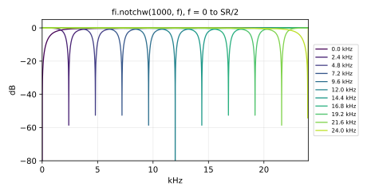

Simple notch filter based on a biquad (`tf2`).
`notchw` is a standard Faust function.

#### Usage:

```
_ : notchw(width,freq) : _
```

Where:

* `width`: "notch width" in Hz (approximate)
* `freq`: "notch frequency" in Hz

#### Test
```
fi = library("filters.lib");
os = library("oscillators.lib");
ba = library("basics.lib");
no = library("noises.lib");
ma = library("maths.lib");
src = os.tosc(440);
notchw_test = src : fi.notchw(200, 1000);
notchw_slider_test = no.noise : fi.notchw(hslider("width", 200, 10, 2000, 1), hslider("freq", 1000, 20, 20000, 1));
notchw_modulated_test = no.noise : fi.notchw(100, 200*pow(25, tri)) with { P = int(ma.SR/10); tri = 1 - abs(2*ba.period(P)/P - 1); };
notchw_jump_test = no.noise : fi.notchw(100, 200*pow(25, sq)) with { P = int(ma.SR/10); sq = ba.period(2*P) < P; };
```

#### References

* [https://ccrma.stanford.edu/~jos/pasp/Phasing_2nd_Order_Allpass_Filters.html](https://ccrma.stanford.edu/~jos/pasp/Phasing_2nd_Order_Allpass_Filters.html)

## Direct-Form Second-Order Biquad Sections

Direct-Form Second-Order Biquad Sections

#### References

* [https://ccrma.stanford.edu/~jos/filters/Four_Direct_Forms.html](https://ccrma.stanford.edu/~jos/filters/Four_Direct_Forms.html)

----

### `(fi.)tf21`, `(fi.)tf22`, `(fi.)tf22t`, `(fi.)tf21t`

tfN = N'th-order direct-form digital filter where:

* `tf21` is tf2, direct-form 1
* `tf22` is tf2, direct-form 2
* `tf22t` is tf2, direct-form 2 transposed
* `tf21t` is tf2, direct-form 1 transposed

#### Usage

```
_ : tf21(b0,b1,b2,a1,a2) : _
_ : tf22(b0,b1,b2,a1,a2) : _
_ : tf22t(b0,b1,b2,a1,a2) : _
_ : tf21t(b0,b1,b2,a1,a2) : _
```

Where:

* `b0`, `b1`, `b2`: transfer-function numerator coefficients
* `a1`, `a2`: transfer-function denominator coefficients (monic
  denominator, `a0 = 1`)

#### Test
```
fi = library("filters.lib");
os = library("oscillators.lib");
src = os.tosc(440);
tf21_test = src : fi.tf21(0.1, 0.2, 0.1, -0.5, 0.06);
tf22_test = src : fi.tf22(0.1, 0.2, 0.1, -0.5, 0.06);
tf22t_test = src : fi.tf22t(0.1, 0.2, 0.1, -0.5, 0.06);
tf21t_test = src : fi.tf21t(0.1, 0.2, 0.1, -0.5, 0.06);
```

#### References

* [https://ccrma.stanford.edu/~jos/fp/Direct_Form_I.html](https://ccrma.stanford.edu/~jos/fp/Direct_Form_I.html)

##  Ladder/Lattice Digital Filters 

Ladder and lattice digital filters generally have superior numerical
properties relative to direct-form digital filters.  They can be derived
from digital waveguide filters, which gives them a physical interpretation.
#### References

* F. Itakura and S. Saito: "Digital Filtering Techniques for Speech Analysis and Synthesis",
    7th Int. Cong. Acoustics, Budapest, 25 C 1, 1971.
* J. D. Markel and A. H. Gray: Linear Prediction of Speech, New York: Springer Verlag, 1976.
* [https://ccrma.stanford.edu/~jos/pasp/Conventional_Ladder_Filters.html](https://ccrma.stanford.edu/~jos/pasp/Conventional_Ladder_Filters.html)

----

### `(fi.)av2sv`

Compute reflection coefficients sv from transfer-function denominator av.
The output `sv` is the parallel signal bank `s1,...,sN`, where `si` is
the i'th reflection coefficient.

#### Usage

```
av2sv(av) : si.bus(ba.count(av))
```

Where:

* `av`: parallel signal bank `a1,...,aN`, where `ai` is the coefficient
  of `z^(-i)` in the filter transfer-function denominator `A(z)`

#### Test
```
fi = library("filters.lib");
si = library("signals.lib");
av2sv_test = fi.av2sv((-0.4, 0.1)) : si.bus(2);
```

#### References

  [https://ccrma.stanford.edu/~jos/filters/Step_Down_Procedure.html](https://ccrma.stanford.edu/~jos/filters/Step_Down_Procedure.html)
  (where reflection coefficients are denoted by k rather than s).

----

### `(fi.)bvav2nuv`

Compute lattice tap coefficients from transfer-function coefficients.
The output `nuv` is the parallel signal bank `nu0,nu1,...,nuN` (N+1
signals), where `nui` is the i'th tap coefficient.

#### Usage

```
bvav2nuv(bv,av) : si.bus(ba.count(av)+1)
```

Where:

* `bv`: parallel signal bank `b0,b1,...,bN`, where `bi` is the
  coefficient of `z^(-i)` in the filter numerator
* `av`: parallel signal bank `a1,...,aN`, where `ai` is the coefficient
  of `z^(-i)` in the filter denominator

#### Test
```
fi = library("filters.lib");
si = library("signals.lib");
bvav2nuv_test = fi.bvav2nuv((0.1, 0.2, 0.3), (-0.4, 0.1)) : si.bus(3);
```

----

### `(fi.)iir_lat2`

Two-multiply lattice IIR filter of arbitrary order.

#### Usage

```
_ : iir_lat2(bv,av) : _
```

Where:

* `bv`: transfer-function numerator
* `av`: transfer-function denominator (monic)

#### Test
```
fi = library("filters.lib");
os = library("oscillators.lib");
src = os.tosc(440);
iir_lat2_test = src : fi.iir_lat2((0.1, 0.2, 0.3), (-0.4, 0.1));
```

----

### `(fi.)allpassnt`

Two-multiply lattice allpass (nested order-1 direct-form-ii allpasses), with taps.

#### Usage

```
_ : allpassnt(n,sv) : si.bus(n+1)
```

Where:

* `n`: the order of the filter
* `sv`: the reflection coefficients (-1 1)

The first output is the n-th order allpass output,
while the remaining outputs are taps taken from the
input of each delay element from the input to the output.
See (fi.)allpassn for the single-output case.

#### Test
```
fi = library("filters.lib");
os = library("oscillators.lib");
si = library("signals.lib");
src = os.tosc(440);
allpassnt_test = src : fi.allpassnt(2, (0.3, -0.2)) : si.bus(3);
```

----

### `(fi.)iir_kl`

Kelly-Lochbaum ladder IIR filter of arbitrary order.

#### Usage

```
_ : iir_kl(bv,av) : _
```

Where:

* `bv`: transfer-function numerator
* `av`: transfer-function denominator (monic)

#### Test
```
fi = library("filters.lib");
os = library("oscillators.lib");
src = os.tosc(440);
iir_kl_test = src : fi.iir_kl((0.1, 0.2, 0.3), (-0.4, 0.1));
```

----

### `(fi.)allpassnklt`

Kelly-Lochbaum ladder allpass. Its n+1 outputs are the allpass output
followed by the n tap signals of the ladder (used by `iir_kl` to form
a general transfer function).

#### Usage:

```
_ : allpassnklt(n,sv) : si.bus(n+1)
```

Where:

* `n`: the order of the filter
* `sv`: the reflection coefficients (-1 1)

#### Test
```
fi = library("filters.lib");
os = library("oscillators.lib");
si = library("signals.lib");
src = os.tosc(440);
allpassnklt_test = src : fi.allpassnklt(2, (0.3, -0.2)) : si.bus(3);
```

----

### `(fi.)iir_lat1`

One-multiply lattice IIR filter of arbitrary order.

#### Usage

```
_ : iir_lat1(bv,av) : _
```

Where:

* `bv`: transfer-function numerator as a bank of parallel signals
* `av`: transfer-function denominator as a bank of parallel signals

#### Test
```
fi = library("filters.lib");
os = library("oscillators.lib");
src = os.tosc(440);
iir_lat1_test = src : fi.iir_lat1((0.1, 0.2, 0.3), (-0.4, 0.1));
```

----

### `(fi.)allpassn1mt`

One-multiply lattice allpass with tap lines. Its N+1 outputs are the
allpass output followed by the N tap signals of the lattice (used by
`iir_lat1` to form a general transfer function).

#### Usage

```
_ : allpassn1mt(N,sv) : si.bus(N+1)
```

Where:

* `N`: the order of the filter (fixed at compile time)
* `sv`: the reflection coefficients (-1 1)

#### Test
```
fi = library("filters.lib");
os = library("oscillators.lib");
si = library("signals.lib");
src = os.tosc(440);
allpassn1mt_test = src : fi.allpassn1mt(2, (0.3, -0.2)) : si.bus(3);
```

----

### `(fi.)iir_nl`

Normalized ladder filter of arbitrary order.

#### Usage

```
_ : iir_nl(bv,av) : _
```

Where:

* `bv`: transfer-function numerator
* `av`: transfer-function denominator (monic)

#### Test
```
fi = library("filters.lib");
os = library("oscillators.lib");
src = os.tosc(440);
iir_nl_test = src : fi.iir_nl((0.1, 0.2, 0.3), (-0.4, 0.1));
```

#### References

* J. D. Markel and A. H. Gray, Linear Prediction of Speech, New York: Springer Verlag, 1976.
* [https://ccrma.stanford.edu/~jos/pasp/Normalized_Scattering_Junctions.html](https://ccrma.stanford.edu/~jos/pasp/Normalized_Scattering_Junctions.html)

----

### `(fi.)allpassnnlt`

Normalized ladder allpass filter of arbitrary order. Its N+1 outputs are
the allpass output followed by the N tap signals of the ladder (used by
`iir_nl` to form a general transfer function).

#### Usage:

```
_ : allpassnnlt(N,sv) : si.bus(N+1)
```

Where:

* `N`: the order of the filter (fixed at compile time)
* `sv`: the reflection coefficients (-1 1)

#### Test
```
fi = library("filters.lib");
os = library("oscillators.lib");
si = library("signals.lib");
no = library("noises.lib");
src = os.tosc(440);
allpassnnlt_test = src : fi.allpassnnlt(2, (0.3, -0.2)) : si.bus(3);
allpassnnlt_product_test = no.noise : fi.allpassnnlt(1, 0.5*hslider("s", 0.6, -1, 1, 0.01)) : si.bus(2);
```

#### References

* J. D. Markel and A. H. Gray, Linear Prediction of Speech, New York: Springer Verlag, 1976.
* [https://ccrma.stanford.edu/~jos/pasp/Normalized_Scattering_Junctions.html](https://ccrma.stanford.edu/~jos/pasp/Normalized_Scattering_Junctions.html)

## Useful Special Cases


----

### `(fi.)tf2np`

Biquad based on a stable second-order Normalized Ladder Filter
(more robust to modulation than `tf2` and protected against instability).

#### Usage

```
_ : tf2np(b0,b1,b2,a1,a2) : _
```

Where:

* `b0`, `b1`, `b2`: transfer-function numerator coefficients
* `a1`, `a2`: transfer-function denominator coefficients (monic
  denominator, `a0 = 1`)

#### Test
```
fi = library("filters.lib");
os = library("oscillators.lib");
src = os.tosc(440);
tf2np_test = src : fi.tf2np(0.6, 0.3, 0.2, -0.5, 0.2);
```

----

### `(fi.)wgr`

Second-order transformer-normalized digital waveguide resonator.
Its two outputs are in phase quadrature: the first is the cosine-phase
output, the second the sine-phase output (see `os.oscwc`, `os.oscws`).

#### Usage

```
_ : wgr(f,r) : _,_
```

Where:

* `f`: resonance frequency (Hz), between 0 and SR/2 (excluded: the frequency is
  kept a hair inside that range so that the amplitude compensation stays finite)
* `r`: loss factor for exponential decay (set to 1 to make a numerically stable oscillator)

The two outputs are the resonator states, in phase quadrature
(`os.oscwc` uses the first, `os.oscws` the second).

#### Test
```
fi = library("filters.lib");
os = library("oscillators.lib");
ba = library("basics.lib");
no = library("noises.lib");
ma = library("maths.lib");
src = os.tosc(440);
wgr_test = fi.wgr(440, 0.995, src);
wgr_slider_test = fi.wgr(hslider("freq", 440, 20, 5000, 1), hslider("r", 0.995, 0.9, 1, 0.001), no.noise);
wgr_modulated_test = fi.wgr(100*pow(20, tri), 0.995, no.noise) with { P = int(ma.SR/10); tri = 1 - abs(2*ba.period(P)/P - 1); };
wgr_zero_freq_test = fi.wgr(1000*(ba.time >= 100), 0.995, no.noise);
```

#### References

* [https://ccrma.stanford.edu/~jos/pasp/Power_Normalized_Waveguide_Filters.html](https://ccrma.stanford.edu/~jos/pasp/Power_Normalized_Waveguide_Filters.html)
* [https://ccrma.stanford.edu/~jos/pasp/Digital_Waveguide_Oscillator.html](https://ccrma.stanford.edu/~jos/pasp/Digital_Waveguide_Oscillator.html)

----

### `(fi.)nlf2`

Second order normalized digital waveguide resonator.
Its two outputs are in phase quadrature: the first is the sine-phase
output, the second the cosine-phase output (see `os.oscrs`, `os.oscrc`).

#### Usage

```
_ : nlf2(f,r) : _,_
```

Where:

* `f`: resonance frequency (Hz)
* `r`: loss factor for exponential decay (set to 1 to make a sinusoidal oscillator)

The two outputs are the resonator states, in phase quadrature
(`os.oscrs` uses the first, `os.oscrc` the second).

#### Test
```
fi = library("filters.lib");
os = library("oscillators.lib");
ba = library("basics.lib");
no = library("noises.lib");
ma = library("maths.lib");
src = os.tosc(440);
nlf2_test = fi.nlf2(440, 0.995, src);
nlf2_slider_test = fi.nlf2(hslider("freq", 440, 20, 5000, 1), hslider("r", 0.995, 0.9, 1, 0.001), no.noise);
nlf2_modulated_test = fi.nlf2(100*pow(20, tri), 0.995, no.noise) with { P = int(ma.SR/10); tri = 1 - abs(2*ba.period(P)/P - 1); };
nlf2_jump_test = fi.nlf2(100*pow(20, sq), 0.995, no.noise) with { P = int(ma.SR/10); sq = ba.period(2*P) < P; };
```

#### References

* [https://ccrma.stanford.edu/~jos/pasp/Power_Normalized_Waveguide_Filters.html](https://ccrma.stanford.edu/~jos/pasp/Power_Normalized_Waveguide_Filters.html)

----

### `(fi.)apnl`

Passive Nonlinear Allpass based on Pierce switching springs idea.
Switch between allpass coefficient `a1` and `a2` at signal zero crossings.
The first-order allpass is realized in normalized (rotation) form, which is
lossless at every sample, so that switching the coefficient can never add
energy; with a constant coefficient its output is that of the usual
first-order allpass (a + z^(-1))/(1 + a z^(-1)).

#### Usage

```
_ : apnl(a1,a2) : _
```

Where:

* `a1`: allpass coefficient used while the filter state is positive (-1 < a1 < 1)
* `a2`: allpass coefficient used otherwise (-1 < a2 < 1)

#### Test
```
fi = library("filters.lib");
os = library("oscillators.lib");
no = library("noises.lib");
src = os.tosc(440);
apnl_test = fi.apnl(0.5, -0.5, src);
apnl_noise_test = fi.apnl(0.9, 0.1, no.noise);
```

#### References

* "A Passive Nonlinear Digital Filter Design ..." by John R. Pierce and Scott
A. Van Duyne, JASA, vol. 101, no. 2, pp. 1120-1126, 1997

## Ladder/Lattice Allpass Filters

An allpass filter has gain 1 at every frequency, but variable phase.
Ladder/lattice allpass filters are specified by reflection coefficients.
They are defined here as nested allpass filters, hence the names `allpassn*`.

#### References

* [https://ccrma.stanford.edu/~jos/pasp/Conventional_Ladder_Filters.html](https://ccrma.stanford.edu/~jos/pasp/Conventional_Ladder_Filters.html)
* [https://ccrma.stanford.edu/~jos/pasp/Nested_Allpass_Filters.html](https://ccrma.stanford.edu/~jos/pasp/Nested_Allpass_Filters.html)
* Linear Prediction of Speech, Markel and Gray, Springer Verlag, 1976

----

### `(fi.)scatN`

N-port scattering junction.

#### Usage

```
si.bus(N) : scatN(N,av,filter) : si.bus(N)
```

Where:

* `N`: number of incoming/outgoing waves
* `av`: vector (list) of `N` alpha parameters (each between 0 and 2, and normally summing to 2): [https://ccrma.stanford.edu/~jos/pasp/Alpha_Parameters.html](https://ccrma.stanford.edu/~jos/pasp/Alpha_Parameters.html)
* `filter` : optional junction filter to apply (`_` for none, see below)

With no filter:

- The junction is _lossless_ when the alpha parameters sum to 2 ("allpass").
- The junction is _passive_ but lossy when the alpha parameters sum to less than 2 ("resistive loss").
- Dynamic and reactive junctions are obtained using the `filter` argument.
  For guaranteed stability, the filter should be _positive real_. (See 2nd ref. below).

For \(N=2\) (two-port scattering), the reflection coefficient \(\rho\) corresponds
to alpha parameters \(1\pm\rho\).

#### Example: Whacky echo chamber made of 16 lossless "acoustic tubes":

```
process = _ : *(1.0/sqrt(16)) <: daisyRev(16,2,0.9999) :> _,_ with {
  daisyRev(N,Dp2,G) = si.bus(N) : (si.bus(2*N) :> si.bus(N)
    : fi.scatN(N, par(i,N,2*G/float(N)), fi.lowpass(1,5000.0))
    : par(i,N,de.delay(DS(i),DS(i)-1))) ~ si.bus(N) with { DS(i) = 2^(Dp2+i); };
};
```

#### Test
```
fi = library("filters.lib");
os = library("oscillators.lib");
dual_src = os.tosc(440), os.tosc(660);
scatN_test = dual_src : fi.scatN(2, (1, 1), _);
```

#### References

* [https://ccrma.stanford.edu/~jos/pasp/Loaded_Waveguide_Junctions.html](https://ccrma.stanford.edu/~jos/pasp/Loaded_Waveguide_Junctions.html)
* [https://ccrma.stanford.edu/~jos/pasp/Passive_String_Terminations.html](https://ccrma.stanford.edu/~jos/pasp/Passive_String_Terminations.html)
* [https://ccrma.stanford.edu/~jos/pasp/Unloaded_Junctions_Alpha_Parameters.html](https://ccrma.stanford.edu/~jos/pasp/Unloaded_Junctions_Alpha_Parameters.html)

----

### `(fi.)scat`

Scatter off of reflectance r with reflection coefficient s.

#### Usage:

```
_ : scat(s,r) : _
```
Where:

* `s`: reflection coefficient between -1 and 1 for stability
* `r`: single-input, single-output block diagram,
       having gain less than 1 at all frequencies for stability.

#### Example: the following program should produce all zeros:

```
process = _ <: fi.allpassn(3,(.3,.2,.1)), fi.scat(.1, fi.scat(.2, fi.scat(.3, _)))
          : - : ^(2) : +~_;
```

#### Test
```
fi = library("filters.lib");
os = library("oscillators.lib");
src = os.tosc(440);
scat_test = src : fi.scat(0.5, _);
```

#### References

* [https://ccrma.stanford.edu/~jos/pasp/Scattering_Impedance_Changes.html](https://ccrma.stanford.edu/~jos/pasp/Scattering_Impedance_Changes.html)

----

### `(fi.)allpassn`

Two-multiply lattice filter.

#### Usage:

```
_ : allpassn(n,sv) : _
```
Where:

* `n`: the order of the filter
* `sv`: the reflection coefficients `(s1,s2,...,sN)`, each between -1 and 1

Equivalent to `fi.allpassnt(n,sv) : _, par(i,n,!);`

Equivalent to `fi.scat( s(n), fi.scat( s(n-1), ..., fi.scat( s(1), _ )))
              with { s(k) = ba.take(k,sv); } ;`

Identical to `allpassn` in `old/filter.lib`.

#### Test
```
fi = library("filters.lib");
os = library("oscillators.lib");
src = os.tosc(440);
allpassn_test = src : fi.allpassn(3, (0.3, 0.2, 0.1));
```

#### References

* J. D. Markel and A. H. Gray: Linear Prediction of Speech, New York: Springer Verlag, 1976.
* [https://ccrma.stanford.edu/~jos/pasp/Conventional_Ladder_Filters.html](https://ccrma.stanford.edu/~jos/pasp/Conventional_Ladder_Filters.html)

----

### `(fi.)allpassnn`

Normalized form - four multiplies and two adds per section,
but coefficients can be time varying and nonlinear without
"parametric amplification" (modulation of signal energy).

#### Usage:

```
_ : allpassnn(n,tv) : _
```

Where:

* `n`: the order of the filter
* `tv`: the `n` section angles in radians (not reflection coefficients):
  section `i` has reflection coefficient sin(t_i) and uses cos(t_i) as its
  tap gain, so that `allpassnn(n,tv)` has the transfer function of
  `allpassn(n,sv)` with sv_i = sin(t_i). Any real angle gives a stable
  filter; angles in (-PI/2, PI/2) cover every reflection coefficient in (-1, 1).

#### Test
```
fi = library("filters.lib");
os = library("oscillators.lib");
src = os.tosc(440);
allpassnn_test = src : fi.allpassnn(3, (0.3, 0.2, 0.1));
```

----

### `(fi.)allpassnkl`

Kelly-Lochbaum form - four multiplies and two adds per
section, but all signals have an immediate physical
interpretation as traveling pressure waves, etc.

#### Usage:

```
_ : allpassnkl(n,sv) : _
```

Where:

* `n`: the order of the filter
* `sv`: the reflection coefficients (-1 1)

#### Test
```
fi = library("filters.lib");
os = library("oscillators.lib");
src = os.tosc(440);
allpassnkl_test = src : fi.allpassnkl(3, (0.3, 0.2, 0.1));
```

----

### `(fi.)allpassn1m`

One-multiply form - one multiply and three adds per section.
Normally the most efficient in special-purpose hardware.

#### Usage:

```
_ : allpassn1m(n,sv) : _
```

Where:

* `n`: the order of the filter
* `sv`: the reflection coefficients (-1 1)

#### Test
```
fi = library("filters.lib");
os = library("oscillators.lib");
src = os.tosc(440);
allpassn1m_test = src : fi.allpassn1m(3, (0.3, 0.2, 0.1));
```

## Digital Filter Sections Specified as Analog Filter Sections

The functions of this section take an analog transfer function `B(s)/A(s)`
and digitize it with the bilinear transform. How the digital filter is then
computed matters as much as its transfer function: two realizations of the
same filter can differ by orders of magnitude in single precision, and when
their coefficients change. `tf2s` and `tf3slf` use trapezoidal integrators
in the analog block diagram (a topology-preserving realization), `tf2sb`
and `tf1sb` trapezoidal state-variable sections, and `tf2snp` and `tf1snp`
protected normalized ladders.

For an online tutorial deriving a state-variable filter with trapezoidal
integrators, see the first reference below.

Their frequency parameters accept any value. A frequency of 0 (or below)
makes every integrator gain 0, so the states hold: a lowpass then holds
its last output, a highpass passes its input minus the DC its states hold,
and a band filter whose lower edge is 0 becomes the lowpass at its upper
edge (a bandstop the highpass). A frequency at or above 0.499*SR acts as
0.499*SR: at Nyquist the bilinear-transform constant `tan(w*T/2)` is
infinite, above it negative (an unstable filter), and short of it the
integrator gains grow as `1/(SR/2 - f)`, which costs precision in float.
At 0.499*SR the single-precision outputs are within 7e-4 (RMS) of double
precision (1e-3 for `peak_eq`), from 44.1 to 192 kHz. A frequency can be
swept down to 0 or jump to and from 0 without a click or a spike.

#### References

* Julius O. Smith III, "Digital State-Variable Filters" (including the
  trapezoidal state-variable filter used here):
  [https://ccrma.stanford.edu/~jos/svf/](https://ccrma.stanford.edu/~jos/svf/)
* Vadim Zavalishin, "The Art of VA Filter Design", revision 2.1.2, 2020:
  [https://www.discodsp.net/VAFilterDesign_2.1.2.pdf](https://www.discodsp.net/VAFilterDesign_2.1.2.pdf)
* [https://ccrma.stanford.edu/~jos/pasp/Bilinear_Transformation.html](https://ccrma.stanford.edu/~jos/pasp/Bilinear_Transformation.html)
* [https://ccrma.stanford.edu/~jos/filters/Four_Direct_Forms.html](https://ccrma.stanford.edu/~jos/filters/Four_Direct_Forms.html)
* [https://github.com/grame-cncm/faustlibraries/issues/263](https://github.com/grame-cncm/faustlibraries/issues/263)

----

### `(fi.)tf2s`, `(fi.)tf2snp`

Second-order digital filter,
specified by ANALOG transfer-function polynomials B(s)/A(s),
and a frequency-scaling parameter. Digitization via the
bilinear transform is built in. `tf2snp` computes the same filter as a
protected normalized ladder. The analog transfer function is:

```
        b2 s^2 + b1 s + b0
H(s) = --------------------
           s^2 + a1 s + a0
```

#### Usage

```
_ : tf2s(b2,b1,b0,a1,a0,w1) : _
_ : tf2snp(b2,b1,b0,a1,a0,w1) : _
```

Where:

* `b2`, `b1`, `b0`: numerator coefficients of the analog transfer function `H(s)`
* `a1`, `a0`: denominator coefficients of `H(s)` (monic denominator, the
  `s^2` coefficient being 1)
* `w1`: the desired digital frequency (in radians/second)
  corresponding to analog frequency 1 rad/sec (i.e., `s = j`).
  `w1` <= 0 holds the filter's states, and `w1` above `0.998*PI*SR`
  (0.499*SR in Hz) acts as that value (see the section introduction)

#### Example test program

A second-order ANALOG Butterworth lowpass filter,
normalized to have cutoff frequency at 1 rad/sec,
has transfer function:

```
             1
H(s) = -----------------
        s^2 + a1 s + 1
```

where `a1 = sqrt(2)`. Therefore, a DIGITAL Butterworth lowpass
cutting off at `SR/4` is specified as `tf2s(0,0,1,sqrt(2),1,PI*SR/2);`

#### Method

Bilinear transform scaled for exact mapping of w1. `tf2s` realizes it
with two trapezoidal integrators (the bilinear transform is trapezoidal
integration) of gain `tan(w1*T/2)`, in controllable canonical form: the
integrators compute `V = X/A(s)` and its derivative, the delay-free loop
is solved in closed form for `u = s^2*V`, and the output taps
`y = b2*u + b1*s*V + b0*V` follow, as in the direct form (poles first,
numerator last: a gain common to the `b`s, such as `resonbp`'s, multiplies
the output exactly, even when it varies). The transfer function is the
same as that of the direct-form biquad, but the poles stay accurate in
single precision when `w1` is small relative to the sample rate, where
the direct form's cluster near z = 1 and lose their digits (a 20 Hz
Butterworth lowpass had a 16 % RMS error at 192 kHz, and a 5 Hz one
diverged: issue #263). Near Nyquist its errors stay close to the direct
form's: at 44.1 kHz with `w1` at 21 kHz, an RMS error of 1.9e-6 instead of
9.5e-7, and a magnitude-response error of 3e-4 dB instead of 5e-3 dB.
The integrators act on `s/w`, where `w = max(|a1|, sqrt(|a0|))` is
a frequency scale of the denominator, so that every state stays at the
output level when the coefficients change: `a1` and `a0` must not both
be zero.

#### Test
```
fi = library("filters.lib");
os = library("oscillators.lib");
ma = library("maths.lib");
ba = library("basics.lib");
no = library("noises.lib");
src = os.tosc(440);
tf2s_test = src : fi.tf2s(0, 0, 1, sqrt(2), 1, ma.PI*ma.SR/2);
tf2s_lp20_test = no.noise : fi.tf2s(0, 0, 1, sqrt(2), 1, 2*ma.PI*20);
tf2s_lp5_test = no.noise : fi.tf2s(0, 0, 1, sqrt(2), 1, 2*ma.PI*5);
tf2s_notch50_test = no.noise : fi.tf2s(1, 0, 1, 0.1, 1, 2*ma.PI*50);
tf2s_slider_test = no.noise : fi.tf2s(0, 0, 1, sqrt(2), 1, 2*ma.PI*hslider("fc", 1000, 20, 20000, 1));
tf2s_modulated_test = no.noise : fi.tf2s(0, 0, 1, sqrt(2), 1, 2*ma.PI*20*pow(250, tri)) with { P = int(ma.SR/10); tri = 1 - abs(2*ba.period(P)/P - 1); };
tf2s_jump_test = no.noise : fi.tf2s(0, 0, 1, sqrt(2), 1, 2*ma.PI*20*pow(250, sq)) with { P = int(ma.SR/10); sq = ba.period(2*P) < P; };
tf2snp_test = src : fi.tf2snp(0, 0, 1, sqrt(2), 1, ma.PI*ma.SR/2);
tf2snp_lowfc_test = no.noise : fi.tf2snp(0, 0, 1, sqrt(2), 1, 2*ma.PI*20);
tf2snp_hp_lowfc_test = no.noise : fi.tf2snp(1, 0, 0, sqrt(2), 1, 2*ma.PI*10.1);
tf2s_nyquist_test = no.noise : fi.tf2s(0, 0, 1, sqrt(2), 1, 2*ma.PI*0.6*ma.SR);
tf2s_zero_freq_test = no.noise : fi.tf2s(1, 0, 0, sqrt(2), 1, 2*ma.PI*(1000*max(0, 1 - ba.time/12000) + 1000*(ba.time >= 24000)));
```

#### References

* [https://ccrma.stanford.edu/~jos/pasp/Bilinear_Transformation.html](https://ccrma.stanford.edu/~jos/pasp/Bilinear_Transformation.html)

----

### `(fi.)tf1snp`

First-order special case of tf2snp above: a first-order normalized ladder,
with its reflection coefficient, complement and tap gains computed from the
analog coefficients without cancellation, like tf2snp.

#### Usage

```
_ : tf1snp(b1,b0,a0,w1) : _
```

Where:

* `b1`: analog numerator coefficient for `s`
* `b0`: analog numerator constant coefficient
* `a0`: analog denominator constant coefficient
* `w1`: desired digital frequency (radians/second) corresponding to analog frequency `1 rad/sec`

#### Test
```
fi = library("filters.lib");
os = library("oscillators.lib");
ma = library("maths.lib");
src = os.tosc(440);
no = library("noises.lib");
ba = library("basics.lib");
tf1snp_test = src : fi.tf1snp(0, 1, 1, ma.PI*ma.SR/2);
tf1snp_lowfc_test = no.noise : fi.tf1snp(0, 1, 1, 2*ma.PI*10.1);
tf1snp_slider_test = no.noise : fi.tf1snp(0, 1, 1, 2*ma.PI*hslider("fc", 1000, 20, 20000, 1));
tf1snp_modulated_test = no.noise : fi.tf1snp(0, 1, 1, 2*ma.PI*20*pow(250, tri)) with { P = int(ma.SR/10); tri = 1 - abs(2*ba.period(P)/P - 1); };
tf1snp_jump_test = no.noise : fi.tf1snp(0, 1, 1, 2*ma.PI*20*pow(250, sq)) with { P = int(ma.SR/10); sq = ba.period(2*P) < P; };
```

----

### `(fi.)tf3slf`

Analogous to `tf2s` above, but third order, and using the typical
low-frequency-matching bilinear-transform constant 2/T ("lf" series)
instead of the specific-frequency-matching value used in `tf2s` and `tf1s`.
Note the lack of a "w1" argument.

#### Usage

```
_ : tf3slf(b3,b2,b1,b0,a3,a2,a1,a0) : _
```

Where:

* `b3`: analog numerator coefficient of `s^3`
* `b2`: analog numerator coefficient of `s^2`
* `b1`: analog numerator coefficient of `s`
* `b0`: analog numerator constant term
* `a3`: analog denominator coefficient of `s^3` (nonzero: for a
  second-order section, use `tf2s`)
* `a2`: analog denominator coefficient of `s^2`
* `a1`: analog denominator coefficient of `s`
* `a0`: analog denominator constant term

#### Method

The bilinear transform is trapezoidal integration, so the analog section
is realized with three trapezoidal integrators (`g = T/2`), in controllable
canonical form: the integrators compute `V = X/A(s)` and its derivatives,
the delay-free loop is solved in closed form for the highest one,
`u = s^3*V`, and the output taps `y = b3*u + b2*s^2*V + b1*s*V + b0*V` follow,
as in the direct form (poles first, numerator last: a gain common to the
`b`s multiplies the output exactly, even when it varies). The transfer
function is the same as that of a third-order direct form with `c = 2*SR`,
but the coefficients enter as they are rather than as sums of `a_k*c^k`,
so the poles stay accurate in single precision when they are close to
z = 1 (cutoffs low relative to the sample rate), where the direct form's
become non-finite (a 20 Hz Butterworth section at 44.1 kHz, for example:
issue #263). The integrators act on `s/w`, where
`w = max(|a2/a3|, sqrt(|a1/a3|), cbrt(|a0/a3|))` is a frequency scale of
the denominator (its largest pole magnitude lies between `w/3` and `2*w`),
so that every state stays at the output level: when the coefficients jump
(a cutoff switching between 50 Hz and 5 kHz), the output stays at the
level of `lowpass(3, fc)`'s, where an unnormalized realization peaks
thousands of times higher.

#### Test
```
ba = library("basics.lib");
fi = library("filters.lib");
ma = library("maths.lib");
no = library("noises.lib");
os = library("oscillators.lib");
src = os.tosc(440);
tf3slf_test = src : fi.tf3slf(0, 0, 0, 1, 1, 2, 2, 1);
tf3slf_lp20_test = no.noise : fi.tf3slf(0, 0, 0, w^3, 1, 2*w, 2*w^2, w^3) with { w = 2*ma.PI*20; };
tf3slf_hp20_test = no.noise : fi.tf3slf(1, 0, 0, 0, 1, 2*w, 2*w^2, w^3) with { w = 2*ma.PI*20; };
tf3slf_lp1k_test = no.noise : fi.tf3slf(0, 0, 0, w^3, 1, 2*w, 2*w^2, w^3) with { w = 2*ma.PI*1000; };
tf3slf_slider_test = no.noise : fi.tf3slf(0, 0, 0, w^3, 1, 2*w, 2*w^2, w^3) with { w = 2*ma.PI*hslider("fc", 1000, 20, 20000, 1); };
tf3slf_modulated_test = no.noise : fi.tf3slf(0, 0, 0, w^3, 1, 2*w, 2*w^2, w^3) with { P = int(ma.SR/10); tri = 1 - abs(2*ba.period(P)/P - 1); w = 2*ma.PI*20*pow(250, tri); };
tf3slf_jump_test = no.noise : fi.tf3slf(0, 0, 0, w^3, 1, 2*w, 2*w^2, w^3) with { P = int(ma.SR/10); sq = ba.period(2*P) < P; w = 2*ma.PI*20*pow(250, sq); };
```

----

### `(fi.)tf1s`

First-order direct-form digital filter,
specified by ANALOG transfer-function polynomials B(s)/A(s),
and a frequency-scaling parameter.

#### Usage

```
_ : tf1s(b1,b0,a0,w1) : _
```

Where:

* `b1`: analog numerator coefficient of `s`
* `b0`: analog numerator constant term
* `a0`: analog denominator constant term in `s + a0`
* `w1`: desired digital frequency in radians per second corresponding to analog frequency `1 rad/s`;
  `w1` <= 0 holds the filter's state, and `w1` above `0.998*PI*SR` (0.499*SR in Hz)
  acts as that value (see the section introduction)

Where:

       b1 s + b0
H(s) = ----------
          s + a0

and `w1` is the desired digital frequency (in radians/second)
corresponding to analog frequency 1 rad/sec (i.e., `s = j`).

#### Example test program

A first-order ANALOG Butterworth lowpass filter,
normalized to have cutoff frequency at 1 rad/sec,
has transfer function:

          1
H(s) = -------
        s + 1

so `b0 = a0 = 1` and `b1 = 0`.  Therefore, a DIGITAL first-order
Butterworth lowpass with gain -3dB at `SR/4` is specified as

```
tf1s(0,1,1,PI*SR/2); // digital half-band order 1 Butterworth
```

#### Method

Bilinear transform scaled for exact mapping of w1, computed with one
trapezoidal integrator of gain `tan(w1*T/2)`, as in `tf2s`: the integrator
computes `V = X/(s + a0)` (normalized by `w = |a0|`, or 1 if `a0` is 0),
and the output is `b1*s*V + b0*V`. The direct form it replaces divided by
`tan(w1*T/2)`, which is 0 at `w1` = 0 (inf/inf, NaN for good), and its
pole near z = 1 lost digits in float at a low `w1`: `lowpass(1, fc)` was up
to 2.2e-3 (RMS) off its double-precision output for `fc` from 1e-6 to
10 Hz (44.1 to 192 kHz), and is now within 7.7e-6. With fixed
coefficients the outputs agree within 1.6e-14 in double precision; with a
modulated `w1` they differ as two time-varying realizations do.

#### Test
```
fi = library("filters.lib");
os = library("oscillators.lib");
ma = library("maths.lib");
ba = library("basics.lib");
no = library("noises.lib");
src = os.tosc(440);
tf1s_test = src : fi.tf1s(0, 1, 1, ma.PI*ma.SR/2);
tf1s_zero_freq_test = no.noise : fi.tf1s(1, 0, 1, 2*ma.PI*1000*(ba.time >= 100));
tf1s_nyquist_test = no.noise : fi.tf1s(0, 1, 1, 2*ma.PI*0.6*ma.SR);
tf1s_slider_test = no.noise : fi.tf1s(0, 1, 1, 2*ma.PI*hslider("fc", 1000, 20, 20000, 1));
tf1s_modulated_test = no.noise : fi.tf1s(0, 1, 1, 2*ma.PI*20*pow(250, tri)) with { P = int(ma.SR/10); tri = 1 - abs(2*ba.period(P)/P - 1); };
tf1s_jump_test = no.noise : fi.tf1s(0, 1, 1, 2*ma.PI*20*pow(250, sq)) with { P = int(ma.SR/10); sq = ba.period(2*P) < P; };
```

#### References

* [https://ccrma.stanford.edu/~jos/pasp/Bilinear_Transformation.html](https://ccrma.stanford.edu/~jos/pasp/Bilinear_Transformation.html)

----

### `(fi.)tf2s_df`, `(fi.)tf1s_df`

Direct-form versions of `tf2s` and `tf1s`: the same bilinear transform of
B(s)/A(s), prewarped at `w1`, realized as the direct-form biquad `tf2` and
first-order section `tf1`. They are cheaper than `tf2s` and `tf1s` (about
1.6x for a fixed `tf2s_df`), and parallel banks of them vectorize better
with `faust -vec`, but they are only for FIXED cutoffs that stay well above
the low end of the band: use `tf2s` and `tf1s` everywhere else.

#### Usage

```
_ : tf2s_df(b2,b1,b0,a1,a0,w1) : _
_ : tf1s_df(b1,b0,a0,w1) : _
```

Where:

* `b2`, `b1`, `b0`, `a1`, `a0`: analog coefficients, as for `tf2s` and `tf1s`
* `w1`: the digital frequency (in radians/second) corresponding to analog
  frequency 1 rad/sec, which must be greater than 0 (`w1` = 0 divides by
  zero); above `0.998*PI*SR` (0.499*SR in Hz) it acts as that value

#### Method

The direct form stores output-level states whose poles cluster near
z = 1 when `w1` is small relative to the sample rate, and loses their
digits in single precision. Relative RMS error of a float render against
double, 2 s impulse response, second-order Butterworth lowpass
(`tf2s_df(0,0,1,sqrt(2),1,2*PI*fc)`), against `tf2s`:

| SR | `fc` | 5 Hz | 20 Hz | 50 Hz | 200 Hz | 1 kHz | 10 kHz |
| :-- | :-- | --: | --: | --: | --: | --: | --: |
| 48 kHz | `tf2s_df` | -25 dB | -36 dB | -50 dB | -91 dB | -104 dB | -138 dB |
| 48 kHz | `tf2s` | -109 dB | -125 dB | -128 dB | -136 dB | -134 dB | -135 dB |
| 192 kHz | `tf2s_df` | diverges | -25 dB | -31 dB | -50 dB | -80 dB | -117 dB |
| 192 kHz | `tf2s` | -108 dB | -109 dB | -119 dB | -128 dB | -130 dB | -143 dB |

A resonant section is worse: with Q = 10 at 192 kHz, `tf2s_df` is -30 dB
(3 %) off at 200 Hz and still -70 dB at 1 kHz. In float, keep a
second-order `w1` above about 1 % of the highest sample rate in use (for
example `fc` above 2 kHz at 192 kHz). The first-order `tf1s_df` is much
less sensitive: -66 dB at 2 Hz and below -80 dB from 10 Hz up at
192 kHz.

The direct form also behaves worse than `tf2s` when `w1` varies: a
downward jump of the cutoff multiplies its ringing by up to the jump
ratio, and modulation at audio rates can make it diverge even in double
precision. Its cost advantage also shrinks there (about 1.1x for a
modulated `w1`), since recomputing the coefficients dominates.

#### Test
```
fi = library("filters.lib");
os = library("oscillators.lib");
ma = library("maths.lib");
ba = library("basics.lib");
no = library("noises.lib");
src = os.tosc(440);
tf2s_df_test = src : fi.tf2s_df(0, 0, 1, sqrt(2), 1, ma.PI*ma.SR/2);
tf2s_df_lp1k_test = no.noise : fi.tf2s_df(0, 0, 1, sqrt(2), 1, 2*ma.PI*1000);
tf2s_df_slider_test = no.noise : fi.tf2s_df(0, 0, 1, sqrt(2), 1, 2*ma.PI*hslider("fc", 2000, 2000, 20000, 1));
tf2s_df_modulated_test = no.noise : fi.tf2s_df(0, 0, 1, sqrt(2), 1, 2*ma.PI*2000*pow(8, tri)) with { P = int(ma.SR/10); tri = 1 - abs(2*ba.period(P)/P - 1); };
tf2s_df_jump_test = no.noise : fi.tf2s_df(0, 0, 1, sqrt(2), 1, 2*ma.PI*2000*pow(8, sq)) with { P = int(ma.SR/10); sq = ba.period(2*P) < P; };
tf1s_df_test = src : fi.tf1s_df(0, 1, 1, ma.PI*ma.SR/2);
tf1s_df_hp_test = no.noise : fi.tf1s_df(1, 0, 1, 2*ma.PI*100);
tf1s_df_slider_test = no.noise : fi.tf1s_df(0, 1, 1, 2*ma.PI*hslider("fc", 1000, 20, 20000, 1));
tf1s_df_modulated_test = no.noise : fi.tf1s_df(0, 1, 1, 2*ma.PI*20*pow(250, tri)) with { P = int(ma.SR/10); tri = 1 - abs(2*ba.period(P)/P - 1); };
tf1s_df_jump_test = no.noise : fi.tf1s_df(0, 1, 1, 2*ma.PI*20*pow(250, sq)) with { P = int(ma.SR/10); sq = ba.period(2*P) < P; };
```

#### References

* [https://ccrma.stanford.edu/~jos/pasp/Bilinear_Transformation.html](https://ccrma.stanford.edu/~jos/pasp/Bilinear_Transformation.html)
* [https://github.com/grame-cncm/faustlibraries/issues/263](https://github.com/grame-cncm/faustlibraries/issues/263)

----

### `(fi.)tpt_df_fmin`

The lowest cutoff, in Hz, at which the `*_tpt_df` functions below switch
from trapezoidal (TPT) sections to the cheaper direct-form ones
(`tf2s_df`, `tf1s_df`) in the precision being compiled: 2304 Hz in single
precision, 0 (direct form everywhere) in double, quad and fixed-point
precision.
The filter banks and analyzers (`filterbank`, `mth_octave_filterbank`,
`an.mth_octave_analyzer`, ...) use it as their default limit:
`filterbank(O,freqs)` is `filterbank_tpt_df(tpt_df_fmin,O,freqs)`.

#### Usage

```
tpt_df_fmin : _
```

#### Method

The float error of a direct-form section grows as the inverse square of
`fc/SR` (12 dB per octave down), so the lowest safe `fc/SR` scales as the
square root of the machine epsilon. In single precision, Butterworth
sections up to order 8 and the 6th-order elliptic `lowpass6e` and
`highpass6e` stay within -80 dB (relative RMS error, float against double)
above `fc/SR` = 0.012, which is 2304 Hz at 192 kHz, the highest rate
`ma.SR` reports. Scaled by the square root of the epsilon ratio, the same
accuracy would need 0.1 Hz in double precision and 0.002 Hz in quad, below
any useful cutoff: the limit is 0 there. Each precision gets its value
from a precision-qualified definition (`singleprecision tpt_df_fmin =
2304.0;`, and 0 for `doubleprecision`, `quadprecision` and
`fixedpointprecision`), the mechanism `ma.EPSILON` uses, so the value is a
constant of the program and the switch costs nothing: each section is
compiled in one form only, when its cutoff is a constant. Fixed-point
compilation, like double, uses the direct form.

Single- and double-precision builds therefore realize the sections
below 2304 Hz in different forms. Their outputs agree for constant or
slowly varying cutoffs, but not under fast modulation or abrupt jumps of
a cutoff, where the direct form rings more (see `tf2s_df`).

#### Test
```
fi = library("filters.lib");
os = library("oscillators.lib");
tpt_df_fmin_test = os.tosc(440) * (fi.tpt_df_fmin <= 2304);
```

----

### `(fi.)tf2sb`

Bandpass mapping of `tf2s`: In addition to a frequency-scaling parameter
`w1` (set to the desired passband width in rad/sec: the prototype's
cutoff at 1 rad/sec maps to two band edges `w1` apart),
there is a desired center-frequency parameter wc (also in rad/s).
Thus, `tf2sb` implements a fourth-order digital bandpass filter section
specified by the coefficients of a second-order analog lowpass prototype
section.  Such sections can be combined in series for higher orders.
The order of mappings is (1) frequency scaling (to set lowpass cutoff w1),
(2) bandpass mapping to wc, then (3) the bilinear transform, with the
usual scale parameter `2*SR`.

#### Usage

```
_ : tf2sb(b2,b1,b0,a1,a0,w1,wc) : _
```

Where:

* `b2`, `b1`, `b0`: analog lowpass numerator coefficients
* `a1`, `a0`: analog lowpass denominator coefficients
* `w1`: desired passband width in radians/second (distance between the band edges), >= 0;
  floored at `5e-4*wc` (see Method)
* `wc`: desired center frequency in radians/second, >= 0 (0 gives the
  lowpass prototype at `w1`)

#### Method

The fourth-order section is computed as two trapezoidal state-variable
sections in cascade, not as one fourth-order direct form. For complex
prototype poles, the four poles form two conjugate pairs, at `W1` and
`W2 = wc^2/W1` with the same damping, computed from the prototype poles.
The second section is fed by the first one's lowpass output, and with
`p = (s^2 + wc^2)/(w1*s)` and `D(p) = p^2 + a1*p + a0`, the output
`b2*x + (b1 - b2*a1)*p/D(p)*x + (b0 - b2*a0)/D(p)*x` is read on the
outputs of the two sections with gains that stay bounded for all
`w1 >= 0` and `wc >= 0`. For real prototype poles, each pole gives one
section, with integrator gains `max(wc, P)` and `wc^2/max(wc, P)`, where
`P` is the pole's magnitude times `w1`. The transfer function is the same
bilinear transform (unwarped, scale `2*SR`), but it stays accurate in
single precision when the band is low or narrow relative to the sample
rate, where the direct form's poles cluster near z = 1 (issue #261).

Each section's input is scaled by `w1/W1`, so that its states stay at the
level of the output for any band, narrow or low: `wc` (from the lower band
edge `fl` of `bandpass`) can be swept down to 0 or jump to and from it, and
a band can close and reopen, without a spike. At `wc` = 0 the second
section is a DC blocker at 0 Hz and the first one the lowpass prototype at
`w1`. `w1` is floored at `5e-4*wc` (a band Q of at most 2000): a narrower
band, down to `w1` = 0 (`fl` = `fu`), acts as one of width `5e-4*wc`, so
that the sections are never lossless; after the band closes, what they
hold decays with a time constant of about `0.75*1000/fc` seconds for a
center frequency `fc` in Hz (`bandpass(2)`). Measured with
`bandpass(2, fl, 2000)`: a sweep of `fl` from 1 kHz to 0 and back in 2 s
peaks at 1.0 times the input (the previous version, which fed the second
section with the bandpass output and scaled its outputs by `(w1/wc)^2`,
at 9e12); a jump of `fl` from 1 kHz to 1 Hz peaks at 1.23 times the static
output (previously 735; the direct form before it, 693); an octave band
at 1 kHz closed for 0.1 s and reopened peaks at 0.89 (previously 210; the
direct form, 1060). After a jump of `wc` to 0, the DC held in the second
section stays in the output, as in any DC blocker at 0 Hz.

When `w1` or `wc` jump abruptly, the state-variable sections release a
little more of their internal state than the direct form would: the
transient is slightly larger for an input well outside the band (about
-75 dB instead of -98 dB in Julius Smith's test, a 5 kHz sine through
`bandpass(2, fc, 1.2*fc)` with `fc` switching between 100 and 120 Hz).
With fixed or smoothly varying edges, both forms reject the same.

#### Test
```
fi = library("filters.lib");
os = library("oscillators.lib");
ma = library("maths.lib");
ba = library("basics.lib");
no = library("noises.lib");
src = os.tosc(440);
tf2sb_test = src : fi.tf2sb(0, 0, 1, sqrt(2), 1, 2*ma.PI*200, 2*ma.PI*1000);
tf2sb_zero_freq_test = no.noise : fi.tf2sb(1, 0, 0, sqrt(2), 1, 2*ma.PI*2000, 2*ma.PI*(1000*max(0, 1 - ba.time/12000) + 1000*(ba.time >= 24000)));
tf2sb_real_test = no.noise : fi.tf2sb(0.3, 0.5, 1, 3, 2, 2*ma.PI*500, 2*ma.PI*1000);
tf2sb_slider_test = no.noise : fi.tf2sb(0, 0, 1, sqrt(2), 1, 2*ma.PI*hslider("bw", 800, 10, 10000, 1), 2*ma.PI*hslider("fc", 1000, 20, 20000, 1));
tf2sb_modulated_test = no.noise : fi.tf2sb(0, 0, 1, sqrt(2), 1, 2*ma.PI*fc/5, 2*ma.PI*fc) with { P = int(ma.SR/10); tri = 1 - abs(2*ba.period(P)/P - 1); fc = 20*pow(250, tri); };
tf2sb_jump_test = no.noise : fi.tf2sb(0, 0, 1, sqrt(2), 1, 2*ma.PI*fc/5, 2*ma.PI*fc) with { P = int(ma.SR/10); sq = ba.period(2*P) < P; fc = 20*pow(250, sq); };
```

----

### `(fi.)tf1sb`

First-to-second-order lowpass-to-bandpass section mapping,
analogous to tf2sb above.

#### Usage

```
_ : tf1sb(b1,b0,a0,w1,wc) : _
```

Where:

* `b1`, `b0`: analog numerator coefficients
* `a0`: analog denominator constant coefficient
* `w1`: desired passband width in radians/second (distance between the band edges), >= 0;
  floored at `5e-4*wc` (see Method)
* `wc`: desired center frequency in radians/second, >= 0 (0 gives the
  lowpass prototype at `w1`)

#### Method

`(b1*p + b0)/(p + a0)` with `p = (s^2 + wc^2)/(w1*s)` is
`b1 + (b0 - b1*a0)*w1*s/(s^2 + a0*w1*s + wc^2)`: one trapezoidal
state-variable section, whose bandpass output gives the second term, with
the unwarped bilinear transform of the direct form. Its two integrator
gains are `G = max(wc, a0*w1)` and `wc^2/G`: for a narrow band
(`a0*w1 <= wc`) the usual section at `wc`, and gains that stay bounded
when `wc` goes to 0, where the section becomes the lowpass
`w1/(s + a0*w1)` (see `tf2sb`). As in `tf2sb`, the input is scaled so that
the states stay at the level of the output, and `w1` is floored at
`5e-4*wc`.

#### Test
```
fi = library("filters.lib");
os = library("oscillators.lib");
ma = library("maths.lib");
ba = library("basics.lib");
no = library("noises.lib");
src = os.tosc(440);
tf1sb_test = src : fi.tf1sb(0, 1, 1, 2*ma.PI*200, 2*ma.PI*1000);
tf1sb_zero_freq_test = no.noise : fi.tf1sb(0, 1, 1, 2*ma.PI*2000, 2*ma.PI*(1000*max(0, 1 - ba.time/12000) + 1000*(ba.time >= 24000)));
tf1sb_slider_test = no.noise : fi.tf1sb(0, 1, 1, 2*ma.PI*hslider("bw", 800, 10, 10000, 1), 2*ma.PI*hslider("fc", 1000, 20, 20000, 1));
tf1sb_modulated_test = no.noise : fi.tf1sb(0, 1, 1, 2*ma.PI*fc/5, 2*ma.PI*fc) with { P = int(ma.SR/10); tri = 1 - abs(2*ba.period(P)/P - 1); fc = 20*pow(250, tri); };
tf1sb_jump_test = no.noise : fi.tf1sb(0, 1, 1, 2*ma.PI*fc/5, 2*ma.PI*fc) with { P = int(ma.SR/10); sq = ba.period(2*P) < P; fc = 20*pow(250, sq); };
```

## Simple Resonator Filters


----

### `(fi.)resonlp`

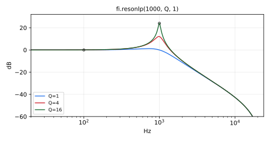

Simple resonant lowpass filter based on `tf2s` (virtual analog).
`resonlp` is a standard Faust function.

#### Usage

```
_ : resonlp(fc,Q,gain) : _
_ : resonhp(fc,Q,gain) : _
_ : resonbp(fc,Q,gain) : _

```

Where:

* `fc`: center frequency (Hz)
* `Q`: q
* `gain`: gain (0-1)

#### Test
```
fi = library("filters.lib");
os = library("oscillators.lib");
ba = library("basics.lib");
no = library("noises.lib");
ma = library("maths.lib");
src = os.tosc(440);
resonlp_test = src : fi.resonlp(1000, 2, 0.8);
resonlp_slider_test = no.noise : fi.resonlp(hslider("fc", 1000, 20, 20000, 1), hslider("Q", 2, 0.5, 20, 0.01), hslider("gain", 0.8, 0, 1, 0.01));
resonlp_modulated_test = no.noise : fi.resonlp(20*pow(250, tri), 2, 0.8) with { P = int(ma.SR/10); tri = 1 - abs(2*ba.period(P)/P - 1); };
resonlp_jump_test = no.noise : fi.resonlp(20*pow(250, sq), 2, 0.8) with { P = int(ma.SR/10); sq = ba.period(2*P) < P; };
resonlp_audio_modulated_test = 0.1*no.noise : fi.resonlp(max(20, 1000*(1 + 0.9*os.tosc(500))), 10, 1);
```

----

### `(fi.)resonhp`

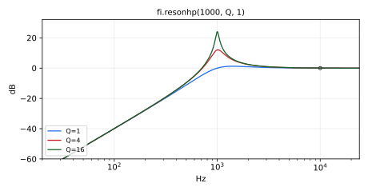

Simple resonant highpass filters based on `tf2s` (virtual analog).
`resonhp` is a standard Faust function. It is the second-order highpass
gain*s^2/(s^2 + s/Q + 1), with s normalized by 2*PI*fc: it rolls off at
12 dB per octave below fc, and its gain is `gain` well above fc.

#### Usage

```
_ : resonlp(fc,Q,gain) : _
_ : resonhp(fc,Q,gain) : _
_ : resonbp(fc,Q,gain) : _

```

Where:

* `fc`: center frequency (Hz)
* `Q`: q
* `gain`: gain (0-1)

#### Test
```
fi = library("filters.lib");
os = library("oscillators.lib");
ba = library("basics.lib");
no = library("noises.lib");
ma = library("maths.lib");
src = os.tosc(440);
resonhp_test = fi.resonhp(1000, 2, 0.8, src);
resonhp_slider_test = no.noise : fi.resonhp(hslider("fc", 1000, 20, 20000, 1), hslider("Q", 2, 0.5, 20, 0.01), hslider("gain", 0.8, 0, 1, 0.01));
resonhp_modulated_test = no.noise : fi.resonhp(20*pow(250, tri), 2, 0.8) with { P = int(ma.SR/10); tri = 1 - abs(2*ba.period(P)/P - 1); };
resonhp_jump_test = no.noise : fi.resonhp(20*pow(250, sq), 2, 0.8) with { P = int(ma.SR/10); sq = ba.period(2*P) < P; };
```

----

### `(fi.)resonbp`

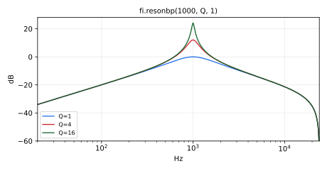

Simple resonant bandpass filters based on `tf2s` (virtual analog).
`resonbp` is a standard Faust function. It is
gain*s/(s^2 + s/Q + 1), with s normalized by 2*PI*fc, so its peak gain,
at fc, is gain*Q.

#### Usage

```
_ : resonlp(fc,Q,gain) : _
_ : resonhp(fc,Q,gain) : _
_ : resonbp(fc,Q,gain) : _

```

Where:

* `fc`: center frequency (Hz)
* `Q`: q
* `gain`: gain (0-1)

#### Test
```
fi = library("filters.lib");
os = library("oscillators.lib");
ba = library("basics.lib");
no = library("noises.lib");
ma = library("maths.lib");
src = os.tosc(440);
resonbp_test = src : fi.resonbp(1000, 2, 0.8);
resonbp_slider_test = no.noise : fi.resonbp(hslider("fc", 1000, 20, 20000, 1), hslider("Q", 2, 0.5, 20, 0.01), hslider("gain", 0.8, 0, 1, 0.01));
resonbp_modulated_test = no.noise : fi.resonbp(20*pow(250, tri), 2, 0.8) with { P = int(ma.SR/10); tri = 1 - abs(2*ba.period(P)/P - 1); };
resonbp_jump_test = no.noise : fi.resonbp(20*pow(250, sq), 2, 0.8) with { P = int(ma.SR/10); sq = ba.period(2*P) < P; };
resonbp_audio_modulated_test = 0.1*no.noise : fi.resonbp(max(20, 1000*(1 + 0.9*os.tosc(500))), 10, 1);
```

## Butterworth Lowpass/Highpass Filters


----

### `(fi.)lowpass`

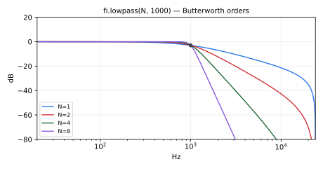

Nth-order Butterworth lowpass filter.
`lowpass` is a standard Faust function.

#### Usage

```
_ : lowpass(N,fc) : _
```

Where:

* `N`: filter order (number of poles), nonnegative constant numerical expression
* `fc`: desired cut-off frequency (-3dB frequency) in Hz, clamped to
  [0, 0.499*SR]: 0 holds the filter's states (see the section
  [Digital Filter Sections Specified as Analog Filter Sections](#digital-filter-sections-specified-as-analog-filter-sections))

#### Test
```
fi = library("filters.lib");
os = library("oscillators.lib");
no = library("noises.lib");
ba = library("basics.lib");
ma = library("maths.lib");
src = os.tosc(440);
lowpass_test = src : fi.lowpass(4, 2000);
lowpass_lowfc_test = no.noise : fi.lowpass(3, 10.1);
lowpass_zero_freq_test = no.noise : fi.lowpass(3, 1000*max(0, 1 - ba.time/12000) + 1000*(ba.time >= 24000));
lowpass_slider_test = no.noise : fi.lowpass(4, hslider("fc", 2000, 20, 20000, 1));
lowpass_modulated_test = no.noise : fi.lowpass(4, 20*pow(250, tri)) with { P = int(ma.SR/10); tri = 1 - abs(2*ba.period(P)/P - 1); };
lowpass_jump_test = no.noise : fi.lowpass(4, 20*pow(250, sq)) with { P = int(ma.SR/10); sq = ba.period(2*P) < P; };
```

#### References

* [https://ccrma.stanford.edu/~jos/filters/Butterworth_Lowpass_Design.html](https://ccrma.stanford.edu/~jos/filters/Butterworth_Lowpass_Design.html)
* `butter` function in Octave `("[z,p,g] = butter(N,1,'s');")`

----

### `(fi.)highpass`

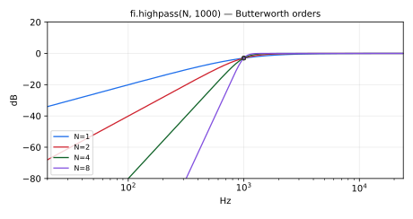

Nth-order Butterworth highpass filter.
`highpass` is a standard Faust function.

#### Usage

```
_ : highpass(N,fc) : _
```

Where:

* `N`: filter order (number of poles), nonnegative constant numerical expression
* `fc`: desired cut-off frequency (-3dB frequency) in Hz, clamped to
  [0, 0.499*SR]: 0 holds the filter's states, so that the input passes
  minus the DC they hold (see the section
  [Digital Filter Sections Specified as Analog Filter Sections](#digital-filter-sections-specified-as-analog-filter-sections))

#### Test
```
fi = library("filters.lib");
os = library("oscillators.lib");
no = library("noises.lib");
ba = library("basics.lib");
ma = library("maths.lib");
src = os.tosc(440);
highpass_test = src : fi.highpass(4, 500);
highpass_lowfc_test = no.noise : fi.highpass(3, 10.1);
highpass_zero_freq_test = no.noise : fi.highpass(3, 1000*max(0, 1 - ba.time/12000) + 1000*(ba.time >= 24000));
highpass_slider_test = no.noise : fi.highpass(4, hslider("fc", 500, 20, 20000, 1));
highpass_modulated_test = no.noise : fi.highpass(4, 20*pow(250, tri)) with { P = int(ma.SR/10); tri = 1 - abs(2*ba.period(P)/P - 1); };
highpass_jump_test = no.noise : fi.highpass(4, 20*pow(250, sq)) with { P = int(ma.SR/10); sq = ba.period(2*P) < P; };
```

#### References

* [https://ccrma.stanford.edu/~jos/filters/Butterworth_Lowpass_Design.html](https://ccrma.stanford.edu/~jos/filters/Butterworth_Lowpass_Design.html)
* `butter` function in Octave `("[z,p,g] = butter(N,1,'s');")`

----

### `(fi.)lowpass0_highpass1`

Generic Butterworth lowpass/highpass filter: the shared implementation
behind `fi.lowpass` and `fi.highpass`, with a selector choosing between
the two responses.

#### Usage

```
_ : lowpass0_highpass1(s,N,fc) : _
```

Where:

* `s`: response selector: 0 for lowpass, 1 for highpass (a constant numerical expression)
* `N`: filter order (a constant numerical expression)
* `fc`: -3dB cutoff frequency in Hz

#### Method

A first-order section `tf1s` for odd `N`, then second-order sections with
the Butterworth pole angles. Each second-order section has the transfer
function of `tf2s` (bilinear transform prewarped at `fc`), computed in
trapezoidal state-variable form (`svf.lp`/`svf.hp`), which stays accurate in
single precision when `fc` is small relative to the sample rate.

#### Test
```
fi = library("filters.lib");
os = library("oscillators.lib");
ba = library("basics.lib");
no = library("noises.lib");
ma = library("maths.lib");
src = os.tosc(440);
lowpass0_highpass1_test = src : fi.lowpass0_highpass1(0, 2, 1000);
lowpass0_highpass1_slider_test = no.noise : fi.lowpass0_highpass1(0, 2, hslider("fc", 1000, 20, 20000, 1));
lowpass0_highpass1_modulated_test = no.noise : fi.lowpass0_highpass1(0, 2, 20*pow(250, tri)) with { P = int(ma.SR/10); tri = 1 - abs(2*ba.period(P)/P - 1); };
lowpass0_highpass1_jump_test = no.noise : fi.lowpass0_highpass1(0, 2, 20*pow(250, sq)) with { P = int(ma.SR/10); sq = ba.period(2*P) < P; };
```

----

### `(fi.)lowpass_tpt_df`, `(fi.)highpass_tpt_df`

`lowpass` and `highpass` (order-`N` Butterworth) in trapezoidal sections
below the cutoff limit `L` and in direct-form sections (`tf2s_df`,
`tf1s_df`) at and above it. With a constant `fc`, only one of the two is
compiled. With a varying `fc`, both run (more CPU than either), the
direct form at `max(fc, L)` so that it stays accurate, and the output
switches between them where `fc` crosses `L`: pass `L = ma.MAX`
(trapezoidal) or `L = 0` (direct form) to compile one form only.

#### Usage

```
_ : lowpass_tpt_df(L,N,fc) : _
_ : highpass_tpt_df(L,N,fc) : _
```

Where:

* `L`: cutoff limit in Hz, usually `tpt_df_fmin`; `L <= 0` selects the
  direct form and `L >= ma.MAX` the trapezoidal form for every `fc`
* `N`: filter order (number of poles), a constant numerical expression
* `fc`: cutoff frequency in Hz

#### Test
```
fi = library("filters.lib");
no = library("noises.lib");
ba = library("basics.lib");
ma = library("maths.lib");
lowpass_tpt_df_test = no.noise : fi.lowpass_tpt_df(fi.tpt_df_fmin, 5, 4000);
lowpass_tpt_df_low_test = no.noise : fi.lowpass_tpt_df(fi.tpt_df_fmin, 5, 50);
lowpass_tpt_df_slider_test = no.noise : fi.lowpass_tpt_df(fi.tpt_df_fmin, 3, hslider("fc", 1000, 20, 20000, 1));
lowpass_tpt_df_modulated_test = no.noise : fi.lowpass_tpt_df(0, 3, 2500*pow(8, tri)) with { P = int(ma.SR/10); tri = 1 - abs(2*ba.period(P)/P - 1); };
lowpass_tpt_df_jump_test = no.noise : fi.lowpass_tpt_df(ma.MAX, 3, 20*pow(250, sq)) with { P = int(ma.SR/10); sq = ba.period(2*P) < P; };
highpass_tpt_df_test = no.noise : fi.highpass_tpt_df(fi.tpt_df_fmin, 5, 4000);
highpass_tpt_df_low_test = no.noise : fi.highpass_tpt_df(fi.tpt_df_fmin, 5, 50);
highpass_tpt_df_slider_test = no.noise : fi.highpass_tpt_df(fi.tpt_df_fmin, 3, hslider("fc", 1000, 20, 20000, 1));
highpass_tpt_df_modulated_test = no.noise : fi.highpass_tpt_df(0, 3, 2500*pow(8, tri)) with { P = int(ma.SR/10); tri = 1 - abs(2*ba.period(P)/P - 1); };
highpass_tpt_df_jump_test = no.noise : fi.highpass_tpt_df(ma.MAX, 3, 20*pow(250, sq)) with { P = int(ma.SR/10); sq = ba.period(2*P) < P; };
```

## Special Filter-Bank Delay-Equalizing Allpass Filters

These special allpass filters are needed by filterbank et al. below.
They are equivalent to `highpass(N,fc)` +|- `lowpass(N,fc)`, but with
canceling pole-zero pairs removed (which occurs for odd N). Both the sum
and the difference are allpass for odd N only, the order the filter banks
require.

----

### `(fi.)highpass_plus_lowpass`

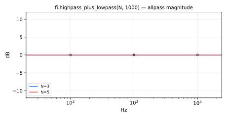

Sum of the order-`N` Butterworth highpass and lowpass responses at the same
cutoff: for odd `N`, an allpass used as delay equalizer by `fi.filterbank`
and the filter banks below. For odd orders 1, 3 and 5, canceling pole-zero
pairs are removed. For even `N` the sum is not allpass: it has a notch at
`fc` for N=2, and +3 dB at `fc` for N=4.

#### Usage

```
_ : highpass_plus_lowpass(N,fc) : _
```

Where:

* `N`: filter order (a constant numerical expression)
* `fc`: crossover frequency in Hz

#### Test
```
fi = library("filters.lib");
os = library("oscillators.lib");
ba = library("basics.lib");
no = library("noises.lib");
ma = library("maths.lib");
highpass_plus_lowpass_test = os.tosc(440) : fi.highpass_plus_lowpass(3, 1000);
highpass_plus_lowpass_slider_test = no.noise : fi.highpass_plus_lowpass(3, hslider("fc", 1000, 20, 20000, 1));
highpass_plus_lowpass_modulated_test = no.noise : fi.highpass_plus_lowpass(3, 20*pow(250, tri)) with { P = int(ma.SR/10); tri = 1 - abs(2*ba.period(P)/P - 1); };
highpass_plus_lowpass_jump_test = no.noise : fi.highpass_plus_lowpass(3, 20*pow(250, sq)) with { P = int(ma.SR/10); sq = ba.period(2*P) < P; };
```

----

### `(fi.)highpass_minus_lowpass`

Difference between the order-`N` Butterworth highpass and lowpass responses
at the same cutoff: an allpass used as delay equalizer by the
dc-inverted filter banks (`fi.mth_octave_filterbank_alt`). For odd orders
3 and 5, canceling pole-zero pairs are removed.

#### Usage

```
_ : highpass_minus_lowpass(N,fc) : _
```

Where:

* `N`: filter order (a constant numerical expression)
* `fc`: crossover frequency in Hz

#### Test
```
fi = library("filters.lib");
os = library("oscillators.lib");
ba = library("basics.lib");
no = library("noises.lib");
ma = library("maths.lib");
highpass_minus_lowpass_test = os.tosc(440) : fi.highpass_minus_lowpass(3, 1000);
highpass_minus_lowpass_slider_test = no.noise : fi.highpass_minus_lowpass(3, hslider("fc", 1000, 20, 20000, 1));
highpass_minus_lowpass_modulated_test = no.noise : fi.highpass_minus_lowpass(3, 20*pow(250, tri)) with { P = int(ma.SR/10); tri = 1 - abs(2*ba.period(P)/P - 1); };
highpass_minus_lowpass_jump_test = no.noise : fi.highpass_minus_lowpass(3, 20*pow(250, sq)) with { P = int(ma.SR/10); sq = ba.period(2*P) < P; };
```

----

### `(fi.)highpass_plus_lowpass_tpt_df`, `(fi.)highpass_minus_lowpass_tpt_df`

`highpass_plus_lowpass` and `highpass_minus_lowpass` in trapezoidal
sections below the cutoff limit `L` and in direct-form sections
(`tf2s_df`, `tf1s_df`) at and above it, as in `lowpass_tpt_df`: the delay
equalizers of the `*_tpt_df` filter banks.

#### Usage

```
_ : highpass_plus_lowpass_tpt_df(L,N,fc) : _
_ : highpass_minus_lowpass_tpt_df(L,N,fc) : _
```

Where:

* `L`: cutoff limit in Hz, usually `tpt_df_fmin`; `L <= 0` selects the
  direct form and `L >= ma.MAX` the trapezoidal form for every `fc`
* `N`: filter order (a constant numerical expression)
* `fc`: crossover frequency in Hz

#### Test
```
fi = library("filters.lib");
no = library("noises.lib");
ba = library("basics.lib");
ma = library("maths.lib");
highpass_plus_lowpass_tpt_df_test = no.noise : fi.highpass_plus_lowpass_tpt_df(fi.tpt_df_fmin, 5, 4000);
highpass_plus_lowpass_tpt_df_low_test = no.noise : fi.highpass_plus_lowpass_tpt_df(fi.tpt_df_fmin, 3, 50);
highpass_plus_lowpass_tpt_df_slider_test = no.noise : fi.highpass_plus_lowpass_tpt_df(fi.tpt_df_fmin, 5, hslider("fc", 1000, 20, 20000, 1));
highpass_plus_lowpass_tpt_df_modulated_test = no.noise : fi.highpass_plus_lowpass_tpt_df(0, 5, 2500*pow(8, tri)) with { P = int(ma.SR/10); tri = 1 - abs(2*ba.period(P)/P - 1); };
highpass_plus_lowpass_tpt_df_jump_test = no.noise : fi.highpass_plus_lowpass_tpt_df(ma.MAX, 5, 20*pow(250, sq)) with { P = int(ma.SR/10); sq = ba.period(2*P) < P; };
highpass_minus_lowpass_tpt_df_test = no.noise : fi.highpass_minus_lowpass_tpt_df(fi.tpt_df_fmin, 5, 4000);
highpass_minus_lowpass_tpt_df_low_test = no.noise : fi.highpass_minus_lowpass_tpt_df(fi.tpt_df_fmin, 3, 50);
highpass_minus_lowpass_tpt_df_slider_test = no.noise : fi.highpass_minus_lowpass_tpt_df(fi.tpt_df_fmin, 5, hslider("fc", 1000, 20, 20000, 1));
highpass_minus_lowpass_tpt_df_modulated_test = no.noise : fi.highpass_minus_lowpass_tpt_df(0, 5, 2500*pow(8, tri)) with { P = int(ma.SR/10); tri = 1 - abs(2*ba.period(P)/P - 1); };
highpass_minus_lowpass_tpt_df_jump_test = no.noise : fi.highpass_minus_lowpass_tpt_df(ma.MAX, 5, 20*pow(250, sq)) with { P = int(ma.SR/10); sq = ba.period(2*P) < P; };
```

----

### `(fi.)highpass_plus_lowpass_even`

Sum of the even-order Butterworth highpass and lowpass responses,
`highpass(N,fc) + lowpass(N,fc)`. Takes two copies of the input signal
(both normally fed the same signal); `fi.highpass_plus_lowpass` selects
this case automatically for even `N`.

#### Usage

```
_,_ : highpass_plus_lowpass_even(N,fc) : _
```

Where:

* `N`: even filter order (a constant numerical expression)
* `fc`: crossover frequency in Hz

#### Test
```
fi = library("filters.lib");
os = library("oscillators.lib");
ba = library("basics.lib");
no = library("noises.lib");
ma = library("maths.lib");
highpass_plus_lowpass_even_test = os.tosc(440), os.tosc(440) : fi.highpass_plus_lowpass_even(4, 1000);
highpass_plus_lowpass_even_slider_test = (no.noise <: _, _) : fi.highpass_plus_lowpass_even(4, hslider("fc", 1000, 20, 20000, 1));
highpass_plus_lowpass_even_modulated_test = (no.noise <: _, _) : fi.highpass_plus_lowpass_even(4, 20*pow(250, tri)) with { P = int(ma.SR/10); tri = 1 - abs(2*ba.period(P)/P - 1); };
highpass_plus_lowpass_even_jump_test = (no.noise <: _, _) : fi.highpass_plus_lowpass_even(4, 20*pow(250, sq)) with { P = int(ma.SR/10); sq = ba.period(2*P) < P; };
```

----

### `(fi.)highpass_minus_lowpass_even`

Difference between the even-order Butterworth highpass and lowpass
responses, `highpass(N,fc) - lowpass(N,fc)`. Takes two copies of the input
signal (both normally fed the same signal); `fi.highpass_minus_lowpass`
selects this case automatically for even `N`.

#### Usage

```
_,_ : highpass_minus_lowpass_even(N,fc) : _
```

Where:

* `N`: even filter order (a constant numerical expression)
* `fc`: crossover frequency in Hz

#### Test
```
fi = library("filters.lib");
os = library("oscillators.lib");
ba = library("basics.lib");
no = library("noises.lib");
ma = library("maths.lib");
highpass_minus_lowpass_even_test = os.tosc(440), os.tosc(440) : fi.highpass_minus_lowpass_even(4, 1000);
highpass_minus_lowpass_even_slider_test = (no.noise <: _, _) : fi.highpass_minus_lowpass_even(4, hslider("fc", 1000, 20, 20000, 1));
highpass_minus_lowpass_even_modulated_test = (no.noise <: _, _) : fi.highpass_minus_lowpass_even(4, 20*pow(250, tri)) with { P = int(ma.SR/10); tri = 1 - abs(2*ba.period(P)/P - 1); };
highpass_minus_lowpass_even_jump_test = (no.noise <: _, _) : fi.highpass_minus_lowpass_even(4, 20*pow(250, sq)) with { P = int(ma.SR/10); sq = ba.period(2*P) < P; };
```

----

### `(fi.)highpass_plus_lowpass_odd`

Sum of the odd-order highpass and lowpass responses.

#### Usage

```
_,_ : highpass_plus_lowpass_odd(N,fc) : _
```

Where:

* `N`: odd Butterworth order
* `fc`: cutoff frequency in Hz

#### Test
```
fi = library("filters.lib");
os = library("oscillators.lib");
ba = library("basics.lib");
no = library("noises.lib");
ma = library("maths.lib");
highpass_plus_lowpass_odd_test = os.tosc(440), os.tosc(440) : fi.highpass_plus_lowpass_odd(3, 1000);
highpass_plus_lowpass_odd_slider_test = (no.noise <: _, _) : fi.highpass_plus_lowpass_odd(3, hslider("fc", 1000, 20, 20000, 1));
highpass_plus_lowpass_odd_modulated_test = (no.noise <: _, _) : fi.highpass_plus_lowpass_odd(3, 20*pow(250, tri)) with { P = int(ma.SR/10); tri = 1 - abs(2*ba.period(P)/P - 1); };
highpass_plus_lowpass_odd_jump_test = (no.noise <: _, _) : fi.highpass_plus_lowpass_odd(3, 20*pow(250, sq)) with { P = int(ma.SR/10); sq = ba.period(2*P) < P; };
```
FIXME: Rewrite the following, as for orders 3 and 5 above,
       to eliminate pole-zero cancellations:

----

### `(fi.)highpass_minus_lowpass_odd`

Difference between the odd-order highpass and lowpass responses.

#### Usage

```
_,_ : highpass_minus_lowpass_odd(N,fc) : _
```

Where:

* `N`: odd Butterworth order
* `fc`: cutoff frequency in Hz

#### Test
```
fi = library("filters.lib");
os = library("oscillators.lib");
ba = library("basics.lib");
no = library("noises.lib");
ma = library("maths.lib");
highpass_minus_lowpass_odd_test = os.tosc(440), os.tosc(440) : fi.highpass_minus_lowpass_odd(3, 1000);
highpass_minus_lowpass_odd_slider_test = (no.noise <: _, _) : fi.highpass_minus_lowpass_odd(3, hslider("fc", 1000, 20, 20000, 1));
highpass_minus_lowpass_odd_modulated_test = (no.noise <: _, _) : fi.highpass_minus_lowpass_odd(3, 20*pow(250, tri)) with { P = int(ma.SR/10); tri = 1 - abs(2*ba.period(P)/P - 1); };
highpass_minus_lowpass_odd_jump_test = (no.noise <: _, _) : fi.highpass_minus_lowpass_odd(3, 20*pow(250, sq)) with { P = int(ma.SR/10); sq = ba.period(2*P) < P; };
```
FIXME: Rewrite the following, as for orders 3 and 5 above,
       to eliminate pole-zero cancellations/

## Elliptic (Cauer) Lowpass Filters

Elliptic (Cauer) Lowpass Filters

#### References

* [http://en.wikipedia.org/wiki/Elliptic_filter](http://en.wikipedia.org/wiki/Elliptic_filter)
* functions `ncauer` and `ellip` in Octave.

----

### `(fi.)lowpass3e`

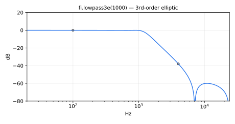

Third-order Elliptic (Cauer) lowpass filter.

#### Usage

```
_ : lowpass3e(fc) : _
```

Where:

* `fc`: passband edge frequency in Hz, where the gain is -0.2 dB (the
  -3 dB point is near 1.28*fc)

#### Test
```
fi = library("filters.lib");
os = library("oscillators.lib");
ba = library("basics.lib");
no = library("noises.lib");
src = os.tosc(440);
lowpass3e_test = src : fi.lowpass3e(1000);
lowpass3e_slider_test = no.noise : fi.lowpass3e(hslider("fc", 1000, 20, 20000, 1));
```

#### Design

For spectral band-slice level display (see `octave_analyzer3e`):

```
[z,p,g] = ncauer(Rp,Rs,3);  % analog zeros, poles, and gain, where
Rp = 60  % dB ripple in stopband
Rs = 0.2 % dB ripple in passband
```

----

### `(fi.)lowpass6e`

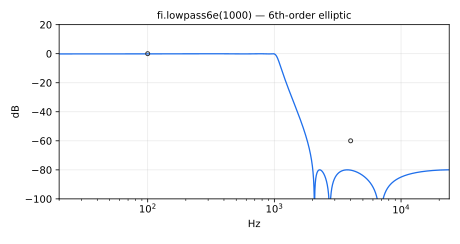

Sixth-order Elliptic/Cauer lowpass filter.

#### Usage

```
_ : lowpass6e(fc) : _
```

Where:

* `fc`: passband edge frequency in Hz, where the gain is -0.2 dB (the
  -3 dB point is near 1.06*fc)

#### Test
```
fi = library("filters.lib");
os = library("oscillators.lib");
no = library("noises.lib");
src = os.tosc(440);
lowpass6e_test = src : fi.lowpass6e(1000);
lowpass6e_slider_test = no.noise : fi.lowpass6e(hslider("fc", 1000, 20, 20000, 1));
```

#### Design

For spectral band-slice level display (see octave_analyzer6e):

```
[z,p,g] = ncauer(Rp,Rs,6);  % analog zeros, poles, and gain, where
 Rp = 80  % dB ripple in stopband
 Rs = 0.2 % dB ripple in passband
```

## Elliptic Highpass Filters


----

### `(fi.)highpass3e`

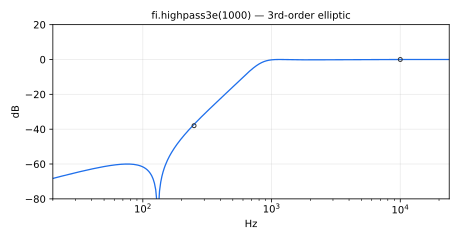

Third-order Elliptic (Cauer) highpass filter. Inversion of `lowpass3e` wrt unit
circle in s plane (s <- 1/s).

#### Usage

```
_ : highpass3e(fc) : _
```

Where:

* `fc`: passband edge frequency in Hz, where the gain is -0.2 dB (the
  -3 dB point is near fc/1.28)

#### Test
```
fi = library("filters.lib");
os = library("oscillators.lib");
ba = library("basics.lib");
no = library("noises.lib");
ma = library("maths.lib");
src = os.tosc(440);
highpass3e_test = src : fi.highpass3e(1000);
highpass3e_slider_test = no.noise : fi.highpass3e(hslider("fc", 1000, 20, 20000, 1));
highpass3e_modulated_test = no.noise : fi.highpass3e(20*pow(250, tri)) with { P = int(ma.SR/10); tri = 1 - abs(2*ba.period(P)/P - 1); };
highpass3e_jump_test = no.noise : fi.highpass3e(20*pow(250, sq)) with { P = int(ma.SR/10); sq = ba.period(2*P) < P; };
```

----

### `(fi.)highpass6e`

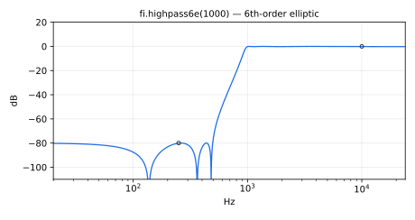

Sixth-order Elliptic/Cauer highpass filter. Inversion of `lowpass6e` wrt unit
circle in s plane (s <- 1/s).

#### Usage

```
_ : highpass6e(fc) : _
```

Where:

* `fc`: passband edge frequency in Hz, where the gain is -0.2 dB (the
  -3 dB point is near fc/1.06)

#### Test
```
fi = library("filters.lib");
os = library("oscillators.lib");
ba = library("basics.lib");
no = library("noises.lib");
ma = library("maths.lib");
src = os.tosc(440);
highpass6e_test = src : fi.highpass6e(1000);
highpass6e_slider_test = no.noise : fi.highpass6e(hslider("fc", 1000, 20, 20000, 1));
highpass6e_modulated_test = no.noise : fi.highpass6e(20*pow(250, tri)) with { P = int(ma.SR/10); tri = 1 - abs(2*ba.period(P)/P - 1); };
highpass6e_jump_test = no.noise : fi.highpass6e(20*pow(250, sq)) with { P = int(ma.SR/10); sq = ba.period(2*P) < P; };
```

----

### `(fi.)lowpass6e_tpt_df`, `(fi.)highpass6e_tpt_df`

`lowpass6e` and `highpass6e` in trapezoidal sections below the cutoff
limit `L` and in direct-form sections (`tf2s_df`) at and above it, as in
`lowpass_tpt_df`: the band splits of `an.mth_octave_analyzer6e_tpt_df`.

#### Usage

```
_ : lowpass6e_tpt_df(L,fc) : _
_ : highpass6e_tpt_df(L,fc) : _
```

Where:

* `L`: cutoff limit in Hz, usually `tpt_df_fmin`; `L <= 0` selects the
  direct form and `L >= ma.MAX` the trapezoidal form for every `fc`
* `fc`: -3dB frequency in Hz

#### Test
```
fi = library("filters.lib");
no = library("noises.lib");
ba = library("basics.lib");
ma = library("maths.lib");
lowpass6e_tpt_df_test = no.noise : fi.lowpass6e_tpt_df(fi.tpt_df_fmin, 4000);
lowpass6e_tpt_df_low_test = no.noise : fi.lowpass6e_tpt_df(fi.tpt_df_fmin, 50);
lowpass6e_tpt_df_slider_test = no.noise : fi.lowpass6e_tpt_df(fi.tpt_df_fmin, hslider("fc", 1000, 20, 20000, 1));
lowpass6e_tpt_df_modulated_test = no.noise : fi.lowpass6e_tpt_df(0, 2500*pow(8, tri)) with { P = int(ma.SR/10); tri = 1 - abs(2*ba.period(P)/P - 1); };
lowpass6e_tpt_df_jump_test = no.noise : fi.lowpass6e_tpt_df(ma.MAX, 20*pow(250, sq)) with { P = int(ma.SR/10); sq = ba.period(2*P) < P; };
highpass6e_tpt_df_test = no.noise : fi.highpass6e_tpt_df(fi.tpt_df_fmin, 4000);
highpass6e_tpt_df_low_test = no.noise : fi.highpass6e_tpt_df(fi.tpt_df_fmin, 50);
highpass6e_tpt_df_slider_test = no.noise : fi.highpass6e_tpt_df(fi.tpt_df_fmin, hslider("fc", 1000, 20, 20000, 1));
highpass6e_tpt_df_modulated_test = no.noise : fi.highpass6e_tpt_df(0, 2500*pow(8, tri)) with { P = int(ma.SR/10); tri = 1 - abs(2*ba.period(P)/P - 1); };
highpass6e_tpt_df_jump_test = no.noise : fi.highpass6e_tpt_df(ma.MAX, 20*pow(250, sq)) with { P = int(ma.SR/10); sq = ba.period(2*P) < P; };
```

## Butterworth Bandpass/Bandstop Filters


----

### `(fi.)bandpass`

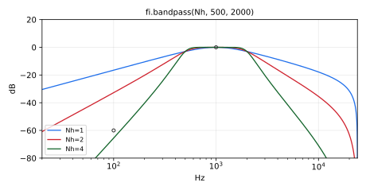

Order 2*Nh Butterworth bandpass filter made using the transformation
`s <- s + wc^2/s` on `lowpass(Nh)`, where `wc` is the desired bandpass center
frequency.  The `lowpass(Nh)` cutoff `w1` is the desired bandpass width.
`bandpass` is a standard Faust function.

#### Usage

```
_ : bandpass(Nh,fl,fu) : _
```

Where:

* `Nh`: HALF the desired bandpass order (which is therefore even)
* `fl`: lower -3dB frequency in Hz
* `fu`: upper -3dB frequency in Hz
Thus, the passband width is `fu-fl`, and its center frequency, where
the response peaks, is the geometric mean of the band edges prewarped by
the bilinear transform: `sqrt(fl*fu)` well below Nyquist, somewhat higher
near it. `fu` is clamped to [0, 0.499*SR] and `fl` to [0, `fu`]: `fl` = 0
gives `lowpass(Nh, fu)`, and `fl` can be swept to 0 or jump to and from it
without a click or a spike (see `tf2sb`). The passband width is floored
at 5e-4 times the center frequency (a Q of at most 2000), so `fl` = `fu`
gives that narrowest band, and a band can close and reopen without a spike.

#### Test
```
fi = library("filters.lib");
os = library("oscillators.lib");
no = library("noises.lib");
ba = library("basics.lib");
ma = library("maths.lib");
src = os.tosc(440);
bandpass_test = src : fi.bandpass(2, 500, 1500);
bandpass_lowband_test = no.noise : fi.bandpass(2, 100, 200);
bandpass_narrowlow_test = no.noise : fi.bandpass(2, 20, 22);
bandpass_zero_freq_test = no.noise : fi.bandpass(2, 1000*max(0, 1 - ba.time/12000) + 1000*(ba.time >= 24000), 2000);
bandpass3_zero_freq_test = no.noise : fi.bandpass(3, 1000*max(0, 1 - ba.time/12000) + 1000*(ba.time >= 24000), 2000);
bandpass_nyquist_test = no.noise : fi.bandpass(2, 1000, 0.6*ma.SR);
bandpass_zero_width_test = no.noise : fi.bandpass(2, select2(z, 707.1, 1000), select2(z, 1414.2, 1000)) with { z = (ba.time >= 4800) & (ba.time < 9600); };
bandpass3_zero_width_test = no.noise : fi.bandpass(3, select2(z, 707.1, 1000), select2(z, 1414.2, 1000)) with { z = (ba.time >= 4800) & (ba.time < 9600); };
bandpass_slider_test = no.noise : fi.bandpass(2, hslider("fl", 500, 20, 20000, 1), hslider("fu", 1500, 20, 20000, 1));
bandpass_modulated_test = no.noise : fi.bandpass(2, fl, 3*fl) with { P = int(ma.SR/10); tri = 1 - abs(2*ba.period(P)/P - 1); fl = 20*pow(250, tri); };
bandpass_jump_test = no.noise : fi.bandpass(2, fl, 3*fl) with { P = int(ma.SR/10); sq = ba.period(2*P) < P; fl = 20*pow(250, sq); };
```

----

### `(fi.)bandstop`

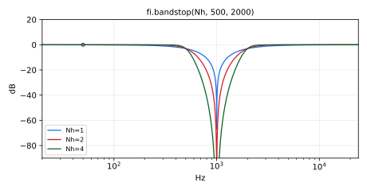

Order 2*Nh Butterworth bandstop filter made using the transformation
`s <- s + wc^2/s` on `highpass(Nh)`, where `wc` is the desired bandpass center
frequency.  The `highpass(Nh)` cutoff `w1` is the desired bandstop width.
`bandstop` is a standard Faust function.

#### Usage

```
_ : bandstop(Nh,fl,fu) : _
```
Where:

* `Nh`: HALF the desired bandstop order (which is therefore even)
* `fl`: lower -3dB frequency in Hz
* `fu`: upper -3dB frequency in Hz
Thus, the stopband width is `fu-fl`, and its center frequency, where
the response has its zero, is the geometric mean of the band edges
prewarped by the bilinear transform: `sqrt(fl*fu)` well below Nyquist,
somewhat higher near it. `fu` is clamped to [0, 0.499*SR] and `fl` to
[0, `fu`]: `fl` = 0 gives `highpass(Nh, fu)`, and `fl` can be swept to 0
or jump to and from it without a click or a spike (see `tf2sb`); `fl` =
`fu` gives the narrowest stopband: the width is floored at 5e-4 times the
center frequency, as in `bandpass`.

#### Test
```
fi = library("filters.lib");
os = library("oscillators.lib");
no = library("noises.lib");
ba = library("basics.lib");
ma = library("maths.lib");
src = os.tosc(440);
bandstop_test = src : fi.bandstop(2, 500, 1500);
bandstop_wide_test = no.noise : fi.bandstop(2, 5000, 8000);
bandstop_zero_freq_test = no.noise : fi.bandstop(2, 1000*max(0, 1 - ba.time/12000) + 1000*(ba.time >= 24000), 2000);
bandstop_zero_width_test = no.noise : fi.bandstop(2, select2(z, 707.1, 1000), select2(z, 1414.2, 1000)) with { z = (ba.time >= 4800) & (ba.time < 9600); };
bandstop_slider_test = no.noise : fi.bandstop(2, hslider("fl", 500, 20, 20000, 1), hslider("fu", 1500, 20, 20000, 1));
bandstop_modulated_test = no.noise : fi.bandstop(2, fl, 3*fl) with { P = int(ma.SR/10); tri = 1 - abs(2*ba.period(P)/P - 1); fl = 20*pow(250, tri); };
bandstop_jump_test = no.noise : fi.bandstop(2, fl, 3*fl) with { P = int(ma.SR/10); sq = ba.period(2*P) < P; fl = 20*pow(250, sq); };
```

----

### `(fi.)bandpass0_bandstop1`

Generic Butterworth bandpass/bandstop filter: the shared implementation
behind `fi.bandpass` and `fi.bandstop`, with a selector choosing between
the two responses.

#### Usage

```
_ : bandpass0_bandstop1(s,Nh,fl,fu) : _
```

Where:

* `s`: response selector: 0 for bandpass, 1 for bandstop (a constant numerical expression)
* `Nh`: HALF the filter order, i.e. the number of second-order sections (a constant numerical expression)
* `fl`: lower -3dB band edge frequency in Hz
* `fu`: upper -3dB band edge frequency in Hz

#### Test
```
fi = library("filters.lib");
os = library("oscillators.lib");
ba = library("basics.lib");
no = library("noises.lib");
ma = library("maths.lib");
src = os.tosc(440);
bandpass0_bandstop1_test = src : fi.bandpass0_bandstop1(0, 2, 500, 1500);
bandpass0_bandstop1_slider_test = no.noise : fi.bandpass0_bandstop1(0, 2, hslider("fl", 500, 20, 20000, 1), hslider("fu", 1500, 20, 20000, 1));
bandpass0_bandstop1_modulated_test = no.noise : fi.bandpass0_bandstop1(0, 2, fl, 3*fl) with { P = int(ma.SR/10); tri = 1 - abs(2*ba.period(P)/P - 1); fl = 20*pow(250, tri); };
bandpass0_bandstop1_jump_test = no.noise : fi.bandpass0_bandstop1(0, 2, fl, 3*fl) with { P = int(ma.SR/10); sq = ba.period(2*P) < P; fl = 20*pow(250, sq); };
```

## Elliptic Bandpass Filters


----

### `(fi.)bandpass6e`

Order 6 elliptic bandpass filter analogous to `bandpass(3)`: a third-order
elliptic lowpass prototype mapped to a bandpass, with a 0.2 dB equiripple
passband between `fl` and `fu`.

#### Usage

```
_ : bandpass6e(fl,fu) : _
```

Where:

* `fl`: lower passband edge frequency in Hz (-0.2 dB), clamped to [0, `fu`]
  (0 gives the elliptic lowpass at `fu`; the width is floored at 5e-4 times
  the center frequency; see `bandpass`)
* `fu`: upper passband edge frequency in Hz (-0.2 dB), clamped to [0, 0.499*SR]

#### Test
```
fi = library("filters.lib");
os = library("oscillators.lib");
ba = library("basics.lib");
no = library("noises.lib");
ma = library("maths.lib");
src = os.tosc(440);
bandpass6e_test = src : fi.bandpass6e(500, 1500);
bandpass6e_zero_freq_test = no.noise : fi.bandpass6e(1000*max(0, 1 - ba.time/12000) + 1000*(ba.time >= 24000), 2000);
bandpass6e_slider_test = no.noise : fi.bandpass6e(hslider("fl", 500, 20, 20000, 1), hslider("fu", 1500, 20, 20000, 1));
bandpass6e_modulated_test = no.noise : fi.bandpass6e(fl, 3*fl) with { P = int(ma.SR/10); tri = 1 - abs(2*ba.period(P)/P - 1); fl = 20*pow(250, tri); };
bandpass6e_jump_test = no.noise : fi.bandpass6e(fl, 3*fl) with { P = int(ma.SR/10); sq = ba.period(2*P) < P; fl = 20*pow(250, sq); };
```

----

### `(fi.)bandpass12e`

Order 12 elliptic bandpass filter analogous to `bandpass(6)`: a sixth-order
elliptic lowpass prototype mapped to a bandpass, with a 0.2 dB equiripple
passband between `fl` and `fu`.

#### Usage

```
_ : bandpass12e(fl,fu) : _
```

Where:

* `fl`: lower passband edge frequency in Hz (-0.2 dB), clamped to [0, `fu`]
  (0 gives the elliptic lowpass at `fu`; the width is floored at 5e-4 times
  the center frequency; see `bandpass`)
* `fu`: upper passband edge frequency in Hz (-0.2 dB), clamped to [0, 0.499*SR]

#### Test
```
fi = library("filters.lib");
os = library("oscillators.lib");
ba = library("basics.lib");
no = library("noises.lib");
ma = library("maths.lib");
src = os.tosc(440);
bandpass12e_test = src : fi.bandpass12e(500, 1500);
bandpass12e_zero_freq_test = no.noise : fi.bandpass12e(1000*max(0, 1 - ba.time/12000) + 1000*(ba.time >= 24000), 2000);
bandpass12e_slider_test = no.noise : fi.bandpass12e(hslider("fl", 500, 20, 20000, 1), hslider("fu", 1500, 20, 20000, 1));
bandpass12e_modulated_test = no.noise : fi.bandpass12e(fl, 3*fl) with { P = int(ma.SR/10); tri = 1 - abs(2*ba.period(P)/P - 1); fl = 20*pow(250, tri); };
bandpass12e_jump_test = no.noise : fi.bandpass12e(fl, 3*fl) with { P = int(ma.SR/10); sq = ba.period(2*P) < P; fl = 20*pow(250, sq); };
```

----

### `(fi.)pospass`

Positive-Pass Filter (single-side-band filter).

#### Usage

```
_ : pospass(N,fc) : _,_
```

where

* `N`: filter order (Butterworth bandpass for positive frequencies).
* `fc`: lower bandpass cutoff frequency in Hz.
  - Highpass cutoff frequency at ma.SR/2 - fc Hz.

#### Example test program

* See `dm.pospass_demo`
* Look at frequency response

#### Method

A filter passing only positive frequencies can be made from a
half-band lowpass by modulating it up to the positive-frequency range.
Equivalently, down-modulate the input signal using a complex sinusoid at -SR/4 Hz,
lowpass it with a half-band filter, and modulate back up by SR/4 Hz.
In Faust/math notation:
$$pospass(N) = \ast(e^{-j\frac{\pi}{2}n}) : \mbox{lowpass(N,SR/4)} : \ast(e^{j\frac{\pi}{2}n})$$

An approximation to the Hilbert transform is given by the
imaginary output signal:

```
hilbert(N) = pospass(N) : !,*(2);
```

#### Test
```
fi = library("filters.lib");
ba = library("basics.lib");
no = library("noises.lib");
os = library("oscillators.lib");
ma = library("maths.lib");
src = os.tosc(440);
pospass_test = src : fi.pospass(3, 1000);
pospass_slider_test = no.noise : fi.pospass(3, hslider("fc", 1000, 20, 20000, 1));
pospass_modulated_test = no.noise : fi.pospass(3, 20*pow(250, tri)) with { P = int(ma.SR/10); tri = 1 - abs(2*ba.period(P)/P - 1); };
pospass_jump_test = no.noise : fi.pospass(3, 20*pow(250, sq)) with { P = int(ma.SR/10); sq = ba.period(2*P) < P; };
```

#### References

* [https://ccrma.stanford.edu/~jos/mdft/Analytic_Signals_Hilbert_Transform.html](https://ccrma.stanford.edu/~jos/mdft/Analytic_Signals_Hilbert_Transform.html)
* [https://ccrma.stanford.edu/~jos/sasp/Comparison_Optimal_Chebyshev_FIR_I.html](https://ccrma.stanford.edu/~jos/sasp/Comparison_Optimal_Chebyshev_FIR_I.html)
* [https://ccrma.stanford.edu/~jos/sasp/Hilbert_Transform.html](https://ccrma.stanford.edu/~jos/sasp/Hilbert_Transform.html)

----

### `(fi.)pospass6e`

Positive-pass filter like `pospass`, but built on the order-6 elliptic
lowpass `lowpass6e` instead of a Butterworth lowpass: a steeper
transition band for the same order.

#### Usage

```
_ : pospass6e(fc) : _,_
```

Where:

* `fc`: lower cutoff frequency in Hz

#### Test
```
fi = library("filters.lib");
os = library("oscillators.lib");
ba = library("basics.lib");
no = library("noises.lib");
ma = library("maths.lib");
pospass6e_test = os.tosc(440) : fi.pospass6e(100);
pospass6e_slider_test = no.noise : fi.pospass6e(hslider("fc", 100, 20, 20000, 1));
pospass6e_modulated_test = no.noise : fi.pospass6e(20*pow(250, tri)) with { P = int(ma.SR/10); tri = 1 - abs(2*ba.period(P)/P - 1); };
pospass6e_jump_test = no.noise : fi.pospass6e(20*pow(250, sq)) with { P = int(ma.SR/10); sq = ba.period(2*P) < P; };
```

----

### `(fi.)hilbert`

Approximate Hilbert transform: twice the imaginary part of the analytic
signal computed by `fi.pospass`, i.e. a signal in quadrature (-90 degrees)
with the in-phase (real) output of the same filter. This is the one-line
construction given in the `fi.pospass` documentation.

The output carries the group delay of the underlying filter, so pair it
with the real part of `fi.pospass` (not with the raw input) when phase
alignment matters. Accuracy improves with the order `N` and with the input
frequency: rejecting the negative-frequency image of a component at `f` Hz
requires the internal half-band lowpass to cut inside a transition band of
width `2*f`, so low frequencies demand high orders (measured at 48 kHz:
with `N = 8`, a 5 kHz sine yields an analytic pair with 0.5% envelope
ripple and quadrature to 1e-4, while a 1 kHz sine needs `N` around 32 for
comparable quality).

#### Usage

```
_ : hilbert(N,fc) : _
```

Where:

* `N`: order of the underlying Butterworth positive-pass filter (a constant numerical expression)
* `fc`: lower cutoff frequency in Hz of the positive-pass filter

#### Test
```
fi = library("filters.lib");
os = library("oscillators.lib");
ba = library("basics.lib");
no = library("noises.lib");
ma = library("maths.lib");
hilbert_test = os.tosc(440) : fi.hilbert(4, 20);
hilbert_slider_test = no.noise : fi.hilbert(4, hslider("fc", 20, 5, 500, 1));
hilbert_modulated_test = no.noise : fi.hilbert(4, 10*pow(10, tri)) with { P = int(ma.SR/10); tri = 1 - abs(2*ba.period(P)/P - 1); };
hilbert_jump_test = no.noise : fi.hilbert(4, 10*pow(10, sq)) with { P = int(ma.SR/10); sq = ba.period(2*P) < P; };
```

#### References

* [https://ccrma.stanford.edu/~jos/mdft/Analytic_Signals_Hilbert_Transform.html](https://ccrma.stanford.edu/~jos/mdft/Analytic_Signals_Hilbert_Transform.html)
* [https://ccrma.stanford.edu/~jos/sasp/Hilbert_Transform.html](https://ccrma.stanford.edu/~jos/sasp/Hilbert_Transform.html)

## Parametric Equalizers (Shelf, Peaking)

Parametric Equalizers (Shelf, Peaking).

#### References

* [http://en.wikipedia.org/wiki/Equalization](http://en.wikipedia.org/wiki/Equalization)
* [https://webaudio.github.io/Audio-EQ-Cookbook/Audio-EQ-Cookbook.txt](https://webaudio.github.io/Audio-EQ-Cookbook/Audio-EQ-Cookbook.txt)
* Digital Audio Signal Processing, Udo Zolzer, Wiley, 1999, p. 124
* [https://ccrma.stanford.edu/~jos/filters/Low_High_Shelving_Filters.html](https://ccrma.stanford.edu/~jos/filters/Low_High_Shelving_Filters.html)
* [https://ccrma.stanford.edu/~jos/filters/Peaking_Equalizers.html](https://ccrma.stanford.edu/~jos/filters/Peaking_Equalizers.html)
* maxmsp.lib in the Faust distribution
* bandfilter.dsp in the faust2pd distribution

----

### `(fi.)lowshelf`

Order-`N` "low shelf" filter (gain boost|cut between dc and some frequency)
`low_shelf` is a standard Faust function.

#### Usage

```
_ : lowshelf(N,L0,fx) : _
_ : low_shelf(L0,fx) : _ // default case (order 3)
_ : lowshelf_other_freq(N,L0,fx) : _
```

Where:

* `N`: filter order 1, 3, 5, ... (odd only, default should be 3, a constant numerical expression)
* `L0`: desired level (dB) between dc and fx (boost `L0>0` or cut `L0<0`)
* `fx`: -3dB frequency of lowpass band (`L0>0`) or upper band (`L0<0`)
      (see "SHELF SHAPE" below).

The gain at SR/2 is constrained to be 1.
The generalization to arbitrary odd orders is based on the well known
fact that odd-order Butterworth band-splits are allpass-complementary
(see filterbank documentation below for references).

#### Test
```
fi = library("filters.lib");
os = library("oscillators.lib");
ba = library("basics.lib");
no = library("noises.lib");
ma = library("maths.lib");
src = os.tosc(440);
lowshelf_test = src : fi.lowshelf(3, 6, 500);
lowshelf_slider_test = no.noise : fi.lowshelf(3, hslider("L0", 6, -24, 24, 0.1), hslider("fc", 500, 20, 20000, 1));
lowshelf_modulated_test = no.noise : fi.lowshelf(3, 6, 20*pow(250, tri)) with { P = int(ma.SR/10); tri = 1 - abs(2*ba.period(P)/P - 1); };
lowshelf_jump_test = no.noise : fi.lowshelf(3, 6, 20*pow(250, sq)) with { P = int(ma.SR/10); sq = ba.period(2*P) < P; };
```

#### Shelf Shape
The magnitude frequency response is approximately piecewise-linear
on a log-log plot ("BODE PLOT").  The Bode "stick diagram" approximation
L(lf) is easy to state in dB versus dB-frequency lf = dB(f):

* L0 > 0:
* L(lf) = L0, f between 0 and fx = 1st corner frequency;
* L(lf) = L0 - N * (lf - lfx), f between fx and f2 = 2nd corner frequency;
* L(lf) = 0, lf > lf2.
* lf2 = lfx + L0/N = dB-frequency at which level gets back to 0 dB.
* L0 < 0:
* L(lf) = L0, f between 0 and f1 = 1st corner frequency;
* L(lf) = - N * (lfx - lf), f between f1 and lfx = 2nd corner frequency;
* L(lf) = 0, lf > lfx.
* lf1 = lfx + L0/N = dB-frequency at which level goes up from L0.

 See `lowshelf_other_freq`.

#### References

* See "Parametric Equalizers" above for references regarding `low_shelf`, `high_shelf`, and `peak_eq`.

----

### `(fi.)low_shelf`

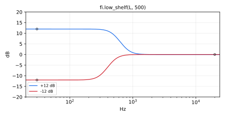

Default low shelf filter: 3rd-order Butterworth case of `fi.lowshelf`
(`low_shelf = lowshelf(3)`), boosting or cutting by `L0` dB between dc and
`fx`. `low_shelf` is a standard Faust function. See `fi.lowshelf` for the
full documentation, including the shelf shape.

#### Usage

```
_ : low_shelf(L0,fx) : _
```

Where:

* `L0`: desired level (dB) between dc and `fx` (boost `L0>0` or cut `L0<0`)
* `fx`: transition frequency in Hz

#### Test
```
fi = library("filters.lib");
os = library("oscillators.lib");
ba = library("basics.lib");
no = library("noises.lib");
ma = library("maths.lib");
src = os.tosc(440);
low_shelf_test = src : fi.low_shelf(6, 500);
low_shelf_slider_test = no.noise : fi.low_shelf(hslider("L0", 6, -24, 24, 0.1), hslider("fc", 500, 20, 20000, 1));
low_shelf_modulated_test = no.noise : fi.low_shelf(6, 20*pow(250, tri)) with { P = int(ma.SR/10); tri = 1 - abs(2*ba.period(P)/P - 1); };
low_shelf_jump_test = no.noise : fi.low_shelf(6, 20*pow(250, sq)) with { P = int(ma.SR/10); sq = ba.period(2*P) < P; };
```

----

### `(fi.)low_shelf1`

First-order low shelf filter, an optimized special case of `fi.lowshelf(1)`:
boosts or cuts by `L0` dB between dc and `fx`.

#### Usage

```
_ : low_shelf1(L0,fx) : _
```

Where:

* `L0`: desired level (dB) between dc and `fx` (boost `L0>0` or cut `L0<0`)
* `fx`: transition frequency in Hz

#### Test
```
fi = library("filters.lib");
os = library("oscillators.lib");
ba = library("basics.lib");
no = library("noises.lib");
ma = library("maths.lib");
src = os.tosc(440);
low_shelf1_test = fi.low_shelf1(2, 500, src);
low_shelf1_slider_test = no.noise : fi.low_shelf1(hslider("L0", 2, -24, 24, 0.1), hslider("fc", 500, 20, 20000, 1));
low_shelf1_modulated_test = no.noise : fi.low_shelf1(2, 20*pow(250, tri)) with { P = int(ma.SR/10); tri = 1 - abs(2*ba.period(P)/P - 1); };
low_shelf1_jump_test = no.noise : fi.low_shelf1(2, 20*pow(250, sq)) with { P = int(ma.SR/10); sq = ba.period(2*P) < P; };
```

----

### `(fi.)low_shelf1_l`

First-order low shelf filter like `fi.low_shelf1`, but taking a LINEAR gain
`G0` instead of a level in dB (avoids computing `ba.db2linear` at run time
when the gain is already linear).

#### Usage

```
_ : low_shelf1_l(G0,fx) : _
```

Where:

* `G0`: desired linear gain between dc and `fx`
* `fx`: transition frequency in Hz

#### Test
```
fi = library("filters.lib");
os = library("oscillators.lib");
ba = library("basics.lib");
no = library("noises.lib");
ma = library("maths.lib");
src = os.tosc(440);
low_shelf1_l_test = fi.low_shelf1_l(2, 500, src);
low_shelf1_l_slider_test = no.noise : fi.low_shelf1_l(hslider("G0", 2, 0, 16, 0.01), hslider("fc", 500, 20, 20000, 1));
low_shelf1_l_modulated_test = no.noise : fi.low_shelf1_l(2, 20*pow(250, tri)) with { P = int(ma.SR/10); tri = 1 - abs(2*ba.period(P)/P - 1); };
low_shelf1_l_jump_test = no.noise : fi.low_shelf1_l(2, 20*pow(250, sq)) with { P = int(ma.SR/10); sq = ba.period(2*P) < P; };
```

----

### `(fi.)lowshelf_other_freq`

Second corner frequency of a low shelf: given the shelf order `N`, level
`L0` and transition frequency `fx` of `fi.lowshelf(N,L0,fx)`, returns the
frequency at which the response returns to 0 dB (see the "Shelf Shape"
section of `fi.lowshelf`). This is a frequency computation, not a filter.

#### Usage

```
lowshelf_other_freq(N,L0,fx) : _
```

Where:

* `N`: shelf order (odd)
* `L0`: shelf level in dB
* `fx`: transition frequency in Hz

#### Test
```
fi = library("filters.lib");
ba = library("basics.lib");
ma = library("maths.lib");
lowshelf_other_freq_test = fi.lowshelf_other_freq(3, 6, 500);
lowshelf_other_freq_slider_test = fi.lowshelf_other_freq(3, hslider("L0", 6, -24, 24, 0.1), hslider("fc", 500, 20, 20000, 1));
lowshelf_other_freq_modulated_test = fi.lowshelf_other_freq(3, 6, 20*pow(250, tri)) with { P = int(ma.SR/10); tri = 1 - abs(2*ba.period(P)/P - 1); };
lowshelf_other_freq_jump_test = fi.lowshelf_other_freq(3, 6, 20*pow(250, sq)) with { P = int(ma.SR/10); sq = ba.period(2*P) < P; };
```

----

### `(fi.)highshelf`

Order-`N` "high shelf" filter (gain boost|cut above some frequency).
`high_shelf` is a standard Faust function.

#### Usage

```
_ : highshelf(N,Lpi,fx) : _
_ : high_shelf(L0,fx) : _ // default case (order 3)
_ : highshelf_other_freq(N,Lpi,fx) : _
```

Where:

* `N`: filter order 1, 3, 5, ... (odd only, a constant numerical expression).
* `Lpi`: desired level (dB) between fx and SR/2 (boost Lpi>0 or cut Lpi<0)
* `fx`: -3dB frequency of highpass band (L0>0) or lower band (L0<0)
       (Use highshelf_other_freq() below to find the other one.)

The gain at dc is constrained to be 1.
See `lowshelf` documentation above for more details on shelf shape.

#### Test
```
fi = library("filters.lib");
os = library("oscillators.lib");
ba = library("basics.lib");
no = library("noises.lib");
ma = library("maths.lib");
src = os.tosc(440);
highshelf_test = src : fi.highshelf(3, 6, 2000);
highshelf_slider_test = no.noise : fi.highshelf(3, hslider("Lpi", 6, -24, 24, 0.1), hslider("fc", 2000, 20, 20000, 1));
highshelf_modulated_test = no.noise : fi.highshelf(3, 6, 20*pow(250, tri)) with { P = int(ma.SR/10); tri = 1 - abs(2*ba.period(P)/P - 1); };
highshelf_jump_test = no.noise : fi.highshelf(3, 6, 20*pow(250, sq)) with { P = int(ma.SR/10); sq = ba.period(2*P) < P; };
```

#### References

* See "Parametric Equalizers" above for references regarding `low_shelf`, `high_shelf`, and `peak_eq`.

----

### `(fi.)high_shelf`

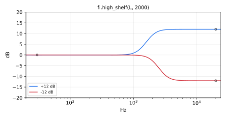

Default high shelf filter: 3rd-order Butterworth case of `fi.highshelf`
(`high_shelf = highshelf(3)`), boosting or cutting by `Lpi` dB between `fx`
and SR/2. `high_shelf` is a standard Faust function. See `fi.highshelf`
for the full documentation.

#### Usage

```
_ : high_shelf(Lpi,fx) : _
```

Where:

* `Lpi`: desired level (dB) between `fx` and SR/2 (boost `Lpi>0` or cut `Lpi<0`)
* `fx`: transition frequency in Hz

#### Test
```
fi = library("filters.lib");
os = library("oscillators.lib");
ba = library("basics.lib");
no = library("noises.lib");
ma = library("maths.lib");
src = os.tosc(440);
high_shelf_test = src : fi.high_shelf(6, 2000);
high_shelf_slider_test = no.noise : fi.high_shelf(hslider("Lpi", 6, -24, 24, 0.1), hslider("fc", 2000, 20, 20000, 1));
high_shelf_modulated_test = no.noise : fi.high_shelf(6, 20*pow(250, tri)) with { P = int(ma.SR/10); tri = 1 - abs(2*ba.period(P)/P - 1); };
high_shelf_jump_test = no.noise : fi.high_shelf(6, 20*pow(250, sq)) with { P = int(ma.SR/10); sq = ba.period(2*P) < P; };
```

----

### `(fi.)high_shelf1`

First-order high shelf filter, an optimized special case of
`fi.highshelf(1)`: boosts or cuts by `Lpi` dB between `fx` and SR/2.

#### Usage

```
_ : high_shelf1(Lpi,fx) : _
```

Where:

* `Lpi`: desired level (dB) between `fx` and SR/2 (boost `Lpi>0` or cut `Lpi<0`)
* `fx`: transition frequency in Hz

#### Test
```
fi = library("filters.lib");
os = library("oscillators.lib");
ba = library("basics.lib");
no = library("noises.lib");
ma = library("maths.lib");
src = os.tosc(440);
high_shelf1_test = fi.high_shelf1(6, 2000, src);
high_shelf1_slider_test = no.noise : fi.high_shelf1(hslider("Lpi", 6, -24, 24, 0.1), hslider("fc", 2000, 20, 20000, 1));
high_shelf1_modulated_test = no.noise : fi.high_shelf1(6, 20*pow(250, tri)) with { P = int(ma.SR/10); tri = 1 - abs(2*ba.period(P)/P - 1); };
high_shelf1_jump_test = no.noise : fi.high_shelf1(6, 20*pow(250, sq)) with { P = int(ma.SR/10); sq = ba.period(2*P) < P; };
```

----

### `(fi.)high_shelf1_l`

First-order high shelf filter like `fi.high_shelf1`, but taking a LINEAR
gain `Gpi` instead of a level in dB.

#### Usage

```
_ : high_shelf1_l(Gpi,fx) : _
```

Where:

* `Gpi`: desired linear gain between `fx` and SR/2
* `fx`: transition frequency in Hz

#### Test
```
fi = library("filters.lib");
os = library("oscillators.lib");
ba = library("basics.lib");
no = library("noises.lib");
ma = library("maths.lib");
src = os.tosc(440);
high_shelf1_l_test = fi.high_shelf1_l(2, 2000, src);
high_shelf1_l_slider_test = no.noise : fi.high_shelf1_l(hslider("Gpi", 2, 0, 16, 0.01), hslider("fc", 2000, 20, 20000, 1));
high_shelf1_l_modulated_test = no.noise : fi.high_shelf1_l(2, 20*pow(250, tri)) with { P = int(ma.SR/10); tri = 1 - abs(2*ba.period(P)/P - 1); };
high_shelf1_l_jump_test = no.noise : fi.high_shelf1_l(2, 20*pow(250, sq)) with { P = int(ma.SR/10); sq = ba.period(2*P) < P; };
```

----

### `(fi.)highshelf_other_freq`

Second corner frequency of a high shelf: given the shelf order `N`, level
`Lpi` and transition frequency `fx` of `fi.highshelf(N,Lpi,fx)`, returns
the frequency at which the response leaves 0 dB. This is a frequency
computation, not a filter.

#### Usage

```
highshelf_other_freq(N,Lpi,fx) : _
```

Where:

* `N`: shelf order (odd)
* `Lpi`: shelf level in dB
* `fx`: transition frequency in Hz

#### Test
```
fi = library("filters.lib");
ba = library("basics.lib");
ma = library("maths.lib");
highshelf_other_freq_test = fi.highshelf_other_freq(3, 6, 2000);
highshelf_other_freq_slider_test = fi.highshelf_other_freq(3, hslider("Lpi", 6, -24, 24, 0.1), hslider("fc", 2000, 20, 20000, 1));
highshelf_other_freq_modulated_test = fi.highshelf_other_freq(3, 6, 20*pow(250, tri)) with { P = int(ma.SR/10); tri = 1 - abs(2*ba.period(P)/P - 1); };
highshelf_other_freq_jump_test = fi.highshelf_other_freq(3, 6, 20*pow(250, sq)) with { P = int(ma.SR/10); sq = ba.period(2*P) < P; };
```

----

### `(fi.)peak_eq`

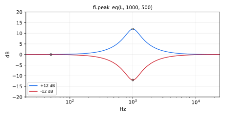

Second order "peaking equalizer" section (gain boost or cut near some frequency)
Also called a "parametric equalizer" section.
`peak_eq` is a standard Faust function.

#### Usage

```
_ : peak_eq(Lfx,fx,B) : _
```

Where:

* `Lfx`: level (dB) at fx (boost Lfx>0 or cut Lfx<0)
* `fx`: peak frequency (Hz), clamped to [0.001, 0.499*SR]: the bandwidth
  prewarping divides by `sin(2*PI*fx/SR)`, which is 0 at 0 and SR/2. As
  `fx` goes to 0, the peak becomes a shelf of level `Lfx` below about `B` Hz.
* `B`: bandwidth of the peak in Hz (B = fx/Q): the bandwidth of the
  resonance (boost) or anti-resonance (cut), which is the -3 dB bandwidth
  about fx when |Lfx| is large

#### Test
```
fi = library("filters.lib");
os = library("oscillators.lib");
ba = library("basics.lib");
no = library("noises.lib");
ma = library("maths.lib");
src = os.tosc(440);
peak_eq_test = src : fi.peak_eq(6, 1000, 200);
peak_eq_zero_freq_test = no.noise : fi.peak_eq(6, 1000*max(0, 1 - ba.time/12000) + 1000*(ba.time >= 24000), 100);
peak_eq_slider_test = no.noise : fi.peak_eq(hslider("Lfx", 6, -24, 24, 0.1), hslider("fc", 1000, 20, 20000, 1), hslider("B", 200, 1, 5000, 1));
peak_eq_modulated_test = no.noise : fi.peak_eq(6, fx, fx/5) with { P = int(ma.SR/10); tri = 1 - abs(2*ba.period(P)/P - 1); fx = 20*pow(250, tri); };
peak_eq_jump_test = no.noise : fi.peak_eq(6, fx, fx/5) with { P = int(ma.SR/10); sq = ba.period(2*P) < P; fx = 20*pow(250, sq); };
```

#### References

* See "Parametric Equalizers" above for references regarding `low_shelf`, `high_shelf`, and `peak_eq`.

----

### `(fi.)peak_eq_cq`

Constant-Q second order peaking equalizer section.

#### Usage

```
_ : peak_eq_cq(Lfx,fx,Q) : _
```

Where:

* `Lfx`: level (dB) at fx
* `fx`: boost or cut frequency (Hz)
* `Q`: "Quality factor" = fx/B where B = bandwidth of peak in Hz

#### Test
```
fi = library("filters.lib");
os = library("oscillators.lib");
ba = library("basics.lib");
no = library("noises.lib");
ma = library("maths.lib");
src = os.tosc(440);
peak_eq_cq_test = src : fi.peak_eq_cq(6, 1000, 4);
peak_eq_cq_slider_test = no.noise : fi.peak_eq_cq(hslider("Lfx", 6, -24, 24, 0.1), hslider("fc", 1000, 20, 20000, 1), hslider("Q", 4, 0.5, 20, 0.01));
peak_eq_cq_modulated_test = no.noise : fi.peak_eq_cq(6, 20*pow(250, tri), 4) with { P = int(ma.SR/10); tri = 1 - abs(2*ba.period(P)/P - 1); };
peak_eq_cq_jump_test = no.noise : fi.peak_eq_cq(6, 20*pow(250, sq), 4) with { P = int(ma.SR/10); sq = ba.period(2*P) < P; };
```

#### References

* See "Parametric Equalizers" above for references regarding `low_shelf`, `high_shelf`, and `peak_eq`.

----

### `(fi.)peak_eq_rm`

Regalia-Mitra second order peaking equalizer section:
`H(z) = (1 + A(z))/2 + K (1 - A(z))/2`, with `A(z)` the second order
allpass centered at `fx` and `K = 10^(Lfx/20)`. At `Lfx = 0` (K = 1) the
section is the identity.

#### Usage

```
_ : peak_eq_rm(Lfx,fx,tanPiBT) : _
```

Where:

* `Lfx`: level (dB) at fx
* `fx`: boost or cut frequency (Hz)
* `tanPiBT`: `tan(PI*B/SR)`, where B = -3dB bandwidth (Hz) when 10^(Lfx/20) = 0
        ~ PI*B/SR for narrow bandwidths B

#### Test
```
fi = library("filters.lib");
os = library("oscillators.lib");
ma = library("maths.lib");
ba = library("basics.lib");
no = library("noises.lib");
src = os.tosc(440);
peak_eq_rm_test = src : fi.peak_eq_rm(6, 1000, tan(ma.PI*200/ma.SR));
peak_eq_rm_slider_test = no.noise : fi.peak_eq_rm(hslider("Lfx", 6, -24, 24, 0.1), hslider("fc", 1000, 20, 20000, 1), tan(ma.PI*hslider("B", 200, 1, 5000, 1)/ma.SR));
peak_eq_rm_modulated_test = no.noise : fi.peak_eq_rm(6, fx, tan(ma.PI*fx/5/ma.SR)) with { P = int(ma.SR/10); tri = 1 - abs(2*ba.period(P)/P - 1); fx = 20*pow(250, tri); };
peak_eq_rm_unity_test = no.noise : fi.peak_eq_rm(0, 1000, tan(ma.PI*200/ma.SR));
```

#### References

P.A. Regalia, S.K. Mitra, and P.P. Vaidyanathan,
"The Digital All-Pass Filter: A Versatile Signal Processing Building Block"
Proceedings of the IEEE, 76(1):19-37, Jan. 1988.  (See pp. 29-30.)
See also "Parametric Equalizers" above for references on shelf
and peaking equalizers in general.

----

### `(fi.)spectral_tilt`

Spectral tilt filter, providing an arbitrary spectral rolloff factor
alpha in (-1,1), where
 -1 corresponds to one pole (-6 dB per octave), and
 +1 corresponds to one zero (+6 dB per octave).
In other words, alpha is the slope of the ln magnitude versus ln frequency.
For a "pinking filter" (e.g., to generate 1/f noise from white noise),
set alpha to -1/2.

#### Usage

```
_ : spectral_tilt(N,f0,bw,alpha) : _
```
Where:

* `N`: desired integer filter order, at least 2 (fixed at compile time)
* `f0`: lower frequency limit for desired roll-off band > 0
* `bw`: bandwidth of desired roll-off band
* `alpha`: slope of roll-off desired in nepers per neper,
        between -1 and 1 (ln mag / ln radian freq)

#### Test
```
fi = library("filters.lib");
os = library("oscillators.lib");
ba = library("basics.lib");
no = library("noises.lib");
ma = library("maths.lib");
src = os.tosc(440);
spectral_tilt_test = src : fi.spectral_tilt(4, 200, 2000, -0.5);
spectral_tilt_slider_test = no.noise : fi.spectral_tilt(4, hslider("f0", 200, 20, 2000, 1), hslider("bw", 2000, 100, 10000, 1), hslider("alpha", -0.5, -1, 1, 0.01));
spectral_tilt_modulated_test = no.noise : fi.spectral_tilt(4, 200, 2000, -1 + 2*tri) with { P = int(ma.SR/10); tri = 1 - abs(2*ba.period(P)/P - 1); };
spectral_tilt_jump_test = no.noise : fi.spectral_tilt(4, 200, 2000, -1 + 2*sq) with { P = int(ma.SR/10); sq = ba.period(2*P) < P; };
```

#### Example test program

See `dm.spectral_tilt_demo` and the documentation for `no.pink_noise`.

#### References

J.O. Smith and H.F. Smith,
"Closed Form Fractional Integration and Differentiation via Real Exponentially Spaced Pole-Zero Pairs",
arXiv.org publication arXiv:1606.06154 [cs.CE], June 7, 2016, [http://arxiv.org/abs/1606.06154](http://arxiv.org/abs/1606.06154)

----

### `(fi.)levelfilter`

Dynamic level lowpass filter.
`levelfilter` is a standard Faust function.

#### Usage

```
_ : levelfilter(L,freq) : _
```

Where:

* `L`: level, linear between 0 and 1 (not in dB: a negative value gives NaN):
  1 passes the input unchanged, smaller values lowpass it more. The gain is
  L^(4/3) at the Nyquist limit (SR/2), and 1 - L + L^(4/3) (within 1 dB of unity) at dc
* `freq`: corner frequency (-3dB point when L = 0) usually set to fundamental freq

See `levelfilterN` for N such filters in series.

#### Test
```
fi = library("filters.lib");
os = library("oscillators.lib");
ba = library("basics.lib");
no = library("noises.lib");
ma = library("maths.lib");
src = os.tosc(440);
levelfilter_test = fi.levelfilter(0.1, 200, src);
levelfilter_slider_test = fi.levelfilter(hslider("L", 0.1, 0, 1, 0.01), hslider("fc", 200, 20, 20000, 1), no.noise);
levelfilter_modulated_test = fi.levelfilter(0.1, 20*pow(250, tri), no.noise) with { P = int(ma.SR/10); tri = 1 - abs(2*ba.period(P)/P - 1); };
levelfilter_jump_test = fi.levelfilter(0.1, 20*pow(250, sq), no.noise) with { P = int(ma.SR/10); sq = ba.period(2*P) < P; };
levelfilter_dc_test = fi.levelfilter(0.1, 200, 1);
```

#### References

* [https://ccrma.stanford.edu/realsimple/faust_strings/Dynamic_Level_Lowpass_Filter.html](https://ccrma.stanford.edu/realsimple/faust_strings/Dynamic_Level_Lowpass_Filter.html)

----

### `(fi.)levelfilterN`

Dynamic level lowpass filter.

#### Usage

```
_ : levelfilterN(N,freq,L) : _
```

Where:

* `N`: number of `levelfilter` in series, each with the level `L^(1/N)`, a constant numerical expression
* `freq`: corner frequency of each `levelfilter`, usually set to fundamental freq
* `L`: level, linear between 0 and 1 (see `levelfilter`); the cascade has the
  same gain at the Nyquist limit as one `levelfilter`

#### Test
```
fi = library("filters.lib");
os = library("oscillators.lib");
ba = library("basics.lib");
no = library("noises.lib");
ma = library("maths.lib");
src = os.tosc(440);
levelfilterN_test = src : fi.levelfilterN(3, 200, 0.1);
levelfilterN_slider_test = no.noise : fi.levelfilterN(3, hslider("fc", 200, 20, 20000, 1), hslider("L", 0.1, 0, 1, 0.01));
levelfilterN_modulated_test = no.noise : fi.levelfilterN(3, 20*pow(250, tri), 0.1) with { P = int(ma.SR/10); tri = 1 - abs(2*ba.period(P)/P - 1); };
levelfilterN_jump_test = no.noise : fi.levelfilterN(3, 20*pow(250, sq), 0.1) with { P = int(ma.SR/10); sq = ba.period(2*P) < P; };
levelfilterN_nyquist_test = 1 - 2*ba.period(2) : fi.levelfilterN(3, 200, 0.1);
```

#### References

* [https://ccrma.stanford.edu/realsimple/faust_strings/Dynamic_Level_Lowpass_Filter.html](https://ccrma.stanford.edu/realsimple/faust_strings/Dynamic_Level_Lowpass_Filter.html)

## Mth-Octave Filter-Banks

Mth-octave filter-banks split the input signal into a bank of parallel signals, one
for each spectral band. They are related to the Mth-Octave Spectrum-Analyzers in
`analysis.lib`.
The documentation of this library contains more details about the implementation.
The parameters are:

* `M`: number of band-slices per octave (>=1), a constant numerical expression
* `N`: total number of bands (>2), a constant numerical expression
* `ftop`: upper bandlimit of the Mth-octave bands (<SR/2)

In addition to the Mth-octave output signals, there is a highpass signal
containing frequencies from ftop to SR/2, and a "dc band" lowpass signal
containing frequencies from 0 (dc) up to the start of the Mth-octave bands.
Thus, the N output signals are

```
highpass(ftop), MthOctaveBands(M,N-2,ftop), dcBand(ftop*2^(-(N-2)/M))
```

A Filter-Bank is defined here as a signal bandsplitter having the
property that summing its output signals gives an allpass-filtered
version of the filter-bank input signal.  A more conventional term for
this is an "allpass-complementary filter bank".  If the allpass filter
is a pure delay (and possible scaling), the filter bank is said to be
a "perfect-reconstruction filter bank" (see Vaidyanathan-1993 cited
below for details).  A "graphic equalizer", in which band signals
are scaled by gains and summed, should be based on a filter bank.

The filter-banks below are implemented as Butterworth or Elliptic
spectrum-analyzers followed by delay equalizers that make them
allpass-complementary.

#### Increasing Channel Isolation

Go to higher filter orders - see Regalia et al. or Vaidyanathan (cited
below) regarding the construction of more aggressive recursive
filter-banks using elliptic or Chebyshev prototype filters.

#### References

* "Tree-structured complementary filter banks using all-pass sections", Regalia et al., IEEE Trans. Circuits & Systems, CAS-34:1470-1484, Dec. 1987
* "Multirate Systems and Filter Banks", P. Vaidyanathan, Prentice-Hall, 1993
* Elementary filter theory: [https://ccrma.stanford.edu/~jos/filters/](https://ccrma.stanford.edu/~jos/filters/)

----

### `(fi.)mth_octave_filterbank[n]`, `(fi.)mth_octave_filterbank`

Allpass-complementary filter banks based on Butterworth band-splitting.
For Butterworth band-splits, the needed delay equalizer is easily found.
Sections whose crossover is at or above `tpt_df_fmin` (2304 Hz in single
precision, 0 in double) are direct form, the others trapezoidal: see
`mth_octave_filterbank_tpt_df`.

#### Usage

```
_ : mth_octave_filterbank(O,M,ftop,N) : par(i,N,_)     // Oth-order
_ : mth_octave_filterbank_alt(O,M,ftop,N) : par(i,N,_) // dc-inverted version
```

Also for convenience:

```
_ : mth_octave_filterbank3(M,ftop,N) : par(i,N,_) // 3rd-order Butterworth
_ : mth_octave_filterbank5(M,ftop,N) : par(i,N,_) // 5th-order Butterworth
mth_octave_filterbank_default = mth_octave_filterbank5;
```

Where:

* `O`: order of filter used to split each frequency band into two, a constant numerical expression
* `M`: number of band-slices per octave, a constant numerical expression
* `ftop`: highest band-split crossover frequency (e.g., 20 kHz)
* `N`: total number of bands (including dc and Nyquist), a constant numerical expression

#### Test
```
fi = library("filters.lib");
os = library("oscillators.lib");
sig = os.tosc(440);
mth_octave_filterbank_test = sig : fi.mth_octave_filterbank(3, 2, 8000, 2);
```

----

### `(fi.)mth_octave_filterbank_tpt_df`, `(fi.)mth_octave_filterbank_alt_tpt_df`

`mth_octave_filterbank` and `mth_octave_filterbank_alt` with an explicit
cutoff limit `L`, as `filterbank_tpt_df` is to `filterbank`:
`mth_octave_filterbank(O,M,ftop,N)` is
`mth_octave_filterbank_tpt_df(tpt_df_fmin,O,M,ftop,N)`, and likewise for
the `_alt` version (and so for `mth_octave_filterbank3`, `5` and
`_default`).

#### Usage

```
_ : mth_octave_filterbank_tpt_df(L,O,M,ftop,N) : par(i,N,_)
_ : mth_octave_filterbank_alt_tpt_df(L,O,M,ftop,N) : par(i,N,_)
```

Where:

* `L`: cutoff limit in Hz, usually `tpt_df_fmin`; `L <= 0` selects the
  direct form and `L >= ma.MAX` the trapezoidal form for every crossover
* `O`, `M`, `ftop`, `N`: as for `mth_octave_filterbank`

#### Test
```
fi = library("filters.lib");
no = library("noises.lib");
mth_octave_filterbank_tpt_df_test = no.noise : fi.mth_octave_filterbank_tpt_df(fi.tpt_df_fmin, 5, 1, 10000, 10);
mth_octave_filterbank_tpt_df_sum_test = no.noise : fi.mth_octave_filterbank_tpt_df(fi.tpt_df_fmin, 5, 1, 10000, 10) :> _;
mth_octave_filterbank_alt_tpt_df_test = no.noise : fi.mth_octave_filterbank_alt_tpt_df(fi.tpt_df_fmin, 3, 2, 8000, 10);
mth_octave_filterbank_alt_tpt_df_sum_test = no.noise : fi.mth_octave_filterbank_alt_tpt_df(fi.tpt_df_fmin, 5, 2, 8000, 10) :> _;
```

----

### `(fi.)mth_octave_filterbank_alt`


#### Usage

```
_ : mth_octave_filterbank_alt(O,M,ftop,N) : par(i,N,_)
```

Where:

* `O`: filter order used to split each band
* `M`: number of band-slices per octave
* `ftop`: highest band-split crossover frequency
* `N`: total number of bands

#### Test
```
fi = library("filters.lib");
os = library("oscillators.lib");
no = library("noises.lib");
sig = os.tosc(440);
mth_octave_filterbank_alt_test = sig : fi.mth_octave_filterbank_alt(3, 2, 8000, 2);
mth_octave_filterbank_alt_bands_test = sig : fi.mth_octave_filterbank_alt(3, 2, 8000, 5);
mth_octave_filterbank_alt_o5_sum_test = no.noise : fi.mth_octave_filterbank_alt(5, 2, 8000, 5) :> _;
```

----

### `(fi.)mth_octave_filterbank3`


#### Usage

```
_ : mth_octave_filterbank3(M,ftop,N) : par(i,N,_)
```

Where:

* `M`: number of band-slices per octave
* `ftop`: highest band-split crossover frequency
* `N`: total number of bands

#### Test
```
fi = library("filters.lib");
os = library("oscillators.lib");
sig = os.tosc(440);
mth_octave_filterbank3_test = sig : fi.mth_octave_filterbank3(2, 8000, 2);
mth_octave_filterbank3_bands_test = sig : fi.mth_octave_filterbank3(2, 8000, 5);
```

----

### `(fi.)mth_octave_filterbank5`


#### Usage

```
_ : mth_octave_filterbank5(M,ftop,N) : par(i,N,_)
```

Where:

* `M`: number of band-slices per octave
* `ftop`: highest band-split crossover frequency
* `N`: total number of bands

#### Test
```
fi = library("filters.lib");
os = library("oscillators.lib");
sig = os.tosc(440);
mth_octave_filterbank5_test = sig : fi.mth_octave_filterbank5(2, 8000, 2);
```

----

### `(fi.)mth_octave_filterbank_default`

Default Mth-octave filter bank: the 5th-order Butterworth case of
`fi.mth_octave_filterbank` (`mth_octave_filterbank_default =
mth_octave_filterbank5`). See `fi.mth_octave_filterbank[n]` for the full
documentation.

#### Usage

```
_ : mth_octave_filterbank_default(M,ftop,N) : par(i,N,_)
```

Where:

* `M`: number of band-slices per octave (a constant numerical expression)
* `ftop`: highest band-split crossover frequency in Hz
* `N`: total number of bands, including dc and Nyquist (a constant numerical expression)

#### Test
```
fi = library("filters.lib");
os = library("oscillators.lib");
sig = os.tosc(440);
mth_octave_filterbank_default_test = sig : fi.mth_octave_filterbank_default(2, 8000, 2);
```

## Arbitrary-Crossover Filter-Banks and Spectrum Analyzers

These are similar to the Mth-octave analyzers above, except that the
band-split frequencies are passed explicitly as arguments.

----

### `(fi.)filterbank`

Filter bank.
`filterbank` is a standard Faust function.
Sections whose crossover is at or above `tpt_df_fmin` (2304 Hz in single
precision, 0 in double) are direct form, the others trapezoidal: see
`filterbank_tpt_df`.

#### Usage

```
_ : filterbank(O,freqs) : par(i,ba.count(freqs)+1,_) // Butterworth band-splits
```

Where:

* `O`: band-split filter order (odd integer required for filterbank[i], a constant numerical expression)
* `freqs`: (fc1,fc2,...,fcNs) [in numerically ascending order], where
          Ns=N-1 is the number of octave band-splits
          (total number of bands N=Ns+1, the number of outputs).

If frequencies are listed explicitly as arguments, enclose them in parens:

```
_ : filterbank(3,(fc1,fc2)) : _,_,_
```

#### Test
```
fi = library("filters.lib");
os = library("oscillators.lib");
src = os.tosc(440);
filterbank_test = src : fi.filterbank(3, (500, 2000));
```

----

### `(fi.)filterbank_tpt_df`

`filterbank` with an explicit cutoff limit `L`: the band splits and delay
equalizers whose crossover is below `L` use trapezoidal sections, the
others the cheaper direct-form sections (`lowpass_tpt_df`,
`highpass_plus_lowpass_tpt_df`). `filterbank(O,freqs)` is
`filterbank_tpt_df(tpt_df_fmin,O,freqs)`: trapezoidal below 2304 Hz in
single precision, direct form everywhere in double precision. Each
section is compiled in one form only when its crossover is a constant;
for crossovers that vary (sliders), pass `L = ma.MAX` (trapezoidal) or
`L = 0` (direct form), or both forms run.

#### Usage

```
_ : filterbank_tpt_df(L,O,freqs) : par(i,ba.count(freqs)+1,_)
```

Where:

* `L`: cutoff limit in Hz, usually `tpt_df_fmin`; `L <= 0` selects the
  direct form and `L >= ma.MAX` the trapezoidal form for every crossover
* `O`, `freqs`: as for `filterbank`

#### Test
```
fi = library("filters.lib");
no = library("noises.lib");
ba = library("basics.lib");
ma = library("maths.lib");
filterbank_tpt_df_test = no.noise : fi.filterbank_tpt_df(fi.tpt_df_fmin, 3, (50, 500, 4000));
filterbank_tpt_df_o5_sum_test = no.noise : fi.filterbank_tpt_df(fi.tpt_df_fmin, 5, (50, 500, 4000)) :> _;
filterbank_tpt_df_slider_test = no.noise : fi.filterbank_tpt_df(fi.tpt_df_fmin, 3, (hslider("f1", 500, 20, 10000, 1), hslider("f2", 4000, 20, 20000, 1)));
filterbank_tpt_df_modulated_test = no.noise : fi.filterbank_tpt_df(0, 3, (f1, 4*f1)) with { P = int(ma.SR/10); tri = 1 - abs(2*ba.period(P)/P - 1); f1 = 2500*pow(2, tri); };
filterbank_tpt_df_jump_test = no.noise : fi.filterbank_tpt_df(ma.MAX, 3, (f1, 4*f1)) with { P = int(ma.SR/10); sq = ba.period(2*P) < P; f1 = 100*pow(10, sq); };
```

----

### `(fi.)filterbanki`

Inverted-dc filter bank.
Sections whose crossover is at or above `tpt_df_fmin` (2304 Hz in single
precision, 0 in double) are direct form, the others trapezoidal: see
`filterbanki_tpt_df`.

#### Usage

```
_ : filterbanki(O,freqs) : par(i,ba.count(freqs)+1,_) // Inverted-dc version
```

Where:

* `O`: band-split filter order (odd integer required for `filterbank[i]`, a constant numerical expression)
* `freqs`: (fc1,fc2,...,fcNs) [in numerically ascending order], where
          Ns=N-1 is the number of octave band-splits
          (total number of bands N=Ns+1, the number of outputs).

If frequencies are listed explicitly as arguments, enclose them in parens:

```
_ : filterbanki(3,(fc1,fc2)) : _,_,_
```

#### Test
```
fi = library("filters.lib");
os = library("oscillators.lib");
no = library("noises.lib");
src = os.tosc(440);
filterbanki_test = src : fi.filterbanki(3, (500, 2000));
filterbanki_o5_sum_test = no.noise : fi.filterbanki(5, (500, 1000, 2000)) :> _;
```

----

### `(fi.)filterbanki_tpt_df`

`filterbanki` with an explicit cutoff limit `L`, as `filterbank_tpt_df`
is to `filterbank`: `filterbanki(O,freqs)` is
`filterbanki_tpt_df(tpt_df_fmin,O,freqs)`.

#### Usage

```
_ : filterbanki_tpt_df(L,O,freqs) : par(i,ba.count(freqs)+1,_)
```

Where:

* `L`: cutoff limit in Hz, usually `tpt_df_fmin`; `L <= 0` selects the
  direct form and `L >= ma.MAX` the trapezoidal form for every crossover
* `O`, `freqs`: as for `filterbanki`

#### Test
```
fi = library("filters.lib");
no = library("noises.lib");
ba = library("basics.lib");
ma = library("maths.lib");
filterbanki_tpt_df_test = no.noise : fi.filterbanki_tpt_df(fi.tpt_df_fmin, 3, (50, 500, 4000));
filterbanki_tpt_df_o5_sum_test = no.noise : fi.filterbanki_tpt_df(fi.tpt_df_fmin, 5, (50, 500, 4000)) :> _;
filterbanki_tpt_df_slider_test = no.noise : fi.filterbanki_tpt_df(fi.tpt_df_fmin, 3, (hslider("f1", 500, 20, 10000, 1), hslider("f2", 4000, 20, 20000, 1)));
filterbanki_tpt_df_modulated_test = no.noise : fi.filterbanki_tpt_df(0, 3, (f1, 4*f1)) with { P = int(ma.SR/10); tri = 1 - abs(2*ba.period(P)/P - 1); f1 = 2500*pow(2, tri); };
filterbanki_tpt_df_jump_test = no.noise : fi.filterbanki_tpt_df(ma.MAX, 3, (f1, 4*f1)) with { P = int(ma.SR/10); sq = ba.period(2*P) < P; f1 = 100*pow(10, sq); };
```

## State Variable Filters

#### References

* Solving the continuous SVF equations using trapezoidal integration
* [https://cytomic.com/files/dsp/SvfLinearTrapOptimised2.pdf](https://cytomic.com/files/dsp/SvfLinearTrapOptimised2.pdf)

----

### `(fi.)svf`

An environment with `lp`, `bp`, `hp`, `notch`, `peak`, `ap`, `bell`, `ls`, `hs` SVF based filters.
All filters have `freq` and `Q` parameters, the `bell`, `ls`, `hs` ones also have a `gain` third parameter.

#### Usage

```
_ : svf.lp(freq, Q) : _
_ : svf.bp(freq, Q) : _
_ : svf.hp(freq, Q) : _
_ : svf.notch(freq, Q) : _
_ : svf.peak(freq, Q) : _
_ : svf.ap(freq, Q) : _
_ : svf.bell(freq, Q, gain) : _
_ : svf.ls(freq, Q, gain) : _
_ : svf.hs(freq, Q, gain) : _
```

Where:

* `freq`: cut frequency in Hz, clamped to [0, 0.499*SR]: 0 holds the
  filter's states (see the section
  [Digital Filter Sections Specified as Analog Filter Sections](#digital-filter-sections-specified-as-analog-filter-sections))
* `Q`: quality factor
* `gain`: gain in dB (`bell`, `ls` and `hs` only)

#### Method

Andrew Simper's trapezoidal state-variable filter: the bilinear transform
of the analog state-variable filter, prewarped at `freq`, whose outputs
are mixed into the nine responses. The delay-free loop is solved for the
highpass first, so that each state is updated by adding a small
increment. Solving it for the bandpass first, as in Simper's listings,
multiplies a state by `1/(1 + g*(g+k))`, close to 1 at a low cutoff, and
loses more than two digits of the damping in single precision: a 20 Hz
lowpass with `Q` = 10 at 192 kHz was 8.8e-4 off its double-precision
output, and is now 3.7e-6 off. See the section
[Digital Filter Sections Specified as Analog Filter Sections](#digital-filter-sections-specified-as-analog-filter-sections)
and [https://ccrma.stanford.edu/~jos/svf/Numerical_Precision_Low_Corner.html](https://ccrma.stanford.edu/~jos/svf/Numerical_Precision_Low_Corner.html).

#### Test
```
fi = library("filters.lib");
os = library("oscillators.lib");
ba = library("basics.lib");
no = library("noises.lib");
ma = library("maths.lib");
sig = os.tosc(440);
svf_lp_test = fi.svf.lp(1000, 0.707, sig);
svf_lp_lowfc_test = no.noise : fi.svf.lp(5, 10);
svf_bp_lowfc_test = no.noise : fi.svf.bp(20, 30);
svf_nyquist_test = no.noise : fi.svf.lp(0.6*ma.SR, 1);
svf_slider_test = no.noise : fi.svf.bell(hslider("fc", 1000, 20, 20000, 1), hslider("Q", 0.707, 0.5, 20, 0.01), hslider("gain", 6, -24, 24, 0.1));
svf_modulated_test = no.noise : fi.svf.lp(20*pow(250, tri), 0.707) with { P = int(ma.SR/10); tri = 1 - abs(2*ba.period(P)/P - 1); };
svf_jump_test = no.noise : fi.svf.lp(20*pow(250, sq), 0.707) with { P = int(ma.SR/10); sq = ba.period(2*P) < P; };
svf_bp_test = fi.svf.bp(1000, 0.707, sig);
svf_hp_test = fi.svf.hp(1000, 0.707, sig);
svf_notch_test = fi.svf.notch(1000, 0.707, sig);
svf_peak_test = fi.svf.peak(1000, 0.707, sig);
svf_ap_test = fi.svf.ap(1000, 0.707, sig);
svf_bell_test = fi.svf.bell(1000, 0.707, 6, sig);
svf_ls_test = fi.svf.ls(500, 0.707, 6, sig);
svf_hs_test = fi.svf.hs(3000, 0.707, 6, sig);
```

----

### `(fi.)svf_morph`

An SVF-based filter that can smoothly morph between
being lowpass, bandpass, and highpass.

#### Usage

```
_ : svf_morph(freq, Q, blend) : _
```

Where:

* `freq`: cutoff frequency
* `Q`: quality factor
* `blend`: [0..2] continuous, where 0 is `lowpass`, 1 is `bandpass`, and 2 is `highpass`. For performance, the value is not clamped to [0..2].

#### Test
```
fi = library("filters.lib");
os = library("oscillators.lib");
ba = library("basics.lib");
no = library("noises.lib");
ma = library("maths.lib");
sig = os.tosc(440);
svf_morph_test = fi.svf_morph(1000, 0.707, 1, sig);
svf_morph_slider_test = fi.svf_morph(hslider("fc", 1000, 20, 20000, 1), hslider("Q", 0.707, 0.5, 20, 0.01), hslider("blend", 1, 0, 2, 0.01), no.noise);
svf_morph_modulated_test = fi.svf_morph(20*pow(250, tri), 0.707, 2*tri, no.noise) with { P = int(ma.SR/10); tri = 1 - abs(2*ba.period(P)/P - 1); };
svf_morph_jump_test = fi.svf_morph(20*pow(250, sq), 0.707, 2*sq, no.noise) with { P = int(ma.SR/10); sq = ba.period(2*P) < P; };
```

#### Example test program

```
process = no.noise : svf_morph(freq, q, blend)
with {
  blend = hslider("Blend", 0, 0, 2, .01) : si.smoo;
  q = hslider("Q", 1, 0.1, 10, .01) : si.smoo;
  freq = hslider("freq", 5000, 100, 18000, 1) : si.smoo;
};
```

#### References

* [https://github.com/mtytel/vital/blob/636ca0ef517a4db087a6a08a6a8a5e704e21f836/src/synthesis/filters/digital_svf.cpp#L292-L295](https://github.com/mtytel/vital/blob/636ca0ef517a4db087a6a08a6a8a5e704e21f836/src/synthesis/filters/digital_svf.cpp#L292-L295)

----

### `(fi.)svf_notch_morph`

An SVF-based notch-filter that can smoothly morph between
being lowpass, notch, and highpass.

#### Usage

```
_ : svf_notch_morph(freq, Q, blend) : _
```

Where:

* `freq`: cutoff frequency
* `Q`: quality factor
* `blend`: [0..2] continuous, where 0 is `lowpass`, 1 is `notch`, and 2 is `highpass`. For performance, the value is not clamped to [0..2].

#### Test
```
fi = library("filters.lib");
os = library("oscillators.lib");
ba = library("basics.lib");
no = library("noises.lib");
ma = library("maths.lib");
sig = os.tosc(440);
svf_notch_morph_test = fi.svf_notch_morph(1000, 0.707, 1, sig);
svf_notch_morph_slider_test = fi.svf_notch_morph(hslider("fc", 1000, 20, 20000, 1), hslider("Q", 0.707, 0.5, 20, 0.01), hslider("blend", 1, 0, 2, 0.01), no.noise);
svf_notch_morph_modulated_test = fi.svf_notch_morph(20*pow(250, tri), 0.707, 2*tri, no.noise) with { P = int(ma.SR/10); tri = 1 - abs(2*ba.period(P)/P - 1); };
svf_notch_morph_jump_test = fi.svf_notch_morph(20*pow(250, sq), 0.707, 2*sq, no.noise) with { P = int(ma.SR/10); sq = ba.period(2*P) < P; };
```

#### Example test program

```
process = no.noise : svf_notch_morph(freq, q, blend)
with {
  blend = hslider("Blend", 0, 0, 2, .01) : si.smoo;
  q = hslider("Q", 1, 0.1, 10, .01) : si.smoo;
  freq = hslider("freq", 5000, 100, 18000, 1) : si.smoo;
};
```

#### References

* [https://github.com/mtytel/vital/blob/636ca0ef517a4db087a6a08a6a8a5e704e21f836/src/synthesis/filters/digital_svf.cpp#L256C36-L263](https://github.com/mtytel/vital/blob/636ca0ef517a4db087a6a08a6a8a5e704e21f836/src/synthesis/filters/digital_svf.cpp#L256C36-L263)

----

### `(fi.)SVFTPT`


Topology-preserving transform implementation following Zavalishin's method.

Outputs: lowpass, highpass, bandpass, normalised bandpass, notch, allpass, 
peaking.

Each individual output can be recalled with its name in the environment as in:
     `SVFTPT.LP2(1000.0, .707)`.

The 7 outputs can be recalled by using `SVF` name as in:
     `SVFTPT.SVF(1000.0, .707)`.

Even though the implementation is different, the characteristics of this
filter are comparable to those of the `svf` environment in this library.

#### Usage:

```
_ : SVFTPT.SVF(CF, Q) : si.bus(7)
_ : SVFTPT.LP2(CF, Q) : _
_ : SVFTPT.HP2(CF, Q) : _
_ : SVFTPT.BP2(CF, Q) : _
_ : SVFTPT.BP2Norm(CF, Q) : _
_ : SVFTPT.Notch2(CF, Q) : _
_ : SVFTPT.AP2(CF, Q) : _
_ : SVFTPT.Peaking2(CF, Q) : _
```

Where:

* `CF`: cutoff in Hz
* `Q`: resonance

#### Test
```
fi = library("filters.lib");
os = library("oscillators.lib");
ba = library("basics.lib");
no = library("noises.lib");
ma = library("maths.lib");
sig = os.tosc(440);
SVFTPT_SVF_test = fi.SVFTPT.SVF(1000, 0.707, sig);
SVFTPT_slider_test = fi.SVFTPT.SVF(hslider("fc", 1000, 20, 20000, 1), hslider("Q", 0.707, 0.5, 20, 0.01), no.noise);
SVFTPT_modulated_test = fi.SVFTPT.SVF(20*pow(250, tri), 0.707, no.noise) with { P = int(ma.SR/10); tri = 1 - abs(2*ba.period(P)/P - 1); };
SVFTPT_jump_test = fi.SVFTPT.SVF(20*pow(250, sq), 0.707, no.noise) with { P = int(ma.SR/10); sq = ba.period(2*P) < P; };
SVFTPT_LP2_test = fi.SVFTPT.LP2(1000, 0.707, sig);
SVFTPT_HP2_test = fi.SVFTPT.HP2(1000, 0.707, sig);
SVFTPT_BP2_test = fi.SVFTPT.BP2(1000, 0.707, sig);
SVFTPT_BP2Norm_test = fi.SVFTPT.BP2Norm(1000, 0.707, sig);
SVFTPT_Notch2_test = fi.SVFTPT.Notch2(1000, 0.707, sig);
SVFTPT_AP2_test = fi.SVFTPT.AP2(1000, 0.707, sig);
SVFTPT_Peaking2_test = fi.SVFTPT.Peaking2(1000, 0.707, sig);
```

----

### `(fi.)dynamicSmoothing`


Adaptive smoother based on Andy Simper's paper.

This filter uses both the lowpass and bandpass outputs of a 
state-variable filter. The lowpass is used to smooth out the input signal,
the bandpass, which is a smoothed out version of the highpass, provides
information on the rate of change of the input. Hence, the bandpass signal
can be used to adjust the cutoff of the filter to quickly follow the input's
fast and large variations while effectively filtering out local 
perturbations.

This implementation does not use an approximation for the CF computation,
and it deploys guards to prevent overshooting with extreme sensitivity 
values.

#### Usage:

```
_ : dynamicSmoothing(sensitivity, baseCF) : _
```

Where:

* `sensitivity`: sensitivity to changes in the input signal.
     The range is, theoretically, from 0 to INF, though anything between
     0.0 and 1.0 should be reasonable
* `baseCF`: cutoff frequency, in Hz, when there is no variation in the 
     input signal

#### Test
```
fi = library("filters.lib");
os = library("oscillators.lib");
ba = library("basics.lib");
no = library("noises.lib");
ma = library("maths.lib");
sig = os.tosc(440);
dynamicSmoothing_test = fi.dynamicSmoothing(0.5, 500, sig);
dynamicSmoothing_slider_test = fi.dynamicSmoothing(hslider("sensitivity", 0.5, 0, 1, 0.01), hslider("fc", 500, 20, 20000, 1), no.noise);
dynamicSmoothing_modulated_test = fi.dynamicSmoothing(0.5, 20*pow(250, tri), no.noise) with { P = int(ma.SR/10); tri = 1 - abs(2*ba.period(P)/P - 1); };
dynamicSmoothing_jump_test = fi.dynamicSmoothing(0.5, 20*pow(250, sq), no.noise) with { P = int(ma.SR/10); sq = ba.period(2*P) < P; };
```

#### References

* [https://cytomic.com/files/dsp/DynamicSmoothing.pdf](https://cytomic.com/files/dsp/DynamicSmoothing.pdf)

----

### `(fi.)oneEuro`

The One Euro Filter (1€ Filter) is an adaptive lowpass filter.
This kind of filter is commonly used in object-tracking,
not necessarily audio processing.

#### Usage

```
_ : oneEuro(derivativeCutoff, beta, minCutoff) : _
```

Where:

* `derivativeCutoff`: Used to filter the first derivative of the input. 1 Hz is a good default.
* `beta`: "Speed" parameter where higher values reduce latency.
* `minCutoff`: Minimum cutoff frequency in Hz. Lower values remove more jitter.

#### Test
```
fi = library("filters.lib");
os = library("oscillators.lib");
ba = library("basics.lib");
no = library("noises.lib");
ma = library("maths.lib");
sig = os.tosc(440);
oneEuro_test = sig : fi.oneEuro(1, 0.5, 5);
oneEuro_slider_test = no.noise : fi.oneEuro(hslider("derivativeCutoff", 1, 0.1, 10, 0.1), hslider("beta", 0.5, 0, 1, 0.01), hslider("minCutoff", 5, 0.1, 50, 0.1));
oneEuro_modulated_test = no.noise : fi.oneEuro(1, 0.5, pow(50, tri)) with { P = int(ma.SR/10); tri = 1 - abs(2*ba.period(P)/P - 1); };
oneEuro_jump_test = no.noise : fi.oneEuro(1, 0.5, pow(50, sq)) with { P = int(ma.SR/10); sq = ba.period(2*P) < P; };
```

#### References

* [https://gery.casiez.net/1euro/](https://gery.casiez.net/1euro/)

## Linkwitz-Riley 4th-order 2-way, 3-way, and 4-way crossovers


The Linkwitz-Riley (LR) crossovers are designed to produce a fully-flat
magnitude response when their outputs are combined. The 4th-order
LR filters (LR4) have a 24dB/octave slope and they are rather popular audio
crossovers used in multi-band processing.

The LR4 can be constructed by cascading two second-order Butterworth
filters. For the second-order Butterworth filters, we will use the SVF
filter implemented above by setting the Q-factor to 1.0 / sqrt(2.0).
These will be cascaded in pairs to build the LR4 highpass and lowpass.
For the phase correction, we will use the 2nd-order Butterworth allpass.

#### References

Zavalishin, Vadim. "The art of VA filter design." Native Instruments, Berlin, Germany (2012).

----

### `(fi.)lowpassLR4`

4th-order Linkwitz-Riley lowpass.

#### Usage

```
_ : lowpassLR4(cf) : _
```

Where:

* `cf`: lowpass cutoff in Hz

#### Test
```
fi = library("filters.lib");
os = library("oscillators.lib");
ba = library("basics.lib");
no = library("noises.lib");
ma = library("maths.lib");
src = os.tosc(440);
lowpassLR4_test = src : fi.lowpassLR4(1000);
lowpassLR4_slider_test = no.noise : fi.lowpassLR4(hslider("fc", 1000, 20, 20000, 1));
lowpassLR4_modulated_test = no.noise : fi.lowpassLR4(20*pow(250, tri)) with { P = int(ma.SR/10); tri = 1 - abs(2*ba.period(P)/P - 1); };
lowpassLR4_jump_test = no.noise : fi.lowpassLR4(20*pow(250, sq)) with { P = int(ma.SR/10); sq = ba.period(2*P) < P; };
```

----

### `(fi.)highpassLR4`

4th-order Linkwitz-Riley highpass.

#### Usage

```
_ : highpassLR4(cf) : _
```

Where:

* `cf`: highpass cutoff in Hz

#### Test
```
fi = library("filters.lib");
os = library("oscillators.lib");
ba = library("basics.lib");
no = library("noises.lib");
ma = library("maths.lib");
src = os.tosc(440);
highpassLR4_test = src : fi.highpassLR4(1000);
highpassLR4_slider_test = no.noise : fi.highpassLR4(hslider("fc", 1000, 20, 20000, 1));
highpassLR4_modulated_test = no.noise : fi.highpassLR4(20*pow(250, tri)) with { P = int(ma.SR/10); tri = 1 - abs(2*ba.period(P)/P - 1); };
highpassLR4_jump_test = no.noise : fi.highpassLR4(20*pow(250, sq)) with { P = int(ma.SR/10); sq = ba.period(2*P) < P; };
```

----

### `(fi.)crossover2LR4`

Two-way 4th-order Linkwitz-Riley crossover.

#### Usage

```
_ : crossover2LR4(cf) : si.bus(2)
```

Where:

* `cf`: crossover split cutoff in Hz

#### Test
```
fi = library("filters.lib");
os = library("oscillators.lib");
ba = library("basics.lib");
no = library("noises.lib");
ma = library("maths.lib");
src = os.tosc(440);
crossover2LR4_test = src : fi.crossover2LR4(1000);
crossover2LR4_slider_test = no.noise : fi.crossover2LR4(hslider("fc", 1000, 20, 20000, 1));
crossover2LR4_modulated_test = no.noise : fi.crossover2LR4(20*pow(250, tri)) with { P = int(ma.SR/10); tri = 1 - abs(2*ba.period(P)/P - 1); };
crossover2LR4_jump_test = no.noise : fi.crossover2LR4(20*pow(250, sq)) with { P = int(ma.SR/10); sq = ba.period(2*P) < P; };
```

----

### `(fi.)crossover3LR4`

Three-way 4th-order Linkwitz-Riley crossover.

#### Usage

```
_ : crossover3LR4(cf1, cf2) : si.bus(3)
```

Where:

* `cf1`: crossover lower split cutoff in Hz
* `cf2`: crossover upper split cutoff in Hz

#### Test
```
fi = library("filters.lib");
os = library("oscillators.lib");
ba = library("basics.lib");
no = library("noises.lib");
ma = library("maths.lib");
src = os.tosc(440);
crossover3LR4_test = src : fi.crossover3LR4(500, 2000);
crossover3LR4_slider_test = no.noise : fi.crossover3LR4(hslider("cf1", 500, 20, 20000, 1), hslider("cf2", 2000, 20, 20000, 1));
crossover3LR4_modulated_test = no.noise : fi.crossover3LR4(cf, 4*cf) with { P = int(ma.SR/10); tri = 1 - abs(2*ba.period(P)/P - 1); cf = 20*pow(60, tri); };
crossover3LR4_jump_test = no.noise : fi.crossover3LR4(cf, 4*cf) with { P = int(ma.SR/10); sq = ba.period(2*P) < P; cf = 20*pow(60, sq); };
```

----

### `(fi.)crossover4LR4`

Four-way 4th-order Linkwitz-Riley crossover.

#### Usage

```
_ : crossover4LR4(cf1, cf2, cf3) : si.bus(4)
```

Where:

* `cf1`: crossover lower split cutoff in Hz
* `cf2`: crossover mid split cutoff in Hz
* `cf3`: crossover upper split cutoff in Hz

#### Test
```
fi = library("filters.lib");
os = library("oscillators.lib");
ba = library("basics.lib");
no = library("noises.lib");
ma = library("maths.lib");
src = os.tosc(440);
crossover4LR4_test = src : fi.crossover4LR4(300, 1000, 3000);
crossover4LR4_slider_test = no.noise : fi.crossover4LR4(hslider("cf1", 300, 20, 20000, 1), hslider("cf2", 1000, 20, 20000, 1), hslider("cf3", 3000, 20, 20000, 1));
crossover4LR4_modulated_test = no.noise : fi.crossover4LR4(cf, 3*cf, 9*cf) with { P = int(ma.SR/10); tri = 1 - abs(2*ba.period(P)/P - 1); cf = 20*pow(25, tri); };
crossover4LR4_jump_test = no.noise : fi.crossover4LR4(cf, 3*cf, 9*cf) with { P = int(ma.SR/10); sq = ba.period(2*P) < P; cf = 20*pow(25, sq); };
```

----

### `(fi.)crossover8LR4`

Eight-way 4th-order Linkwitz-Riley crossover.

#### Usage

```
_ : crossover8LR4(cf1, cf2, cf3, cf4, cf5, cf6, cf7) : si.bus(8)
```

Where:

* `cf1`: lowest crossover cutoff frequency in Hz
* `cf2`: second crossover cutoff frequency in Hz
* `cf3`: third crossover cutoff frequency in Hz
* `cf4`: fourth crossover cutoff frequency in Hz
* `cf5`: fifth crossover cutoff frequency in Hz
* `cf6`: sixth crossover cutoff frequency in Hz
* `cf7`: highest crossover cutoff frequency in Hz

#### Test
```
fi = library("filters.lib");
os = library("oscillators.lib");
ba = library("basics.lib");
no = library("noises.lib");
ma = library("maths.lib");
src = os.tosc(440);
crossover8LR4_test = src : fi.crossover8LR4(100, 200, 400, 800, 1600, 3200, 6400);
crossover8LR4_slider_test = no.noise : fi.crossover8LR4(hslider("cf1", 100, 20, 20000, 1), hslider("cf2", 200, 20, 20000, 1), hslider("cf3", 400, 20, 20000, 1), hslider("cf4", 800, 20, 20000, 1), hslider("cf5", 1600, 20, 20000, 1), hslider("cf6", 3200, 20, 20000, 1), hslider("cf7", 6400, 20, 20000, 1));
crossover8LR4_modulated_test = no.noise : fi.crossover8LR4(cf, 2*cf, 4*cf, 8*cf, 16*cf, 32*cf, 64*cf) with { P = int(ma.SR/10); tri = 1 - abs(2*ba.period(P)/P - 1); cf = 20*pow(4, tri); };
crossover8LR4_jump_test = no.noise : fi.crossover8LR4(cf, 2*cf, 4*cf, 8*cf, 16*cf, 32*cf, 64*cf) with { P = int(ma.SR/10); sq = ba.period(2*P) < P; cf = 20*pow(4, sq); };
```

##  Standardized Filters 


----

### `(fi.)itu_r_bs_1770_4_kfilter`

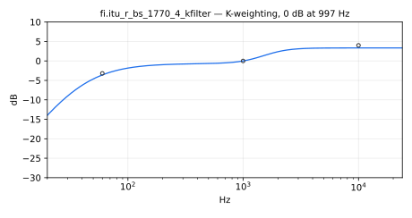

The prefilter from Recommendation ITU-R BS.1770-4 for loudness
measurement. Also known as "K-filter". The recommendation defines
biquad filter coefficients for a fixed sample rate of 48kHz (page
4-5). Here, we construct biquads for arbitrary samplerates.  The
resulting filter is normalized, such that the magnitude at 997Hz is
unity gain 1.0.

Please note, the ITU-recommendation handles the normalization in
equation (2) by subtracting 0.691dB, which is not needed with
`itu_r_bs_1770_4_kfilter`.

One option for future improvement might be, to round those filter
coefficients, that are almost equal to one. Second, the maximum
magnitude difference at 48kHz between the ITU-defined filter and
`itu_r_bs_1770_4_kfilter` is 0.001dB, which obviously could be
less.

#### Usage

```
_ : itu_r_bs_1770_4_kfilter : _
```

#### Test
```
fi = library("filters.lib");
os = library("oscillators.lib");
src = os.tosc(440);
itu_r_bs_1770_4_kfilter_test = src : fi.itu_r_bs_1770_4_kfilter;
```

#### References

* [https://www.itu.int/rec/R-REC-BS.1770](https://www.itu.int/rec/R-REC-BS.1770)
* [https://gist.github.com/jkbd/07521a98f7873a2dc3dbe16417930791](https://gist.github.com/jkbd/07521a98f7873a2dc3dbe16417930791)

## Averaging Functions


----

### `(fi.)avg_rect`

Moving average.

#### Usage

```
_ : avg_rect(period) : _
```

Where:

* `period`: averaging frame duration in seconds

#### Test
```
fi = library("filters.lib");
ba = library("basics.lib");
no = library("noises.lib");
ma = library("maths.lib");
avg_rect_test = no.noise : fi.avg_rect(0.01);
avg_rect_slider_test = no.noise : fi.avg_rect(hslider("period", 0.01, 0.001, 0.1, 0.001));
avg_rect_modulated_test = no.noise : fi.avg_rect(0.001 + 0.019*tri) with { P = int(ma.SR/10); tri = 1 - abs(2*ba.period(P)/P - 1) : max(0) : min(1); };
avg_rect_jump_test = no.noise : fi.avg_rect(0.001 + 0.019*sq) with { P = int(ma.SR/10); sq = ba.period(2*P) < P; };
```


----

### `(fi.)avg_tau`

Averaging function based on a one-pole filter and the tau response time.
Tau represents the effective length of the one-pole impulse response,
that is, tau is the integral of the filter's impulse response. This
response is slower to reach the final value but has less ripples in
non-steady signals.

#### Usage

```
_ : avg_tau(period) : _
```

Where:

* `period`: time, in seconds, for the system to decay by 1/e,
or to reach 1-1/e of its final value.

#### Test
```
fi = library("filters.lib");
ba = library("basics.lib");
no = library("noises.lib");
ma = library("maths.lib");
avg_tau_test = no.noise : fi.avg_tau(0.01);
avg_tau_slider_test = no.noise : fi.avg_tau(hslider("period", 0.01, 0.001, 0.1, 0.001));
avg_tau_modulated_test = no.noise : fi.avg_tau(0.001 + 0.019*tri) with { P = int(ma.SR/10); tri = 1 - abs(2*ba.period(P)/P - 1); };
avg_tau_jump_test = no.noise : fi.avg_tau(0.001 + 0.019*sq) with { P = int(ma.SR/10); sq = ba.period(2*P) < P; };
```

#### References

* [https://ccrma.stanford.edu/~jos/mdft/Exponentials.html](https://ccrma.stanford.edu/~jos/mdft/Exponentials.html)

----

### `(fi.)avg_t60`

Averaging function based on a one-pole filter and the t60 response time.
This response is particularly useful when the system is required to
reach the final value after about `period` seconds.

#### Usage

```
_ : avg_t60(period) : _
```

Where:

* `period`: time, in seconds, for the system to decay by 1/1000,
or to reach 1-1/1000 of its final value.

#### Test
```
fi = library("filters.lib");
ba = library("basics.lib");
no = library("noises.lib");
ma = library("maths.lib");
avg_t60_test = no.noise : fi.avg_t60(0.01);
avg_t60_slider_test = no.noise : fi.avg_t60(hslider("period", 0.01, 0.001, 0.1, 0.001));
avg_t60_modulated_test = no.noise : fi.avg_t60(0.001 + 0.019*tri) with { P = int(ma.SR/10); tri = 1 - abs(2*ba.period(P)/P - 1); };
avg_t60_jump_test = no.noise : fi.avg_t60(0.001 + 0.019*sq) with { P = int(ma.SR/10); sq = ba.period(2*P) < P; };
```

#### References

* [https://ccrma.stanford.edu/~jos/mdft/Audio_Decay_Time_T60.html](https://ccrma.stanford.edu/~jos/mdft/Audio_Decay_Time_T60.html)

----

### `(fi.)avg_t19`

Averaging function based on a one-pole filter and the t19 response time.
This response is close to the moving-average algorithm as it roughly reaches
the final value after `period` seconds and shows about the same
oscillations for non-steady signals.

#### Usage

```
_ : avg_t19(period) : _
```

Where:

* `period`: time, in seconds, for the system to decay by 1/e^2.2,
or to reach 1-1/e^2.2 of its final value.

#### Test
```
fi = library("filters.lib");
ba = library("basics.lib");
no = library("noises.lib");
ma = library("maths.lib");
avg_t19_test = no.noise : fi.avg_t19(0.01);
avg_t19_slider_test = no.noise : fi.avg_t19(hslider("period", 0.01, 0.001, 0.1, 0.001));
avg_t19_modulated_test = no.noise : fi.avg_t19(0.001 + 0.019*tri) with { P = int(ma.SR/10); tri = 1 - abs(2*ba.period(P)/P - 1); };
avg_t19_jump_test = no.noise : fi.avg_t19(0.001 + 0.019*sq) with { P = int(ma.SR/10); sq = ba.period(2*P) < P; };
```

#### References

Zölzer, U. (2008). Digital audio signal processing (Vol. 9). New York: Wiley.

## Kalman Filters


----

### `(fi.)kalman`

The Kalman filter. It returns the state (a bus of size `N`).
Note that the only compile-time constant arguments are `N` and `M`.
Other arguments are capitalized because they're matrices, and it makes
reading them much easier.

#### Usage
```
kalman(N, M, B, R, H, Q, F, reset, u, z) : si.bus(N)
```

Where:

* `N`: State size (constant int)
* `M`: Measurement size (constant int)
* `B`: Control input matrix (NxM)
* `R`: Measurement noise covariance matrix (MxM)
* `H`: Observation matrix (MxN)
* `Q`: Process noise covariance matrix (NxN)
* `F`: State transition matrix (NxN)
* `reset`: Reset trigger. Whenever `reset>0`, the internal state `x` and covariance matrix `P` are reset.
* `u`: Control input (Mx1)
* `z`: Measurement signal (Mx1)

#### Example test programs
Demo 1 `(N=1, M=1)` (don't listen, just use oscilloscope):

```
process = fi.kalman(N, M, B, R, H, Q, F, reset, u, z) : it.interpolate_linear(filteredAmt, z)
with {
   B = 1.;
   R = 0.1;
   H = 1;
   Q = .01; 
   F = la.identity(N);
   reset = button("reset");

   // Dimensions
   N = 1; // State size
   M = 1; // Measurement size

   freq = hslider("Freq", 1, 0.01, 10, .01);
   u = 0.; // constant input
   trueState = os.osc(freq)*.5 + u;
   noiseGain = hslider("Noise Gain", .1, 0, 1, .01);

   filteredAmt = hslider("Filter Amount", 1, 0, 1, .01) : si.smoo;

   measurementNoise = no.noise*noiseGain;
   z = trueState + measurementNoise; // Observed state
};
```

Demo 2 `(N=2, M=1)` (don't listen, just use oscilloscope)

```
process = fi.kalman(N, M, B, R, H, Q, F, reset, u, z)
with {
    B = par(i, N, 0);
    R = (0.1);
    H = (1, 0);
    Q = la.diag(2, par(i, N, .1));
    F = la.identity(N);
    reset = 0;
    u = si.bus(M);
    z = si.bus(M);

    // Dimensions
    N = 2; // State size
    M = 1; // Measurement size
};
```

#### Test
```
fi = library("filters.lib");
ba = library("basics.lib");
no = library("noises.lib");
ma = library("maths.lib");
kalman_test = fi.kalman(1, 1, 1, 0.1, 1, 0.01, 1, 0, 0, z) with { P = int(ma.SR/10); z = 0.5*(1 - abs(2*ba.period(P)/P - 1)) + 0.1*no.noise; };
```

#### References

* [https://en.wikipedia.org/wiki/Kalman_filter](https://en.wikipedia.org/wiki/Kalman_filter)
* [https://www.cs.unc.edu/~welch/kalman/index.html](https://www.cs.unc.edu/~welch/kalman/index.html)

## Adaptive Filters


----

### `(fi.)lms`, `(fi.)nlms`

Adaptive N-tap FIR filter trained by the (delayed-update) LMS rule:
the filter output `y` is the dot product of the adaptive weights with the
last `N` input samples, the error `e = d - y` is fed back, and each weight
moves along its instantaneous gradient: `w_k <- w_k + mu * e * x@k`.
`nlms` is the normalized variant: the step is divided by the energy of
the `N` input samples currently in the filter, making the convergence
rate independent of the input level (use it unless the input power is
known and constant).

The weight update uses the one-sample-delayed error (the standard
"delayed LMS" that a causal sample loop imposes), which does not change
the converged solution.

#### Usage

```
x, d : lms(N, mu) : _, _   // outputs: y (filter output), e (error)
x, d : nlms(N, mu) : _, _
```

Where:

* `N`: number of adaptive weights (a constant numerical expression)
* `mu`: adaptation step; for `lms`, stability requires
  `mu < 2/(N*power(x))`, while for `nlms` values in (0, 2) are stable and
  0.1-1.0 is typical
* `x`: input signal (the reference fed to the adaptive FIR)
* `d`: desired signal

A converged identification of an unknown system H feeding
`d = H(x)` leaves the weights equal to the first `N` samples of the
impulse response of H, `y` equal to `d`, and `e` near zero.

#### Test
```
fi = library("filters.lib");
no = library("noises.lib");
lms_test = no.noise, (no.noise : @(3)*0.5 + no.noise@(1)*0.25) : fi.lms(8, 0.01);
nlms_test = no.noise, (no.noise : @(3)*0.5 + no.noise@(1)*0.25) : fi.nlms(8, 0.5);
```

#### References

* S. Haykin, "Adaptive Filter Theory", Prentice Hall.
* B. Widrow and S.D. Stearns, "Adaptive Signal Processing", Prentice Hall.

----

### `(fi.)adaptFIR`

Generic adaptive N-tap FIR engine that `lms` and `nlms` are built on.
The filter output `y` is the dot product of the adaptive weights with the
last `N` input samples, the error `e = d - y` is the single feedback
signal, and each weight integrates its (one-sample-delayed) gradient
step: `w_k <- w_k + step * e * x@k`.

Unlike `mu` in `lms`, the `step` parameter is a **signal**, which makes
this the extension point for the whole family of adaptation rules:
`nlms` is `adaptFIR` with the step divided by the instantaneous input
energy, a leaky or gated LMS is `adaptFIR` with a step that decays or is
forced to 0 while adaptation should be frozen, a scheduled step
implements search-then-converge, and so on. Use `lms`/`nlms` directly
unless you need a custom rule.

#### Usage

```
x, d : adaptFIR(N, step) : _, _   // outputs: y (filter output), e (error)
```

Where:

* `N`: number of adaptive weights (a constant numerical expression)
* `step`: adaptation step, as a signal evaluated at every sample; the
  `lms` stability bound `step < 2/(N*power(x))` applies to its
  instantaneous value
* `x`: input signal (the reference fed to the adaptive FIR)
* `d`: desired signal

#### Example

```
// NLMS is one normalization away:
nlms(N, mu, x, d) = adaptFIR(N, mu / (ma.EPSILON + sum(k, N, x@k * x@k)), x, d);
// gated adaptation: freeze the weights below an input-level threshold
gatedLMS(N, mu, th, x, d) = adaptFIR(N, mu * (abs(x) > th), x, d);
```

#### Test
```
fi = library("filters.lib");
no = library("noises.lib");
adaptFIR_test = no.noise, (no.noise : @(3)*0.5 + no.noise@(1)*0.25)
    : fi.adaptFIR(8, 0.01);
```

#### References

* S. Haykin, "Adaptive Filter Theory", Prentice Hall.
