#  oscillators.lib 

Oscillators library. Its official prefix is `os`.

This library provides a wide range of oscillator designs for sound synthesis.
It includes classic waveforms (sine, sawtooth, square, triangle), band-limited and anti-aliased
oscillators, phase and frequency modulation units, as well as noise-based and physical-model
driven oscillators for advanced synthesis techniques in Faust.

The oscillators library is organized into 9 sections:

* [Wave-Table-Based Oscillators](#wave-table-based-oscillators)
* [Low Frequency Oscillators](#low-frequency-oscillators)
* [Low Frequency Sawtooths](#low-frequency-sawtooths)
* [Alias-Suppressed Sawtooth](#alias-suppressed-sawtooth)
* [Alias-Suppressed Pulse, Square, and Impulse Trains](#alias-suppressed-pulse-square-and-impulse-trains)
* [Filter-Based Oscillators](#filter-based-oscillators)
* [Waveguide-Resonator-Based Oscillators](#waveguide-resonator-based-oscillators)
* [Casio CZ Oscillators](#casio-cz-oscillators)
* [PolyBLEP-Based Oscillators](#polyblep-based-oscillators)

#### References

* [https://github.com/grame-cncm/faustlibraries/blob/master/oscillators.lib](https://github.com/grame-cncm/faustlibraries/blob/master/oscillators.lib)

## Wave-Table-Based Oscillators

Oscillators using tables. The table size is set by the
[pl.tablesize](https://github.com/grame-cncm/faustlibraries/blob/master/platform.lib) constant.

Note that there is a numerical problem with several phasor functions built using the internal
`_phasor_imp`. The reason is that the incremental step is smaller than `ma.EPSILON`, which happens with very small frequencies,
so it will have no effect when summed to 1, but it will be enough to make the fractional function wrap
around when summed to 0. An example of this problem can be observed when running the following code:

`process = os.phasor(1.0, -.001);`

The output of this program is the sequence 1, 0, 1, 0, 1... This happens because the negative incremental
step is greater than `-ma.EPSILON`, which will have no effect when summed to 1, but it will be significant
enough to make the fractional function  wrap around when summed to 0.

The incremental step can be clipped to guarantee that the phasor will
always run correctly for its full cycle, otherwise, for increments smaller than `ma.EPSILON`,
phasor would initially run but it'd eventually get stuck once the output gets big enough.

All functions using `_phasor_imp` are affected by this problem, but a safer
version is implemented, and can be used alternatively by setting `SAFE=1` in the environment using
[explicit substitution](https://faustdoc.grame.fr/manual/syntax/#explicit-substitution) syntax.

For example: `process = os[SAFE=1;].phasor(1.0, -.001);` will use the safer implementation of `_phasor_imp`.

----

### `(os.)SAFE`

Global parameter selecting the safer version of the internal phasor
implementation (0: faster version, 1: safer version, protecting
against the small-increment numerical problem described at the top of
this section). Meant to be overridden through
[explicit substitution](https://faustdoc.grame.fr/manual/syntax/#explicit-substitution)
syntax, and usable by other functions as well.

#### Usage

```
os[SAFE=1;].phasor(1.0, -.001) : _
```

#### Test
```
os = library("oscillators.lib");
SAFE_test = os.SAFE, os[SAFE=1;].phasor(1.0, -.001);
```

----

### `(os.)sinwaveform`

Sine waveform ready to use with a `rdtable`.

#### Usage

```
sinwaveform(tablesize) : _
```

Where:

* `tablesize`: the table size

#### Test
```
os = library("oscillators.lib");
sinwaveform_test = os.sinwaveform(1024);
```

----

### `(os.)coswaveform`

Cosine waveform ready to use with a `rdtable`.

#### Usage

```
coswaveform(tablesize) : _
```

Where:

* `tablesize`: the table size

#### Test
```
os = library("oscillators.lib");
coswaveform_test = os.coswaveform(1024);
```

----

### `(os.)phasor`

A simple phasor to be used with a `rdtable`.
`phasor` is a standard Faust function.

#### Usage

```
phasor(tablesize,freq) : _
```

Where:

* `tablesize`: the table size
* `freq`: the frequency in Hz

Note that `tablesize` is just a multiplier for the output of a unit-amp phasor
so `phasor(1.0, freq)` can be used to generate a phasor output in the range [0, 1[.

#### Test
```
os = library("oscillators.lib");
ba = library("basics.lib");
ma = library("maths.lib");
phasor_test = os.phasor(1024, 440);
phasor_slider_test = os.phasor(1024, hslider("phasor:freq", 440, -20000, 20000, 1));
phasor_modulated_test = os.phasor(1024, 2000*(2*tri - 1)) with { P = int(ma.SR/10); tri = 1 - abs(2*ba.period(P)/P - 1); };
```

----

### `(os.)hs_phasor`

Hardsyncing phasor to be used with a `rdtable`.

#### Usage

```
hs_phasor(tablesize,freq,reset) :  _
```

Where:

* `tablesize`: the table size
* `freq`: the frequency in Hz
* `reset`: a reset signal, reset phase to 0 when equal to 1

#### Test
```
os = library("oscillators.lib");
ba = library("basics.lib");
hs_phasor_test = os.hs_phasor(1024, 330, ba.pulse(32));
```

----

### `(os.)hsp_phasor`

Hardsyncing phasor with selectable phase to be used with a `rdtable`.

#### Usage

```
hsp_phasor(tablesize,freq,reset,phase)
```

Where:

* `tablesize`: the table size
* `freq`: the frequency in Hz
* `reset`: reset the oscillator to phase when equal to 1
* `phase`: phase between 0 and 1

#### Test
```
os = library("oscillators.lib");
hsp_phasor_test = os.hsp_phasor(1024, 330, button("reset"), 0.25);
```

----

### `(os.)oscsin`

Sine wave oscillator.
`oscsin` is a standard Faust function.

#### Usage

```
oscsin(freq) : _
```

Where:

* `freq`: the frequency in Hz

#### Test
```
os = library("oscillators.lib");
ba = library("basics.lib");
ma = library("maths.lib");
oscsin_test = os.oscsin(440);
oscsin_slider_test = os.oscsin(hslider("oscsin:freq", 440, -20000, 20000, 1));
oscsin_modulated_test = os.oscsin(2000*(2*tri - 1)) with { P = int(ma.SR/10); tri = 1 - abs(2*ba.period(P)/P - 1); };
```

----

### `(os.)hs_oscsin`

Sin lookup table with hardsyncing phase.

#### Usage

```
hs_oscsin(freq,reset) : _
```

Where:

* `freq`: the frequency in Hz
* `reset`: reset the oscillator to 0 when equal to 1

#### Test
```
os = library("oscillators.lib");
ba = library("basics.lib");
hs_oscsin_test = os.hs_oscsin(440, ba.pulse(32));
```

----

### `(os.)osccos`

Cosine wave oscillator.

#### Usage

```
osccos(freq) : _
```

Where:

* `freq`: the frequency in Hz

#### Test
```
os = library("oscillators.lib");
osccos_test = os.osccos(440);
```

----

### `(os.)hs_osccos`

Cos lookup table with hardsyncing phase.

#### Usage

```
hs_osccos(freq,reset) : _
```

Where:

* `freq`: the frequency in Hz
* `reset`: reset the oscillator to 0 when equal to 1

#### Test
```
os = library("oscillators.lib");
hs_osccos_test = os.hs_osccos(440, button("reset"));
```

----

### `(os.)oscp`

A sine wave generator with controllable phase.

#### Usage

```
oscp(freq,phase) : _
```

Where:

* `freq`: the frequency in Hz
* `phase`: the phase in radian

#### Test
```
os = library("oscillators.lib");
ma = library("maths.lib");
oscp_test = os.oscp(440, ma.PI/3);
```

----

### `(os.)osci`

Interpolated phase sine wave oscillator.

#### Usage

```
osci(freq) : _
```

Where:

* `freq`: the frequency in Hz

#### Test
```
os = library("oscillators.lib");
osci_test = os.osci(440);
```

----

### `(os.)osc`

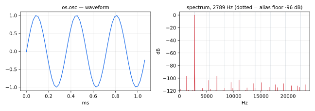

Default sine wave oscillator (same as [oscsin](#oscsin)).
`osc` is a standard Faust function.

#### Usage

```
osc(freq) : _
```

Where:

* `freq`: the frequency in Hz

#### Test
```
os = library("oscillators.lib");
ba = library("basics.lib");
ma = library("maths.lib");
osc_test = os.osc(440);
osc_slider_test = os.osc(hslider("osc:freq", 440, -20000, 20000, 1));
osc_modulated_test = os.osc(2000*(2*tri - 1)) with { P = int(ma.SR/10); tri = 1 - abs(2*ba.period(P)/P - 1); };
```

----

### `(os.)m_oscsin`

Sine wave oscillator based on the `sin` mathematical function.

#### Usage

```
m_oscsin(freq) : _
```

Where:

* `freq`: the frequency in Hz

#### Test
```
os = library("oscillators.lib");
m_oscsin_test = os.m_oscsin(440);
```

----

### `(os.)m_osccos`

Sine wave oscillator based on the `cos` mathematical function.

#### Usage

```
m_osccos(freq) : _
```

Where:

* `freq`: the frequency in Hz

#### Test
```
os = library("oscillators.lib");
m_osccos_test = os.m_osccos(440);
```

----

### `(os.)tphase`

Integer phase accumulator: the phase counter `m(n) = (m(n-1) + p) mod N`,
computed in integers, so exactly, without drift.

A phasor in floating point (`phasor`, `lf_sawpos`) adds a rounded increment
at every sample: its rounding error accumulates, and the phase of a
single-precision render drifts away from that of a double-precision one.
`tphase` counts in integers instead. Its properties:

* **exact**: `m(n) = ((n+1)·p) mod N`, with no rounding, as long as
  `N + |p|` stays below 2^31 (the range of a Faust `int`);
* **the same in every precision**: the integer arithmetic does not depend
  on `-single`, `-double` or the compilation options;
* **periodic**: the period is exactly `N/gcd(N, p)` samples;
* **in range**: `0 <= m < N` for `p >= 0`, and `-N < m <= 0` for
  `p < 0` (the remainder takes the sign of the counter);
* **continuous when `p` changes**: a step changed at run time changes the
  speed of the counter, not its current value.

`float(m)/N` is a phase in cycles; it is exact in `float` as long as
`N <= 2^24`. The counter starts at `p` (the first sample is `p mod N`).

#### Usage

```
tphase(N, p) : _
```

Where:

* `N`: the modulus, a positive integer (the number of steps in one cycle)
* `p`: the step, an integer (positive or negative), added at every sample

#### Test
```
os = library("oscillators.lib");
tphase_test = os.tphase(480000, 4400);
tphase_slider_test = os.tphase(480000, int(hslider("step", 4400, -48000, 48000, 1)));
```

----

### `(os.)tosc`

Sine wave oscillator on an exact integer phase: the same signal in single
and double precision, at exactly the requested frequency (to 0.1 Hz).

`osc` and `m_oscsin` accumulate a phase in floating point: after one
second, the single- and double-precision renders are out of phase, and only
their levels can be compared. `tosc` reads the sine of an integer phase
`m = tphase(N, p)` with `N = 10·SR` and `p = round(10·freq)`. Its
properties:

* **no drift**: the phase `m/N` is exact at every sample (see `tphase`);
  the single- and double-precision outputs differ only by the rounding of
  `2π·m/N` and of `sin`, a few ulps at every sample, never accumulated;
* **exact frequency**: the frequency played is `p/10` Hz, that is `freq`
  rounded to the nearest 0.1 Hz, halves away from zero (`round`, not
  `rint`, which rounds halves to even: 0.25 Hz plays 0.3 Hz, and -0.25 Hz
  plays -0.3 Hz). A frequency below 0.05 Hz in magnitude gives `p = 0`, a
  constant output of 0. The step is the same integer in single and double
  precision, unless `10·freq` falls within a rounding error of a half;
* **independent of the sample rate**: the step `p` depends on `freq`
  only, never on `SR`, so the same `freq` gives the same frequency at
  every rate, without a rounding that depends on `SR`;
* **valid ranges**: `SR` an integer up to 1677721 Hz (`N <= 2^24`, so that
  `float(m)` is exact), and any `freq` (negative frequencies included;
  above Nyquist, it aliases like any sampled sine);
* **phase continuous** when `freq` changes at run time.

The first sample is `sin(2π·p/N)`, not 0. `tosc` is meant as a test source
for numerical checks (comparing renders across precisions, sample rates or
compilation options); `sin` is computed at every sample, so it costs more
than the table-based `osc`.

#### Usage

```
tosc(freq) : _
```

Where:

* `freq`: the frequency in Hz (rounded to the nearest 0.1 Hz, halves away from zero)

#### Test
```
os = library("oscillators.lib");
ba = library("basics.lib");
ma = library("maths.lib");
tosc_test = os.tosc(440);
tosc_12000_test = os.tosc(12000);
tosc_lfo_test = os.tosc(0.1);
tosc_slider_test = os.tosc(hslider("freq", 440, -20000, 20000, 0.1));
tosc_modulated_test = os.tosc(20*pow(250, tri)) with { P = int(ma.SR/10); tri = 1 - abs(2*ba.period(P)/P - 1); };
```

## Low Frequency Oscillators

Low Frequency Oscillators (LFOs) have prefix `lf_`
(no aliasing suppression, since it is inaudible at LF).
Use `sawN` and its derivatives for audio oscillators with suppressed aliasing.

----

### `(os.)lf_imptrain`

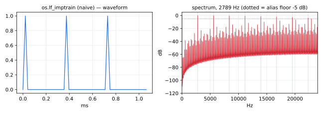

Unit-amplitude low-frequency impulse train.
`lf_imptrain` is a standard Faust function.

#### Usage

```
lf_imptrain(freq) : _
```

Where:

* `freq`: frequency in Hz

#### Test
```
os = library("oscillators.lib");
lf_imptrain_test = os.lf_imptrain(3);
```

----

### `(os.)lf_pulsetrainpos`

Unit-amplitude nonnegative LF pulse train, duty cycle between 0 and 1.


#### Usage

```
lf_pulsetrainpos(freq, duty) : _
```

Where:

* `freq`: frequency in Hz
* `duty`: duty cycle between 0 and 1

#### Test
```
os = library("oscillators.lib");
lf_pulsetrainpos_test = os.lf_pulsetrainpos(3, 0.35);
```

----

### `(os.)lf_pulsetrain`

Unit-amplitude zero-mean LF pulse train, duty cycle between 0 and 1.

#### Usage

```
lf_pulsetrain(freq,duty) : _
```

Where:

* `freq`: frequency in Hz
* `duty`: duty cycle between 0 and 1

#### Test
```
os = library("oscillators.lib");
lf_pulsetrain_test = os.lf_pulsetrain(3, 0.35);
```

----

### `(os.)lf_squarewavepos`

Positive LF square wave in [0,1]

#### Usage

```
lf_squarewavepos(freq) : _
```

Where:

* `freq`: frequency in Hz

#### Test
```
os = library("oscillators.lib");
lf_squarewavepos_test = os.lf_squarewavepos(3);
```

----

### `(os.)lf_squarewave`

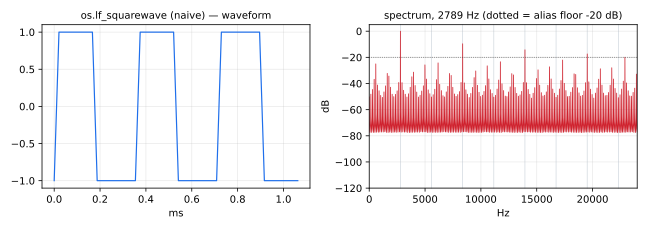

Zero-mean unit-amplitude LF square wave.
`lf_squarewave` is a standard Faust function.

#### Usage

```
lf_squarewave(freq) : _
```

Where:

* `freq`: frequency in Hz

#### Test
```
os = library("oscillators.lib");
lf_squarewave_test = os.lf_squarewave(3);
```

----

### `(os.)lf_trianglepos`

Positive unit-amplitude LF positive triangle wave.

#### Usage

```
lf_trianglepos(freq) : _
```

Where:

* `freq`: frequency in Hz

#### Test
```
os = library("oscillators.lib");
lf_trianglepos_test = os.lf_trianglepos(3);
```

----

### `(os.)lf_triangle`

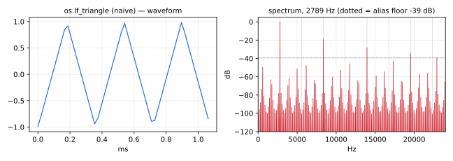

Zero-mean unit-amplitude LF triangle wave.
`lf_triangle` is a standard Faust function.

#### Usage

```
lf_triangle(freq) : _
```

Where:

* `freq`: frequency in Hz

#### Test
```
os = library("oscillators.lib");
lf_triangle_test = os.lf_triangle(3);
```

##  Low Frequency Sawtooths 

Sawtooth waveform oscillators for virtual analog synthesis et al.
The 'simple' versions (`lf_rawsaw`, `lf_sawpos` and `saw1`), are mere samplings of
the ideal continuous-time ("analog") waveforms.  While simple, the
aliasing due to sampling is quite audible.  The differentiated
polynomial waveform family (`saw2`, `sawN`, and derived functions)
do some extra processing to suppress aliasing (not audible for
very low fundamental frequencies).  According to Lehtonen et al.
(JASA 2012), the aliasing of `saw2` should be inaudible at fundamental
frequencies below 2 kHz or so, for a 44.1 kHz sampling rate and 60 dB SPL
presentation level;  fundamentals 415 and below required no aliasing
suppression (i.e., `saw1` is ok).

----

### `(os.)lf_rawsaw`

Simple sawtooth waveform oscillator between 0 and period in samples.

#### Usage

```
lf_rawsaw(periodsamps) : _
```

Where:

* `periodsamps`: number of periods per samples

#### Test
```
os = library("oscillators.lib");
lf_rawsaw_test = os.lf_rawsaw(128);
```

----

### `(os.)lf_sawpos`

Simple sawtooth waveform oscillator between 0 and 1.

#### Usage

```
lf_sawpos(freq) : _
```

Where:

* `freq`: frequency in Hz

#### Test
```
os = library("oscillators.lib");
ba = library("basics.lib");
ma = library("maths.lib");
lf_sawpos_test = os.lf_sawpos(3);
lf_sawpos_slider_test = os.lf_sawpos(hslider("lf_sawpos:freq", 3, 0.01, 100, 0.01));
lf_sawpos_modulated_test = os.lf_sawpos(0.01*pow(10000, tri)) with { P = int(ma.SR/10); tri = 1 - abs(2*ba.period(P)/P - 1); };
```

----

### `(os.)lf_sawpos_phase`

Simple sawtooth waveform oscillator between 0 and 1
with phase control.

#### Usage

```
lf_sawpos_phase(freq, phase) : _
```

Where:

* `freq`: frequency in Hz
* `phase`: phase between 0 and 1

#### Test
```
os = library("oscillators.lib");
lf_sawpos_phase_test = os.lf_sawpos_phase(3, 0.25);
```

----

### `(os.)lf_sawpos_reset`

Simple sawtooth waveform oscillator between 0 and 1
with reset.

#### Usage

```
lf_sawpos_reset(freq,reset) : _
```

Where:

* `freq`: frequency in Hz
* `reset`: reset the oscillator to 0 when equal to 1

#### Test
```
os = library("oscillators.lib");
ba = library("basics.lib");
lf_sawpos_reset_test = os.lf_sawpos_reset(3, ba.pulse(32));
```

----

### `(os.)lf_sawpos_phase_reset`

Simple sawtooth waveform oscillator between 0 and 1
with phase control and reset.

#### Usage

```
lf_sawpos_phase_reset(freq,phase,reset) : _
```

Where:

* `freq`: frequency in Hz
* `phase`: phase between 0 and 1
* `reset`: reset the oscillator to phase when equal to 1

#### Test
```
os = library("oscillators.lib");
lf_sawpos_phase_reset_test = os.lf_sawpos_phase_reset(3, 0.75, button("reset"));
```

----

### `(os.)lf_saw`, `(os.)saw1`

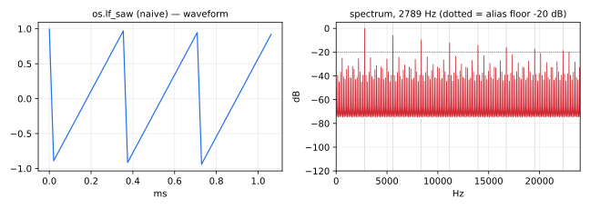

Simple sawtooth waveform oscillator between -1 and 1.
`lf_saw` is a standard Faust function.

#### Usage

```
lf_saw(freq) : _
```

Where:

* `freq`: frequency in Hz

#### Test
```
os = library("oscillators.lib");
lf_saw_test = os.lf_saw(3);
```

##  Alias-Suppressed Sawtooth 


----

### `(os.)sawN`, `(os.)MAX_SAW_ORDER`

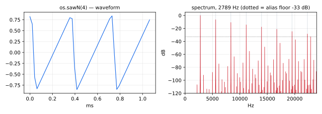

Alias-Suppressed Sawtooth Audio-Frequency Oscillator using Nth-order polynomial transitions
to reduce aliasing. The maximum usable order is `MAX_SAW_ORDER` (4:
orders 5 and 6 have noise at low fundamentals).

`sawN(N,freq)`, `sawNp(N,freq,phase)`, `saw2dpw(freq)`, `saw2(freq)`, `saw3(freq)`,
`saw4(freq)`, `sawtooth(freq)`, `saw2f2(freq)`, `saw2f4(freq)`

#### Usage

```
sawN(N,freq) : _        // Nth-order aliasing-suppressed sawtooth using DPW method (see below)
sawNp(N,freq,phase) : _ // sawN with phase offset feature
saw2dpw(freq) : _       // saw2 using DPW
saw2ptr(freq) : _       // saw2 using the faster, stateless PTR method
saw2(freq) : _          // DPW method, but subject to change if a better method emerges
saw3(freq) : _          // sawN(3)
saw4(freq) : _          // sawN(4)
sawtooth(freq) : _      // saw2
saw2f2(freq) : _        // saw2dpw with 2nd-order droop-correction filtering
saw2f4(freq) : _        // saw2dpw with 4th-order droop-correction filtering
```

Where:

* `N`: polynomial order, a constant numerical expression between 1 and 4
* `freq`: frequency in Hz
* `phase`: phase between 0 and 1

#### Test
```
os = library("oscillators.lib");
ba = library("basics.lib");
ma = library("maths.lib");
sawN_test = os.sawN(3, 440);
sawN_slider_test = os.sawN(3, hslider("sawN:freq", 440, 20, 20000, 1));
sawN_modulated_test = os.sawN(3, 50*pow(400, tri)) with { P = int(ma.SR/10); tri = 1 - abs(2*ba.period(P)/P - 1); };
```
#### Method
Differentiated Polynomial Wave (DPW).

##### Reference
"Alias-Suppressed Oscillators based on Differentiated Polynomial Waveforms",
Vesa Valimaki, Juhan Nam, Julius Smith, and Jonathan Abel,
IEEE Tr. Audio, Speech, and Language Processing (IEEE-ASLP),
Vol. 18, no. 5, pp 786-798, May 2010.
10.1109/TASL.2009.2026507.

#### Notes
The polynomial order `N` is limited to 4 because noise has been
observed at very low `freq` values.  (LFO sawtooths should of course
be generated using `lf_sawpos` instead.)

----

### `(os.)sawNp`

Same as `(os.)sawN` but with a controllable waveform phase.

#### Usage

```
sawNp(N,freq,phase) : _
```

where

* `N`: waveform interpolation polynomial order 1 to 4 (constant integer expression)
* `freq`: frequency in Hz
* `phase`: waveform phase as a fraction of one period (rounded to nearest sample)

#### Test
```
os = library("oscillators.lib");
sawNp_test = os.sawNp(3, 330, 0.5);
```
#### Implementation Notes

The phase offset is implemented by delaying `sawN(N,freq)` by
`round(phase*ma.SR/freq)` samples, for up to 8191 samples.
The minimum sawtooth frequency that can be delayed a whole period
is therefore `ma.SR/8191`, which is well below audibility for normal
audio sampling rates.


----

### `(os.)saw2`

Alias-Suppressed Sawtooth Audio-Frequency Oscillator of order 2.

#### Usage

```
saw2(freq) : _
```

where

* `freq`: frequency in Hz

#### Test
```
os = library("oscillators.lib");
saw2_test = os.saw2(220);
```

#### Implementation Notes

`saw2` uses the PTR method.

#### References

* See `sawN` above.

----

### `(os.)saw3`

Alias-Suppressed Sawtooth Audio-Frequency Oscillator of order 3.

#### Usage

```
saw3(freq) : _
```

where

* `freq`: frequency in Hz

#### Test
```
os = library("oscillators.lib");
saw3_test = os.saw3(220);
```

#### Implementation Notes

`saw3` uses the DPW method.

#### References

* See `sawN` above.

----

### `(os.)saw4`

Alias-Suppressed Sawtooth Audio-Frequency Oscillator of order 4.

#### Usage

```
saw4(freq) : _
```

where

* `freq`: frequency in Hz

#### Test
```
os = library("oscillators.lib");
saw4_test = os.saw4(220);
```

#### Implementation Notes

`saw4` uses the DPW method.

#### References

* See `sawN` above.

----

### `(os.)saw2ptr`

Alias-Suppressed Sawtooth Audio-Frequency Oscillator
using Polynomial Transition Regions (PTR) for order 2.

#### Usage

```
saw2ptr(freq) : _
```

where

* `freq`: frequency in Hz

#### Test
```
os = library("oscillators.lib");
ba = library("basics.lib");
ma = library("maths.lib");
saw2ptr_test = os.saw2ptr(220);
saw2ptr_slider_test = os.saw2ptr(hslider("saw2ptr:freq", 220, 20, 20000, 1));
saw2ptr_modulated_test = os.saw2ptr(20*pow(1000, tri)) with { P = int(ma.SR/10); tri = 1 - abs(2*ba.period(P)/P - 1); };
```
##### Implementation

Polynomial Transition Regions (PTR) method for aliasing suppression.

##### Notes

Method PTR may be preferred because it requires less
computation and is stateless which means that the frequency `freq`
can be modulated arbitrarily fast over time without filtering
artifacts.  For this reason, `saw2` is presently defined as `saw2ptr`.

#### References

* Kleimola, J.; Valimaki, V., "Reducing Aliasing from Synthetic Audio Signals Using Polynomial Transition Regions," Signal Processing Letters, IEEE, vol.19, no.2, pp.67-70, Feb. 2012
* [https://aaltodoc.aalto.fi/bitstream/handle/123456789/7747/publication6.pdf?sequence=9](https://aaltodoc.aalto.fi/bitstream/handle/123456789/7747/publication6.pdf?sequence=9)
* [http://research.spa.aalto.fi/publications/papers/spl-ptr/](http://research.spa.aalto.fi/publications/papers/spl-ptr/)

----

### `(os.)saw2dpw`

Alias-Suppressed Sawtooth Audio-Frequency Oscillator
using the Differentiated Polynomial Waveform (DWP) method.

#### Usage

```
saw2dpw(freq) : _
```

where

* `freq`: frequency in Hz

This is the original Faust `saw2` function using the DPW method.
Since `saw2` is now defined as `saw2ptr`, the DPW version
is now available as `saw2dwp`.

#### Test
```
os = library("oscillators.lib");
ba = library("basics.lib");
ma = library("maths.lib");
saw2dpw_test = os.saw2dpw(220);
saw2dpw_slider_test = os.saw2dpw(hslider("saw2dpw:freq", 220, 20, 20000, 1));
saw2dpw_modulated_test = os.saw2dpw(20*pow(1000, tri)) with { P = int(ma.SR/10); tri = 1 - abs(2*ba.period(P)/P - 1); };
```

----

### `(os.)sawtooth`

Alias-suppressed aliasing-suppressed sawtooth oscillator, presently defined as `saw2`.
`sawtooth` is a standard Faust function.

#### Usage

```
sawtooth(freq) : _
```

Where:

* `freq`: frequency in Hz

#### Test
```
os = library("oscillators.lib");
sawtooth_test = os.sawtooth(220);
```

----

### `(os.)saw2f2`

Alias-Suppressed Sawtooth Audio-Frequency Oscillator with 2nd-order droop-correction filtering.

#### Usage

```
saw2f2(freq) : _
```

Where:

* `freq`: frequency in Hz

In return for aliasing suppression, there is some attenuation near half the sampling rate.
This can be considered as beneficial, or it can be compensated with a high-frequency boost.
The boost filter is second-order for `saw2f2`, and it is designed for the DPW case using `saw2dpw`.
See Figure 4(b) in the DPW reference for a plot of the slight droop in the DPW case.

#### Test
```
os = library("oscillators.lib");
saw2f2_test = os.saw2f2(220);
```

----

### `(os.)saw2f4`

Alias-Suppressed Sawtooth Audio-Frequency Oscillator with 4th-order droop-correction filtering.

#### Usage

```
saw2f4(freq) : _
```

Where:

* `freq`: frequency in Hz

In return for aliasing suppression, there is some attenuation near half the sampling rate.
This can be considered as beneficial, or it can be compensated with a high-frequency boost.
The boost filter is fourth-order for `saw2f4`, and it is designed for the DPW case using `saw2dpw`.
See Figure 4(b) in the DPW reference for a plot of the slight droop in the DPW case.

#### Test
```
os = library("oscillators.lib");
saw2f4_test = os.saw2f4(220);
```

## Alias-Suppressed Pulse, Square, and Impulse Trains

Alias-Suppressed Pulse, Square and Impulse Trains.

`pulsetrainN`, `pulsetrain`, `squareN`, `square`, `imptrainN`, `imptrain`,
`triangleN`, `triangle`

All are zero-mean and meant to oscillate in the audio frequency range.
Use simpler sample-rounded `lf_*` versions above for LFOs.

#### Usage

```
pulsetrainN(N,freq,duty) : _
pulsetrain(freq, duty) : _ // = pulsetrainN(2)

squareN(N,freq) : _
square : _ // = squareN(2)

imptrainN(N,freq) : _
imptrain : _ // = imptrainN(2)

triangleN(N,freq) : _
triangle : _ // = triangleN(2)
```

Where:

* `N`: polynomial order, a constant numerical expression
* `freq`: frequency in Hz

----

### `(os.)impulse`

One-time impulse generated when the Faust process is started.
`impulse` is a standard Faust function.

#### Usage

```
impulse : _
```

#### Test
```
os = library("oscillators.lib");
impulse_test = os.impulse;
```

----

### `(os.)pulsetrainN`

Alias-suppressed pulse train oscillator.

#### Usage

```
pulsetrainN(N,freq,duty) : _
```

Where:

* `N`: order, as a constant numerical expression
* `freq`: frequency in Hz
* `duty`: duty cycle between 0 and 1

#### Test
```
os = library("oscillators.lib");
ba = library("basics.lib");
ma = library("maths.lib");
pulsetrainN_test = os.pulsetrainN(3, 220, 0.25);
pulsetrainN_slider_test = os.pulsetrainN(3, hslider("pulsetrainN:freq", 220, 20, 20000, 1), hslider("pulsetrainN:duty", 0.25, 0, 1, 0.01));
pulsetrainN_modulated_test = os.pulsetrainN(3, 220, 0.05 + 0.9*tri) with { P = int(ma.SR/10); tri = 1 - abs(2*ba.period(P)/P - 1); };
```


----

### `(os.)pulsetrain`

Alias-suppressed pulse train oscillator. Based on `pulsetrainN(2)`.
`pulsetrain` is a standard Faust function.

#### Usage

```
pulsetrain(freq,duty) : _
```

Where:

* `freq`: frequency in Hz
* `duty`: duty cycle between 0 and 1

#### Test
```
os = library("oscillators.lib");
pulsetrain_test = os.pulsetrain(220, 0.25);
```

----

### `(os.)squareN`

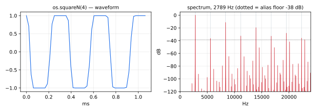

Alias-suppressed square wave oscillator.

#### Usage

```
squareN(N,freq) : _
```

Where:

* `N`: order, as a constant numerical expression
* `freq`: frequency in Hz

#### Test
```
os = library("oscillators.lib");
squareN_test = os.squareN(3, 220);
```

----

### `(os.)square`

Alias-suppressed square wave oscillator. Based on `squareN(2)`.
`square` is a standard Faust function.

#### Usage

```
square(freq) : _
```

Where:

* `freq`: frequency in Hz

#### Test
```
os = library("oscillators.lib");
square_test = os.square(220);
```

----

### `(os.)imptrainN`

Alias-suppressed impulse train generator.

#### Usage

```
imptrainN(N,freq) : _
```

Where:

* `N`: order, as a constant numerical expression
* `freq`: frequency in Hz

#### Test
```
os = library("oscillators.lib");
imptrainN_test = os.imptrainN(3, 220);
```

----

### `(os.)imptrain`

Alias-suppressed impulse train generator. Based on `imptrainN(2)`.
`imptrain` is a standard Faust function.

#### Usage

```
imptrain(freq) : _
```

Where:

* `freq`: frequency in Hz

#### Test
```
os = library("oscillators.lib");
imptrain_test = os.imptrain(220);
```

----

### `(os.)triangleN`

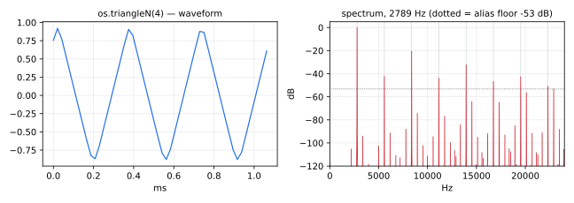

Alias-suppressed triangle wave oscillator.

#### Usage

```
triangleN(N,freq) : _
```

Where:

* `N`: order, as a constant numerical expression
* `freq`: frequency in Hz

#### Test
```
os = library("oscillators.lib");
triangleN_test = os.triangleN(3, 220);
```

----

### `(os.)triangle`

Alias-suppressed triangle wave oscillator. Based on `triangleN(2)`.
`triangle` is a standard Faust function.

#### Usage

```
triangle(freq) : _
```

Where:

* `freq`: frequency in Hz

#### Test
```
os = library("oscillators.lib");
triangle_test = os.triangle(220);
```

## Filter-Based Oscillators

Filter-Based Oscillators.

#### Usage

```
osc[b|rq|rs|rc|s](freq), where freq = frequency in Hz.
```

#### References

* [http://lac.linuxaudio.org/2012/download/lac12-slides-jos.pdf](http://lac.linuxaudio.org/2012/download/lac12-slides-jos.pdf)
* [https://ccrma.stanford.edu/~jos/pdf/lac12-paper-jos.pdf](https://ccrma.stanford.edu/~jos/pdf/lac12-paper-jos.pdf)

----

### `(os.)oscb`

Sinusoidal oscillator based on the biquad: the impulse response of
sin(w) z^-1 / (1 - 2cos(w) z^-1 + z^-2), w = 2*PI*freq/SR, which is
sin(n*w), of amplitude 1 and starting at 0 like `osc`. The state carries
the amplitude: a frequency that changes while it runs changes the
amplitude too, so `oscb` is meant for a constant frequency.

Until oscillators.lib 1.8.1 the numerator was 1, and the amplitude
1/sin(w): about 16 at 440 Hz and 44.1 kHz.

#### Usage

```
oscb(freq) : _
```

Where:

* `freq`: frequency in Hz

#### Test
```
os = library("oscillators.lib");
oscb_test = os.oscb(440);
```

----

### `(os.)oscrq`

Sinusoidal (sine and cosine) oscillator based on 2D vector rotation,
 = undamped "coupled-form" resonator
 = lossless 2nd-order normalized ladder filter.

#### Usage

```
oscrq(freq) : _,_
```

Where:

* `freq`: frequency in Hz


#### Test
```
os = library("oscillators.lib");
oscrq_test = os.oscrq(440);
```
#### References

* [https://ccrma.stanford.edu/~jos/pasp/Normalized_Scattering_Junctions.html](https://ccrma.stanford.edu/~jos/pasp/Normalized_Scattering_Junctions.html)

----

### `(os.)oscrs`

Sinusoidal (sine) oscillator based on 2D vector rotation,
 = undamped "coupled-form" resonator
 = lossless 2nd-order normalized ladder filter.

#### Usage

```
oscrs(freq) : _
```

Where:

* `freq`: frequency in Hz

#### Test
```
os = library("oscillators.lib");
ba = library("basics.lib");
ma = library("maths.lib");
oscrs_test = os.oscrs(440);
oscrs_modulated_test = os.oscrs(20*pow(1000, tri)) with { P = int(ma.SR/10); tri = 1 - abs(2*ba.period(P)/P - 1); };
```
#### References

* [https://ccrma.stanford.edu/~jos/pasp/Normalized_Scattering_Junctions.html](https://ccrma.stanford.edu/~jos/pasp/Normalized_Scattering_Junctions.html)

----

### `(os.)oscrc`

Sinusoidal (cosine) oscillator based on 2D vector rotation,
 = undamped "coupled-form" resonator
 = lossless 2nd-order normalized ladder filter.

#### Usage

```
oscrc(freq) : _
```

Where:

* `freq`: frequency in Hz

#### Test
```
os = library("oscillators.lib");
oscrc_test = os.oscrc(440);
```
#### References

* [https://ccrma.stanford.edu/~jos/pasp/Normalized_Scattering_Junctions.html](https://ccrma.stanford.edu/~jos/pasp/Normalized_Scattering_Junctions.html)

----

### `(os.)oscrp`, `(os.)oscr`

Sinusoidal oscillators based on 2D vector rotation like `oscrs` and
`oscrc`: `oscrp(f,p)` gives an arbitrary initial phase (p=0 for sine,
PI/2 for cosine, etc.), and `oscr` is the default form, a synonym for
`oscrs` (sine, starts without a pop).

#### Usage

```
oscrp(freq,phase) : _
oscr(freq) : _
```

Where:

* `freq`: frequency in Hz
* `phase`: initial phase in radians

#### Test
```
os = library("oscillators.lib");
oscrp_test = os.oscrp(440, 0.5);
oscr_test = os.oscr(440);
```

----

### `(os.)oscs`

Sinusoidal oscillator based on the state variable filter
= undamped "modified-coupled-form" resonator
= "magic circle" algorithm used in graphics.
`oscs` is a standard Faust function.

#### Usage

```
oscs(freq) : _
```

Where:

* `freq`: frequency in Hz

#### Test
```
os = library("oscillators.lib");
oscs_test = os.oscs(440);
oscs_slider_test = os.oscs(hslider("oscs:freq", 440, 20, 14000, 1));
```

----

### `(os.)quadosc`

Quadrature (cosine and sine) oscillator based on QuadOsc by Martin Vicanek.

#### Usage

```
quadosc(freq) : _,_
```

where

* `freq`: frequency in Hz

#### Test
```
os = library("oscillators.lib");
ba = library("basics.lib");
ma = library("maths.lib");
quadosc_test = os.quadosc(440);
quadosc_slider_test = os.quadosc(hslider("quadosc:freq", 440, 20, 20000, 1));
quadosc_modulated_test = os.quadosc(20*pow(1000, tri)) with { P = int(ma.SR/10); tri = 1 - abs(2*ba.period(P)/P - 1); };
```
#### References

* [https://vicanek.de/articles/QuadOsc.pdf](https://vicanek.de/articles/QuadOsc.pdf)

----

### `(os.)sidebands`

Adds harmonics to quad oscillator.

#### Usage

```
   cos(x),sin(x) : sidebands(vs) : _,_
```

Where:

* `vs` : list of amplitudes

#### Test
```
os = library("oscillators.lib");
sidebands_test = os.quadosc(110) : os.sidebands((1, 0.5, 0.25));
```
#### Example test program
```
   cos(x),sin(x) : sidebands((10,20,30))
```

outputs:

```
   10*cos(x) + 20*cos(2*x) + 30*cos(3*x),
   10*sin(x) + 20*sin(2*x) + 30*sin(3*x);
```

The following:

```
   process = os.quadosc(F) : sidebands((10,20,30))
```

is (modulo floating point issues) the same as:

```
   c = os.quadosc : _,!;
   s = os.quadosc : !,_;
   process =
       10*c(F) + 20*c(2*F) + 30*c(F),
       10*s(F) + 20*s(2*F) + 30*s(F);
```

but much more efficient.

#### Implementation Notes

This is based on the trivial trigonometric identities:

```
   cos((n + 1) x) = 2 cos(x) cos(n x) - cos((n - 1) x)
   sin((n + 1) x) = 2 cos(x) sin(n x) - sin((n - 1) x)
```

Note that the calculation of the cosine/sine parts do not depend
on each other, so if you only need the sine part you can do:

```
   process = os.quadosc(F) : sidebands(vs) : !,_;
```

and the compiler will discard the half of the calculations.

----

### `(os.)sidebands_list`

Creates the list of complex harmonics from quad oscillator.

Similar to `sidebands` but doesn't sum the harmonics, so it is more
generic but less convenient for immediate usage.

#### Usage

```
   cos(x),sin(x) : sidebands_list(N) : si.bus(2*N)
```

Where:

* `N` : number of harmonics, compile time constant > 1


#### Test
```
os = library("oscillators.lib");
sidebands_list_test = os.quadosc(110) : os.sidebands_list(3);
```
#### Example test program
```
   cos(x),sin(x) : sidebands_list(3)
```

outputs:

```
   cos(x),sin(x), cos(2*x),sin(2*x), cos(3*x),sin(3*x);
```

The following:

```
   process = os.quadosc(F) : sidebands_list(3)
```

is (modulo floating point issues) the same as:

```
   process = os.quadosc(F), os.quadosc(2*F), os.quadosc(3*F);
```

but much more efficient.

----

### `(os.)dsf`

An environment with sine/cosine oscsillators with exponentially decaying
harmonics based on direct summation formula.

#### Usage

```
dsf.xxx(f0, df, a, [n]) : _
```

Where:

* `f0`: base frequency
* `df`: step frequency
* `a`: decaying factor != 1
* `n`: total number of harmonics (`osccN/oscsN` only)

#### Test
```
os = library("oscillators.lib");
ba = library("basics.lib");
ma = library("maths.lib");
dsf_oscc_test = os.dsf.oscc(220, 110, 0.6);
dsf_oscs_test = os.dsf.oscs(220, 110, 0.6);
dsf_osccN_test = os.dsf.osccN(220, 110, 0.6, 4);
dsf_oscsN_test = os.dsf.oscsN(220, 110, 0.6, 4);
dsf_osccNq_test = os.dsf.osccNq(220, 110, 0.6);
dsf_oscsNq_test = os.dsf.oscsNq(220, 110, 0.6);
dsf_oscc_slider_test = os.dsf.oscc(hslider("dsf_oscc:f0", 220, 20, 5000, 1), hslider("dsf_oscc:df", 110, 1, 5000, 1), hslider("dsf_oscc:a", 0.6, 0, 0.95, 0.01));
dsf_oscc_modulated_test = os.dsf.oscc(220, 110, 0.95*tri) with { P = int(ma.SR/10); tri = 1 - abs(2*ba.period(P)/P - 1); };
dsf_oscs_slider_test = os.dsf.oscs(hslider("dsf_oscs:f0", 220, 20, 5000, 1), hslider("dsf_oscs:df", 110, 1, 5000, 1), hslider("dsf_oscs:a", 0.6, 0, 0.95, 0.01));
dsf_oscs_modulated_test = os.dsf.oscs(220, 110, 0.95*tri) with { P = int(ma.SR/10); tri = 1 - abs(2*ba.period(P)/P - 1); };
dsf_osccN_modulated_test = os.dsf.osccN(220, 110, 0.95*tri, 4) with { P = int(ma.SR/10); tri = 1 - abs(2*ba.period(P)/P - 1); };
```
#### Variants

- infinite number of harmonics, implies aliasing
```
oscc(f0,df,a) : _;
oscs(f0,df,a) : _;
```

- n harmonics, f0, f0 + df, f0 + 2\*df, ..., f0 + (n-1)\*df
```
osccN(f0,df,a,n) : _;
oscsN(f0,df,a,n) : _;
```

- finite number of harmonics, from f0 to Nyquist
```
osccNq(f0,df,a) : _;
oscsNq(f0,df,a) : _;
```

#### Example test program
```
process = dsf.osccN(F0,DF,A,N),
          dsf.oscsN(F0,DF,A,N);
```
if `N` is an integer constant, the same (modulo fp issues) as:
```
c = os.quadosc : _,!;
s = os.quadosc : !,_;
process = sum(k,N, A^k * c(F0 + k*DF)),
          sum(k,N, A^k * s(F0 + k*DF));
```
but much more efficient.

#### References

* [https://ccrma.stanford.edu/STANM/stanms/stanm5/stanm5.pdf](https://ccrma.stanford.edu/STANM/stanms/stanm5/stanm5.pdf)

----

### `(os.)twin_osc`

Twin oscillator using a time-varying comb filter for PWM, morph, or detune.
Sawtooth through feedforward comb filter: `y = x - g*x[n-d]`.

Based on: "Virtual Analog Synthesis with a Time-Varying Comb Filter"
D. Lowenfels, AES Convention 115, October 2003.

Modes (comb filter configurations):

* 0 = PWM: `y = x - x[d]` - pulse width modulation
* 1 = MORPH: `y = x - amt*x[d]` - saw to square morphing
* 2 = DETUNE: `y = x + x[d]` - summing comb

#### Usage

```
twin_osc(freq, amt, detune, mode) : _
```

Where:

* `freq`: frequency in Hz
* `amt`: effect amount (0-1), controls comb delay time
* `detune`: additional delay offset in samples
* `mode`: mode selector (0=PWM, 1=MORPH, 2=DETUNE)

#### Test
```
os = library("oscillators.lib");
ba = library("basics.lib");
ma = library("maths.lib");
twin_osc_pwm_test = os.twin_osc(220, 0.5, 0, 0);
twin_osc_morph_test = os.twin_osc(220, 0.75, 0, 1);
twin_osc_detune_test = os.twin_osc(220, 0.5, 0, 2);
twin_osc_slider_test = os.twin_osc(hslider("twin_osc:freq", 220, 20, 5000, 1), hslider("twin_osc:amt", 0.5, 0, 1, 0.01), hslider("twin_osc:detune", 0, 0, 100, 0.1), hslider("twin_osc:mode", 0, 0, 2, 1));
twin_osc_modulated_test = os.twin_osc(220, 0.05 + 0.9*tri, 0, 0) with { P = int(ma.SR/10); tri = 1 - abs(2*ba.period(P)/P - 1); };
```

#### References

* [https://www.researchgate.net/publication/325654284](https://www.researchgate.net/publication/325654284)

----

### `(os.)rpm`

An environment with RPM (Recursive Phase Modulation) oscillators.
Based on Norio Tomisawa's 1981 Yamaha patent for feedback FM synthesis.
Uses a "hunting filter" (2-point moving average) in the feedback path
to suppress Nyquist-rate limit cycle oscillations at high modulation indices.

#### Usage

```
rpm.sawtooth(freq, beta) : _
rpm.square(freq, beta) : _
```

Where:

* `freq`: frequency in Hz
* `beta`: modulation depth (0 to ~1.5)

#### Test
```
os = library("oscillators.lib");
ba = library("basics.lib");
ma = library("maths.lib");
rpm_sawtooth_test = os.rpm.sawtooth(220, 1.0);
rpm_square_test = os.rpm.square(220, 1.0);
rpm_sawtooth_slider_test = os.rpm.sawtooth(hslider("rpm_sawtooth:freq", 220, 20, 5000, 1), hslider("rpm_sawtooth:beta", 1.0, 0, 1.5, 0.01));
rpm_sawtooth_modulated_test = os.rpm.sawtooth(220, 1.5*tri) with { P = int(ma.SR/10); tri = 1 - abs(2*ba.period(P)/P - 1); };
rpm_sawtooth_jump_test = os.rpm.sawtooth(220, 1.5*sq) with { P = int(ma.SR/10); sq = ba.period(2*P) < P; };
rpm_square_slider_test = os.rpm.square(hslider("rpm_square:freq", 220, 20, 5000, 1), hslider("rpm_square:beta", 1.0, 0, 1.5, 0.01));
rpm_square_modulated_test = os.rpm.square(220, 1.5*tri) with { P = int(ma.SR/10); tri = 1 - abs(2*ba.period(P)/P - 1); };
rpm_square_jump_test = os.rpm.square(220, 1.5*sq) with { P = int(ma.SR/10); sq = ba.period(2*P) < P; };
```

#### Variants

* `sawtooth(freq, beta)`: sawtooth-like waveform (sine morphs to saw as beta -> 1.5)
* `square(freq, beta)`: odd-harmonic square-like waveform (squared feedback)

#### References

* [https://patents.google.com/patent/US4249447](https://patents.google.com/patent/US4249447)

##  Waveguide-Resonator-Based Oscillators 

Sinusoidal oscillator based on the waveguide resonator `wgr`.

----

### `(os.)oscwc`

Sinusoidal oscillator based on the waveguide resonator `wgr`. Unit-amplitude
cosine oscillator.

#### Usage

```
oscwc(freq) : _
```

Where:

* `freq`: frequency in Hz

#### Test
```
os = library("oscillators.lib");
oscwc_test = os.oscwc(440);
```
#### References

* [https://ccrma.stanford.edu/~jos/pasp/Digital_Waveguide_Oscillator.html](https://ccrma.stanford.edu/~jos/pasp/Digital_Waveguide_Oscillator.html)

----

### `(os.)oscws`

Sinusoidal oscillator based on the waveguide resonator `wgr`. Unit-amplitude
sine oscillator.

#### Usage

```
oscws(freq) : _
```

Where:

* `freq`: frequency in Hz

#### Test
```
os = library("oscillators.lib");
oscws_test = os.oscws(440);
```
#### References

* [https://ccrma.stanford.edu/~jos/pasp/Digital_Waveguide_Oscillator.html](https://ccrma.stanford.edu/~jos/pasp/Digital_Waveguide_Oscillator.html)

----

### `(os.)oscq`

Sinusoidal oscillator based on the waveguide resonator `wgr`.
Unit-amplitude cosine and sine (quadrature) oscillator.

#### Usage

```
oscq(freq) : _,_
```

Where:

* `freq`: frequency in Hz

#### Test
```
os = library("oscillators.lib");
oscq_test = os.oscq(440);
```
#### References

* [https://ccrma.stanford.edu/~jos/pasp/Digital_Waveguide_Oscillator.html](https://ccrma.stanford.edu/~jos/pasp/Digital_Waveguide_Oscillator.html)

----

### `(os.)oscw`

Sinusoidal oscillator based on the waveguide resonator `wgr`.
Unit-amplitude cosine oscillator (default).

#### Usage

```
oscw(freq) : _
```

Where:

* `freq`: frequency in Hz

#### Test
```
os = library("oscillators.lib");
oscw_test = os.oscw(440);
```
#### References

* [https://ccrma.stanford.edu/~jos/pasp/Digital_Waveguide_Oscillator.html](https://ccrma.stanford.edu/~jos/pasp/Digital_Waveguide_Oscillator.html)

##  Casio CZ Oscillators 

Oscillators that mimic some of the Casio CZ oscillators.

There are two sets:

* a set with an index parameter

* a set with a res parameter

The "index oscillators" outputs a sine wave at index=0 and gets brighter with a higher index.
There are two versions of the "index oscillators":

* with P appended to the name: is phase aligned with `fund:sin`

* without P appended to the name: has the phase of the original CZ oscillators

The "res oscillators" have a resonant frequency.
"res" is the frequency of resonance as a factor of the fundamental pitch.

For the `fund` waveform, use a low-frequency oscillator without anti-aliasing such as `os.lf_saw`.

----

### `(os.)CZsaw`

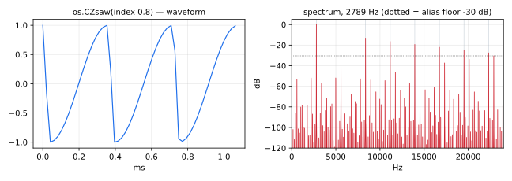

Oscillator that mimics the Casio CZ saw oscillator.
`CZsaw` is a standard Faust function.

#### Usage

```
CZsaw(fund,index) : _
```

Where:

* `fund`: a saw-tooth waveform between 0 and 1 that the oscillator slaves to
* `index`: the brightness of the oscillator, 0 to 1. 0 = sine-wave, 1 = saw-wave

#### Test
```
os = library("oscillators.lib");
ba = library("basics.lib");
ma = library("maths.lib");
CZsaw_test = os.CZsaw(os.lf_sawpos(110), 0.5);
CZsaw_slider_test = os.CZsaw(os.lf_sawpos(110), hslider("CZsaw:index", 0.5, 0, 1, 0.01));
CZsaw_modulated_test = os.CZsaw(float(os.tphase(N, 1100))/N, tri) with { N = 10*int(ma.SR); P = int(ma.SR/10); tri = 1 - abs(2*ba.period(P)/P - 1); };
```

----

### `(os.)CZsawP`

Oscillator that mimics the Casio CZ saw oscillator,
with it's phase aligned to `fund:sin`.
`CZsawP` is a standard Faust function.

#### Usage

```
CZsawP(fund,index) : _
```

Where:

* `fund`: a saw-tooth waveform between 0 and 1 that the oscillator slaves to
* `index`: the brightness of the oscillator, 0 to 1. 0 = sine-wave, 1 = saw-wave

#### Test
```
os = library("oscillators.lib");
ba = library("basics.lib");
ma = library("maths.lib");
CZsawP_test = os.CZsawP(os.lf_sawpos(110), 0.5);
CZsawP_slider_test = os.CZsawP(os.lf_sawpos(110), hslider("CZsawP:index", 0.5, 0, 1, 0.01));
CZsawP_modulated_test = os.CZsawP(float(os.tphase(N, 1100))/N, tri) with { N = 10*int(ma.SR); P = int(ma.SR/10); tri = 1 - abs(2*ba.period(P)/P - 1); };
```

----

### `(os.)CZsquare`

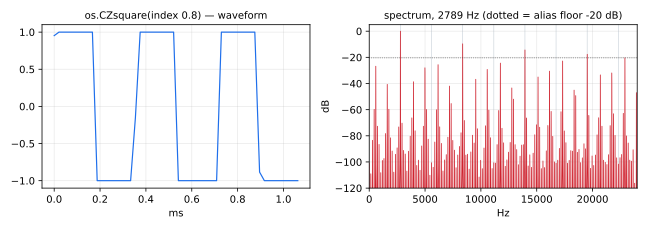

Oscillator that mimics the Casio CZ square oscillator
`CZsquare` is a standard Faust function.

#### Usage

```
CZsquare(fund,index) : _
```

Where:

* `fund`: a saw-tooth waveform between 0 and 1 that the oscillator slaves to
* `index`: the brightness of the oscillator, 0 to 1. 0 = sine-wave, 1 = square-wave

#### Test
```
os = library("oscillators.lib");
ba = library("basics.lib");
ma = library("maths.lib");
CZsquare_test = os.CZsquare(os.lf_sawpos(110), 0.5);
CZsquare_slider_test = os.CZsquare(os.lf_sawpos(110), hslider("CZsquare:index", 0.5, 0, 1, 0.01));
CZsquare_modulated_test = os.CZsquare(float(os.tphase(N, 1100))/N, tri) with { N = 10*int(ma.SR); P = int(ma.SR/10); tri = 1 - abs(2*ba.period(P)/P - 1); };
```

----

### `(os.)CZsquareP`

Oscillator that mimics the Casio CZ square oscillator,
with it's phase aligned to `fund:sin`.
`CZsquareP` is a standard Faust function.

#### Usage

```
CZsquareP(fund,index) : _
```

Where:

* `fund`: a saw-tooth waveform between 0 and 1 that the oscillator slaves to
* `index`: the brightness of the oscillator, 0 to 1. 0 = sine-wave, 1 = square-wave

#### Test
```
os = library("oscillators.lib");
ba = library("basics.lib");
ma = library("maths.lib");
CZsquareP_test = os.CZsquareP(os.lf_sawpos(110), 0.5);
CZsquareP_slider_test = os.CZsquareP(os.lf_sawpos(110), hslider("CZsquareP:index", 0.5, 0, 1, 0.01));
CZsquareP_modulated_test = os.CZsquareP(float(os.tphase(N, 1100))/N, tri) with { N = 10*int(ma.SR); P = int(ma.SR/10); tri = 1 - abs(2*ba.period(P)/P - 1); };
```

----

### `(os.)CZpulse`

Oscillator that mimics the Casio CZ pulse oscillator.
`CZpulse` is a standard Faust function.

#### Usage

```
CZpulse(fund,index) : _
```

Where:

* `fund`: a saw-tooth waveform between 0 and 1 that the oscillator slaves to
* `index`: the brightness of the oscillator, 0 gives a sine-wave, 1 is closer to a pulse

#### Test
```
os = library("oscillators.lib");
ba = library("basics.lib");
ma = library("maths.lib");
CZpulse_test = os.CZpulse(os.lf_sawpos(110), 0.5);
CZpulse_slider_test = os.CZpulse(os.lf_sawpos(110), hslider("CZpulse:index", 0.5, 0, 1, 0.01));
CZpulse_modulated_test = os.CZpulse(float(os.tphase(N, 1100))/N, tri) with { N = 10*int(ma.SR); P = int(ma.SR/10); tri = 1 - abs(2*ba.period(P)/P - 1); };
```

----

### `(os.)CZpulseP`

Oscillator that mimics the Casio CZ pulse oscillator,
with it's phase aligned to `fund:sin`.
`CZpulseP` is a standard Faust function.

#### Usage

```
CZpulseP(fund,index) : _
```

Where:

* `fund`: a saw-tooth waveform between 0 and 1 that the oscillator slaves to
* `index`: the brightness of the oscillator, 0 gives a sine-wave, 1 is closer to a pulse

#### Test
```
os = library("oscillators.lib");
ba = library("basics.lib");
ma = library("maths.lib");
CZpulseP_test = os.CZpulseP(os.lf_sawpos(110), 0.5);
CZpulseP_slider_test = os.CZpulseP(os.lf_sawpos(110), hslider("CZpulseP:index", 0.5, 0, 1, 0.01));
CZpulseP_modulated_test = os.CZpulseP(float(os.tphase(N, 1100))/N, tri) with { N = 10*int(ma.SR); P = int(ma.SR/10); tri = 1 - abs(2*ba.period(P)/P - 1); };
```

----

### `(os.)CZsinePulse`

Oscillator that mimics the Casio CZ sine/pulse oscillator.
`CZsinePulse` is a standard Faust function.

#### Usage

```
CZsinePulse(fund,index) : _
```

Where:

* `fund`: a saw-tooth waveform between 0 and 1 that the oscillator slaves to
* `index`: the brightness of the oscillator, 0 gives a sine-wave, 1 is a sine minus a pulse

#### Test
```
os = library("oscillators.lib");
ba = library("basics.lib");
ma = library("maths.lib");
CZsinePulse_test = os.CZsinePulse(os.lf_sawpos(110), 0.5);
CZsinePulse_slider_test = os.CZsinePulse(os.lf_sawpos(110), hslider("CZsinePulse:index", 0.5, 0, 1, 0.01));
CZsinePulse_modulated_test = os.CZsinePulse(float(os.tphase(N, 1100))/N, tri) with { N = 10*int(ma.SR); P = int(ma.SR/10); tri = 1 - abs(2*ba.period(P)/P - 1); };
```

----

### `(os.)CZsinePulseP`

Oscillator that mimics the Casio CZ sine/pulse oscillator,
with it's phase aligned to `fund:sin`.
`CZsinePulseP` is a standard Faust function.

#### Usage

```
CZsinePulseP(fund,index) : _
```

Where:

* `fund`: a saw-tooth waveform between 0 and 1 that the oscillator slaves to
* `index`: the brightness of the oscillator, 0 gives a sine-wave, 1 is a sine minus a pulse

#### Test
```
os = library("oscillators.lib");
ba = library("basics.lib");
ma = library("maths.lib");
CZsinePulseP_test = os.CZsinePulseP(os.lf_sawpos(110), 0.5);
CZsinePulseP_slider_test = os.CZsinePulseP(os.lf_sawpos(110), hslider("CZsinePulseP:index", 0.5, 0, 1, 0.01));
CZsinePulseP_modulated_test = os.CZsinePulseP(float(os.tphase(N, 1100))/N, tri) with { N = 10*int(ma.SR); P = int(ma.SR/10); tri = 1 - abs(2*ba.period(P)/P - 1); };
```

----

### `(os.)CZhalfSine`

Oscillator that mimics the Casio CZ half sine oscillator.
`CZhalfSine` is a standard Faust function.

#### Usage

```
CZhalfSine(fund,index) : _
```

Where:

* `fund`: a saw-tooth waveform between 0 and 1 that the oscillator slaves to
* `index`: the brightness of the oscillator, 0 gives a sine-wave, 1 is somewhere between a saw and a square

#### Test
```
os = library("oscillators.lib");
ba = library("basics.lib");
ma = library("maths.lib");
CZhalfSine_test = os.CZhalfSine(os.lf_sawpos(110), 0.5);
CZhalfSine_slider_test = os.CZhalfSine(os.lf_sawpos(110), hslider("CZhalfSine:index", 0.5, 0, 1, 0.01));
CZhalfSine_modulated_test = os.CZhalfSine(float(os.tphase(N, 1100))/N, tri) with { N = 10*int(ma.SR); P = int(ma.SR/10); tri = 1 - abs(2*ba.period(P)/P - 1); };
```

----

### `(os.)CZhalfSineP`

Oscillator that mimics the Casio CZ half sine oscillator,
with it's phase aligned to `fund:sin`.
`CZhalfSineP` is a standard Faust function.

#### Usage

```
CZhalfSineP(fund,index) : _
```

Where:

* `fund`: a saw-tooth waveform between 0 and 1 that the oscillator slaves to
* `index`: the brightness of the oscillator, 0 gives a sine-wave, 1 is somewhere between a saw and a square

#### Test
```
os = library("oscillators.lib");
ba = library("basics.lib");
ma = library("maths.lib");
CZhalfSineP_test = os.CZhalfSineP(os.lf_sawpos(110), 0.5);
CZhalfSineP_slider_test = os.CZhalfSineP(os.lf_sawpos(110), hslider("CZhalfSineP:index", 0.5, 0, 1, 0.01));
CZhalfSineP_modulated_test = os.CZhalfSineP(float(os.tphase(N, 1100))/N, tri) with { N = 10*int(ma.SR); P = int(ma.SR/10); tri = 1 - abs(2*ba.period(P)/P - 1); };
```

----

### `(os.)CZresSaw`

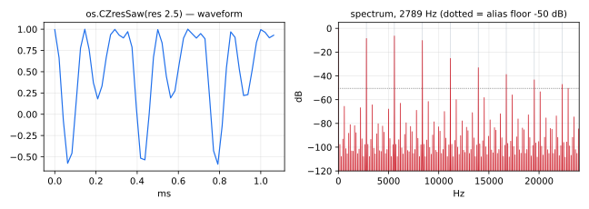

Oscillator that mimics the Casio CZ resonant sawtooth oscillator.
`CZresSaw` is a standard Faust function.

#### Usage

```
CZresSaw(fund,res) : _
```

Where:

* `fund`: a saw-tooth waveform between 0 and 1 that the oscillator slaves to
* `res`: the frequency of resonance as a factor of the fundamental pitch.

#### Test
```
os = library("oscillators.lib");
ba = library("basics.lib");
ma = library("maths.lib");
CZresSaw_test = os.CZresSaw(os.lf_sawpos(110), 2.5);
CZresSaw_slider_test = os.CZresSaw(os.lf_sawpos(110), hslider("CZresSaw:res", 2.5, 1, 16, 0.1));
CZresSaw_modulated_test = os.CZresSaw(float(os.tphase(N, 1100))/N, 1 + 15*tri) with { N = 10*int(ma.SR); P = int(ma.SR/10); tri = 1 - abs(2*ba.period(P)/P - 1); };
```

----

### `(os.)CZresTriangle`

Oscillator that mimics the Casio CZ resonant triangle oscillator.
`CZresTriangle` is a standard Faust function.

#### Usage

```
CZresTriangle(fund,res) : _
```

Where:

* `fund`: a saw-tooth waveform between 0 and 1 that the oscillator slaves to
* `res`: the frequency of resonance as a factor of the fundamental pitch.

#### Test
```
os = library("oscillators.lib");
ba = library("basics.lib");
ma = library("maths.lib");
CZresTriangle_test = os.CZresTriangle(os.lf_sawpos(110), 2.5);
CZresTriangle_slider_test = os.CZresTriangle(os.lf_sawpos(110), hslider("CZresTriangle:res", 2.5, 1, 16, 0.1));
CZresTriangle_modulated_test = os.CZresTriangle(float(os.tphase(N, 1100))/N, 1 + 15*tri) with { N = 10*int(ma.SR); P = int(ma.SR/10); tri = 1 - abs(2*ba.period(P)/P - 1); };
```

----

### `(os.)CZresTrap`

Oscillator that mimics the Casio CZ resonant trapeze oscillator
`CZresTrap` is a standard Faust function.

#### Usage

```
CZresTrap(fund,res) : _
```

Where:

* `fund`: a saw-tooth waveform between 0 and 1 that the oscillator slaves to
* `res`: the frequency of resonance as a factor of the fundamental pitch.

#### Test
```
os = library("oscillators.lib");
ba = library("basics.lib");
ma = library("maths.lib");
CZresTrap_test = os.CZresTrap(os.lf_sawpos(110), 2.5);
CZresTrap_slider_test = os.CZresTrap(os.lf_sawpos(110), hslider("CZresTrap:res", 2.5, 1, 16, 0.1));
CZresTrap_modulated_test = os.CZresTrap(float(os.tphase(N, 1100))/N, 1 + 15*tri) with { N = 10*int(ma.SR); P = int(ma.SR/10); tri = 1 - abs(2*ba.period(P)/P - 1); };
```

## PolyBLEP-Based Oscillators


----

### `(os.)polyblep`

PolyBLEP residual function, used for smoothing steps in the audio signal.

#### Usage

```
polyblep(Q,phase) : _
```

Where:

* `Q`: smoothing factor between 0 and 0.5. Determines how far from the ends of the phase interval the quadratic function is used.
* `phase`: normalised phase (between 0 and 1)

#### Test
```
os = library("oscillators.lib");
polyblep_test = os.polyblep(0.2, os.lf_sawpos(220));
```

----

### `(os.)polyblep_saw`

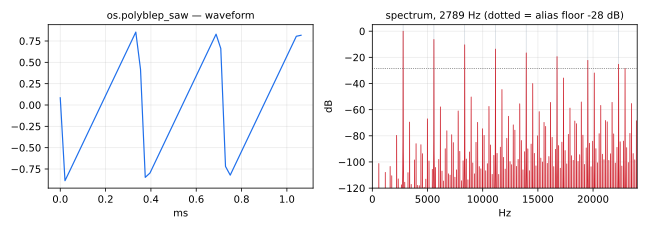

Sawtooth oscillator with suppressed aliasing (using `polyblep`).

#### Usage

```
polyblep_saw(freq) : _
```

Where:

* `freq`: frequency in Hz

#### Test
```
os = library("oscillators.lib");
ba = library("basics.lib");
ma = library("maths.lib");
polyblep_saw_test = os.polyblep_saw(220);
polyblep_saw_slider_test = os.polyblep_saw(hslider("polyblep_saw:freq", 220, 20, 20000, 1));
polyblep_saw_modulated_test = os.polyblep_saw(20*pow(1000, tri)) with { P = int(ma.SR/10); tri = 1 - abs(2*ba.period(P)/P - 1); };
```

----

### `(os.)polyblep_square`

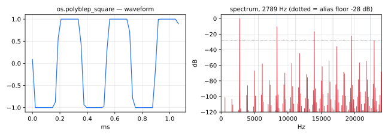

Square wave oscillator with suppressed aliasing (using `polyblep`).

#### Usage

```
polyblep_square(freq) : _
```

Where:

* `freq`: frequency in Hz

#### Test
```
os = library("oscillators.lib");
ba = library("basics.lib");
ma = library("maths.lib");
polyblep_square_test = os.polyblep_square(220);
polyblep_square_slider_test = os.polyblep_square(hslider("polyblep_square:freq", 220, 20, 20000, 1));
polyblep_square_modulated_test = os.polyblep_square(20*pow(1000, tri)) with { P = int(ma.SR/10); tri = 1 - abs(2*ba.period(P)/P - 1); };
```

----

### `(os.)polyblep_triangle`

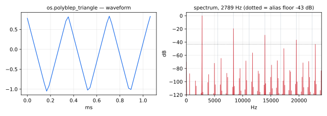

Triangle wave oscillator with suppressed aliasing (using `polyblep`).

#### Usage

```
polyblep_triangle(freq) : _
```

Where:

* `freq`: frequency in Hz

#### Test
```
os = library("oscillators.lib");
ba = library("basics.lib");
ma = library("maths.lib");
polyblep_triangle_test = os.polyblep_triangle(220);
polyblep_triangle_modulated_test = os.polyblep_triangle(20*pow(1000, tri)) with { P = int(ma.SR/10); tri = 1 - abs(2*ba.period(P)/P - 1); };
polyblep_triangle_jump_test = os.polyblep_triangle(20*pow(250, sq)) with { P = int(ma.SR/10); sq = ba.period(2*P) < P; };
```
