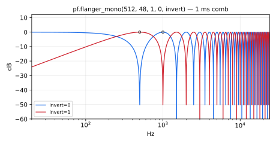
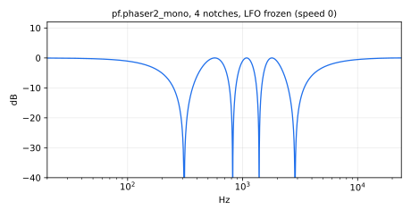

#  phaflangers.lib 

Phasers and Flangers library. Its official prefix is `pf`.

This library provides a set of phaser and flanger effects based on delay-line
modulation. 

The Phaflangers library is organized into 1 section:

* [Functions Reference](#functions-reference)

#### References

* [https://github.com/grame-cncm/faustlibraries/blob/master/phaflangers.lib](https://github.com/grame-cncm/faustlibraries/blob/master/phaflangers.lib)

## Functions Reference


----

### `(pf.)flanger_mono`



Mono flanging effect.

#### Usage:

```
_ : flanger_mono(dmax,curdel,depth,fb,invert) : _
```

Where:

* `dmax`: maximum delay-line length (power of 2) - 10 ms typical
* `curdel`: current dynamic delay (not to exceed dmax)
* `depth`: effect strength between 0 and 1 (1 typical)
* `fb`: feedback gain between 0 and 1 (0 typical)
* `invert`: 0 for normal, 1 to invert sign of flanging sum

#### Test
```
pf = library("phaflangers.lib");
os = library("oscillators.lib");
ba = library("basics.lib");
ma = library("maths.lib");
no = library("noises.lib");
flanger_mono_test = os.tosc(440) : pf.flanger_mono(4096, 1024, 0.7, 0.25, 0);
flanger_mono_slider_test = os.tosc(440) : pf.flanger_mono(4096, hslider("flanger_mono:curdel", 1024, 1, 4095, 1), hslider("flanger_mono:depth", 0.7, 0, 1, 0.01), hslider("flanger_mono:fb", 0.25, 0, 0.99, 0.01), 0);
flanger_mono_modulated_test = no.noise : pf.flanger_mono(512, 1 + 255*tri, 1, 0.7, 0) with { P = int(ma.SR/10); tri = 1 - abs(2*ba.period(P)/P - 1); };
flanger_mono_jump_test = no.noise : pf.flanger_mono(512, 1 + 255*sq, 1, 0.7, 0) with { P = int(ma.SR/10); sq = ba.period(2*P) < P; };
```

#### References

* [https://ccrma.stanford.edu/~jos/pasp/Flanging.html](https://ccrma.stanford.edu/~jos/pasp/Flanging.html)

----

### `(pf.)flanger_stereo`

Stereo flanging effect.
`flanger_stereo` is a standard Faust function.

#### Usage:

```
_,_ : flanger_stereo(dmax,curdel1,curdel2,depth,fb,invert) : _,_
```

Where:

* `dmax`: maximum delay-line length (power of 2) - 10 ms typical
* `curdel1`: current dynamic delay for the left channel (not to exceed dmax)
* `curdel2`: current dynamic delay for the right channel (not to exceed dmax)
* `depth`: effect strength between 0 and 1 (1 typical)
* `fb`: feedback gain between 0 and 1 (0 typical)
* `invert`: 0 for normal, 1 to invert sign of flanging sum

#### Test
```
pf = library("phaflangers.lib");
os = library("oscillators.lib");
flanger_stereo_test = os.tosc(440), os.tosc(660) : pf.flanger_stereo(4096, 1024, 1536, 0.7, 0.25, 0);
flanger_stereo_slider_test = os.tosc(440), os.tosc(660) : pf.flanger_stereo(4096, hslider("flanger_stereo:curdel1", 1024, 1, 4095, 1), hslider("flanger_stereo:curdel2", 1536, 1, 4095, 1), hslider("flanger_stereo:depth", 0.7, 0, 1, 0.01), hslider("flanger_stereo:fb", 0.25, 0, 0.99, 0.01), 0);
```

#### References      

* [https://ccrma.stanford.edu/~jos/pasp/Flanging.html](https://ccrma.stanford.edu/~jos/pasp/Flanging.html)

----

### `(pf.)vibrato2_mono`

Sweeping second-order resonant allpass chain with feedback, the core
used by `phaser2_mono`: `sections` allpass sections whose notch
frequencies are swept between `frqmin` and `frqmax` by a sinusoidal LFO.

#### Usage

```
_ : vibrato2_mono(sections,phase01,fb,width,frqmin,fratio,frqmax,speed) : _
```

Where:

* `sections`: number of second-order allpass sections (MACRO ARGUMENT - not a signal)
* `phase01`: phase of the LFO (0-1): crossfades between sine and cosine phase
* `fb`: feedback gain between -1 and 1
* `width`: approximate width of spectral notches in Hz
* `frqmin`: approximate minimum frequency of first spectral notch in Hz
* `fratio`: ratio of adjacent notch frequencies
* `frqmax`: approximate maximum frequency of first spectral notch in Hz
* `speed`: LFO frequency in Hz

#### Test
```
pf = library("phaflangers.lib");
os = library("oscillators.lib");
ba = library("basics.lib");
ma = library("maths.lib");
no = library("noises.lib");
vibrato2_mono_test = os.tosc(440) : pf.vibrato2_mono(4, 0, 0.5, 1000, 100, 1.5, 4800, 0.5);
vibrato2_mono_slider_test = os.tosc(440) : pf.vibrato2_mono(4, hslider("vibrato2_mono:phase01", 0, 0, 1, 0.01), hslider("vibrato2_mono:fb", 0.5, -0.99, 0.99, 0.01), hslider("vibrato2_mono:width", 1000, 10, 5000, 1), hslider("vibrato2_mono:frqmin", 100, 20, 5000, 1), hslider("vibrato2_mono:fratio", 1.5, 1, 4, 0.01), hslider("vibrato2_mono:frqmax", 4800, 20, 10000, 1), hslider("vibrato2_mono:speed", 0.5, 0, 10, 0.01));
vibrato2_mono_jump_test = no.noise : pf.vibrato2_mono(4, 0, 1.8*sq - 0.9, 1000, 100, 1.5, 4800, 0.5) with { P = int(ma.SR/10); sq = ba.period(2*P) < P; };
```

#### References

* [https://ccrma.stanford.edu/~jos/pasp/Phasing.html](https://ccrma.stanford.edu/~jos/pasp/Phasing.html)

----

### `(pf.)phaser2_mono`



Mono phasing effect.

#### Usage

```
_ : phaser2_mono(Notches,phase,width,frqmin,fratio,frqmax,speed,depth,fb,invert) : _
```

Where:

* `Notches`: number of spectral notches (MACRO ARGUMENT - not a signal)
* `phase`: phase of the oscillator (0-1)
* `width`: approximate width of spectral notches in Hz
* `frqmin`: approximate minimum frequency of first spectral notch in Hz
* `fratio`: ratio of adjacent notch frequencies
* `frqmax`: approximate maximum frequency of first spectral notch in Hz
* `speed`: LFO frequency in Hz (rate of periodic notch sweep cycles)
* `depth`: effect strength between 0 and 1 (1 typical) (aka "intensity")
           when depth=2, "vibrato mode" is obtained (pure allpass chain)
* `fb`: feedback gain between -1 and 1 (0 typical)
* `invert`: 0 for normal, 1 to invert sign of flanging sum

#### Test
```
pf = library("phaflangers.lib");
os = library("oscillators.lib");
phaser2_mono_test = os.tosc(330) : pf.phaser2_mono(4, 0.0, 50, 200, 1.5, 4000, 0.5, 0.8, 0.2, 0);
phaser2_mono_slider_test = os.tosc(330) : pf.phaser2_mono(4, hslider("phaser2_mono:phase01", 0, 0, 1, 0.01), hslider("phaser2_mono:width", 50, 10, 5000, 1), hslider("phaser2_mono:frqmin", 200, 20, 5000, 1), hslider("phaser2_mono:fratio", 1.5, 1, 4, 0.01), hslider("phaser2_mono:frqmax", 4000, 20, 10000, 1), hslider("phaser2_mono:speed", 0.5, 0, 10, 0.01), hslider("phaser2_mono:depth", 0.8, 0, 2, 0.01), hslider("phaser2_mono:fb", 0.2, -0.99, 0.99, 0.01), 0);
```

#### References

* [https://ccrma.stanford.edu/~jos/pasp/Phasing.html](https://ccrma.stanford.edu/~jos/pasp/Phasing.html)
* [http://www.geofex.com/Article_Folders/phasers/phase.html](http://www.geofex.com/Article_Folders/phasers/phase.html)
* 'An Allpass Approach to Digital Phasing and Flanging', Julius O. Smith III,
  Proc. Int. Computer Music Conf. (ICMC-84), pp. 103-109, Paris, 1984.
* CCRMA Tech. Report STAN-M-21: [https://ccrma.stanford.edu/STANM/stanms/stanm21/](https://ccrma.stanford.edu/STANM/stanms/stanm21/)

----

### `(pf.)phaser2_stereo`

Stereo phasing effect.
`phaser2_stereo` is a standard Faust function.

#### Usage

```
_,_ : phaser2_stereo(Notches,width,frqmin,fratio,frqmax,speed,depth,fb,invert) : _,_
```

Where:

* `Notches`: number of spectral notches (MACRO ARGUMENT - not a signal)
* `width`: approximate width of spectral notches in Hz
* `frqmin`: approximate minimum frequency of first spectral notch in Hz
* `fratio`: ratio of adjacent notch frequencies
* `frqmax`: approximate maximum frequency of first spectral notch in Hz
* `speed`: LFO frequency in Hz (rate of periodic notch sweep cycles)
* `depth`: effect strength between 0 and 1 (1 typical) (aka "intensity")
           when depth=2, "vibrato mode" is obtained (pure allpass chain)
* `fb`: feedback gain between -1 and 1 (0 typical)
* `invert`: 0 for normal, 1 to invert sign of flanging sum

#### Test
```
pf = library("phaflangers.lib");
os = library("oscillators.lib");
phaser2_stereo_test = os.tosc(220), os.tosc(330) : pf.phaser2_stereo(4, 50, 200, 1.5, 4000, 0.5, 0.8, 0.2, 0);
```

#### References

* [https://ccrma.stanford.edu/~jos/pasp/Phasing.html](https://ccrma.stanford.edu/~jos/pasp/Phasing.html)
* [http://www.geofex.com/Article_Folders/phasers/phase.html](http://www.geofex.com/Article_Folders/phasers/phase.html)
* 'An Allpass Approach to Digital Phasing and Flanging', Julius O. Smith III,
   Proc. Int. Computer Music Conf. (ICMC-84), pp. 103-109, Paris, 1984.
* CCRMA Tech. Report STAN-M-21: [https://ccrma.stanford.edu/STANM/stanms/stanm21/](https://ccrma.stanford.edu/STANM/stanms/stanm21/)
