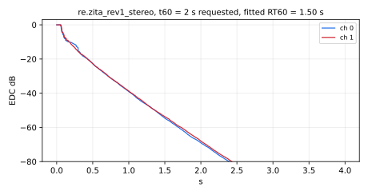
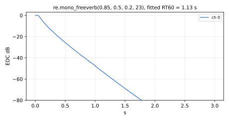
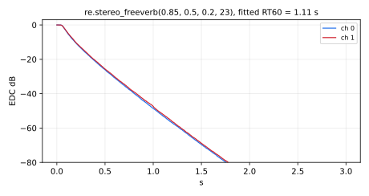
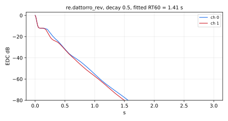

#  reverbs.lib 

Reverbs library. Its official prefix is `re`.

This library provides a collection of artificial reverberation algorithms in Faust.
It includes Schroeder, Moorer, Freeverb, and FDN-based designs. These modules can be used
for room simulation, spatialization, and creative ambience design in both mono and multichannel contexts.

The Reverbs library is organized into 7 sections:

* [Schroeder Reverberators](#schroeder-reverberators)
* [Feedback Delay Network (FDN) Reverberators](#feedback-delay-network-fdn-reverberators)
* [Freeverb](#freeverb)
* [Dattorro Reverb](#dattorro-reverb)
* [JPverb and Greyhole Reverbs](#jpverb-and-greyhole-reverbs)
* [Keith Barr Allpass Loop Reverb](#keith-barr-allpass-loop-reverb)
* [Others](#respringreverb)
#### References

* [https://github.com/grame-cncm/faustlibraries/blob/master/reverbs.lib](https://github.com/grame-cncm/faustlibraries/blob/master/reverbs.lib)

## Schroeder Reverberators


----

### `(re.)jcrev`

This artificial reverberator take a mono signal and output stereo
(`satrev`) and quad (`jcrev`). They were implemented by John Chowning
in the MUS10 computer-music language (descended from Music V by Max
Mathews).  They are Schroeder Reverberators, well tuned for their size.
Nowadays, the more expensive freeverb is more commonly used (see the
Faust examples directory).

`jcrev` reverb below was made from a listing of "RV", dated April 14, 1972,
which was recovered from an old SAIL DART backup tape.
John Chowning thinks this might be the one that became the
well known and often copied JCREV.

The delay-line lengths are the sample counts of the listing, fixed in
samples, so the decay time and the apparent room size scale with 1/SR.
The decay time is about 49,900 samples (T60 measured on the energy decay of
the impulse response): 1.13 s at 44.1 kHz, 1.04 s at 48 kHz, 0.52 s at
96 kHz, and 0.26 s at 192 kHz.

`jcrev` is a standard Faust function.

#### Usage

```
_ : jcrev : _,_,_,_
```

#### Test
```
re = library("reverbs.lib");
os = library("oscillators.lib");
jcrev_test = os.tosc(440) : re.jcrev;
```

----

### `(re.)satrev`

This artificial reverberator take a mono signal and output stereo
(`satrev`) and quad (`jcrev`).  They were implemented by John Chowning
in the MUS10 computer-music language (descended from Music V by Max
Mathews).  They are Schroeder Reverberators, well tuned for their size.
Nowadays, the more expensive freeverb is more commonly used (see the
Faust examples directory).

`satrev` was made from a listing of "SATREV", dated May 15, 1971,
which was recovered from an old SAIL DART backup tape.
John Chowning thinks this might be the one used on his
often-heard brass canon sound examples, one of which can be found at
[https://ccrma.stanford.edu/~jos/wav/FM-BrassCanon2.wav](https://ccrma.stanford.edu/~jos/wav/FM-BrassCanon2.wav).

As in `jcrev`, the delay-line lengths are fixed in samples, so the decay
time and the apparent room size scale with 1/SR. The decay time is about
28,600 samples (T60 measured on the energy decay of the impulse response):
0.65 s at 44.1 kHz, 0.60 s at 48 kHz, 0.30 s at 96 kHz, and 0.15 s at 192 kHz.

#### Usage

```
_ : satrev : _,_
```

#### Test
```
re = library("reverbs.lib");
os = library("oscillators.lib");
satrev_test = os.tosc(330) : re.satrev;
```

## Feedback Delay Network (FDN) Reverberators


----

### `(re.)fdnrev0`

Pure Feedback Delay Network Reverberator (generalized for easy scaling).
`fdnrev0` is a standard Faust function.

It has N inputs, one per delay line (added to the feedback signals), and
N outputs, the delay-line outputs. Any number of signals among 1, 2, 4,
..., N is usually spread over the inputs with `<:` and the outputs mixed
down with `:>` (see the Example below).

#### Usage

```
N = ba.count(delays);
si.bus(N) : fdnrev0(MAXDELAY,delays,BBSO,freqs,durs,loopgainmax,nonl) : si.bus(N)
```

Where:

* `N`: the number of delay lines, 2, 4, 8, ...  (power of 2)
* `MAXDELAY`: power of 2 at least as large as longest delay-line length
* `delays`: N delay lines, N a power of 2, lengths (in samples, at least 2) preferably coprime
* `BBSO`: odd positive integer = order of bandsplit desired at freqs
* `freqs`: NB-1 crossover frequencies separating desired frequency bands, in increasing order
* `durs`: NB decay times (t60) desired for the various bands, highest band first
  (the order of the `fi.filterbank` outputs, i.e., the reverse of `freqs`)
* `loopgainmax`: scalar gain between 0 and 1 used to "squelch" the reverb
* `nonl`: nonlinearity, between -1 and 1 exclusive (0 is linear): the input of each
  delay line goes through `fi.apnl(nonl,-nonl)`, a lossless first-order allpass whose
  coefficient switches between `nonl` and `-nonl` with the sign of its state
  (Pierce and Van Duyne's switching spring). The network stays passive, but the
  switching couples its modes and moves energy across frequency: the tail gets
  brighter and the band decay times somewhat shorter. The switching being
  asymmetric, part of the energy goes to DC, which stays in the loop and is
  removed at the outputs by a 5 Hz DC blocker. With `nonl = 0`, `fi.apnl` is
  exactly a unit delay, which the delay lines absorb, and the DC blocker is
  bypassed, so that the output is that of the linear network, sample for sample

#### Example

```
_,_ <: fdnrev0(MAXDELAY,delays,BBSO,freqs,durs,loopgainmax,nonl) :> _,_
```

#### Test
```
re = library("reverbs.lib");
os = library("oscillators.lib");
ba = library("basics.lib");
ma = library("maths.lib");
no = library("noises.lib");
fdnrev0_test = (os.tosc(220), os.tosc(330), os.tosc(440), os.tosc(550))
  <: re.fdnrev0(4096, (149, 211, 263, 293), 1, (800, 4000), (1.5, 2.0, 2.5), 0.8, 0.0);
fdnrev0_slider_test = (os.tosc(220), os.tosc(330), os.tosc(440), os.tosc(550)) <: re.fdnrev0(4096, (149, 211, 263, 293), 1, (hslider("fdnrev0:f1", 800, 50, 5000, 1), hslider("fdnrev0:f2", 4000, 100, 10000, 1)), (hslider("fdnrev0:t60high", 1.5, 0.1, 10, 0.01), hslider("fdnrev0:t60mid", 2.0, 0.1, 10, 0.01), hslider("fdnrev0:t60low", 2.5, 0.1, 10, 0.01)), hslider("fdnrev0:loopgainmax", 0.8, 0, 1, 0.01), hslider("fdnrev0:nonl", 0.0, 0, 0.999, 0.001));
fdnrev0_modulated_test = par(i, 4, no.noises(4, i)) <: re.fdnrev0(4096, (149, 211, 263, 293), 1, (800, 4000), (1.5, 0.5*pow(10, tri), 2.5), 0.8, 0.0) with { P = int(ma.SR/10); tri = 1 - abs(2*ba.period(P)/P - 1); };
fdnrev0_jump_test = par(i, 4, no.noises(4, i)) <: re.fdnrev0(4096, (149, 211, 263, 293), 1, (800, 4000), (1.5, 0.5*pow(10, sq), 2.5), 0.8, 0.0) with { P = int(ma.SR/10); sq = ba.period(2*P) < P; };
fdnrev0_nonl_test = no.multinoise(4)
  : re.fdnrev0(4096, (149, 211, 263, 293), 1, (800, 4000), (1.5, 2.0, 2.5), 0.8, 0.2);
fdnrev0_nonl_slider_test = no.multinoise(4)
  : re.fdnrev0(4096, (149, 211, 263, 293), 1, (800, 4000), (1.5, 2.0, 2.5), 0.8, hslider("fdnrev0:nonl", 0.2, -0.999, 0.999, 0.001));
fdnrev0_nonl_modulated_test = no.multinoise(4)
  : re.fdnrev0(4096, (149, 211, 263, 293), 1, (800, 4000), (1.5, 2.0, 2.5), 0.8, 0.4*tri - 0.2) with { P = int(ma.SR/10); tri = 1 - abs(2*ba.period(P)/P - 1); };
```

#### References

* [https://ccrma.stanford.edu/~jos/pasp/FDN_Reverberation.html](https://ccrma.stanford.edu/~jos/pasp/FDN_Reverberation.html)
* "Nonlinear Allpass Ladder Filters in FAUST" by Julius O. Smith and Romain Michon,
  Proc. DAFx-11, Paris, 2011 (section 4.3, nonlinear FDN)

----

### `(re.)zita_rev_fdn`

Internal 8x8 late-reverberation FDN used in the FOSS Linux reverb `zita-rev1`
by Fons Adriaensen <fons@linuxaudio.org>.  This is an FDN reverb with
allpass comb filters in each feedback delay in addition to the
damping filters.

As in `zita-rev1` (`reverb.cc`), each loop (allpass comb plus delay line)
is exactly `floor(0.5 + SR*t)` samples long for the eight loop times `t`
from 125 to 257 ms, and an `f2` above 0.49 `SR` places the T60 = t60m/2
point at Nyquist. One deliberate difference: the low shelf crossing
over at `f1` uses a bilinear-transform one-pole lowpass (`fi.lowpass(1,f1)`),
where `zita-rev1` uses y += w(x-y) with w = 2 pi f1/SR. The bilinear
version does not depend on the sampling rate; the two decay times differ
by under 1% at `f1` = 200 Hz and by up to 3% at `f1` = 1 kHz at 44.1 kHz.

#### Usage

```
si.bus(8) : zita_rev_fdn(f1,f2,t60dc,t60m,fsmax) : si.bus(8)
```

Where:

* `f1`: crossover frequency (Hz) separating dc and midrange frequencies
* `f2`: frequency (Hz) above f1 where T60 = t60m/2 (see below);
  above 0.49 `SR`, Nyquist
* `t60dc`: desired decay time (t60) at frequency 0 (sec)
* `t60m`: desired decay time (t60) at midrange frequencies (sec)
* `fsmax`: maximum sampling rate to be used (Hz), which sizes the delay lines:
  above it, the longer delays are clamped and the decay times come out short.
  192000 (the highest `ma.SR`) covers every rate.

#### Test
```
re = library("reverbs.lib");
os = library("oscillators.lib");
ba = library("basics.lib");
ma = library("maths.lib");
no = library("noises.lib");
zita_rev_fdn_test = par(i, 8, os.tosc(110 * (i + 1)))
  <: re.zita_rev_fdn(200, 2000, 3.0, 2.0, 192000);
zita_rev_fdn_slider_test = par(i, 8, os.tosc(110 * (i + 1))) <: re.zita_rev_fdn(hslider("zita_rev_fdn:f1", 200, 50, 1000, 1), hslider("zita_rev_fdn:f2", 2000, 1500, 20000, 1), hslider("zita_rev_fdn:t60dc", 3.0, 1, 8, 0.1), hslider("zita_rev_fdn:t60m", 2.0, 1, 8, 0.1), 192000);
zita_rev_fdn_modulated_test = par(i, 8, no.noises(8, i)) : re.zita_rev_fdn(200, 2000, 3.0, pow(20, tri), 192000) with { P = int(ma.SR/10); tri = 1 - abs(2*ba.period(P)/P - 1); };
zita_rev_fdn_jump_test = par(i, 8, no.noises(8, i)) : re.zita_rev_fdn(200, 2000, 3.0, pow(20, sq), 192000) with { P = int(ma.SR/10); sq = ba.period(2*P) < P; };
zita_rev_fdn_f2_test = no.multinoise(8)
  : re.zita_rev_fdn(200, 30000, 3.0, 2.0, 192000);
```

#### References

* [http://www.kokkinizita.net/linuxaudio/zita-rev1-doc/quickguide.html](http://www.kokkinizita.net/linuxaudio/zita-rev1-doc/quickguide.html)
* [https://ccrma.stanford.edu/~jos/pasp/Zita_Rev1.html](https://ccrma.stanford.edu/~jos/pasp/Zita_Rev1.html)

----

### `(re.)zita_in_delay`

Stereo input delay used by `zita_rev1` in both stereo and ambisonics
mode: delays both channels by `rdel` milliseconds (rounded to the nearest
sample) and scales them by 0.3. `zita_rev1_stereo` and `zita_rev1_ambi`
pass their own `rdel` minus 20 ms, as `zita-rev1` does.

#### Usage

```
_,_ : zita_in_delay(rdel) : _,_
```

Where:

* `rdel`: input delay (ms), e.g., 0 to ~100 ms; at most 170 ms at 192 kHz

#### Test
```
re = library("reverbs.lib");
os = library("oscillators.lib");
no = library("noises.lib");
zita_in_delay_test = os.tosc(440), os.tosc(660) : re.zita_in_delay(60);
zita_in_delay_long_test = no.noise, no.noise : re.zita_in_delay(200);
```

----

### `(re.)zita_distrib2`

Stereo input mapping used by `zita_rev1` in both stereo and ambisonics
mode: fans the two input channels out to the `N` delay lines of the
feedback delay network, flipping the sign of half of them. As in
`zita-rev1` (`reverb.cc`), the left input feeds the first `N/2` lines and
the right input the last `N/2`, each with signs `+` on the first half and
`-` on the second (for `N=8`: `L,L,-L,-L,R,R,-R,-R`).

#### Usage

```
_,_ : zita_distrib2(N) : si.bus(N)
```

Where:

* `N`: number of delay lines of the FDN, a power of two >= 4, known at compile time

#### Test
```
re = library("reverbs.lib");
os = library("oscillators.lib");
zita_distrib2_test = os.tosc(440), os.tosc(660) : re.zita_distrib2(8);
```

----

### `(re.)zita_rev1_stereo`



Extend `zita_rev_fdn` to include `zita_rev1` input/output mapping in stereo mode.
`zita_rev1_stereo` is a standard Faust function.

The output is the reverberation only (no dry signal). As in `zita-rev1`
(`reverb.cc`), the input delay is `rdel` - 20 ms, so that the first
echoes of the diffusion allpasses (13 to 32 ms) arrive about `rdel` ms
after the input, and the output gain is 0.525/sqrt(`t60m`), which offsets
the growth of the reverberant energy with the decay time (white noise in,
`t60dc` = `t60m`, `f2` = 23 kHz, at 48 kHz: the level falls 3.6 dB from
`t60m` = 1 to 8 s, where a fixed gain would rise 5.4 dB). 0.525 is the
`zita-rev1` wet gain 0.7 m (2-m) at its default dry/wet mix m = 0.5;
`dm.zita_rev1` applies the rest of that mix law.

#### Usage

```
_,_ : zita_rev1_stereo(rdel,f1,f2,t60dc,t60m,fsmax) : _,_
```

Where:

* `rdel`: delay in milliseconds before reverberation begins, 20 to 100 ms in `zita-rev1`
  (below 20 ms, as 20 ms; at most 190 ms at 192 kHz)
* `f1`: crossover frequency between low and mid decay regions
* `f2`: crossover frequency between mid and high decay regions
* `t60dc`: low-frequency decay time in seconds
* `t60m`: mid-band decay time in seconds
* `fsmax`: maximum supported sample rate (Hz), which sizes the delay lines (192000 covers every rate)

#### Test
```
re = library("reverbs.lib");
os = library("oscillators.lib");
no = library("noises.lib");
zita_rev1_stereo_test = (os.tosc(440), os.tosc(550))
  : re.zita_rev1_stereo(20, 200, 2000, 3.0, 2.0, 192000);
zita_rev1_stereo_slider_test = (os.tosc(440), os.tosc(550)) : re.zita_rev1_stereo(hslider("zita_rev1_stereo:rdel", 20, 0, 100, 1), hslider("zita_rev1_stereo:f1", 200, 50, 1000, 1), hslider("zita_rev1_stereo:f2", 2000, 1500, 20000, 1), hslider("zita_rev1_stereo:t60dc", 3.0, 1, 8, 0.1), hslider("zita_rev1_stereo:t60m", 2.0, 1, 8, 0.1), 192000);
zita_rev1_stereo_t60m_test = no.multinoise(2)
  : re.zita_rev1_stereo(60, 200, 6000, 3.0, 4.0, 192000);
```

----

### `(re.)zita_rev1_ambi`

Extend `zita_rev_fdn` to include `zita_rev1` input/output mapping in
"ambisonics mode", as provided in the Linux C++ version.

As in `zita-rev1` (`reverb.cc`), the input delay is `rdel` - 20 ms (see
`zita_rev1_stereo`), and the gain of the first output (W) is
1/sqrt(`t60m`), that of the other three (X, Y, Z) `rgxyz` dB more.

#### Usage

```
_,_ : zita_rev1_ambi(rgxyz,rdel,f1,f2,t60dc,t60m,fsmax) : _,_,_,_
```

Where:

* `rgxyz`: relative gain of lanes 1, 4, and 2 compared to lane 0 in the output (for example, -9 to 9 dB)
* `rdel`: delay in milliseconds before reverberation begins, 20 to 100 ms in `zita-rev1`
  (below 20 ms, as 20 ms; at most 190 ms at 192 kHz)
* `f1`: crossover frequency between low and mid decay regions
* `f2`: crossover frequency between mid and high decay regions
* `t60dc`: low-frequency decay time in seconds
* `t60m`: mid-band decay time in seconds
* `fsmax`: maximum supported sample rate (Hz), which sizes the delay lines (192000 covers every rate)

#### Test
```
re = library("reverbs.lib");
os = library("oscillators.lib");
no = library("noises.lib");
zita_rev1_ambi_test = (os.tosc(330), os.tosc(550))
  : re.zita_rev1_ambi(0.0, 25, 200, 2000, 3.0, 2.0, 192000);
zita_rev1_ambi_t60m_test = no.multinoise(2)
  : re.zita_rev1_ambi(6.0, 60, 200, 6000, 3.0, 4.0, 192000);
```

----

### `(re.)vital_rev`

A port of the reverb from the Vital synthesizer. All input parameters
have been normalized to a continuous [0,1] range, making them easy to modulate.
The scaling of the parameters happens inside the function.

#### Usage

```
_,_ : vital_rev(prelow, prehigh, lowcutoff, highcutoff, lowgain, highgain, chorus_amt, chorus_freq, predelay, time, size, mix) : _,_ 
```

Where:

* `prelow`: In the pre-filter, this is the cutoff frequency of a high-pass filter (hence a low value)
* `prehigh`: In the pre-filter, this is the cutoff frequency of a low-pass filter (hence a high value)
* `lowcutoff`: In the feedback filter stage, this is the cutoff frequency of a low-shelf filter
* `highcutoff`: In the feedback filter stage, this is the cutoff frequency of a high-shelf filter
* `lowgain`: In the feedback filter stage, this is the gain of a low-shelf filter
* `highgain`: In the feedback filter stage, this is the gain of a high-shelf filter
* `chorus_amt`: The amount of chorus modulation in the main delay lines
* `chorus_freq`: The LFO rate of chorus modulation in the main delay lines
* `predelay`: The amount of pre-delay time
* `time`: The decay time of the reverb
* `size`: The size of the room
* `mix`: A wetness value to use in a final dry/wet mixer

#### Test
```
re = library("reverbs.lib");
os = library("oscillators.lib");
ba = library("basics.lib");
ma = library("maths.lib");
no = library("noises.lib");
vital_rev_test = (os.tosc(330), os.tosc(440))
  : re.vital_rev(0.2, 0.8, 0.5, 0.7, 0.4, 0.6, 0.3, 0.2, 0.1, 0.7, 0.5, 0.4);
vital_rev_modulated_test = (no.noises(2, 0), no.noises(2, 1)) : re.vital_rev(0.2, 0.8, 0.5, 0.7, 0.4, 0.6, 0, 0.2, 0.1, 0.7, tri, 0.4) with { P = int(ma.SR/10); tri = 1 - abs(2*ba.period(P)/P - 1); };
vital_rev_jump_test = (no.noises(2, 0), no.noises(2, 1)) : re.vital_rev(0.2, 0.8, 0.5, 0.7, 0.4, 0.6, 0, 0.2, 0.1, 0.3 + 0.6*sq, 0.5, 0.4) with { P = int(ma.SR/10); sq = ba.period(2*P) < P; };
```

## Freeverb


----

### `(re.)mono_freeverb`



A simple Schroeder reverberator primarily developed by "Jezar at Dreampoint" that
is extensively used in the free-software world. It uses four Schroeder allpasses in
series and eight parallel Schroeder-Moorer filtered-feedback comb-filters for each
audio channel, and is said to be especially well tuned.

`mono_freeverb` is a standard Faust function.

#### Usage

```
_ : mono_freeverb(fb1, fb2, damp, spread) : _
```

Where:

* `fb1`: coefficient of the lowpass comb filters (0-1)
* `fb2`: coefficient of the allpass comb filters (0-1)
* `damp`: damping of the lowpass comb filter (0-1)
* `spread`: spatial spread in number of samples (for stereo)

#### Test
```
re = library("reverbs.lib");
os = library("oscillators.lib");
ba = library("basics.lib");
ma = library("maths.lib");
no = library("noises.lib");
mono_freeverb_test = os.tosc(440) : re.mono_freeverb(0.7, 0.5, 0.3, 30);
mono_freeverb_slider_test = os.tosc(440) : re.mono_freeverb(hslider("mono_freeverb:fb1", 0.7, 0, 0.99, 0.01), hslider("mono_freeverb:fb2", 0.5, 0, 0.99, 0.01), hslider("mono_freeverb:damp", 0.3, 0, 1, 0.01), 30);
mono_freeverb_modulated_test = no.noise : re.mono_freeverb(0.7, 0.5, tri, 30) with { P = int(ma.SR/10); tri = 1 - abs(2*ba.period(P)/P - 1); };
mono_freeverb_jump_test = no.noise : re.mono_freeverb(0.5 + 0.45*sq, 0.5, 0.3, 30) with { P = int(ma.SR/10); sq = ba.period(2*P) < P; };
```

#### License
While this version is licensed LGPL (with exception) along with other GRAME
library functions, the file freeverb.dsp in the examples directory of older
Faust distributions, such as faust-0.9.85, was released under the BSD license,
which is less restrictive.

----

### `(re.)stereo_freeverb`



A simple Schroeder reverberator primarily developed by "Jezar at Dreampoint" that
is extensively used in the free-software world. It uses four Schroeder allpasses in
series and eight parallel Schroeder-Moorer filtered-feedback comb-filters for each
audio channel, and is said to be especially well tuned.

#### Usage

```
_,_ : stereo_freeverb(fb1, fb2, damp, spread) : _,_
```

Where:

* `fb1`: coefficient of the lowpass comb filters (0-1)
* `fb2`: coefficient of the allpass comb filters (0-1)
* `damp`: damping of the lowpass comb filter (0-1)
* `spread`: spatial spread in number of samples (for stereo)

#### Test
```
re = library("reverbs.lib");
os = library("oscillators.lib");
stereo_freeverb_test = (os.tosc(330), os.tosc(550))
  : re.stereo_freeverb(0.7, 0.5, 0.3, 30);
```

## Dattorro Reverb


----

### `(re.)dattorro_rev`



Reverberator based on the Dattorro reverb topology. This implementation does
not use modulated delay lengths (excursion).

#### Usage

```
_,_ : dattorro_rev(pre_delay, bw, i_diff1, i_diff2, decay, d_diff1, d_diff2, damping) : _,_
```

Where:

* `pre_delay`: pre-delay in samples (fixed at compile time)
* `bw`: band-width filter (pre filtering); (0 - 1)
* `i_diff1`: input diffusion factor 1; (0 - 1)
* `i_diff2`: input diffusion factor 2;
* `decay`: decay rate; (0 - 1); infinite decay = 1.0
* `d_diff1`: decay diffusion factor 1; (0 - 1)
* `d_diff2`: decay diffusion factor 2;
* `damping`: high-frequency damping; no damping = 0.0

#### Test
```
re = library("reverbs.lib");
os = library("oscillators.lib");
ba = library("basics.lib");
ma = library("maths.lib");
no = library("noises.lib");
dattorro_rev_test = (os.tosc(330), os.tosc(550))
  : re.dattorro_rev(200, 0.5, 0.7, 0.6, 0.5, 0.7, 0.5, 0.2);
dattorro_rev_slider_test = (os.tosc(330), os.tosc(550)) : re.dattorro_rev(200, hslider("dattorro_rev:bw", 0.5, 0, 1, 0.01), hslider("dattorro_rev:i_diff1", 0.7, 0, 1, 0.01), hslider("dattorro_rev:i_diff2", 0.6, 0, 1, 0.01), hslider("dattorro_rev:decay", 0.5, 0, 0.99, 0.01), hslider("dattorro_rev:d_diff1", 0.7, 0, 1, 0.01), hslider("dattorro_rev:d_diff2", 0.5, 0, 1, 0.01), hslider("dattorro_rev:damping", 0.2, 0, 1, 0.01));
dattorro_rev_modulated_test = (no.noises(2, 0), no.noises(2, 1)) : re.dattorro_rev(200, 0.5, 0.7, 0.6, 0.5, 0.7, 0.5, tri) with { P = int(ma.SR/10); tri = 1 - abs(2*ba.period(P)/P - 1); };
dattorro_rev_jump_test = (no.noises(2, 0), no.noises(2, 1)) : re.dattorro_rev(200, 0.5, 0.7, 0.6, 0.3 + 0.6*sq, 0.7, 0.5, 0.2) with { P = int(ma.SR/10); sq = ba.period(2*P) < P; };
```

#### References

* [https://ccrma.stanford.edu/~dattorro/EffectDesignPart1.pdf](https://ccrma.stanford.edu/~dattorro/EffectDesignPart1.pdf)

----

### `(re.)dattorro_rev_default`

Reverberator based on the Dattorro reverb topology with reverb parameters from the
original paper.
This implementation does not use modulated delay lengths (excursion) and
uses zero length pre-delay.

#### Usage

```
_,_ : dattorro_rev_default : _,_
```

#### Test
```
re = library("reverbs.lib");
os = library("oscillators.lib");
dattorro_rev_default_test = (os.tosc(330), os.tosc(550))
  : re.dattorro_rev_default;
```

#### References

* [https://ccrma.stanford.edu/~dattorro/EffectDesignPart1.pdf](https://ccrma.stanford.edu/~dattorro/EffectDesignPart1.pdf)

## JPverb and Greyhole Reverbs


----

### `(re.)jpverb`

An algorithmic reverb (stereo in/out), inspired by the lush chorused sound 
of certain vintage Lexicon and Alesis reverberation units. 
Designed to sound great with synthetic sound sources, rather than sound like a realistic space.

#### Usage

```
_,_ : jpverb(t60, damp, size, early_diff, mod_depth, mod_freq, low, mid, high, low_cutoff, high_cutoff) : _,_
```

Where:

* `t60`: approximate reverberation time in seconds ([0.1..60] sec) (T60 - the time for the reverb to decay by 60db when damp == 0 ). Does not effect early reflections
* `damp`: controls damping of high-frequencies as the reverb decays. 0 is no damping, 1 is very strong damping. Values should be in the range ([0..1])
* `size`: scales size of delay-lines within the reverberator, producing the impression of a larger or smaller space. Values below 1 can sound metallic. Values should be in the range [0.5..5]
* `early_diff`: controls shape of early reflections. Values of 0.707 or more produce smooth exponential decay. Lower values produce a slower build-up of echoes. Values should be in the range ([0..1])
* `mod_depth`: depth ([0..1]) of delay-line modulation. Use in combination with `mod_freq` to set amount of chorusing within the structure
* `mod_freq`: frequency ([0..10] Hz) of delay-line modulation. Use in combination with `mod_depth` to set amount of chorusing within the structure
* `low`: multiplier ([0..1]) for the reverberation time within the low band
* `mid`: multiplier ([0..1]) for the reverberation time within the mid band
* `high`: multiplier ([0..1]) for the reverberation time within the high band
* `low_cutoff`: frequency (100..6000 Hz) at which the crossover between the low and mid bands of the reverb occurs
* `high_cutoff`: frequency (1000..10000 Hz) at which the crossover between the mid and high bands of the reverb occurs

#### Test
```
re = library("reverbs.lib");
os = library("oscillators.lib");
ba = library("basics.lib");
ma = library("maths.lib");
no = library("noises.lib");
jpverb_test = (os.tosc(330), os.tosc(440))
  : re.jpverb(3.0, 0.2, 1.0, 0.8, 0.3, 0.4, 0.9, 0.8, 0.7, 500, 4000);
jpverb_slider_test = (os.tosc(330), os.tosc(440)) : re.jpverb(hslider("jpverb:t60", 3.0, 0.1, 60, 0.1), hslider("jpverb:damp", 0.2, 0, 0.999, 0.001), hslider("jpverb:size", 1.0, 0.5, 5, 0.01), hslider("jpverb:early_diff", 0.8, 0, 0.99, 0.001), hslider("jpverb:mod_depth", 0.3, 0, 1, 0.01), hslider("jpverb:mod_freq", 0.4, 0, 10, 0.01), hslider("jpverb:low", 0.9, 0, 1, 0.01), hslider("jpverb:mid", 0.8, 0, 1, 0.01), hslider("jpverb:high", 0.7, 0, 1, 0.01), hslider("jpverb:low_cutoff", 500, 100, 6000, 1), hslider("jpverb:high_cutoff", 4000, 1000, 10000, 1));
jpverb_modulated_test = (no.noises(2, 0), no.noises(2, 1)) : re.jpverb(0.5*pow(20, tri), 0.2, 1.0, 0.8, 0, 0.4, 0.9, 0.8, 0.7, 500, 4000) with { P = int(ma.SR/10); tri = 1 - abs(2*ba.period(P)/P - 1); };
jpverb_jump_test = (no.noises(2, 0), no.noises(2, 1)) : re.jpverb(3.0, 0.9*sq, 1.0, 0.8, 0, 0.4, 0.9, 0.8, 0.7, 500, 4000) with { P = int(ma.SR/10); sq = ba.period(2*P) < P; };
```

#### References

* [https://doc.sccode.org/Overviews/DEIND.html](https://doc.sccode.org/Overviews/DEIND.html)

----

### `(re.)greyhole`

A complex echo-like effect (stereo in/out), inspired by the classic Eventide effect of a similar name. 
The effect consists of a diffuser (like a mini-reverb, structurally similar to the one used in `jpverb`)
connected in a feedback system with a long, modulated delay-line. 
Excels at producing spacey washes of sound.

#### Usage

```
_,_ : greyhole(dt, damp, size, early_diff, feedback, mod_depth, mod_freq) : _,_
```

Where:

* `dt`: approximate reverberation time in seconds ([0.1..60 sec])
* `damp`: controls damping of high-frequencies as the reverb decays. 0 is no damping, 1 is very strong damping. Values should be between ([0..1])
* `size`: control of relative "room size" roughly in the range ([0.5..3])
* `early_diff`: controls pattern of echoes produced by the diffuser. At very low values, the diffuser acts like a delay-line whose length is controlled by the 'size' parameter. Medium values produce a slow build-up of echoes, giving the sound a reversed-like quality. Values of 0.707 or greater than produce smooth exponentially decaying echoes. Values should be in the range ([0..1])
* `feedback`: amount of feedback through the system. Sets the number of repeating echoes. A setting of 1.0 produces infinite sustain. Values should be in the range ([0..1])
* `mod_depth`: depth ([0..1]) of delay-line modulation. Use in combination with `mod_freq` to produce chorus and pitch-variations in the echoes
* `mod_freq`: frequency ([0..10] Hz) of delay-line modulation. Use in combination with `mod_depth` to produce chorus and pitch-variations in the echoes

#### Test
```
re = library("reverbs.lib");
os = library("oscillators.lib");
ba = library("basics.lib");
ma = library("maths.lib");
no = library("noises.lib");
greyhole_test = (os.tosc(220), os.tosc(440))
  : re.greyhole(2.0, 0.3, 1.0, 0.6, 0.5, 0.4, 0.2);
greyhole_slider_test = (os.tosc(220), os.tosc(440)) : re.greyhole(hslider("greyhole:dt", 2.0, 0.1, 60, 0.1), hslider("greyhole:damp", 0.3, 0, 0.99, 0.001), hslider("greyhole:size", 1.0, 0.5, 3, 0.01), hslider("greyhole:early_diff", 0.6, 0, 0.99, 0.001), hslider("greyhole:feedback", 0.5, 0, 1, 0.01), hslider("greyhole:mod_depth", 0.4, 0, 1, 0.01), hslider("greyhole:mod_freq", 0.2, 0, 10, 0.01));
greyhole_modulated_test = (no.noises(2, 0), no.noises(2, 1)) : re.greyhole(2.0, 0.3, 1.0, 0.6, 0.2 + 0.7*tri, 0, 0.2) with { P = int(ma.SR/10); tri = 1 - abs(2*ba.period(P)/P - 1); };
greyhole_jump_test = (no.noises(2, 0), no.noises(2, 1)) : re.greyhole(2.0, 0.3, 1.0, 0.6, 0.2 + 0.7*sq, 0, 0.2) with { P = int(ma.SR/10); sq = ba.period(2*P) < P; };
```

#### References

* [https://doc.sccode.org/Overviews/DEIND.html](https://doc.sccode.org/Overviews/DEIND.html)

## Keith Barr Allpass Loop Reverb


----

### `(re.)kb_rom_rev1`

Reverberator based on Keith Barr's all-pass single feedback loop reverb topology. Originally designed for the Spin Semiconductor FV-1 chip, this code is an adaptation of the rom_rev1.spn file, part of the Spin Semiconductor Free DSP Programs available on the Spin Semiconductor website.  
It was submitted by Keith Barr himself and written in Spin Semiconductor Assembly, a dedicated assembly language for programming the FV-1 chip.  

In this topology, when multiple delays and all-pass filters are placed in a loop, sound injected into the loop will recirculate, increasing the density of any impulse as the signal successively passes through the all-pass filters. 
The result, after a short period of time, is a wash of sound, completely diffused into a natural reverb tail.  

The reverb typically has a mono input (as from a single source) but benefits from a stereo output, providing the listener with a fuller, more immersive reverberant image.

#### Usage

```
_,_ : kb_rom_rev1(rt, damp) : _,_
```

Where:

* `rt`: coefficent of the decay of the reverb (0-1)
* `damp`: coefficient of the lowpass filters (0-1)

#### Test
```
re = library("reverbs.lib");
os = library("oscillators.lib");
kb_rom_rev1_test = (os.tosc(330), os.tosc(660))
  : re.kb_rom_rev1(0.7, 0.3);
kb_rom_rev1_slider_test = (os.tosc(330), os.tosc(660)) : re.kb_rom_rev1(hslider("kb_rom_rev1:rt", 0.7, 0, 0.99, 0.01), hslider("kb_rom_rev1:damp", 0.3, 0, 1, 0.01));
```

#### References

* [https://www.spinsemi.com/programs.php#:~:text=Keith%20Barr-,rom_rev1.spn,-ROM%20reverb%202](https://www.spinsemi.com/programs.php#:~:text=Keith%20Barr-,rom_rev1.spn,-ROM%20reverb%202)
* [https://www.spinsemi.com/knowledge_base/effects.html#Reverberation](https://www.spinsemi.com/knowledge_base/effects.html#Reverberation)
* [https://www.spinsemi.com/knowledge_base/inst_syntax.html](https://www.spinsemi.com/knowledge_base/inst_syntax.html)

## Valhalla Supermassive


----

### `(re.)valhallaSupermassive`

Model of six modes of Valhalla DSP's free ValhallaSupermassive delay/reverb:
feedback delay networks and cascades of matrix allpasses, with delay lines of
up to 2 s, modulated by a shared quadrature LFO.

| `mode` | name | structure |
|---|---|---|
| 0 | Gemini | sixteen modulated delays, scattered by a butterfly of rotations |
| 2 | Centaurus | four serial four-channel matrix allpasses |
| 3 | Sagittarius | eight serial stereo matrix allpasses |
| 4 | Great Annihilator | a plain four-channel stage and three matrix allpasses inside a global feedback loop |
| 6 | Lyra | four modulated delays with a four-channel scattering matrix |
| 19 | Virgo | Lyra with highpass and lowpass filters inside the feedback loop |

The mode numbers are the plug-in's own. The structures follow the diagrams
Sean Costello presented at DAFx26; delay, gain, modulation and filter laws
were matched to the plug-in (v5.0.0). Stereo in, stereo out.

#### Usage

```
_,_ : valhallaSupermassive(mode, mix, delay, warp, feedback, density, width,
                           lowcut, highcut, modrate, moddepth) : _,_
```

Where:

* `mode`: the mode number (see the table), a constant numerical expression
* `mix`: dry/wet mix (0-1), equal-power
* `delay`: base delay time in milliseconds (0-2000)
* `warp`: spreads the delay lengths below `delay` (0-1)
* `feedback`: feedback amount (0-1)
* `density`: scattering angle of the rotation matrices (0-1)
* `width`: stereo width of the wet signal (-1 to 1; 1 is full width,
  0 is mono, -1 swaps the channels)
* `lowcut`: highpass cutoff in Hz (10-2000)
* `highcut`: lowpass cutoff in Hz (200-20000)
* `modrate`: LFO rate in Hz (0.01-10)
* `moddepth`: modulation depth (0-1)

#### Test
```
re = library("reverbs.lib");
os = library("oscillators.lib");
valhallaSupermassive_test = (os.osc(330), os.osc(440))
   : re.valhallaSupermassive(6, 0.5, 200, 0.3, 0.6, 0.3, 1, 10, 20000, 0.5, 0.2);
valhallaSupermassive_gemini_test = (os.osc(330), os.osc(440))
   : re.valhallaSupermassive(0, 0.5, 200, 0.3, 0.6, 0.3, 1, 10, 20000, 0.5, 0.2);
valhallaSupermassive_centaurus_test = (os.osc(330), os.osc(440))
   : re.valhallaSupermassive(2, 0.5, 200, 0.3, 0.6, 0.3, 1, 10, 20000, 0.5, 0.2);
valhallaSupermassive_sagittarius_test = (os.osc(330), os.osc(440))
   : re.valhallaSupermassive(3, 0.5, 200, 0.3, 0.6, 0.3, 1, 10, 20000, 0.5, 0.2);
valhallaSupermassive_annihilator_test = (os.osc(330), os.osc(440))
   : re.valhallaSupermassive(4, 0.5, 200, 0.3, 0.6, 0.3, 1, 10, 20000, 0.5, 0.2);
valhallaSupermassive_virgo_test = (os.osc(330), os.osc(440))
   : re.valhallaSupermassive(19, 0.5, 200, 0.3, 0.6, 0.3, 1, 10, 20000, 0.5, 0.2);
```

#### References

* S. Costello, keynote, 29th Int. Conf. Digital Audio Effects (DAFx26),
  Cambridge, MA, USA, 2026
* S. Costello, "Plugin Design: Rescue Your Darlings," Valhalla DSP, 2021,
*   [https://valhalladsp.com/2021/08/16/put-it-down-for-now-pick-it-back-up-later/](https://valhalladsp.com/2021/08/16/put-it-down-for-now-pick-it-back-up-later/)
* [https://valhalladsp.com/shop/reverb/valhalla-supermassive/](https://valhalladsp.com/shop/reverb/valhalla-supermassive/)

## Others


----

### `(re.)springreverb`

Mono spring-inspired reverb originally designed for the Chaos Audio Stratus, which defines all parameters
in the [0..10] range. They have been remapped to more typical [0..1] ranges in this implementation.
Uses a diffusion stage into a bank of damped delay lines with Hadamard
feedback mixing to emulate the lively, metallic character of multi-spring tanks.

#### Usage

```
_ : springreverb(dwell, blend, tone, tension, springs) : _
```

Where:

* `dwell`: feedback amount controlling decay length ([0..1])
* `blend`: wet gain scaling ([0..1], maps to 0..0.8)
* `tone`: lowpass cutoff applied to the wet path ([0..1])
* `tension`: base spring delay time and tail length ([0..1])
* `springs`: spacing preset between spring delays (0 = left, 1 = right, 2 = middle)

#### Test
```
re = library("reverbs.lib");
os = library("oscillators.lib");
ba = library("basics.lib");
ma = library("maths.lib");
no = library("noises.lib");
springreverb_test = os.tosc(330)
  : re.springreverb(0.5, 0.5, 0.5, 0.5, 1);
springreverb_slider_test = os.tosc(330) : re.springreverb(hslider("springreverb:dwell", 0.5, 0, 1, 0.01), hslider("springreverb:blend", 0.5, 0, 1, 0.01), hslider("springreverb:tone", 0.5, 0, 1, 0.01), hslider("springreverb:tension", 0.5, 0, 1, 0.01), 1);
springreverb_modulated_test = no.noise : re.springreverb(0.5, 0.5, tri, 0.5, 1) with { P = int(ma.SR/10); tri = 1 - abs(2*ba.period(P)/P - 1); };
springreverb_jump_test = no.noise : re.springreverb(0.5, 0.5, sq, 0.5, 1) with { P = int(ma.SR/10); sq = ba.period(2*P) < P; };
```
