#  tonestacks.lib 

A library of guitar amplifier tone stack emulations, from the Guitarix
project, based on the circuit analysis of D.T. Yeh (some component values
taken from the CAPS plugin suite). Each model is the classic passive
treble/middle/bass network of a well-known amplifier, discretized by
bilinear transform from its schematic component values.

The models are normally used through their own namespace:

```
ts = library("tonestacks.lib");
process = ts.jcm2000(t,m,l);
```

#### References

* [https://github.com/grame-cncm/faustlibraries/blob/master/tonestacks.lib](https://github.com/grame-cncm/faustlibraries/blob/master/tonestacks.lib)
* D.T. Yeh and J.O. Smith, "Discretization of the '59 Fender Bassman Tone
  Stack", Proc. of the 9th Int. Conference on Digital Audio Effects (DAFx-06).

----

### `tonestack`

Generic tone stack: computes the bilinear-transformed transfer function
of the classic passive treble/middle/bass network from its schematic
component values. All the amplifier models below are instances of this
function with measured component values.

#### Usage

```
_ : tonestack(C1,C2,C3,R1,R2,R3,R4,t,m,l) : _
```

Where:

* `C1`, `C2`, `C3`: capacitor values of the network, in Farads
* `R1`, `R2`, `R3`, `R4`: resistor values of the network, in Ohms
* `t`: treble control, between 0 and 1
* `m`: middle control, between 0 and 1
* `l`: bass control, between 0 and 1

----

### `bassman`

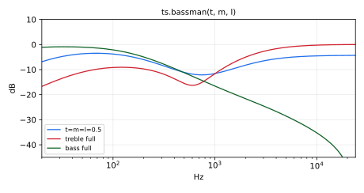

Tone stack of the 1959 Fender Bassman 5F6-A.

#### Usage

```
_ : bassman(t,m,l) : _
```

Where:

* `t`: treble control, between 0 and 1
* `m`: middle control, between 0 and 1
* `l`: bass control, between 0 and 1

----

### `mesa`

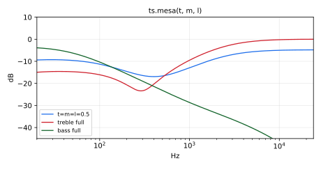

Tone stack of the Mesa Boogie Mark.

#### Usage

```
_ : mesa(t,m,l) : _
```

Where:

* `t`: treble control, between 0 and 1
* `m`: middle control, between 0 and 1
* `l`: bass control, between 0 and 1

----

### `twin`

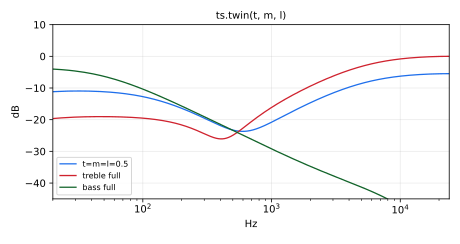

Tone stack of the 1969 Fender Twin Reverb AA270.

#### Usage

```
_ : twin(t,m,l) : _
```

Where:

* `t`: treble control, between 0 and 1
* `m`: middle control, between 0 and 1
* `l`: bass control, between 0 and 1

----

### `princeton`

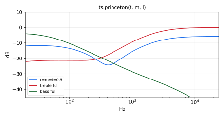

Tone stack of the 1964 Fender Princeton AA1164.

#### Usage

```
_ : princeton(t,m,l) : _
```

Where:

* `t`: treble control, between 0 and 1
* `m`: middle control, between 0 and 1
* `l`: bass control, between 0 and 1

----

### `jcm800`

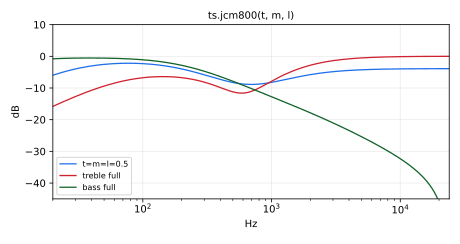

Tone stack of the Marshall JCM-800 Lead 100 (model 2203).

#### Usage

```
_ : jcm800(t,m,l) : _
```

Where:

* `t`: treble control, between 0 and 1
* `m`: middle control, between 0 and 1
* `l`: bass control, between 0 and 1

----

### `jcm2000`

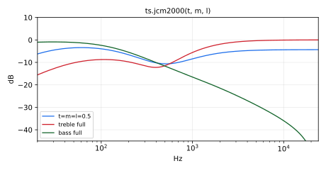

Tone stack of the Marshall JCM-2000 Lead.

#### Usage

```
_ : jcm2000(t,m,l) : _
```

Where:

* `t`: treble control, between 0 and 1
* `m`: middle control, between 0 and 1
* `l`: bass control, between 0 and 1

----

### `jtm45`

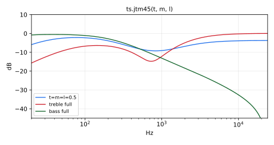

Tone stack of the Marshall JTM 45.

#### Usage

```
_ : jtm45(t,m,l) : _
```

Where:

* `t`: treble control, between 0 and 1
* `m`: middle control, between 0 and 1
* `l`: bass control, between 0 and 1

----

### `mlead`

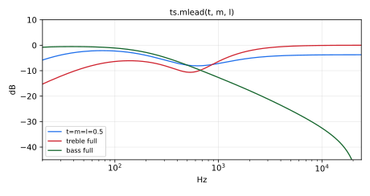

Tone stack of the 1967 Marshall Major Lead 200.

#### Usage

```
_ : mlead(t,m,l) : _
```

Where:

* `t`: treble control, between 0 and 1
* `m`: middle control, between 0 and 1
* `l`: bass control, between 0 and 1

----

### `m2199`

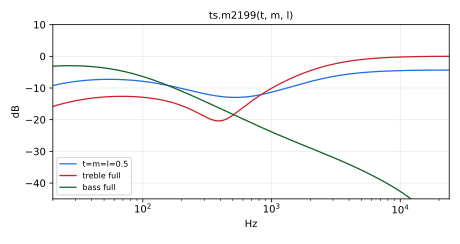

Tone stack of the Marshall M2199 30W solid state.

#### Usage

```
_ : m2199(t,m,l) : _
```

Where:

* `t`: treble control, between 0 and 1
* `m`: middle control, between 0 and 1
* `l`: bass control, between 0 and 1

----

### `ac30`

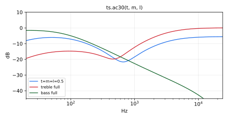

Tone stack of the Vox AC-30.

#### Usage

```
_ : ac30(t,m,l) : _
```

Where:

* `t`: treble control, between 0 and 1
* `m`: middle control, between 0 and 1
* `l`: bass control, between 0 and 1

----

### `ac15`

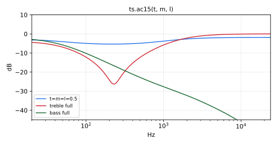

Tone stack of the Vox AC-15.

#### Usage

```
_ : ac15(t,m,l) : _
```

Where:

* `t`: treble control, between 0 and 1
* `m`: middle control, between 0 and 1
* `l`: bass control, between 0 and 1

----

### `soldano`

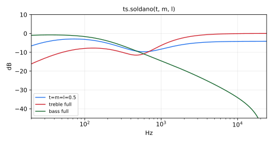

Tone stack of the Soldano SLO 100.

#### Usage

```
_ : soldano(t,m,l) : _
```

Where:

* `t`: treble control, between 0 and 1
* `m`: middle control, between 0 and 1
* `l`: bass control, between 0 and 1

----

### `sovtek`

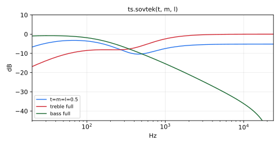

Tone stack of the Sovtek MIG 100H.

#### Usage

```
_ : sovtek(t,m,l) : _
```

Where:

* `t`: treble control, between 0 and 1
* `m`: middle control, between 0 and 1
* `l`: bass control, between 0 and 1

----

### `peavey`

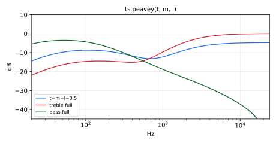

Tone stack of the Peavey C20.

#### Usage

```
_ : peavey(t,m,l) : _
```

Where:

* `t`: treble control, between 0 and 1
* `m`: middle control, between 0 and 1
* `l`: bass control, between 0 and 1

----

### `ibanez`

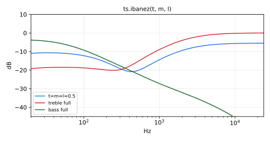

Tone stack of the Ibanez GX20.

#### Usage

```
_ : ibanez(t,m,l) : _
```

Where:

* `t`: treble control, between 0 and 1
* `m`: middle control, between 0 and 1
* `l`: bass control, between 0 and 1

----

### `roland`

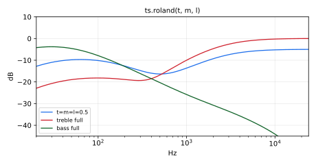

Tone stack of the Roland Cube 60.

#### Usage

```
_ : roland(t,m,l) : _
```

Where:

* `t`: treble control, between 0 and 1
* `m`: middle control, between 0 and 1
* `l`: bass control, between 0 and 1

----

### `ampeg`

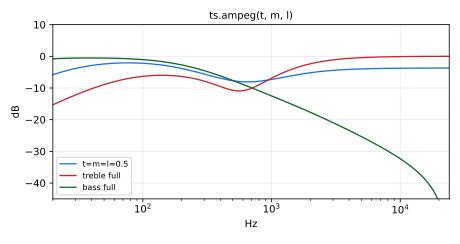

Tone stack of the Ampeg VL 501.

#### Usage

```
_ : ampeg(t,m,l) : _
```

Where:

* `t`: treble control, between 0 and 1
* `m`: middle control, between 0 and 1
* `l`: bass control, between 0 and 1

----

### `ampeg_rev`

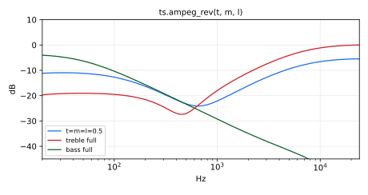

Tone stack of the Ampeg Reverbrocket.

#### Usage

```
_ : ampeg_rev(t,m,l) : _
```

Where:

* `t`: treble control, between 0 and 1
* `m`: middle control, between 0 and 1
* `l`: bass control, between 0 and 1

----

### `bogner`

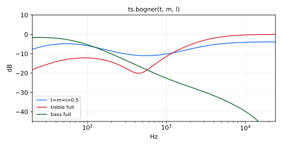

Tone stack of the Bogner Triple Giant preamp.

#### Usage

```
_ : bogner(t,m,l) : _
```

Where:

* `t`: treble control, between 0 and 1
* `m`: middle control, between 0 and 1
* `l`: bass control, between 0 and 1

----

### `groove`

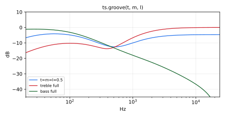

Tone stack of the Groove Tubes Trio preamp.

#### Usage

```
_ : groove(t,m,l) : _
```

Where:

* `t`: treble control, between 0 and 1
* `m`: middle control, between 0 and 1
* `l`: bass control, between 0 and 1

----

### `crunch`

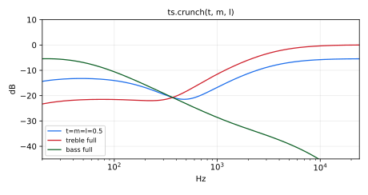

Tone stack of the Hughes & Kettner.

#### Usage

```
_ : crunch(t,m,l) : _
```

Where:

* `t`: treble control, between 0 and 1
* `m`: middle control, between 0 and 1
* `l`: bass control, between 0 and 1

----

### `fender_blues`

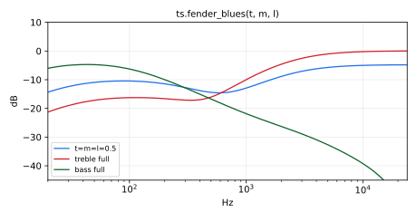

Tone stack of the Fender Blues Junior.

#### Usage

```
_ : fender_blues(t,m,l) : _
```

Where:

* `t`: treble control, between 0 and 1
* `m`: middle control, between 0 and 1
* `l`: bass control, between 0 and 1

----

### `fender_default`

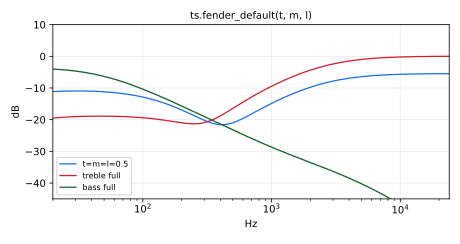

Tone stack of the Fender (generic).

#### Usage

```
_ : fender_default(t,m,l) : _
```

Where:

* `t`: treble control, between 0 and 1
* `m`: middle control, between 0 and 1
* `l`: bass control, between 0 and 1

----

### `fender_deville`

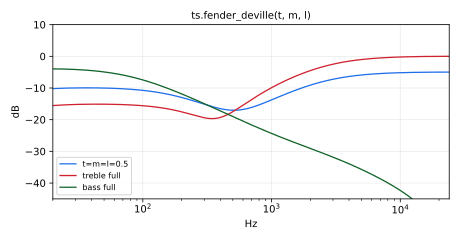

Tone stack of the Fender Hot Rod DeVille.

#### Usage

```
_ : fender_deville(t,m,l) : _
```

Where:

* `t`: treble control, between 0 and 1
* `m`: middle control, between 0 and 1
* `l`: bass control, between 0 and 1

----

### `gibsen`

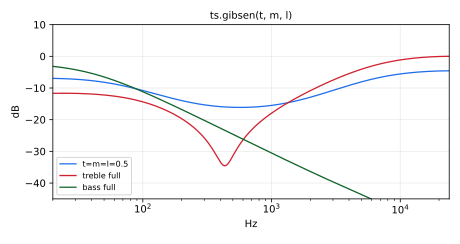

Tone stack of the Gibson GS12 Reverbrocket.

#### Usage

```
_ : gibsen(t,m,l) : _
```

Where:

* `t`: treble control, between 0 and 1
* `m`: middle control, between 0 and 1
* `l`: bass control, between 0 and 1
