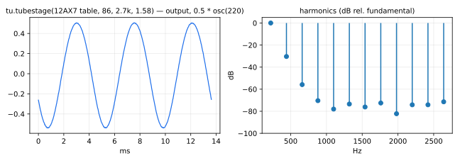
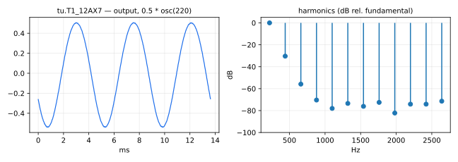
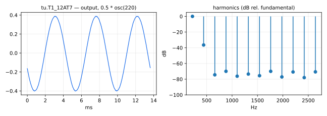
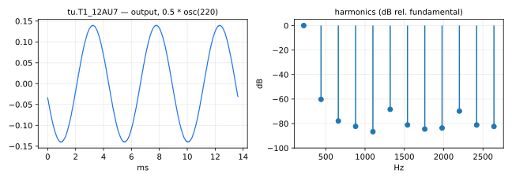
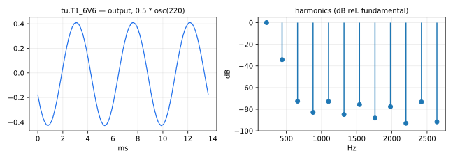
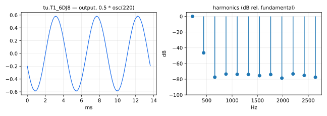
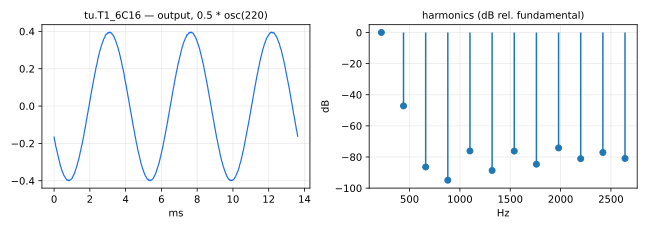

#  tubes.lib 

Vacuum tube amplifier stage emulations from the Guitarix project. The
transfer curve of each tube is stored as a precomputed table
(`tubetable_*`), interpolated at run time; `tubestage` wraps one table
into a complete gain stage with its cathode-capacitor highpass. The
`T1_*`/`T2_*`/`T3_*` functions below instantiate the first, second and
third preamp stage of each supported tube model.

The models are normally used through their own namespace:

```
tu = library("tubes.lib");
process = tu.T1_12AX7 : *(preamp) : tu.T2_12AX7;
```

#### References

* [https://github.com/grame-cncm/faustlibraries/blob/master/tubes.lib](https://github.com/grame-cncm/faustlibraries/blob/master/tubes.lib)
* [https://github.com/brummer10/guitarix](https://github.com/brummer10/guitarix)

----

### `tubestage`



One complete triode gain stage: table-driven waveshaping followed by the
highpass formed by the cathode capacitor and resistor.
`tubestageF(tb,vplus,divider,fck,Rk,Vk0)` is the fully parameterized form;
`tubestage(tb,fck,Rk,Vk0)` uses the standard 250V supply with divider 40,
and `tubestage130_20(tb,fck,Rk,Vk0)` a 130V supply with divider 20.

#### Usage

```
_ : tubestage(tb,fck,Rk,Vk0) : _
_ : tubestage130_20(tb,fck,Rk,Vk0) : _
_ : tubestageF(tb,vplus,divider,fck,Rk,Vk0) : _
```

Where:

* `tb`: a tube transfer-curve table (one of the `tubetable_*` waveforms)
* `vplus`: supply voltage in Volts (`tubestageF` only)
* `divider`: output voltage divider factor (`tubestageF` only)
* `fck`: cutoff frequency in Hz of the cathode highpass
* `Rk`: cathode resistor value in Ohms
* `Vk0`: quiescent cathode voltage in Volts

----

### `T1_12AX7`, `T2_12AX7`, `T3_12AX7`



First, second and third preamp stage of a 12AX7 (high-gain dual triode, the classic guitar preamp tube),
with the bias values used by the Guitarix amplifiers.

#### Usage

```
_ : T1_12AX7 : _
```

----

### `T1_12AT7`, `T2_12AT7`, `T3_12AT7`



First, second and third preamp stage of a 12AT7 (medium-gain dual triode),
with the bias values used by the Guitarix amplifiers.

#### Usage

```
_ : T1_12AT7 : _
```

----

### `T1_12AU7`, `T2_12AU7`, `T3_12AU7`



First, second and third preamp stage of a 12AU7 (low-gain dual triode),
with the bias values used by the Guitarix amplifiers.

#### Usage

```
_ : T1_12AU7 : _
```

----

### `T1_6V6`, `T2_6V6`, `T3_6V6`



First, second and third preamp stage of a 6V6 (beam power tetrode, wired as a triode),
with the bias values used by the Guitarix amplifiers.

#### Usage

```
_ : T1_6V6 : _
```

----

### `T1_6DJ8`, `T2_6DJ8`, `T3_6DJ8`



First, second and third preamp stage of a 6DJ8 / ECC88 (low-noise dual triode),
with the bias values used by the Guitarix amplifiers.

#### Usage

```
_ : T1_6DJ8 : _
```

----

### `T1_6C16`, `T2_6C16`, `T3_6C16`



First, second and third preamp stage of a 6C16 (single triode),
with the bias values used by the Guitarix amplifiers.

#### Usage

```
_ : T1_6C16 : _
```
