#  vaeffects.lib 

Virtual Analog Effects (VAE) library. Its official prefix is `ve`.

This library provides virtual analog (VA) audio effects modeled after classic
analog circuitry. It includes nonlinear filters and effects.

The virtual analog filter library is organized into 6 sections:

* [Moog Filters](#moog-filters)
* [Korg 35 Filters](#korg-35-filters)
* [Oberheim Filters](#oberheim-filters)
* [Sallen Key Filters](#sallen-key-filters)
* [Vicanek's Matched (Decramped) Second-Order Filters](#vicaneks-matched-decramped-second-order-filters)
* [Effects](#effects)

#### References

* [https://github.com/grame-cncm/faustlibraries/blob/master/vaeffects.lib](https://github.com/grame-cncm/faustlibraries/blob/master/vaeffects.lib)

## Moog Filters


----

### `(ve.)moog_vcf`

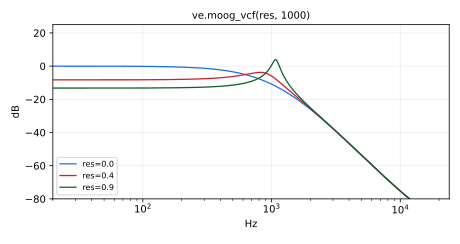

Moog "Voltage Controlled Filter" (VCF) in "analog" form. Moog VCF
implemented using the same logical block diagram as the classic
analog circuit.  As such, it neglects the one-sample delay associated
with the feedback path around the four one-poles.
This extra delay alters the response, especially at high frequencies
(see reference [1] for details).
See `moog_vcf_2b` below for a more accurate implementation.

#### Usage

```
_ : moog_vcf(res,fr) : _
```

Where:

* `res`: normalized amount of corner-resonance between 0 and 1 
(0 is no resonance, 1 is maximum)
* `fr`: corner-resonance frequency in Hz. The filter is stable for `fr` below
SR/6.28 at `res` <= 0.25, SR/6.88 at 0.5, SR/7.34 at 0.8 and SR/7.58 as `res`
approaches 1, so keep `fr` below about SR/7.6

#### Test
```
ve = library("vaeffects.lib");
os = library("oscillators.lib");
no = library("noises.lib");
ba = library("basics.lib");
ma = library("maths.lib");
moog_vcf_test = os.tosc(440) : ve.moog_vcf(0.5, 1000);
moog_vcf_slider_test = os.tosc(440)
  : ve.moog_vcf(
      hslider("moog_vcf:res", 0.5, 0, 1, 0.01),
      hslider("moog_vcf:freq", 1000, 50, 4000, 1)
    );
moog_vcf_modulated_test = no.noise : ve.moog_vcf(0.9, 50*pow(100, tri)) with { P = int(ma.SR/10); tri = 1 - abs(2*ba.period(P)/P - 1); };
moog_vcf_jump_test = no.noise : ve.moog_vcf(0.9, 50*pow(100, sq)) with { P = int(ma.SR/10); sq = ba.period(2*P) < P; };
```

#### References

* [https://ccrma.stanford.edu/~stilti/papers/moogvcf.pdf](https://ccrma.stanford.edu/~stilti/papers/moogvcf.pdf)
* [https://ccrma.stanford.edu/~jos/pasp/vegf.html](https://ccrma.stanford.edu/~jos/pasp/vegf.html)

----

### `(ve.)moog_vcf_2b`, `(ve.)moog_vcf_2bn`

Moog "Voltage Controlled Filter" (VCF) as two biquads. Implementation
of the ideal Moog VCF transfer function factored into second-order
sections. As a result, it is more accurate than `moog_vcf` above, but
its coefficient formulas are more complex when one or both parameters
are varied.  Here, res is the fourth root of that in `moog_vcf`, so, as
the sampling rate approaches infinity, `moog_vcf(res^4,fr)` becomes equivalent
to `moog_vcf_2b[n](res,fr)` (when res and fr are constant).
`moog_vcf_2b` uses two direct-form biquads (`tf2`).
`moog_vcf_2bn` uses two protected normalized-ladder biquads (`tf2np`).

#### Usage

```
_ : moog_vcf_2b(res,fr) : _
_ : moog_vcf_2bn(res,fr) : _
```

Where:

* `res`: normalized amount of corner-resonance between 0 and 1
(0 is min resonance, 1 is maximum)
* `fr`: corner-resonance frequency in Hz

#### Test
```
ve = library("vaeffects.lib");
os = library("oscillators.lib");
no = library("noises.lib");
ba = library("basics.lib");
ma = library("maths.lib");
moog_vcf_2b_test = os.tosc(330) : ve.moog_vcf_2b(0.4, 1200);
moog_vcf_2b_slider_test = os.tosc(330)
  : ve.moog_vcf_2b(
      hslider("moog_vcf_2b:res", 0.4, 0, 1, 0.01),
      hslider("moog_vcf_2b:freq", 1200, 50, 6000, 1)
    );
moog_vcf_2b_modulated_test = no.noise : ve.moog_vcf_2b(0.95, 20*pow(500, tri)) with { P = int(ma.SR/10); tri = 1 - abs(2*ba.period(P)/P - 1); };
moog_vcf_2b_jump_test = no.noise : ve.moog_vcf_2b(0.95, 20*pow(500, sq)) with { P = int(ma.SR/10); sq = ba.period(2*P) < P; };
moog_vcf_2bn_test = os.tosc(330) : ve.moog_vcf_2bn(0.4, 1200);
moog_vcf_2bn_slider_test = os.tosc(330)
  : ve.moog_vcf_2bn(
      hslider("moog_vcf_2bn:res", 0.4, 0, 1, 0.01),
      hslider("moog_vcf_2bn:freq", 1200, 50, 6000, 1)
    );
moog_vcf_2bn_modulated_test = no.noise : ve.moog_vcf_2bn(0.95, 20*pow(500, tri)) with { P = int(ma.SR/10); tri = 1 - abs(2*ba.period(P)/P - 1); };
moog_vcf_2bn_jump_test = no.noise : ve.moog_vcf_2bn(0.95, 20*pow(500, sq)) with { P = int(ma.SR/10); sq = ba.period(2*P) < P; };
```

----

### `(ve.)moogLadder`

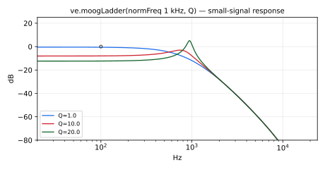

Virtual analog model of the 4th-order Moog Ladder (without any nonlinearities), which is arguably the 
most well-known ladder filter in analog synthesizers. Several 
1st-order filters are cascaded in series. Feedback is then used, in part, to 
control the cut-off frequency and the resonance.

#### Usage

```
_ : moogLadder(normFreq,Q) : _
```

Where:

* `normFreq`: normalized frequency (0-1)
* `Q`: quality factor between .707 (0 feedback coefficient) to 25 (feedback = 4, which is the self-oscillating threshold).

#### Test
```
ve = library("vaeffects.lib");
os = library("oscillators.lib");
no = library("noises.lib");
ba = library("basics.lib");
ma = library("maths.lib");
moogLadder_test = os.tosc(220) : ve.moogLadder(0.3, 4);
moogLadder_slider_test = os.tosc(220)
  : ve.moogLadder(
      hslider("moogLadder:normFreq", 0.3, 0, 1, 0.001),
      hslider("moogLadder:Q", 4, 0.7, 20, 0.1)
    );
moogLadder_modulated_test = no.noise : ve.moogLadder(0.8*tri, 20) with { P = int(ma.SR/10); tri = 1 - abs(2*ba.period(P)/P - 1); };
moogLadder_jump_test = no.noise : ve.moogLadder(0.8*sq, 20) with { P = int(ma.SR/10); sq = ba.period(2*P) < P; };
```

#### References

* [Zavalishin 2012] (revision 2.1.2, February 2020)
* [https://www.discodsp.net/VAFilterDesign_2.1.2.pdf](https://www.discodsp.net/VAFilterDesign_2.1.2.pdf)
* Lorenzo Della Cioppa's correction to Pirkle's implementation: [https://www.kvraudio.com/forum/viewtopic.php?f=33<https://www.kvraudio.com/forum/viewtopic.php?f=33&t=571909>t=571909](https://www.kvraudio.com/forum/viewtopic.php?f=33<https://www.kvraudio.com/forum/viewtopic.php?f=33&t=571909>t=571909)

----

### `(ve.)lowpassLadder4`

Topology-preserving transform implementation of a four-pole ladder lowpass.
This is essentially the same filter as the moogLadder above except for 
the parameters, which will be expressed in Hz, for the cutoff, and as a
raw feedback coefficient, for the resonance. 
Also, note that the parameter order has changed.

#### Usage

```
_ : lowpassLadder4(k, CF) : _
```

Where:

* `k`: feedback coefficient between 0 and 4, which is the stability threshold.
* `CF`: the filter's cutoff in Hz.

#### Test
```
ve = library("vaeffects.lib");
os = library("oscillators.lib");
no = library("noises.lib");
ba = library("basics.lib");
ma = library("maths.lib");
lowpassLadder4_test = os.tosc(110) : ve.lowpassLadder4(2.0, 800);
lowpassLadder4_slider_test = os.tosc(110)
  : ve.lowpassLadder4(
      hslider("lowpassLadder4:k", 2.0, 0, 4, 0.1),
      hslider("lowpassLadder4:freq", 800, 50, 5000, 1)
    );
lowpassLadder4_modulated_test = no.noise : ve.lowpassLadder4(3.9, 20*pow(250, tri)) with { P = int(ma.SR/10); tri = 1 - abs(2*ba.period(P)/P - 1); };
lowpassLadder4_jump_test = no.noise : ve.lowpassLadder4(3.9, 20*pow(250, sq)) with { P = int(ma.SR/10); sq = ba.period(2*P) < P; };
```

Notes:

If you want to express the feedback coefficient as the resonance peak, you can use the formula: 

     k = 4.0 - 1.0 / Q;

where Q, between .25 and infinity, corresponds to the peak of the filter at cutoff. 
I.e., if you feed the filter with a sine whose frequency is the same as the cutoff, the output 
peak corresponds exactly to that set via the Q-param.
#### References

* [Zavalishin 2012] (revision 2.1.2, February 2020)
* [https://www.discodsp.net/VAFilterDesign_2.1.2.pdf](https://www.discodsp.net/VAFilterDesign_2.1.2.pdf)

----

### `(ve.)moogHalfLadder`

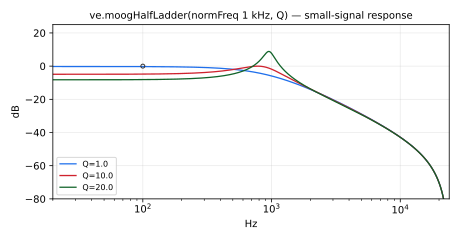

Virtual analog model of the 2nd-order Moog Half Ladder (simplified version of
`(ve.)moogLadder`). Several 1st-order filters are cascaded in series. 
Feedback is then used, in part, to control the cut-off frequency and the 
resonance.

This filter was implemented in Faust by Eric Tarr during the 
[2019 Embedded DSP With Faust Workshop](https://ccrma.stanford.edu/workshops/faust-embedded-19/).

#### Usage

```
_ : moogHalfLadder(normFreq,Q) : _
```

Where:

* `normFreq`: normalized frequency (0-1)
* `Q`: q

#### Test
```
ve = library("vaeffects.lib");
os = library("oscillators.lib");
no = library("noises.lib");
ba = library("basics.lib");
ma = library("maths.lib");
moogHalfLadder_test = os.tosc(220) : ve.moogHalfLadder(0.3, 4);
moogHalfLadder_slider_test = os.tosc(220)
  : ve.moogHalfLadder(
      hslider("moogHalfLadder:normFreq", 0.3, 0, 1, 0.001),
      hslider("moogHalfLadder:Q", 4, 0.7, 20, 0.1)
    );
moogHalfLadder_modulated_test = no.noise : ve.moogHalfLadder(0.8*tri, 20) with { P = int(ma.SR/10); tri = 1 - abs(2*ba.period(P)/P - 1); };
moogHalfLadder_jump_test = no.noise : ve.moogHalfLadder(0.8*sq, 20) with { P = int(ma.SR/10); sq = ba.period(2*P) < P; };
```

#### References

* [https://www.willpirkle.com/app-notes/virtual-analog-moog-half-ladder-filter](https://www.willpirkle.com/app-notes/virtual-analog-moog-half-ladder-filter)
* [http://www.willpirkle.com/Downloads/AN-8MoogHalfLadderFilter.pdf](http://www.willpirkle.com/Downloads/AN-8MoogHalfLadderFilter.pdf)

----

### `(ve.)diodeLadder`

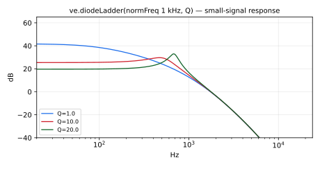

4th order virtual analog diode ladder filter. In addition to the individual 
states used within each independent 1st-order filter, there are also additional 
feedback paths found in the block diagram. These feedback paths are labeled 
as connecting states. Rather than separately storing these connecting states 
in the Faust implementation, they are simply implicitly calculated by 
tracing back to the other states (`s1`,`s2`,`s3`,`s4`) each recursive step.

This filter was implemented in Faust by Eric Tarr during the 
[2019 Embedded DSP With Faust Workshop](https://ccrma.stanford.edu/workshops/faust-embedded-19/).

#### Usage

```
_ : diodeLadder(normFreq,Q) : _
```

Where:

* `normFreq`: normalized frequency (0-1)
* `Q`: q

#### Test
```
ve = library("vaeffects.lib");
os = library("oscillators.lib");
no = library("noises.lib");
ba = library("basics.lib");
ma = library("maths.lib");
diodeLadder_test = os.tosc(220) : ve.diodeLadder(0.4, 4);
diodeLadder_slider_test = os.tosc(220)
  : ve.diodeLadder(
      hslider("diodeLadder:normFreq", 0.4, 0, 1, 0.001),
      hslider("diodeLadder:Q", 4, 0.7, 20, 0.1)
    );
diodeLadder_modulated_test = no.noise : ve.diodeLadder(0.8*tri, 20) with { P = int(ma.SR/10); tri = 1 - abs(2*ba.period(P)/P - 1); };
diodeLadder_jump_test = no.noise : ve.diodeLadder(0.8*sq, 20) with { P = int(ma.SR/10); sq = ba.period(2*P) < P; };
```

#### References

* [https://www.willpirkle.com/virtual-analog-diode-ladder-filter/](https://www.willpirkle.com/virtual-analog-diode-ladder-filter/)
* [http://www.willpirkle.com/Downloads/AN-6DiodeLadderFilter.pdf](http://www.willpirkle.com/Downloads/AN-6DiodeLadderFilter.pdf)

## Korg 35 Filters

The following filters are virtual analog models of the Korg 35 low-pass 
filter and high-pass filter found in the MS-10 and MS-20 synthesizers.
The virtual analog models for the LPF and HPF are different, making these 
filters more interesting than simply tapping different states of the same 
circuit. 

These filters were implemented in Faust by Eric Tarr during the 
[2019 Embedded DSP With Faust Workshop](https://ccrma.stanford.edu/workshops/faust-embedded-19/).

#### Filter history:

* [https://secretlifeofsynthesizers.com/the-korg-35-filter/](https://secretlifeofsynthesizers.com/the-korg-35-filter/)

----

### `(ve.)korg35LPF`

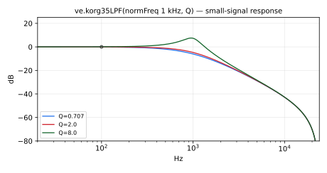

Virtual analog models of the Korg 35 low-pass filter found in the MS-10 and 
MS-20 synthesizers.

#### Usage

```
_ : korg35LPF(normFreq,Q) : _
```

Where:

* `normFreq`: normalized frequency (0-1)
* `Q`: q

#### Test
```
ve = library("vaeffects.lib");
os = library("oscillators.lib");
no = library("noises.lib");
ba = library("basics.lib");
ma = library("maths.lib");
korg35LPF_test = os.tosc(220) : ve.korg35LPF(0.35, 3.5);
korg35LPF_slider_test = os.tosc(220)
  : ve.korg35LPF(
      hslider("korg35LPF:normFreq", 0.35, 0, 1, 0.001),
      hslider("korg35LPF:Q", 3.5, 0.7, 10, 0.1)
    );
korg35LPF_modulated_test = no.noise : ve.korg35LPF(0.8*tri, 9.5) with { P = int(ma.SR/10); tri = 1 - abs(2*ba.period(P)/P - 1); };
korg35LPF_jump_test = no.noise : ve.korg35LPF(0.8*sq, 9.5) with { P = int(ma.SR/10); sq = ba.period(2*P) < P; };
```

----

### `(ve.)korg35HPF`

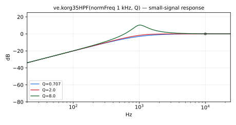

Virtual analog models of the Korg 35 high-pass filter found in the MS-10 and 
MS-20 synthesizers.

#### Usage

```
_ : korg35HPF(normFreq,Q) : _
```

Where:

* `normFreq`: normalized frequency (0-1)
* `Q`: q

#### Test
```
ve = library("vaeffects.lib");
os = library("oscillators.lib");
no = library("noises.lib");
ba = library("basics.lib");
ma = library("maths.lib");
korg35HPF_test = os.tosc(330) : ve.korg35HPF(0.4, 3.5);
korg35HPF_slider_test = os.tosc(330)
  : ve.korg35HPF(
      hslider("korg35HPF:normFreq", 0.4, 0, 1, 0.001),
      hslider("korg35HPF:Q", 3.5, 0.7, 10, 0.1)
    );
korg35HPF_modulated_test = no.noise : ve.korg35HPF(0.8*tri, 9.5) with { P = int(ma.SR/10); tri = 1 - abs(2*ba.period(P)/P - 1); };
korg35HPF_jump_test = no.noise : ve.korg35HPF(0.8*sq, 9.5) with { P = int(ma.SR/10); sq = ba.period(2*P) < P; };
```

## Oberheim Filters

The following filter (4 types) is an implementation of the virtual analog 
model described in Section 7.2 of the Will Pirkle book, "Designing Software 
Synthesizer Plug-ins in C++". It is based on the block diagram in Figure 7.5. 

The Oberheim filter is a state-variable filter with soft-clipping distortion 
within the circuit. 

In many VA filters, distortion is accomplished using the "tanh" function. 
For this Faust implementation, that distortion function was replaced with 
the `(ef.)cubicnl` function.

----

### `(ve.)oberheim`

Generic multi-outputs Oberheim filter that produces the BSF, BPF, HPF and LPF outputs (see description above).

#### Usage

```
_ : oberheim(normFreq,Q) : _,_,_,_
```

Where:

* `normFreq`: normalized frequency (0-1)
* `Q`: q

#### Test
```
ve = library("vaeffects.lib");
os = library("oscillators.lib");
no = library("noises.lib");
ba = library("basics.lib");
ma = library("maths.lib");
oberheim_test = os.tosc(220) : ve.oberheim(0.4, 1.5);
oberheim_slider_test = os.tosc(220)
  : ve.oberheim(
      hslider("oberheim:normFreq", 0.4, 0, 1, 0.001),
      hslider("oberheim:Q", 1.5, 0.5, 10, 0.1)
    );
oberheim_modulated_test = no.noise : ve.oberheim(0.8*tri, 10) with { P = int(ma.SR/10); tri = 1 - abs(2*ba.period(P)/P - 1); };
oberheim_jump_test = no.noise : ve.oberheim(0.8*sq, 10) with { P = int(ma.SR/10); sq = ba.period(2*P) < P; };
```

----

### `(ve.)oberheimBSF`

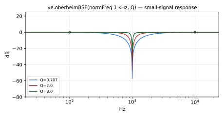

Band-Stop Oberheim filter (see description above). 
Specialize the generic implementation: keep the first BSF output, 
the compiler will only generate the needed code.

#### Usage

```
_ : oberheimBSF(normFreq,Q) : _
```

Where:

* `normFreq`: normalized frequency (0-1)
* `Q`: q

#### Test
```
ve = library("vaeffects.lib");
os = library("oscillators.lib");
oberheimBSF_test = os.tosc(220) : ve.oberheimBSF(0.4, 1.5);
oberheimBSF_slider_test = os.tosc(220)
  : ve.oberheimBSF(
      hslider("oberheimBSF:normFreq", 0.4, 0, 1, 0.001),
      hslider("oberheimBSF:Q", 1.5, 0.5, 10, 0.1)
    );
```

----

### `(ve.)oberheimBPF`

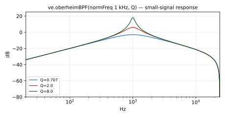

Band-Pass Oberheim filter (see description above).
Specialize the generic implementation: keep the second BPF output, 
the compiler will only generate the needed code.

#### Usage

```
_ : oberheimBPF(normFreq,Q) : _
```

Where:

* `normFreq`: normalized frequency (0-1)
* `Q`: q

#### Test
```
ve = library("vaeffects.lib");
os = library("oscillators.lib");
oberheimBPF_test = os.tosc(220) : ve.oberheimBPF(0.4, 1.5);
oberheimBPF_slider_test = os.tosc(220)
  : ve.oberheimBPF(
      hslider("oberheimBPF:normFreq", 0.4, 0, 1, 0.001),
      hslider("oberheimBPF:Q", 1.5, 0.5, 10, 0.1)
    );
```

----

### `(ve.)oberheimHPF`

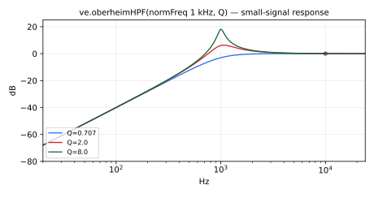

High-Pass Oberheim filter (see description above).
Specialize the generic implementation: keep the third HPF output, 
the compiler will only generate the needed code.

#### Usage

```
_ : oberheimHPF(normFreq,Q) : _
```

Where:

* `normFreq`: normalized frequency (0-1)
* `Q`: q

#### Test
```
ve = library("vaeffects.lib");
os = library("oscillators.lib");
oberheimHPF_test = os.tosc(220) : ve.oberheimHPF(0.4, 1.5);
oberheimHPF_slider_test = os.tosc(220)
  : ve.oberheimHPF(
      hslider("oberheimHPF:normFreq", 0.4, 0, 1, 0.001),
      hslider("oberheimHPF:Q", 1.5, 0.5, 10, 0.1)
    );
```

----

### `(ve.)oberheimLPF`

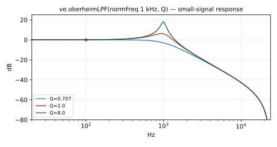

Low-Pass Oberheim filter (see description above). 
Specialize the generic implementation: keep the fourth LPF output,
the compiler will only generate the needed code.

#### Usage

```
_ : oberheimLPF(normFreq,Q) : _
```

Where:

* `normFreq`: normalized frequency (0-1)
* `Q`: q

#### Test
```
ve = library("vaeffects.lib");
os = library("oscillators.lib");
oberheimLPF_test = os.tosc(220) : ve.oberheimLPF(0.4, 1.5);
oberheimLPF_slider_test = os.tosc(220)
  : ve.oberheimLPF(
      hslider("oberheimLPF:normFreq", 0.4, 0, 1, 0.001),
      hslider("oberheimLPF:Q", 1.5, 0.5, 10, 0.1)
    );
```

## Sallen Key Filters

The following filters were implemented based on VA models of synthesizer 
filters.

The modeling approach is based on a Topology Preserving Transform (TPT) to 
resolve the delay-free feedback loop in the corresponding analog filters.  

The primary processing block used to build other filters (Moog, Korg, etc.) is
based on a 1st-order Sallen-Key filter. 

The filters included in this script are 1st-order LPF/HPF and 2nd-order 
state-variable filters capable of LPF, HPF, and BPF.  

#### Resources:

* Vadim Zavalishin (2018) "The Art of VA Filter Design", v2.1.0
* [https://www.discodsp.net/VAFilterDesign_2.1.0.pdf](https://www.discodsp.net/VAFilterDesign_2.1.0.pdf)
* Will Pirkle (2014) "Resolving Delay-Free Loops in Recursive Filters Using 
the Modified Härmä Method", AES 137 [http://www.aes.org/e-lib/browse.cfm?elib=17517](http://www.aes.org/e-lib/browse.cfm?elib=17517)
* Description and diagrams of 1st- and 2nd-order TPT filters: 
* [https://www.willpirkle.com/706-2/](https://www.willpirkle.com/706-2/)

----

### `(ve.)sallenKeyOnePole`

Sallen-Key generic One Pole filter that produces the LPF and HPF outputs (see description above).

For the Faust implementation of this filter, recursion (`letrec`) is used 
for storing filter "states". The output (e.g. `y`) is calculated by using 
the input signal and the previous states of the filter.

During the current recursive step, the states of the filter (e.g. `s`) for 
the next step are also calculated.

Admittedly, this is not an efficient way to implement a filter because it 
requires independently calculating the output and each state during each 
recursive step. However, it works as a way to store and use "states"
within the constraints of Faust. 

The simplest example is the 1st-order LPF (shown on the cover of Zavalishin 
2018 and Fig 4.3 of [https://www.willpirkle.com/706-2/](https://www.willpirkle.com/706-2/)).

Here, the input signal is split in parallel for the calculation of the output signal, `y`, 
and the state `s`. The value of the state is only used for feedback to the next 
step of recursion. It is blocked (!) from also being routed to the output. 

A trick used for calculating the state `s` is to observe that the input to 
the delay block is the sum of two signal: what appears to be a feedforward 
path and a feedback path. In reality, the signals being summed are identical 
`(signal*2)` plus the value of the current state.

#### Usage

```
_ : sallenKeyOnePole(normFreq) : _,_
```

Where:

* `normFreq`: normalized frequency (0-1)

#### Test
```
ve = library("vaeffects.lib");
os = library("oscillators.lib");
no = library("noises.lib");
ba = library("basics.lib");
ma = library("maths.lib");
sallenKeyOnePole_test = os.tosc(440) : ve.sallenKeyOnePole(0.25);
sallenKeyOnePole_slider_test = os.tosc(440)
  : ve.sallenKeyOnePole(
      hslider("sallenKeyOnePole:normFreq", 0.25, 0, 1, 0.001)
    );
sallenKeyOnePole_modulated_test = no.noise : ve.sallenKeyOnePole(0.8*tri) with { P = int(ma.SR/10); tri = 1 - abs(2*ba.period(P)/P - 1); };
sallenKeyOnePole_jump_test = no.noise : ve.sallenKeyOnePole(0.8*sq) with { P = int(ma.SR/10); sq = ba.period(2*P) < P; };
```

----

### `(ve.)sallenKeyOnePoleLPF`

Sallen-Key One Pole lowpass filter (see description above).
Specialize the generic implementation: keep the first LPF output, 
the compiler will only generate the needed code.

#### Usage

```
_ : sallenKeyOnePoleLPF(normFreq) : _
```

Where:

* `normFreq`: normalized frequency (0-1)

#### Test
```
ve = library("vaeffects.lib");
os = library("oscillators.lib");
sallenKeyOnePoleLPF_test = os.tosc(440) : ve.sallenKeyOnePoleLPF(0.25);
sallenKeyOnePoleLPF_slider_test = os.tosc(440)
  : ve.sallenKeyOnePoleLPF(
      hslider("sallenKeyOnePoleLPF:normFreq", 0.25, 0, 1, 0.001)
    );
```

----

### `(ve.)sallenKeyOnePoleHPF`

Sallen-Key One Pole Highpass filter (see description above). The dry input 
signal is routed in parallel to the output. The LPF'd signal is subtracted 
from the input so that the HPF remains.
Specialize the generic implementation: keep the second HPF output, 
the compiler will only generate the needed code.

#### Usage

```
_ : sallenKeyOnePoleHPF(normFreq) : _
```

Where:

* `normFreq`: normalized frequency (0-1)

#### Test
```
ve = library("vaeffects.lib");
os = library("oscillators.lib");
sallenKeyOnePoleHPF_test = os.tosc(440) : ve.sallenKeyOnePoleHPF(0.25);
sallenKeyOnePoleHPF_slider_test = os.tosc(440)
  : ve.sallenKeyOnePoleHPF(
      hslider("sallenKeyOnePoleHPF:normFreq", 0.25, 0, 1, 0.001)
    );
```

----

### `(ve.)sallenKey2ndOrder`

Sallen-Key generic 2nd order filter that produces the LPF, BPF and HPF outputs. 

This is a 2nd-order Sallen-Key state-variable filter. The idea is that by 
"tapping" into different points in the circuit, different filters 
(LPF,BPF,HPF) can be achieved. See Figure 4.6 of 
[https://www.willpirkle.com/706-2/](https://www.willpirkle.com/706-2/)

This is also a good example of the next step for generalizing the Faust 
programming approach used for all these VA filters. In this case, there are 
three things to calculate each recursive step (`y`,`s1`,`s2`). For each thing, the 
circuit is only calculated up to that point. 

Comparing the LPF to BPF, the output signal (`y`) is calculated similarly. 
Except, the output of the BPF stops earlier in the circuit. Similarly, the 
states (`s1` and `s2`) only differ in that `s2` includes a couple more terms 
beyond what is used for `s1`. 

#### Usage

```
_ : sallenKey2ndOrder(normFreq,Q) : _,_,_
```

Where:

* `normFreq`: normalized frequency (0-1)
* `Q`: quality factor controlling the sharpness/resonance of the filter around the center frequency (CF). For bandpass filters, higher Q increases the gain at the center frequency. Must be in the range `[ma.EPSILON, ma.MAX]`

#### Test
```
ve = library("vaeffects.lib");
os = library("oscillators.lib");
no = library("noises.lib");
ba = library("basics.lib");
ma = library("maths.lib");
sallenKey2ndOrder_test = os.tosc(330) : ve.sallenKey2ndOrder(0.3, 1.0);
sallenKey2ndOrder_slider_test = os.tosc(330)
  : ve.sallenKey2ndOrder(
      hslider("sallenKey2ndOrder:normFreq", 0.3, 0, 1, 0.001),
      hslider("sallenKey2ndOrder:Q", 1.0, 0.1, 10, 0.1)
    );
sallenKey2ndOrder_modulated_test = no.noise : ve.sallenKey2ndOrder(0.8*tri, 10) with { P = int(ma.SR/10); tri = 1 - abs(2*ba.period(P)/P - 1); };
sallenKey2ndOrder_jump_test = no.noise : ve.sallenKey2ndOrder(0.8*sq, 10) with { P = int(ma.SR/10); sq = ba.period(2*P) < P; };
```

----

### `(ve.)sallenKey2ndOrderLPF`

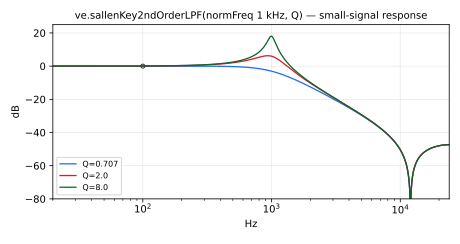

Sallen-Key 2nd order lowpass filter (see description above). 
Specialize the generic implementation: keep the first LPF output,
the compiler will only generate the needed code.

#### Usage

```
_ : sallenKey2ndOrderLPF(normFreq,Q) : _
```

Where:

* `normFreq`: normalized frequency (0-1)
* `Q`: quality factor controlling the sharpness/resonance of the filter around the center frequency (CF). For bandpass filters, higher Q increases the gain at the center frequency. Must be in the range `[ma.EPSILON, ma.MAX]`

#### Test
```
ve = library("vaeffects.lib");
os = library("oscillators.lib");
sallenKey2ndOrderLPF_test = os.tosc(330) : ve.sallenKey2ndOrderLPF(0.3, 0.8);
sallenKey2ndOrderLPF_slider_test = os.tosc(330)
  : ve.sallenKey2ndOrderLPF(
      hslider("sallenKey2ndOrderLPF:normFreq", 0.3, 0, 1, 0.001),
      hslider("sallenKey2ndOrderLPF:Q", 0.8, 0.1, 10, 0.1)
    );
```

----

### `(ve.)sallenKey2ndOrderBPF`

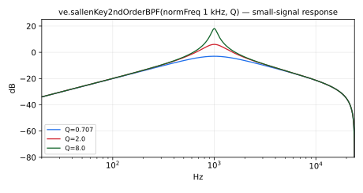

Sallen-Key 2nd order bandpass filter (see description above). 
Specialize the generic implementation: keep the second BPF output, 
the compiler will only generate the needed code.

#### Usage

```
_ : sallenKey2ndOrderBPF(normFreq,Q) : _
```

Where:

* `normFreq`: normalized frequency (0-1)
* `Q`: quality factor controlling the sharpness/resonance of the filter around the center frequency (CF). For bandpass filters, higher Q increases the gain at the center frequency. Must be in the range `[ma.EPSILON, ma.MAX]`

#### Test
```
ve = library("vaeffects.lib");
os = library("oscillators.lib");
sallenKey2ndOrderBPF_test = os.tosc(330) : ve.sallenKey2ndOrderBPF(0.3, 1.5);
sallenKey2ndOrderBPF_slider_test = os.tosc(330)
  : ve.sallenKey2ndOrderBPF(
      hslider("sallenKey2ndOrderBPF:normFreq", 0.3, 0, 1, 0.001),
      hslider("sallenKey2ndOrderBPF:Q", 1.5, 0.1, 10, 0.1)
    );
```

----

### `(ve.)sallenKey2ndOrderHPF`

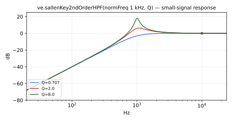

Sallen-Key 2nd order highpass filter (see description above). 
Specialize the generic implementation: keep the third HPF output, 
the compiler will only generate the needed code.

#### Usage

```
_ : sallenKey2ndOrderHPF(normFreq,Q) : _
```

Where:

* `normFreq`: normalized frequency (0-1)
* `Q`: quality factor controlling the sharpness/resonance of the filter around the center frequency (CF). For bandpass filters, higher Q increases the gain at the center frequency. Must be in the range `[ma.EPSILON, ma.MAX]`

#### Test
```
ve = library("vaeffects.lib");
os = library("oscillators.lib");
sallenKey2ndOrderHPF_test = os.tosc(330) : ve.sallenKey2ndOrderHPF(0.3, 0.8);
sallenKey2ndOrderHPF_slider_test = os.tosc(330)
  : ve.sallenKey2ndOrderHPF(
      hslider("sallenKey2ndOrderHPF:normFreq", 0.3, 0, 1, 0.001),
      hslider("sallenKey2ndOrderHPF:Q", 0.8, 0.1, 10, 0.1)
    );
```

## Vicanek's Matched (Decramped) Second-Order Filters

Vicanek's Matched (Decramped) Second-Order Filters.

This collection implements high-quality second-order filters
based on the work of Vicanek, offering improved frequency accuracy and dynamic
response over traditional biquads—especially near Nyquist.

Standard digital filter designs (like bilinear-transformed biquads) suffer from
frequency warping, which distorts the placement of poles and zeros. Vicanek's
method, detailed in his paper *"Matched Second Order Digital Filters"*, proposes
a set of matched filter formulas that eliminate such warping, preserving the
intended analog-like behavior and frequency response.

The filters provided here include:

- `biquad`            — generic difference equation implementation  
- `lowpass2Matched`   — second-order lowpass with resonance  
- `highpass2Matched`  — second-order highpass with resonance  
- `bandpass2Matched`  — second-order bandpass with resonance  
- `peaking2Matched`   — second-order peaking EQ
- `lowshelf2Matched`  – second-order Butterworth lowshelf
- `highshelf2Matched` – second-order Butterworth highshelf

Each filter relies on carefully derived coefficient formulas that guarantee
accurate placement of the frequency response peak and preserve Q and gain behavior.

Their coefficients are computed without cancellation and their recurrence
runs on small increments, so that they are accurate in single precision too,
at every sample rate: a low `CF` or a high `Q` stays within about 1e-5 of the
double-precision output (1e-4 for `bandpass2Matched`).

#### References

* Vicanek, M. (2016) *Matched Second Order Digital Filters*
* [https://www.vicanek.de/articles/BiquadFits.pdf](https://www.vicanek.de/articles/BiquadFits.pdf)

----

### `(ve.)biquad`

Basic biquad section implementing the difference equation:
`y[n] = b0 * x[n] + b1 * x[n-1] + b2 * x[n-2] - a1 * y[n-1] - a2 * y[n-2]`

#### Usage:
```
_ : biquad(b0, b1, b2, a1, a2) : _
```

Where:

* `b0`: feedforward coefficient for `x[n]`
* `b1`: feedforward coefficient for `x[n-1]`
* `b2`: feedforward coefficient for `x[n-2]`
* `a1`: feedback coefficient for `y[n-1]`
* `a2`: feedback coefficient for `y[n-2]`

#### Test
```
ve = library("vaeffects.lib");
os = library("oscillators.lib");
biquad_test = os.tosc(440)
  : ve.biquad(0.5, 0.3, 0.2, -0.3, 0.2);
```

----

### `(ve.)lowpass2Matched`

Vicanek's decramped second-order resonant lowpass filter.

Accurate in single precision too: its coefficients are computed without
cancellation and its recurrence runs on small increments, so that a low
`CF` or a high `Q` at a high sample rate stays within about 1e-5 of the
double-precision output.

#### Usage:
```
_ : lowpass2Matched(CF, Q) : _
```

Where:

* `CF`: cutoff frequency in Hz
* `Q`: resonance linear amplitude

#### Test
```
ve = library("vaeffects.lib");
os = library("oscillators.lib");
no = library("noises.lib");
ba = library("basics.lib");
ma = library("maths.lib");
lowpass2Matched_test = os.tosc(440) : ve.lowpass2Matched(1000, 0.707);
lowpass2Matched_slider_test = os.tosc(440)
  : ve.lowpass2Matched(
      hslider("lowpass2Matched:CF", 1000, 50, 5000, 1),
      hslider("lowpass2Matched:Q", 0.707, 0.1, 5, 0.01)
    );
lowpass2Matched_modulated_test = no.noise : ve.lowpass2Matched(20*pow(250, tri), 5) with { P = int(ma.SR/10); tri = 1 - abs(2*ba.period(P)/P - 1); };
lowpass2Matched_low_test = no.noise : ve.lowpass2Matched(50, 10);
```

----

### `(ve.)highpass2Matched`

Vicanek's decramped second-order resonant highpass filter.

Accurate in single precision too: its coefficients are computed without
cancellation and its recurrence runs on small increments, so that a low
`CF` or a high `Q` at a high sample rate stays within about 1e-5 of the
double-precision output.

#### Usage:
```
_ : highpass2Matched(CF, Q) : _
```

Where:

* `CF`: cutoff frequency in Hz
* `Q`: resonance linear amplitude

#### Test
```
ve = library("vaeffects.lib");
os = library("oscillators.lib");
no = library("noises.lib");
ba = library("basics.lib");
ma = library("maths.lib");
highpass2Matched_test = os.tosc(440) : ve.highpass2Matched(500, 0.707);
highpass2Matched_slider_test = os.tosc(440)
  : ve.highpass2Matched(
      hslider("highpass2Matched:CF", 500, 50, 5000, 1),
      hslider("highpass2Matched:Q", 0.707, 0.1, 5, 0.01)
    );
highpass2Matched_modulated_test = no.noise : ve.highpass2Matched(20*pow(250, tri), 5) with { P = int(ma.SR/10); tri = 1 - abs(2*ba.period(P)/P - 1); };
highpass2Matched_low_test = no.noise : ve.highpass2Matched(50, 10);
```

----

### `(ve.)bandpass2Matched`

Vicanek's decramped second-order resonant bandpass filter.

Accurate in single precision too: its coefficients are computed without
cancellation and its recurrence runs on small increments, so that a low
`CF` or a high `Q` at a high sample rate stays within about 1e-4 of the
double-precision output.

#### Usage:
```
_ : bandpass2Matched(CF, Q) : _
```

Where:

* `CF`: cutoff frequency in Hz
* `Q`: peak width

#### Test
```
ve = library("vaeffects.lib");
os = library("oscillators.lib");
no = library("noises.lib");
ba = library("basics.lib");
ma = library("maths.lib");
bandpass2Matched_test = os.tosc(440) : ve.bandpass2Matched(1200, 2.0);
bandpass2Matched_slider_test = os.tosc(440)
  : ve.bandpass2Matched(
      hslider("bandpass2Matched:CF", 1200, 50, 5000, 1),
      hslider("bandpass2Matched:Q", 2.0, 0.1, 10, 0.01)
    );
bandpass2Matched_modulated_test = no.noise : ve.bandpass2Matched(20*pow(250, tri), 5) with { P = int(ma.SR/10); tri = 1 - abs(2*ba.period(P)/P - 1); };
bandpass2Matched_low_test = no.noise : ve.bandpass2Matched(50, 10);
```

----

### `(ve.)peaking2Matched`

Vicanek's decramped second-order peaking equalizer.

Accurate in single precision too: its coefficients are computed without
cancellation and its recurrence runs on small increments, so that a low
`CF` or a high `Q` at a high sample rate stays within about 1e-5 of the
double-precision output.

#### Usage:
```
_ : peaking2Matched(G, CF, Q) : _
```

Where:

* `G`: peak linear amplitude
* `CF`: cutoff frequency in Hz
* `Q`: peak width

#### Test
```
ve = library("vaeffects.lib");
os = library("oscillators.lib");
no = library("noises.lib");
ba = library("basics.lib");
ma = library("maths.lib");
peaking2Matched_test = os.tosc(440) : ve.peaking2Matched(1.5, 1000, 2.0);
peaking2Matched_slider_test = os.tosc(440)
  : ve.peaking2Matched(
      hslider("peaking2Matched:G", 1.5, 0.1, 4, 0.01),
      hslider("peaking2Matched:CF", 1000, 50, 5000, 1),
      hslider("peaking2Matched:Q", 2.0, 0.1, 10, 0.01)
    );
peaking2Matched_modulated_test = no.noise : ve.peaking2Matched(2, 20*pow(250, tri), 5) with { P = int(ma.SR/10); tri = 1 - abs(2*ba.period(P)/P - 1); };
peaking2Matched_low_test = no.noise : ve.peaking2Matched(4, 50, 10);
```

----

### `(ve.)lowshelf2Matched`

Vicanek's decramped second-order Butterworth lowshelf filter.

Accurate in single precision too: its coefficients are computed without
cancellation and its recurrence runs on small increments, so that a low
`CF` at a high sample rate stays within about 1e-5 of the double-precision
output. `G = 1` gives the identity.

#### Usage:
```
_ : lowshelf2Matched(G, CF) : _
```

Where:

* `G`: shelf linear amplitude
* `CF`: cutoff frequency in Hz

#### Test
```
ve = library("vaeffects.lib");
os = library("oscillators.lib");
no = library("noises.lib");
ba = library("basics.lib");
ma = library("maths.lib");
lowshelf2Matched_test = os.tosc(330) : ve.lowshelf2Matched(1.5, 500);
lowshelf2Matched_slider_test = os.tosc(330)
  : ve.lowshelf2Matched(
      hslider("lowshelf2Matched:G", 1.5, 0.5, 4, 0.01),
      hslider("lowshelf2Matched:CF", 500, 50, 5000, 1)
    );
lowshelf2Matched_modulated_test = no.noise : ve.lowshelf2Matched(0.25*pow(16, tri), 1000) with { P = int(ma.SR/10); tri = 1 - abs(2*ba.period(P)/P - 1); };
lowshelf2Matched_low_test = no.noise : ve.lowshelf2Matched(4, 20);
lowshelf2Matched_unity_test = no.noise : ve.lowshelf2Matched(1, 500);
```

----

### `(ve.)highshelf2Matched`

Vicanek's decramped second-order Butterworth highshelf filter.

Accurate in single precision too: its coefficients are computed without
cancellation and its recurrence runs on small increments, so that a low
`CF` at a high sample rate stays within about 1e-5 of the double-precision
output. `G = 1` gives the identity.

#### Usage:
```
_ : highshelf2Matched(G, CF) : _
```

Where:

* `G`: shelf linear amplitude
* `CF`: cutoff frequency in Hz

#### Test
```
ve = library("vaeffects.lib");
os = library("oscillators.lib");
no = library("noises.lib");
ba = library("basics.lib");
ma = library("maths.lib");
highshelf2Matched_test = os.tosc(330) : ve.highshelf2Matched(1.5, 1500);
highshelf2Matched_slider_test = os.tosc(330)
  : ve.highshelf2Matched(
      hslider("highshelf2Matched:G", 1.5, 0.5, 4, 0.01),
      hslider("highshelf2Matched:CF", 1500, 50, 10000, 1)
    );
highshelf2Matched_modulated_test = no.noise : ve.highshelf2Matched(0.25*pow(16, tri), 1000) with { P = int(ma.SR/10); tri = 1 - abs(2*ba.period(P)/P - 1); };
highshelf2Matched_low_test = no.noise : ve.highshelf2Matched(0.25, 20);
highshelf2Matched_unity_test = no.noise : ve.highshelf2Matched(1, 500);
```

## Effects


----

### `(ve.)wah4`

Wah effect, 4th order.
`wah4` is a standard Faust function.

#### Usage

```
_ : wah4(fr) : _
```

Where:

* `fr`: resonance frequency in Hz, between 0 and SR/7.34 (about 6 kHz at
  44.1 kHz). Above, or below 0, the filter is unstable.

#### Test
```
ve = library("vaeffects.lib");
os = library("oscillators.lib");
no = library("noises.lib");
ba = library("basics.lib");
ma = library("maths.lib");
wah4_test = os.tosc(220) : ve.wah4(800);
wah4_slider_test = os.tosc(220)
  : ve.wah4(
      hslider("wah4:freq", 800, 200, 2000, 1)
    );
wah4_modulated_test = no.noise : ve.wah4(200*pow(10, tri)) with { P = int(ma.SR/10); tri = 1 - abs(2*ba.period(P)/P - 1); };
```

#### References

* [https://ccrma.stanford.edu/~jos/pasp/vegf.html](https://ccrma.stanford.edu/~jos/pasp/vegf.html)

----

### `(ve.)autowah`

Auto-wah effect: `crybaby` with its `wah` parameter driven by the
input's amplitude envelope (`an.amp_follower`). Input peaks above 1
hold the pedal fully forward (`crybaby` clamps `wah` to [0,1]).
`autowah` is a standard Faust function.

#### Usage

```
_ : autowah(level) : _
```

Where:

* `level`: amount of effect desired (0 to 1).

#### Test
```
ve = library("vaeffects.lib");
os = library("oscillators.lib");
no = library("noises.lib");
autowah_test = os.tosc(220) : ve.autowah(0.7);
autowah_slider_test = os.tosc(220)
  : ve.autowah(
      hslider("autowah:level", 0.7, 0, 1, 0.01)
    );
autowah_hot_test = 4*no.noise : ve.autowah(1);
```

----

### `(ve.)crybaby`

Digitized CryBaby wah pedal.
`crybaby` is a standard Faust function.

#### Usage

```
_ : crybaby(wah) : _
```

Where:

* `wah`: "pedal angle" from 0 to 1. Values outside are clamped to
  this range: without the clamp, the poles leave the unit circle
  above about 2.08 at 44.1 kHz (2.58 at 192 kHz).

#### Test
```
ve = library("vaeffects.lib");
os = library("oscillators.lib");
no = library("noises.lib");
ba = library("basics.lib");
ma = library("maths.lib");
crybaby_test = os.tosc(220) : ve.crybaby(0.3);
crybaby_slider_test = os.tosc(220)
  : ve.crybaby(
      hslider("crybaby:wah", 0.3, 0, 1, 0.01)
    );
crybaby_modulated_test = no.noise : ve.crybaby(tri) with { P = int(ma.SR/10); tri = 1 - abs(2*ba.period(P)/P - 1); };
crybaby_jump_test = no.noise : ve.crybaby(sq) with { P = int(ma.SR/10); sq = ba.period(2*P) < P; };
crybaby_noise_test = no.noise : ve.crybaby(0);
crybaby_clamp_test = no.noise <: ve.crybaby(-1), ve.crybaby(3);
```

#### References

* [https://ccrma.stanford.edu/~jos/pasp/vegf.html](https://ccrma.stanford.edu/~jos/pasp/vegf.html)

----

### `(ve.)vocoder`

A very simple vocoder where the spectrum of the modulation signal
is analyzed using a filter bank.
`vocoder` is a standard Faust function.
The two signals can also be given as inputs, by partial application
(second form below, as in the Test section).

#### Usage

```
vocoder(nBands,att,rel,BWRatio,source,excitation) : _
source, excitation : vocoder(nBands,att,rel,BWRatio) : _
```

Where:

* `nBands`: Number of vocoder bands
* `att`: Attack time in seconds
* `rel`: Release time in seconds
* `BWRatio`: Coefficient to adjust the bandwidth of each band (0.1 - 2)
* `source`: Modulation signal
* `excitation`: Excitation/Carrier signal

#### Test
```
ve = library("vaeffects.lib");
no = library("noises.lib");
os = library("oscillators.lib");
vocoder_test = (no.noise, os.tosc(220)) : ve.vocoder(8, 0.01, 0.1, 1.0);
vocoder_slider_test = (no.noise, os.tosc(220))
  : ve.vocoder(
      8,
      hslider("vocoder:att", 0.01, 0.001, 0.1, 0.001),
      hslider("vocoder:rel", 0.1, 0.01, 0.5, 0.01),
      hslider("vocoder:BWRatio", 1.0, 0.5, 1.5, 0.01)
    );
```

----

### `(ve.)klonCentaur`

Klon Centaur overdrive pedal circuit model.

The Klon Centaur is a guitar overdrive pedal known for adding gain and
harmonic distortion while preserving the instrument's natural tone. This is a
port of the "Traditional" (circuit model) mode of Jatin Chowdhury's
ChowCentaur: the gain stage is modeled with wave digital filters (WDF), with
the diode clipper running at twice the sample rate, and the input buffer,
amplifier, tone and output stages as bilinear-transformed filters.

The controls are smoothed over 50 ms, as in ChowCentaur, starting from their
initial values. The input is scaled by 0.5, as in ChowCentaur; a sample of
±1 is treated as ±1 V.

Accuracy: against the ChowCentaur 1.4.0 plug-in (Traditional mode), the output
level is within 0.13 dB and the waveform within 1.6 % for gain up to 0.5;
at gain 1 with loud input the model is up to 0.9 dB louder (waveform within
11 %). The remaining difference comes from the plug-in's fast log/exp
approximations in the diode model, which this port evaluates accurately: a
variant using the plug-in's approximations matches it within 0.02 %.

Single precision: the output stays within 2.3e-4 of double precision at the
default settings from 44.1 to 192 kHz. At low gain the preamp's wave digital
tree loses precision in float (a 1 µF capacitor next to 15 kΩ), and with gain
and treble at 0 the gap grows from 3e-4 of the peak at 44.1 kHz to 6e-3 at
192 kHz; ChowCentaur runs its wave digital filters in double precision.

#### Usage

```
_ : klonCentaur(gain, treble, level) : _
```

Where:

* `gain`: Gain control (0-1), where 0 is minimum gain and 1 is maximum gain.
  Controls the resistance of the gain potentiometer (R10b) in the preamp stage,
  ranging from 2kΩ at maximum gain to 102kΩ at minimum gain.
* `treble`: Treble/tone control (0-1), where 0 is dark/warm tone and 1 is bright tone.
  Controls the frequency response of the active tone shaping filter.
* `level`: Output level/volume control (0-1), where 0 is minimum output and 1 is maximum output.
  Controls the output potentiometer resistance, setting the final output amplitude.

#### Test
```
ve = library("vaeffects.lib");
os = library("oscillators.lib");
no = library("noises.lib");
ba = library("basics.lib");
ma = library("maths.lib");
klonCentaur_test = os.tosc(330) : ve.klonCentaur(0.5, 0.5, 0.5);
klonCentaur_slider_test = os.tosc(330)
   : ve.klonCentaur(
       hslider("klonCentaur:gain", 0.5, 0, 1, 0.01),
       hslider("klonCentaur:treble", 0.5, 0, 1, 0.01),
       hslider("klonCentaur:level", 0.5, 0, 1, 0.01)
     );
klonCentaur_modulated_test = 0.5*no.noise : ve.klonCentaur(0.1 + 0.9*tri, 0.5, 0.5) with { P = int(ma.SR/10); tri = 1 - abs(2*ba.period(P)/P - 1); };
klonCentaur_jump_test = 0.5*no.noise : ve.klonCentaur(0.1 + 0.9*sq, 0.5, 0.5) with { P = int(ma.SR/10); sq = ba.period(2*P) < P; };
klonCentaur_hot_test = os.tosc(110)*0.5 : ve.klonCentaur(1, 0, 1);
```

#### References

* J. Chowdhury, "chowdsp_wdf: An Advanced C++ Library for Wave Digital Circuit
  Modelling," arXiv:2210.12554, 2022
* [https://github.com/jatinchowdhury18/KlonCentaur/tree/master/ChowCentaur](https://github.com/jatinchowdhury18/KlonCentaur/tree/master/ChowCentaur)
