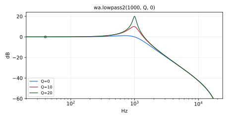
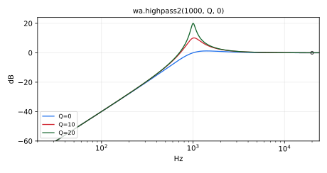
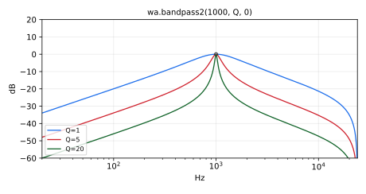
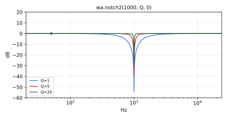
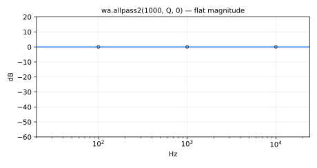
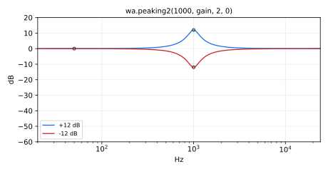
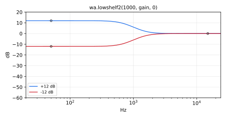
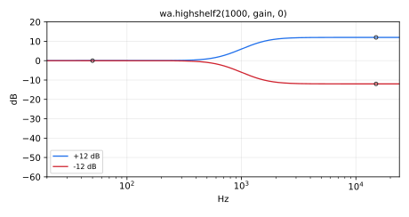

#  webaudio.lib 

An implementation of the WebAudio API filters (https://www.w3.org/TR/webaudio/). Its official prefix is `wa`.

This library implement WebAudio filters, using their C++ version as a starting point, 
taken from Mozilla Firefox implementation.

#### References

* [https://github.com/grame-cncm/faustlibraries/blob/master/webaudio.lib](https://github.com/grame-cncm/faustlibraries/blob/master/webaudio.lib)

----

### `BiquadFilter`

Environment holding the normalized biquad coefficient sets
(`b0,b1,b2,a1,a2`, ready for `fi.tf2`) of the Web Audio filters below,
computed from the Web Audio API specification formulas.

#### Usage

```
BiquadFilter(f0, dBgain, Q, aDetune).lowpass2 // or .highpass2, .bandpass2,
                   // .notch2, .allpass2, .peaking2, .lowshelf2, .highshelf2
```

Where:

* `f0`: center/cutoff frequency in Hz
* `dBgain`: gain in dB (used by the peaking and shelving filters)
* `Q`: quality factor
* `aDetune`: detune amount in cents

#### Test
```
wa = library("webaudio.lib");
BiquadFilter_test = wa.BiquadFilter(1000, 6, 1, 0).lowpass2;
```

----

### `(wa.)lowpass2`



Standard second-order resonant lowpass filter with 12dB/octave rolloff.
Frequencies below the cutoff pass through, frequencies above it are attenuated.

#### Usage

```
_ : lowpass2(f0, Q, dtune) : _
```

Where:

* `f0`: cutoff frequency in Hz
* `Q`: the quality factor
* `dtune`: detuning of the frequency in cents

#### Test
```
wa = library("webaudio.lib");
os = library("oscillators.lib");
lowpass2_test = os.osc(440) : wa.lowpass2(1000, 0.707, 0);
```

#### References

* [https://searchfox.org/mozilla-central/source/dom/media/webaudio/blink/Biquad.cpp#98](https://searchfox.org/mozilla-central/source/dom/media/webaudio/blink/Biquad.cpp#98)

----

### `(wa.)highpass2`



Standard second-order resonant highpass filter with 12dB/octave rolloff.
Frequencies below the cutoff are attenuated, frequencies above it pass through.

#### Usage

```
_ : highpass2(f0, Q, dtune) : _
```

Where:

* `f0`: cutoff frequency in Hz
* `Q`: the quality factor
* `dtune`: detuning of the frequency in cents

#### Test
```
wa = library("webaudio.lib");
os = library("oscillators.lib");
highpass2_test = os.osc(440) : wa.highpass2(1000, 0.707, 0);
```

#### References

* [https://searchfox.org/mozilla-central/source/dom/media/webaudio/blink/Biquad.cpp#127](https://searchfox.org/mozilla-central/source/dom/media/webaudio/blink/Biquad.cpp#127)

----

### `(wa.)bandpass2`



Standard second-order bandpass filter.
Frequencies outside the given range of frequencies are attenuated, the frequencies inside it pass through.

#### Usage

```
_ : bandpass2(f0, Q, dtune) : _
```

Where:

* `f0`: cutoff frequency in Hz
* `Q`: the quality factor
* `dtune`: detuning of the frequency in cents

#### Test
```
wa = library("webaudio.lib");
os = library("oscillators.lib");
bandpass2_test = os.osc(440) : wa.bandpass2(1000, 1, 0);
```

#### References

* [https://searchfox.org/mozilla-central/source/dom/media/webaudio/blink/Biquad.cpp#334](https://searchfox.org/mozilla-central/source/dom/media/webaudio/blink/Biquad.cpp#334)

----

### `(wa.)notch2`



Standard notch filter, also called a band-stop or band-rejection filter.
It is the opposite of a bandpass filter: frequencies outside the give range of frequencies 
pass through, frequencies inside it are attenuated.

#### Usage

```
_ : notch2(f0, Q, dtune) : _
```

Where:

* `f0`: cutoff frequency in Hz
* `Q`: the quality factor
* `dtune`: detuning of the frequency in cents

#### Test
```
wa = library("webaudio.lib");
os = library("oscillators.lib");
notch2_test = os.osc(440) : wa.notch2(1000, 1, 0);
```

#### References

* [https://searchfox.org/mozilla-central/source/dom/media/webaudio/blink/Biquad.cpp#301](https://searchfox.org/mozilla-central/source/dom/media/webaudio/blink/Biquad.cpp#301)

----

### `(wa.)allpass2`



Standard second-order allpass filter. It lets all frequencies through,
but changes the phase-relationship between the various frequencies.

#### Usage

```
_ : allpass2(f0, Q, dtune) : _
```

Where:

* `f0`: cutoff frequency in Hz
* `Q`: the quality factor
* `dtune`: detuning of the frequency in cents

#### Test
```
wa = library("webaudio.lib");
os = library("oscillators.lib");
allpass2_test = os.osc(440) : wa.allpass2(1000, 1, 0);
```

#### References

* [https://searchfox.org/mozilla-central/source/dom/media/webaudio/blink/Biquad.cpp#268](https://searchfox.org/mozilla-central/source/dom/media/webaudio/blink/Biquad.cpp#268)

----

### `(wa.)peaking2`



Frequencies inside the range get a boost or an attenuation, frequencies outside it are unchanged.

#### Usage

```
_ : peaking2(f0, gain, Q, dtune) : _
```

Where:

* `f0`: cutoff frequency in Hz
* `gain`: the gain in dB
* `Q`: the quality factor
* `dtune`: detuning of the frequency in cents

#### Test
```
wa = library("webaudio.lib");
os = library("oscillators.lib");
peaking2_test = os.osc(440) : wa.peaking2(1000, 3, 1, 0);
```

#### References

* [https://searchfox.org/mozilla-central/source/dom/media/webaudio/blink/Biquad.cpp#233](https://searchfox.org/mozilla-central/source/dom/media/webaudio/blink/Biquad.cpp#233)

----

### `(wa.)lowshelf2`



Standard second-order lowshelf filter.
Frequencies lower than the frequency get a boost, or an attenuation, frequencies over it are unchanged.

#### Usage

```
_ : lowshelf2(f0, gain, dtune) : _
```

Where:

* `f0`: cutoff frequency in Hz
* `gain`: the gain in dB
* `dtune`: detuning of the frequency in cents

#### Test
```
wa = library("webaudio.lib");
os = library("oscillators.lib");
lowshelf2_test = os.osc(440) : wa.lowshelf2(500, 6, 0);
```

#### References

* [https://searchfox.org/mozilla-central/source/dom/media/webaudio/blink/Biquad.cpp#169](https://searchfox.org/mozilla-central/source/dom/media/webaudio/blink/Biquad.cpp#169)

----

### `(wa.)highshelf2`



Standard second-order highshelf filter.
Frequencies higher than the frequency get a boost or an attenuation, frequencies lower than it are unchanged.

#### Usage

```
_ : highshelf2(f0, gain, dtune) : _
```

Where:

* `f0`: cutoff frequency in Hz
* `gain`: the gain in dB
* `dtune`: detuning of the frequency in cents

#### Test
```
wa = library("webaudio.lib");
os = library("oscillators.lib");
highshelf2_test = os.osc(440) : wa.highshelf2(2000, -6, 0);
```

#### References

* [https://searchfox.org/mozilla-central/source/dom/media/webaudio/blink/Biquad.cpp#201](https://searchfox.org/mozilla-central/source/dom/media/webaudio/blink/Biquad.cpp#201)
